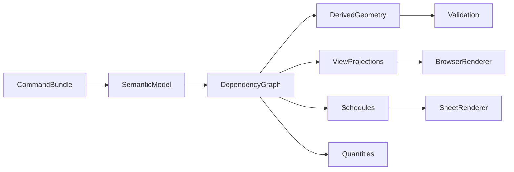
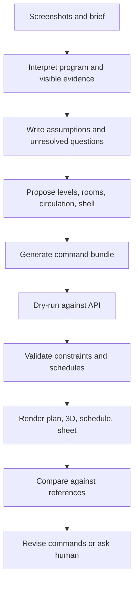

# PRD — Revit Production Parity & AI-Agent Building Planning

**Status:** draft for implementation planning  
**Date:** 2026-05-04  
**Scope:** browser-first BIM authoring, documentation, schedules, and AI-agent generated building plans inspired by the supplied Revit tutorial screenshots.  
**Non-goal:** pixel-cloning Revit, copying proprietary UI, or native `.rvt` parity in the first implementation wave.

**Implementation tracker:** operational workpackage status, evidence, and remaining implementation backlog are tracked in [spec/revit-production-parity-workpackage-tracker.md](../revit-production-parity-workpackage-tracker.md). Keep this PRD as the requirements source of truth; update the tracker whenever workpackages are added, completed, or split into todos.

## 1. Executive Summary

BIM AI currently has a strong architectural seed: a single command-driven model shared by browser, CLI, API, validation, undo history, and a lightweight plan/3D cockpit. That is the right foundation. However, compared with the provided Revit tutorial screenshots, the current product is still in a different category:

- The screenshots show a **production BIM/documentation environment** with floor plans, room plans, window schedules, 3D cutaways, view browser/properties, sheets, section/detail viewports, titleblocks, annotations, dimensions, and schedules.
- BIM AI today shows a **semantic prototype**: level list, simple wall/door/window/room geometry, basic plan and Three.js 3D views, simple room schedule, advisor, comments, and command tooling.

The gap is not mainly visual styling. It is missing product subsystems:

- A real **model regeneration engine** for derived geometry, hosted cuts, wall/floor/roof/stair joins, section cuts, view ranges, and dependent schedules.
- A real **view/documentation system**: plan views, room color schemes, schedules, sections, details, sheets, viewport placement, titleblocks, annotations, dimensions, tags, legends, and print/export.
- A real **family/type/material library**: parametric types, layered assemblies, hosted voids/reveals, window/door families, room finishes, cleanroom metadata.
- A real **AI-agent design loop**: agent receives a screenshot/brief, proposes a building model, validates it, renders matching plan/3D/schedule artifacts, and iterates against evidence.

This PRD defines what is needed to reach the capabilities implied by the screenshots, while preserving BIM AI’s non-negotiable invariant:

> Browser, CLI, and API mutate one canonical command-driven semantic model. Geometry, drawings, schedules, and exports are projections of that model, not separate sources of truth.

## 2. Reference Inputs

### 2.1 Supplied Revit Tutorial Screenshots

The user supplied seven reference captures from the video workflow:

| Ref | Saved asset                                                                                                          | What it shows                                                                                        |
| --- | -------------------------------------------------------------------------------------------------------------------- | ---------------------------------------------------------------------------------------------------- |
| R1  | `/Users/jhoetter/.cursor/projects/Users-jhoetter-repos-bim-ai/assets/image-5fbab930-b083-4e73-808b-57b27ccd47eb.png` | Exterior 3D house view with roof, terrain/site context, trees, project browser, properties palette.  |
| R2  | `/Users/jhoetter/.cursor/projects/Users-jhoetter-repos-bim-ai/assets/image-8aef1368-c5e3-4c91-a340-3856f40f014f.png` | EG floor plan with walls, stairs, doors, windows, room layout, garage outline, tags/callouts.        |
| R3  | `/Users/jhoetter/.cursor/projects/Users-jhoetter-repos-bim-ai/assets/image-e2d70655-7074-454e-af39-6cfe69047ee8.png` | OG room plan with colored rooms, stair core, room labels, legend, view browser.                      |
| R4  | `/Users/jhoetter/.cursor/projects/Users-jhoetter-repos-bim-ai/assets/image-95770849-b2e9-491e-831e-84e5b6b2585e.png` | Window schedule grouped by types/levels with dimensions and counts.                                  |
| R5  | `/Users/jhoetter/.cursor/projects/Users-jhoetter-repos-bim-ai/assets/image-b9ace1e0-2bf2-4dd6-9d1a-3b00097070e3.png` | 3D cutaway / interior view showing rooms, stairs, slabs, openings, wall volumes, floor patterns.     |
| R6  | `/Users/jhoetter/.cursor/projects/Users-jhoetter-repos-bim-ai/assets/image-a637a67e-26e1-4141-8222-3a952a396ecc.png` | Sheet composition with titleblock, section/elevation/detail viewports, dimensions.                   |
| R7  | `/Users/jhoetter/.cursor/projects/Users-jhoetter-repos-bim-ai/assets/image-f9ebb82e-d41f-41f2-96ca-47f125fd6b0b.png` | Zoomed sheet/detail layout with section and detail callout, annotations, schedule/titleblock region. |

### 2.2 Existing BIM AI Docs

Relevant existing documents:

- `spec/prd/revit-tutorial-parity-cleanroom-roadmap.md` — semantic/workflow roadmap from the 11-video tutorial.
- `spec/prd/cli-agent-home-design-gaps.md` — CLI-authored house gaps and current validated workflow.
- `spec/prd.md` — V1 BIM AI PRD.
- `spec/ui/interactions.md` — current interaction baseline.
- `spec/openbim-compatibility.md` — OpenBIM/Revit stance.
- `spec/foundations/analysis.md` — clean-room Figma/Revit/Navisworks conceptual analysis.
- `prompt.md` — long-term product direction: semantic model, constraints, collaboration, AI-native browser BIM.

### 2.3 Current Browser Baseline

Direct browser inspection on `http://127.0.0.1:2000` showed:

- Product shell: `BIM AI v2`, layout selector, perspective selector, viewer selector, collaborator name, command button, theme button.
- Tools panel: select, wall, door, window, room, rectangle, grid, dimension.
- Levels panel: `Ground`, `Upper`, editable elevations.
- Explorer: lists semantic elements such as walls, rooms, door, window, grids, dimension, issue, viewpoint.
- Central surface: plan grid plus a simple 3D orbit view in Plan + 3D layout.
- Advisor / schedule / activity / inspector / comments panels exist lower/right in the responsive layout.
- Seed summary from API: 2 levels, 8 walls, 2 rooms, 1 door, 1 window, 3 grid lines, 1 dimension, 1 viewpoint, 1 issue.
- API summary shows no actual floors, roofs, stairs, sheets, or schedules in the seed model.

The browser is useful as a semantic proof of concept. It is not yet a production documentation workspace.

## 3. Product Vision

BIM AI should become an **AI-agent-driven production BIM planning system**:

1. A human or agent provides a goal: text brief, floor-plan sketch, reference screenshot, room program, cleanroom specification, or site constraints.
2. The agent generates a command bundle against the canonical model.
3. BIM AI validates the bundle using geometry, code, cleanroom, and documentation checks.
4. The browser renders evidence: plans, 3D views, schedules, sections, sheets.
5. Human and agent iterate until the model satisfies functional, visual, quantitative, and documentation requirements.

The product should not try to be “Revit in a browser” as a UI clone. It should provide the same **production outcomes**:

- correct building model,
- correct drawings,
- correct schedules,
- correct validation,
- correct exports,
- reproducible command history,
- AI-readable model state,
- browser-native collaboration.

## 4. Current State vs Target State

| Domain          | Current BIM AI                                                    | Screenshot target                                                                                                                             |
| --------------- | ----------------------------------------------------------------- | --------------------------------------------------------------------------------------------------------------------------------------------- |
| Project browser | Explorer flat-ish list by element kind                            | Hierarchical project browser: floor plans, ceiling plans, 3D views, sections, sheets, schedules, families, groups, links.                     |
| Properties      | Inspector JSON / basic controls                                   | Context-sensitive property palette with instance/type params, view params, schedules, phases, graphics, crop/view range.                      |
| Plan view       | WebGL grid, walls as bars, rooms as fills, doors/windows symbolic | Documentation-grade plan with line weights, wall layers, openings, swings, stairs, room tags, dimensions, grids, view range, underlays, crop. |
| 3D view         | Simple walls/openings/ribbons                                     | Exterior/interior 3D with slabs, roofs, stairs, cut planes, materials, openings as void cuts, site context, saved views.                      |
| Rooms           | Explicit polygons and simple room schedule                        | Computed room regions, room separation lines, area/volume, color schemes, legends, finish schedules.                                          |
| Schedules       | Room area/perimeter CSV only                                      | Generic schedule engine with fields, filters, grouping, sorting, levels, type/instance params, sheet placement.                               |
| Sheets          | Schema exists, no real UI                                         | Titleblock sheet canvas with placed views, viewports, crop boxes, sections, details, schedules, print/PDF/export.                             |
| Families        | Early schema/type fields                                          | Family/type catalog, hosted voids, parametric dimensions, instance/type propagation, LOD/visibility.                                          |
| Engine          | Command apply + constraints                                       | Regeneration graph: constraints, hosts, joins, openings, schedules, view projections, derived geometry.                                       |
| AI loop         | CLI/schema/dry-run basics                                         | Screenshot/brief to model, validation, rendered evidence, iterative corrections, explainable assumptions.                                     |

## 5. Screenshot-by-Screenshot Requirements

### 5.1 R1 — Exterior 3D House With Site Context

Observed capabilities in the screenshot:

- Complete house massing with roof, wall openings, garage, multiple levels.
- Roof planes, ridge/hip geometry, overhangs, gutters/edges implied.
- Terrain/site plane with trees and context objects.
- Saved 3D view in project browser.
- Properties palette for view scale/detail/graphics/camera settings.
- Navigation widget / 3D orbit controls.

Current BIM AI gaps:

- No production roof mesh in current seed.
- 3D viewport does not render floors/roofs/stairs/site/trees/materials.
- No cut style, visual styles, shadows, edge modes, or saved camera browser.
- No site/topography/landscape object library.
- No view properties model beyond `ViewpointElem`.

Requirements:

- **R1.3D.1:** Add a renderable `site` / `topography` element with boundary, terrain mesh or flat pad, north/orientation, property setbacks, and optional context objects.
- **R1.3D.2:** Render roof geometry from semantic roof footprint and slope flags: ridges, hips, gables, overhangs, fascia, and material surfaces.
- **R1.3D.3:** Render walls as cuttable solids with openings actually removed or visibly marked, not just colored boxes over walls.
- **R1.3D.4:** Support materials and visual styles: default shaded, hidden line, white model, sectioned/cutaway, presentation.
- **R1.3D.5:** Add saved 3D views with camera, crop/section box, visual style, discipline, detail level, and phase.
- **R1.3D.6:** Add view browser hierarchy for 3D views and named working views.
- **R1.3D.7:** Add object library for trees/site entourage as non-BIM context elements.

Acceptance:

- Given a generated reference house, the 3D view shows walls, floors, roof, windows, doors, garage, site pad, and at least simple context objects.
- A saved 3D view can be opened from the browser and returns to the same camera/crop/style.
- The same view can be exported as image evidence for agent validation.

### 5.2 R2 — EG Floor Plan With Doors, Windows, Stair, Garage

Observed capabilities:

- Plan view at a specific level (`EG Türen und Fenster`).
- Wall outlines with inner/outer faces and line weights.
- Doors with swing arcs and tags.
- Windows with tags and cut representation.
- Stair with treads/risers and direction marker.
- Garage or attached volume in plan.
- Room boundaries, partitions, detail line work.
- Project browser has multiple plans: EG/OG/DG variants.
- Properties show view-specific settings: scale, detail level, visibility, underlay, view range, crop.

Current gaps:

- Plan symbology is minimal.
- Stairs are schema/command-level only, not a production plan symbol.
- Doors/windows are basic hosted markers, not voided cuts with tags.
- No distinct view definitions for EG room plan vs EG door/window plan.
- No view range or local cut plane.
- No type-specific line weights, patterns, cut/projection category styling.
- No dimension/tag automation.

Requirements:

- **R2.PLAN.1:** Introduce `plan_view` elements with level, view range, scale, discipline, crop, underlay, template, phase, and visible categories.
- **R2.PLAN.2:** Implement plan projection engine that produces drawable primitives from semantic elements: wall cut faces, wall layers, door swings, window cuts, stairs, floor openings, room fills, grids, dimensions, tags.
- **R2.PLAN.3:** Add line weight and line pattern system per category and view style.
- **R2.PLAN.4:** Add stair plan representation: treads, riser count, run arrow, break line, upper/lower visibility based on view range.
- **R2.PLAN.5:** Add door/window tags with numbering, family/type reference, width/height/sill metadata.
- **R2.PLAN.6:** Add plan underlay/ghost system for editing upper floors against lower-floor context.
- **R2.PLAN.7:** Add garage/ancillary room concepts as regular rooms with type/use classification and schedule metadata.

Acceptance:

- A generated EG plan can visually distinguish walls, doors, windows, stairs, rooms, dimensions, and tags.
- Door/window placements are validated against wall hosts and appear in both plan and schedule.
- A plan view can be duplicated into “EG rooms”, “EG doors/windows”, and “EG furniture” variants with different visibility templates.

### 5.3 R3 — OG Colored Room Plan

Observed capabilities:

- Rooms colored by room/department/function.
- Room names and areas inside filled regions.
- Legend for color scheme.
- Stair and wall context visible while rooms dominate.
- View browser selects `OG Räume`.
- Scale and view properties are independent from geometry.

Current gaps:

- Rooms are explicit polygons only; not derived from wall boundaries.
- No room color scheme / legend system.
- Room tags are not first-class tags.
- No room volume / upper limit in usable UI.
- No furniture/fixture categories.

Requirements:

- **R3.ROOM.1:** Add robust room computation from boundaries, walls, room separation lines, floor openings, and shafts.
- **R3.ROOM.2:** Support explicit room separation lines for open-plan subdivision.
- **R3.ROOM.3:** Add room metadata: number, name, department, function, cleanroom class, finish set, occupancy, ventilation zone, area target, area computed.
- **R3.ROOM.4:** Add color scheme definitions: by name, department, cleanroom class, finish type, pressure zone, or custom parameter.
- **R3.ROOM.5:** Add legends as view annotations derived from color scheme.
- **R3.ROOM.6:** Add room tags with configurable label fields and visibility rules.
- **R3.ROOM.7:** Add room area computation with polygon clipping and unit formatting.

Acceptance:

- A room plan view can show colored room fills and a legend.
- Room labels show name and area; areas update when walls or separation lines move.
- Agent can request “show OG by room function” and receive a reproducible view definition.

### 5.4 R4 — Window Schedule

Observed capabilities:

- Schedule grouped by window family/type.
- Fields: count, number, family, rough width, rough height, sill height, level, comments.
- Multiple groups for different window families.
- Schedule appears as a document view in the project browser.
- It can be placed on a sheet.

Current gaps:

- Only a hardcoded room schedule exists in the browser.
- Generic `schedule` schema is early; no UI schedule builder.
- No family/type propagation.
- No from/to room or computed level labels.
- No schedule grouping/sorting/filters with totals.
- No sheet placement of schedule views.

Requirements:

- **R4.SCHED.1:** Implement generic schedule definitions with category, fields, filters, grouping, sorting, totals, formatting, and sheet placement.
- **R4.SCHED.2:** Support schedule fields from both instance and type parameters.
- **R4.SCHED.3:** Implement computed fields: level name, host wall type, room adjacency, rough opening width/height, sill/head height, count, area, volume, material quantities.
- **R4.SCHED.4:** Add schedule view renderer: table layout, group headers, column widths, title, units, totals, page breaks.
- **R4.SCHED.5:** Add schedule export: CSV, JSON, and printable sheet view.
- **R4.SCHED.6:** Add schedule validation: missing required fields, orphaned hosted elements, duplicate marks, inconsistent family type parameters.

Acceptance:

- Window and door schedules can be generated from the model without manual table entry.
- Changing a window type updates every instance and its schedule row.
- Agent can ask for “window schedule by level and family” and get a schedule artifact plus model links.

### 5.5 R5 — 3D Cutaway / Interior View

Observed capabilities:

- 3D section/cutaway exposes interior rooms and walls.
- Floors/slabs and floor finish patterns are visible.
- Stairs are detailed enough to recognize treads, risers, railing/walls.
- Windows and doors are inserted as openings.
- View is copied/named (`3D Kopie 1`) and can use temporary hide/isolate/section box.

Current gaps:

- No true section box/cut plane engine.
- No floor/slab rendering in current 3D baseline.
- Stair schema is not richly rendered.
- No wall layer cross-section or cut material hatches.
- Openings are rendered as colored boxes rather than host voids.
- No temporary isolate/hide, category visibility, or cut style.

Requirements:

- **R5.CUT.1:** Add 3D view section boxes and arbitrary clipping planes.
- **R5.CUT.2:** Implement cut-solid rendering for walls, floors, roofs, stairs, and hosted voids.
- **R5.CUT.3:** Support cut materials/hatches: wall core, insulation, finish, floor layers.
- **R5.CUT.4:** Add temporary isolate/hide and permanent visibility overrides per view.
- **R5.CUT.5:** Add stair geometry generation for straight/L/U runs, treads, risers, landings, railings.
- **R5.CUT.6:** Add view duplicate/copy workflows for alternative 3D/detail views.

Acceptance:

- A cutaway view can slice the reference house and expose interior rooms with stairs and floor slabs.
- Hosted door/window voids are visible as openings, not just colored indicators.
- View settings are serializable and reproducible through CLI/API.

### 5.6 R6/R7 — Sheet Layout With Sections, Details, Titleblock

Observed capabilities:

- Sheet canvas with border/titleblock.
- Multiple viewports: large section/elevation, smaller detail, another section, schedule/titleblock fields.
- Dimensions, annotations, levels, section markers.
- Detail callout view with scale and title.
- Project browser lists sheets and views.
- Properties show sheet metadata, approval info, sheet number/name.

Current gaps:

- `sheet`, `section_cut`, `callout`, and `view_template` schemas exist, but no production UI/workflow.
- No sheet canvas.
- No viewport placement or crop manipulation UI.
- No titleblock fields or revision/issue metadata.
- No section/elevation renderer.
- No detail components/fills/repeating detail.
- No PDF/print path.

Requirements:

- **R6.SHEET.1:** Add a paper-space sheet canvas with units, page size, scale, titleblock, border, grid/snap, and placed viewports.
- **R6.SHEET.2:** Add viewport model: view reference, sheet position, crop, scale, title, detail number, visibility, lock.
- **R6.SHEET.3:** Add titleblock schema: project name, sheet number, sheet name, revision, drawn/checked/approved, issue date, client, logo/image fields.
- **R6.SHEET.4:** Add section/elevation view renderer with cut/projection lines, levels, dimensions, tags, hatches, and callout markers.
- **R6.SHEET.5:** Add detail view: model cut + 2D annotations/fills/detail components.
- **R6.SHEET.6:** Add sheet export to PDF/SVG/PNG and browser print.
- **R6.SHEET.7:** Add sheet browser tree and commands: create sheet, place view, move viewport, set scale, duplicate sheet.

Acceptance:

- A sheet can represent the tutorial final deliverable: section, detail, plan/3D/elevation, schedule, titleblock.
- Sheet output is deterministic enough for screenshot/PDF regression tests.
- Agent can generate a deliverable sheet from model state without manual drafting.

## 6. Model Kernel Requirements

### 6.1 Semantic Source of Truth

Every production artifact must derive from semantic elements:

- Plan views derive from walls, floors, roofs, rooms, stairs, openings, tags, dimensions.
- 3D views derive from generated solids and materials.
- Schedules derive from element/type parameters and computed quantities.
- Sheets place views/schedules as references, not copies.
- Exports serialize the same source model.

Required element domains:

- Project settings, units, phases, design options.
- Levels/datums: FFB/RFB/UKRD, parent/offset chains.
- Wall types: ordered layers, material, core boundary, finish boundary, line patterns.
- Floor/slab types: structural layer, insulation, finish layers, room-bounded finishes.
- Roof types: pitched/flat/tapered, variable layers, overhangs, slope definition.
- Stairs: runs, landings, railings, code parameters, plan/3D representation.
- Doors/windows/openings: family/type, host wall, rough opening, sill/head, reveal, void/cut, interlock.
- Rooms/spaces: computed boundaries, separation lines, upper limits, volumes, finishes, cleanroom class.
- Views: plan, section, elevation, 3D, schedule, sheet, detail, callout.
- Annotations: tags, dimensions, text, symbols, detail lines, filled regions.
- Schedules: category, fields, filters, grouping, sorting, formatting.
- Materials: identity, appearance, hatch/cut pattern, quantity rules.
- Assets: entourage, titleblocks, templates, families.

### 6.2 Regeneration Engine

The current engine applies commands and validates constraints. Production parity requires a regeneration layer:

Requirements:

- **KERNEL.1:** Maintain dependency graph between elements and derived outputs.
- **KERNEL.2:** Recompute wall height from datum constraints.
- **KERNEL.3:** Recompute room boundaries from walls/separators when requested.
- **KERNEL.4:** Recompute hosted voids when door/window/family/wall type changes.
- **KERNEL.5:** Recompute join geometry when walls/floors/roofs meet.
- **KERNEL.6:** Recompute schedules and quantities after model changes.
- **KERNEL.7:** Mark stale derived artifacts and provide deterministic invalidation.
- **KERNEL.8:** Expose regeneration diagnostics to API and advisor.

Acceptance:

- A command bundle can be replayed from empty state and yields identical model, derived geometry, schedules, and view artifacts.
- A type parameter change propagates to all instances and affected schedules/views.

## 7. Browser Product Requirements

### 7.1 Workspace Layout

Required production shell regions:

- Top ribbon / command surface: tool modes, view controls, undo/redo, search, command palette, AI action button.
- Left project browser: views, sheets, schedules, families, levels, model categories, issues.
- Left or right properties palette: selected element or active view.
- Center canvas: active plan/3D/sheet/schedule/section view.
- Right inspector/advisor: constraints, AI assumptions, selection metadata, comments.
- Bottom status bar: scale, coordinates, snap state, active level, warnings.

Current BIM AI uses responsive cards. Production BIM requires a denser, resizable workbench.

Requirements:

- **UI.1:** Dockable panels with persistent layout presets.
- **UI.2:** Project browser tree grouped by artifact type: plans, 3D views, sections, sheets, schedules, families, model elements.
- **UI.3:** Properties palette supports view properties and element instance/type params.
- **UI.4:** Split views: plan + 3D, plan + schedule, sheet + properties, section + detail.
- **UI.5:** View tabs/history for open views.
- **UI.6:** Keyboard-first commands and context menu actions.

### 7.2 Plan Authoring

Requirements:

- **PLAN.AUTH.1:** Precision drafting grid, zoom/pan, view scale, snapping to endpoints/midpoints/intersections/faces/grid lines.
- **PLAN.AUTH.2:** Wall draw by centerline, finish face, core face; chain walls; offsets; constraints.
- **PLAN.AUTH.3:** Place doors/windows by host face with live preview and valid placement range.
- **PLAN.AUTH.4:** Draw stairs with runs/landings and automatically create slab opening suggestions.
- **PLAN.AUTH.5:** Draw room separation lines and place room labels.
- **PLAN.AUTH.6:** Add dimension chains and tags using element references.
- **PLAN.AUTH.7:** Edit by grips, numerical properties, alignment, lock constraints.
- **PLAN.AUTH.8:** Undo/redo is command-backed and shareable through API.

### 7.3 Documentation View Rendering

Requirements:

- **VIEW.1:** Plan view range: cut plane, top/bottom clip, view depth, underlay.
- **VIEW.2:** Category visibility and graphics overrides.
- **VIEW.3:** View templates that apply scale, category visibility, detail level, annotation style, color scheme.
- **VIEW.4:** Annotation model coordinates vs paper coordinates clearly separated.
- **VIEW.5:** Line weights and hatch/patterns by material/category/cut/projection state.
- **VIEW.6:** Crop boxes and scope boxes.

## 8. AI-Agent Planning Requirements

The user’s desired workflow is not “manually sketch in BIM AI.” The target is:

> Provide a screenshot or brief and ask an AI agent to reason about layout and produce a building model.

### 8.1 Agent Inputs

Agent must accept:

- Reference screenshot(s): exterior, plan, room plan, schedule, sheet.
- Text brief: room program, number of floors, style, constraints.
- Site data: boundary, setbacks, orientation, topography.
- Standards: regional building code assumptions, cleanroom specs, unit conventions.
- Desired output: model, plan views, schedules, sheets, export files.

### 8.2 Agent Planning Pipeline

Requirements:

- **AI.1:** Agent has explicit model-generation protocol: inspect schema, snapshot, summary, generate bundle, dry-run, validate, apply.
- **AI.2:** Agent writes assumptions before applying irreversible design decisions.
- **AI.3:** Agent can generate reference house from empty model including floors, roof, stairs, rooms, openings, sheets, schedules.
- **AI.4:** Agent can request rendered artifacts through API/Playwright and compare against goals.
- **AI.5:** Agent can generate dimension/tag/schedule/documentation commands after model geometry exists.
- **AI.6:** Agent can preserve model invariants: no orphaned openings, rooms enclosed or separated, schedules complete.
- **AI.7:** Agent can create issues when requirements cannot be satisfied.
- **AI.8:** Agent must never silently mutate model in UI; every mutation is a command with undo/redo history.

### 8.3 Agent Evidence Artifacts

Every AI-generated model should produce:

- Native JSON command bundle.
- Model snapshot JSON.
- Summary and validation report.
- Plan screenshot(s): EG, OG, roof, room color plan.
- 3D screenshot(s): exterior and cutaway.
- Schedule CSV/JSON: rooms, doors, windows, materials.
- Sheet PDF/PNG once sheet renderer exists.
- Assumptions log and deviations from brief.

## 9. Schedules, Quantities, and Computations

Required computations:

- Wall length, height, gross/net area, material layer quantities.
- Floor/slab area, layer quantities, openings deducted.
- Roof area by plane/layer, slope-adjusted area.
- Room area, perimeter, volume, finish surfaces.
- Door/window counts, rough opening sizes, sill/head heights, level, host wall, from/to room.
- Stair riser/tread count, code checks, clearance.
- Cleanroom metrics: class, room pressure, door interlock sets, finishes, panel metadata.
- Sheet index, view list, schedule list, revision table.

Schedule categories:

- Room schedule.
- Door schedule.
- Window schedule.
- Wall type schedule.
- Floor/finish schedule.
- Roof schedule.
- Sheet list.
- View list.
- Issue/BCF report.
- Cleanroom IDS compliance matrix.

Acceptance:

- Schedules are generated from current model state.
- Each schedule row links back to element IDs.
- Filters and grouping are serializable and replayable.

## 10. Asset and Library Requirements

### 10.1 Family/Type Libraries

Required libraries:

- Wall types: exterior masonry, interior partition, cleanroom panel wall.
- Floor types: structural slab, finish floor, epoxy, PVC, tile, insulation.
- Roof types: gable, hip, flat, tapered insulation.
- Door types: interior swing, exterior, garage, cleanroom interlock.
- Window types: fixed, casement, ribbon, custom sill/head rules.
- Stairs: straight, L, U, with landing.
- Railings: stair rail, guardrail, balcony rail.
- Tags: room, window sill, door mark, slab finish, section head, elevation marker.
- Titleblocks: A0/A1/A2/A3.
- View templates: architecture plan, room plan, door/window plan, section, sheet, cleanroom validation.

### 10.2 Asset Metadata

Every library object needs:

- Stable ID and version.
- Name and category.
- Type parameters.
- Instance parameter defaults.
- Geometry/projection rules.
- Schedule fields.
- Validation rules.
- Material/appearance.
- Localization labels.

## 11. Validation and Advisor Requirements

The advisor should evolve from simple geometry warnings to production model QA.

Validation classes:

- Geometry: overlap, zero length, orphaned hosts, openings outside walls, unjoined edges.
- Datum: missing level constraints, inconsistent offsets, duplicate level names, invalid FFB/RFB/UKRD chains.
- Rooms: unbounded rooms, overlapping rooms, no separation, missing number/name/area, wrong upper limit.
- Stairs: riser/tread impossible, missing headroom, no landing, no slab opening.
- Roofs: invalid slope, unclosed footprint, unattached gable walls.
- Schedules: missing required fields, duplicate marks, fields not available.
- Sheets: missing titleblock, empty viewport, scale mismatch, crop clipping annotations.
- Cleanroom: missing room class, missing pressure, missing interlock, invalid finish, incomplete door metadata.
- Exchange: missing IFC mapping, unexportable categories, IDS violations.

Advisor UX:

- Filter by discipline/perspective.
- Group by severity, view, category.
- Click violation selects elements and opens recommended view.
- Quick fixes are command bundles.
- AI can explain and propose fixes.

## 12. Exchange Requirements

The exchange roadmap remains OpenBIM-first:

- JSON command bundle: canonical internal replay.
- JSON snapshot: deterministic model state.
- IFC export/import: levels, walls, slabs, roofs, openings, rooms, materials, quantities.
- glTF export: visual model for lightweight review.
- BCF export/import: issues and viewpoints.
- IDS validation: cleanroom deliverables and office standards.
- RVT bridge: later plugin/cloud/customer-specific bridge, not first-wave core.

Acceptance:

- Every implemented element has JSON roundtrip.
- IFC/glTF exporters must declare unsupported categories, not silently drop them.
- BCF topics link to view IDs and element IDs.

## 13. Performance and Collaboration

Requirements:

- 10k semantic elements usable in browser with category visibility.
- Plan pan/zoom at 60fps for normal residential/small commercial models.
- Derived geometry computed incrementally or in workers.
- Server-authoritative command ordering.
- Presence/cursors/comments separate from model truth.
- Multi-user edits serialized and replayable.
- Undo/redo scoped by user but model-safe.
- Large schedules virtualized.
- Sheets render deterministically for tests.

## 14. Roadmap

### Phase A — Evidence and Baseline

Goal: make the gap visible and measurable.

- Add visual baselines for current UI and target screenshot classes.
- Build golden command bundle for reference two-storey house.
- Add screenshot-based Playwright smoke for plan, 3D, schedule, sheet placeholders.
- Add model summary coverage for floors/roofs/stairs/sheets/schedules.

Acceptance:

- Current prototype limitations are tracked as failing or pending requirements.
- Golden bundle rebuilds from empty model.

### Phase B — Real Residential Model Kernel

Goal: model the house in the screenshots semantically.

- Floors/slabs with boundaries and openings.
- Roof by footprint with slope flags and overhangs.
- Stairs with runs/landings/openings.
- Wall joins and hosted cuts.
- Room boundaries and room separation.

Acceptance:

- Reference house has EG/OG, roof, stair, garage, rooms, openings, and no blocking validation errors.

### Phase C — Production Plan Views

Goal: documentation-grade plan views.

- Plan view elements and templates.
- View range and underlays.
- Category graphics and line weights.
- Door/window/stair plan symbols.
- Room color schemes and legends.
- Dimension and tag automation.

Acceptance:

- EG plan and OG room plan visually resemble the screenshot workflows in content, not Revit chrome.

### Phase D — Families, Types, Materials

Goal: schedules and cleanroom detail become reliable.

- Family/type registry with propagation.
- Hosted void/reveal model.
- Material/layer catalog.
- Door/window schedules.
- Finish schedules.
- Cleanroom metadata and IDS checks.

Acceptance:

- Window schedule can be generated with grouping, type fields, dimensions, level, and comments.

### Phase E — Sections, 3D Cutaways, Sheets

Goal: final deliverables.

- Section/elevation view generation.
- 3D section boxes and cut material rendering.
- Sheet canvas, titleblocks, viewports.
- Detail callouts and annotation placement.
- PDF/SVG/PNG export.

Acceptance:

- Tutorial-like sheet with section, detail, schedule/titleblock can be generated from the model.

### Phase F — AI-Agent Production Loop

Goal: agent builds and verifies a model from screenshots/briefs.

- Screenshot/brief interpretation protocol.
- Command bundle generation and dry-run.
- Rendered evidence comparison.
- Assumption and issue logs.
- Iterative correction workflow.

Acceptance:

- Given a reference screenshot and room program, an agent can create a plausible two-storey house model with plans, 3D, schedules, and sheet evidence.

## 15. Verification Strategy

Test layers:

- Python unit tests for each command and regeneration rule.
- TypeScript typecheck and coercion tests for every element kind.
- API tests for snapshot, summary, validation, export.
- CLI tests for bundle generation, dry-run, apply, export.
- Playwright tests for plan/3D/schedule/sheet rendering.
- Visual baselines for reference plan, room plan, 3D, schedule, sheet.
- Golden command bundles for each roadmap phase.
- Property-based geometry tests for rooms/openings/joins.
- IDS cleanroom fixture tests.

Definition of done for each subsystem:

- Command schema exists.
- Engine applies it.
- Snapshot serializes it.
- Web hydrates it.
- Browser can render or inspect it.
- Schedule/summary knows it when relevant.
- Validation covers obvious invalid states.
- CLI can dry-run/apply it.
- Golden fixture proves replay.

## 16. Non-Goals and Guardrails

- Do not clone Revit UI pixels or proprietary behavior.
- Do not introduce a second drawing-only source of truth for documentation.
- Do not treat screenshots as static mockups; they express product workflows and artifacts.
- Do not hide missing engine behavior behind fake UI panels.
- Do not implement RVT native import/export before OpenBIM semantics stabilize.
- Do not let AI write unreviewed model mutations outside the command path.

## 17. Open Questions

- What regional default codes should govern stairs, egress, dimensions, and room naming?
- Should the first reference model target residential only, or include cleanroom rooms/doors/finishes immediately?
- What titleblock format and sheet sizes should be the first supported template set?
- Should AI screenshot interpretation initially be manual-assisted (agent writes assumptions) or fully automated with vision extraction?
- Which visual style should be used for BIM AI’s own production documents: Revit-like monochrome linework, modern color-coded docs, or both?

## 18. Immediate Recommendation

The fastest route to credibility is not UI chrome. It is a **reference model bundle plus evidence views**:

1. Build a two-storey reference house from empty model with floors, roof, stairs, doors/windows, room metadata.
2. Generate four views: EG doors/windows plan, OG room color plan, 3D exterior, window schedule.
3. Add sheet placement for at least one section/detail placeholder.
4. Use Playwright screenshots and JSON validation as the acceptance loop.
5. Let the AI agent iterate against those evidence artifacts.

Once that loop works, every future Revit-parity feature can be judged by whether it improves the generated evidence.
