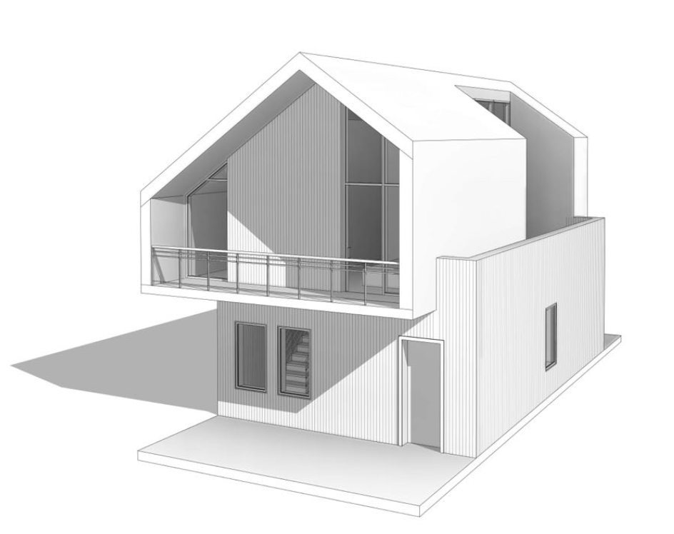

# Target House Seed — Precision Reference Spec

> **Purpose.** Authoritative reference for what the demo seed house should look
> like when perfectly modelled in BIM AI. Architect-quality verbal description
> precise enough to redraw from memory, specifically capturing the core
> asymmetrical massing and distinct wall heights.

---

## 1. Architectural Description (ground truth)

_Read as architect's field notes. Every measurement is intent, not survey._

### 1.1 Viewpoint

South-south-west isometric, camera elevated ~30–35° above the ground plane,
horizontal angle ~25–30° west of due south. The **south facade** (front) occupies
roughly 70% of the composition width; the **east facade** with the ground-floor
extension is visible to the right. The west facade is visible as a thin vertical
slice at the left edge.

---

### 1.2 Main Volume & Asymmetrical Massing

**Plan:** Two stacked, offset volumes. The ground floor acts as a wide base.
The upper floor is narrower, aligned entirely to the west (left) edge, leaving
the eastern portion of the ground floor exposed as a flat roof deck.

**Roof & Wall Heights (The Core Essence):** The upper volume is defined by a highly **asymmetrical gable roof** with
distinctly different wall heights on the east and west.

- The **roof ridge** is significantly off-center, shifted far to the east (right).
- The **west (left) wall** of the upper floor is very low. Consequently, the
  left-side roof pitch is long and descends to a low eave.
- The **east (right) wall** of the main upper volume is much higher before the
  roof begins, resulting in a short, steep roof pitch on the right side.
- Roof surface: **dark grey standing-seam metal**.

---

### 1.3 South Facade — Ground Floor

- Full width clad in **light beige/grey vertical siding**. Boards have a narrow
  shadow gap, running floor-to-ceiling without horizontal breaks.
- **One door:** single-leaf, standard height. Positioned right-of-centre. Dark
  solid-panel appearance with a vertical glass insert.
- **Two windows:** portrait-format narrow rectangular glazing. Positioned in the
  left half of the ground floor facade. Dark grey frames. A staircase is faintly
  visible through the rightmost window.

### 1.4 South Facade — Upper Floor & Loggia

- **The Asymmetrical Frame:** The front face of the upper volume is dominated by a
  thick, smooth white frame that outlines the asymmetrical gable shape (low wall
  on the left, long rising pitch, high off-center ridge, short drop on the right)
  and the floor slab.
- **Deep Recess (Loggia):** Everything inside this white frame is set back/recessed
  by ~1 500 mm to create a covered balcony.
- **Recessed Back Wall:** Clad in **warm, natural-tone vertical wood siding**,
  contrasting sharply with the white frame and lower beige siding.
- **Windows (on recessed wall):** 1. A large, floor-to-ceiling rectangular window/sliding door on the right. 2. A smaller, trapezoidal window on the left whose top edge slopes to follow
  the long, low angle of the roof pitch.
- **Balcony:** Projects very slightly forward. Features a wood floor deck and a
  **frameless transparent glass balustrade**. No solid posts visible.

### 1.5 West Facade

- Visible as a thin strip to the left.
- **Ground Floor:** Light beige/grey vertical siding.
- **Upper Floor:** Features the notably **low wall height** mentioned above. Finished
  in **smooth white render**. No openings visible from this angle.

### 1.6 East Facade & Extension

- **Ground Floor Extension:** The wide ground floor extends to the right (east),
  clad entirely in the **light beige/grey vertical siding**. The top forms a flat
  roof deck surrounded by a low parapet. Features one small vertical window.
- **Upper Dormer / Cut-out:** The eastern slope of the asymmetrical metal roof
  is interrupted by a massive rectangular dormer cut-out. This dormer opens
  directly onto the flat roof deck with large floor-to-ceiling glass doors. The
  cheeks/walls of this dormer match the smooth white render.

---

### 1.7 Material + Colour Summary

| Surface                        | Material               | Colour             |
| ------------------------------ | ---------------------- | ------------------ |
| Ground floor walls & extension | Vertical siding        | Light beige / grey |
| Upper floor side walls         | Smooth render          | Bright white       |
| Upper south recessed wall      | Vertical wood siding   | Warm natural wood  |
| Roof                           | Standing-seam metal    | Dark grey          |
| Asymmetrical front frame       | Smooth render          | Bright white       |
| Balcony balustrade             | Frameless glass        | Transparent        |
| Windows & Door frames          | Aluminium profile      | Dark grey          |
| Front Door                     | Solid panel with glass | Dark / mid-tone    |
