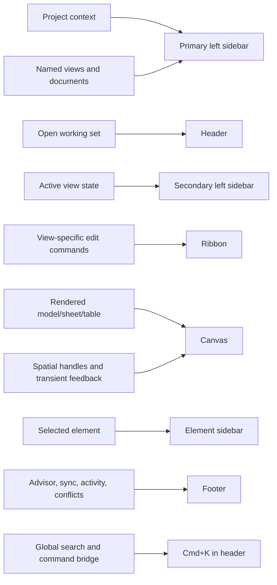

# BIM AI UX Rework Specification

Last updated: 2026-05-11

Source artifact: `spec/UX bim-ai rework.pdf`

Master index: [`spec/ux-bim-ai-rework-master.md`](./ux-bim-ai-rework-master.md)

Dynamic audit: [`spec/ux-bim-ai-rework-dynamic-audit.md`](./ux-bim-ai-rework-dynamic-audit.md)

Purpose: define the target interaction model for the workspace revamp before implementation. This document is intentionally prescriptive: the next implementation agent should be able to decide where any existing or future UI belongs without reinterpreting the slide deck.

## Executive Summary

The workspace needs a strict ownership model for layout surfaces. The current UI has many useful features, but they have accumulated in inconsistent regions: primary navigation also edits datums and types, the header mixes tabs with project selection and authoring shortcuts, the right rail mixes selected-element properties with view-wide 3D controls and the advisor, and the plan canvas has several independent floating toolbars. The target design consolidates almost everything into seven canonical regions:

```text
+--------------------------------------------------------------------------+
| Header: sidebar reveal + open tabs + share/presence + Cmd+K              |
+--------------------------------------------------------------------------+
| Ribbon: view-type-specific editing commands                              |
+--------------+-----------------+----------------------------+------------+
| Primary      | Secondary       | Canvas                     | Element    |
| navigation   | view sidebar    | drawing / viewing surface  | sidebar    |
|              |                 |                            | selection  |
+--------------+-----------------+----------------------------+------------+
| Footer: global status, advisor count, sync, warnings, coordinates        |
+--------------------------------------------------------------------------+
```

The important rule is not the visual grid itself. The important rule is that each control has exactly one conceptual owner:

| Owner                  | Scope                                            | Examples                                                                                                                                     |
| ---------------------- | ------------------------------------------------ | -------------------------------------------------------------------------------------------------------------------------------------------- |
| Primary left sidebar   | Project navigation                               | Concept, search project, floor plans, 3D views, sections, sheets, schedules, project selector, user menu                                     |
| Header                 | Open document/view tabs and global collaboration | Open tabs, close/reorder tabs, collapsed-sidebar reveal, share, presence, Cmd+K                                                              |
| Secondary left sidebar | Current view-type state                          | Plan view range, plan graphics, 3D sun/render/camera state, sheet paper/titleblock context, schedule columns/filter/sort, section crop/depth |
| Ribbon                 | Current view-type editing commands               | Draw wall, place door, annotate, sheet viewport editing, schedule row/column editing, concept board creation                                 |
| Canvas                 | The actual drawing/review surface                | Model viewport, sheet, schedule grid, view cube, direct-manipulation handles, short transient hints                                          |
| Element sidebar        | Selected-element instance/type details           | Wall properties, selected roof properties, selected viewport properties, selected schedule row element details                               |
| Footer                 | Global system and project-wide facts             | Advisor warning count, save/sync, undo depth, active view summary, coordinates, conflicts, activity                                          |

Ownership graph:



## Current Findings

The PDF identifies the same failure pattern repeatedly: controls are not bad individually, but their placement does not communicate their scope. The live workspace and code confirm this.

- The primary rail currently contains view navigation, level editing, browser legend, family library, types, families, discipline, and plan-style selectors. See `WorkspaceLeftRail` around lines 73-188 and `buildBrowserSections` around lines 98-205.
- The header currently contains project selection, workspace switching, undo/redo, section/measure/dimension/tag shortcuts, thin lines, close inactive views, tab-like mode navigation, share, search, presence, and account. See `TopBar` around lines 43-168 and 366-470.
- The ribbon is styled consistently but still uses broad Revit-like tabs independent of the active view type. It also contains navigation and view-switching commands that duplicate the primary sidebar/header. See `RibbonBar` around lines 410-650.
- The right rail is currently both selected-element inspector and view-control container. It also hosts advisor/review content globally. See `WorkspaceRightRail` around lines 422-478 and 959-1035.
- The canvas still owns several persistent control stacks: floating tool palette, plan detail toolbar, annotate ribbon, crop panel, zoom/fit, temporary visibility, reveal hidden, snap toolbar, navigation hints. See `Workspace` around lines 1844-1874 and `PlanCanvas` around lines 4904-5920.
- The current collapsed primary rail is better than the PDF screenshot because it shows section icons, but each icon still expands the same sidebar instead of navigating directly to that view group. See `LeftRailCollapsed`.
- The footer is close to the right place for global status, but the advisor currently lives in the right rail rather than the footer as a warning/error count with a dialog.

## Design Principles

### 1. Scope Must Be Visible

Every control must communicate whether it affects:

- the whole project,
- the active view,
- the editing mode inside the active view,
- the selected element,
- or the global application state.

Bad pattern: `Graphics` controls in the selected-element sidebar when they affect the whole 3D canvas.

Good pattern: `Graphics` controls in the secondary left sidebar for 3D because they affect the active 3D view, not the selected roof.

### 2. Navigation Is Not Editing

Opening a view, changing tabs, and drawing a wall are three different mental models.

- View navigation belongs to the primary left sidebar.
- Open views belong to header tabs.
- Drawing/editing belongs to the ribbon.

Bad pattern: header buttons for `Grundriss`, `3D`, `Schnitt`, `Plan`, `Tabelle`, `Konzept`.

Good pattern: primary sidebar lists view groups; clicking a named view opens or activates a header tab.

### 3. The Element Sidebar Must Disappear Without Selection

The right sidebar should be a true selected-element inspector. It should not stay open as a view settings panel when no element is selected.

Bad pattern: keep the right rail open in 3D with view controls even when no element is selected.

Good pattern: move view controls to the secondary left sidebar; collapse the right element sidebar whenever `selectedId` is empty.

### 4. The Secondary Sidebar Is Persistent View Context

The secondary left sidebar is not a second navigation tree. It is the cockpit for the current view type. It can resize to a compact minimum but should not fully disappear by default because it prevents view-level controls from becoming hidden or scattered.

Examples:

- Plan: level/view selector, view range, crop, detail level, phase, graphics, underlays, temporary visibility state.
- 3D: sun, render style, background, projection, camera actions, section box, category visibility, saved-view state.
- Sheet: sheet set, paper, titleblock, viewport list, sheet visibility, revisions.
- Schedule: active schedule, fields, sort/group/filter, formatting, placed-on-sheet state.
- Section: source plan, far clip, crop/depth, detail level, graphics, placed-on-sheet state.
- Concept: board layers, attachments, grouping, background/grid.

### 5. The Ribbon Is Always Present But View-Type Specific

Every view type should have a ribbon, but it must only expose commands that can be performed in that view type.

Bad pattern: a wall tool visible in a sheet or schedule, even if disabled, unless it is explicitly a bridge action in Cmd+K.

Good pattern: sheet ribbon has sheet authoring groups; schedule ribbon has table/documentation groups; 3D ribbon has select/modify/review/documentation groups; plan ribbon has create/modify/annotate groups.

### 6. Cmd+K Is The Universal Escape Hatch

Cmd+K must remain global and context-aware. It can expose navigation, bridges, and power commands that do not deserve persistent chrome. It should make scope explicit:

- Direct in current view.
- Opens another view.
- Requires selection.
- Unavailable with reason.

Cmd+K is allowed to bridge between modes. Persistent chrome generally should not.

### 7. The Canvas Should Not Become A Toolbar Host

Canvas overlays are allowed only when they are spatially meaningful or transient:

- allowed: view cube, selection grips, temp dimensions, numeric input at cursor, snap glyphs, north symbol, direct manipulation handles, short navigation hints;
- move out: persistent tool palettes, plan detail toolbar, crop panel, annotate ribbon, snap settings, reveal hidden, temporary visibility menus, long saved-view HUDs.

### 8. Do Not Lose Functionality

This revamp is a consolidation, not a feature removal. Any feature removed from a surface must be rehomed into one of the canonical regions and listed in the tracker.

## Layout Region Specifications

### Primary Left Sidebar

Target role: file-system-like project navigation.

Must contain:

- project selector at top;
- project search;
- navigation groups: Concept, Floor Plans, 3D Views, Sections, Sheets, Schedules;
- optional saved searches/recent views if needed;
- user menu at bottom;
- collapsed icon state showing meaningful view-group shortcuts;
- resize handle that can shrink to zero.

Must not contain:

- level creation/elevation editing;
- family/type authoring;
- discipline/perspective selectors;
- plan style selectors;
- browser legend;
- selected-element properties;
- advisor list.

Recommended ordering:

1. Project selector.
2. Search project.
3. Concept.
4. Floor Plans.
5. 3D Views.
6. Sections.
7. Sheets.
8. Schedules.
9. User/account menu.

Collapsed behavior:

- Width can be 0.
- When width is 0, the header shows a sidebar icon.
- When width is icon-only, each icon should activate or reveal the relevant navigation group, not only expand the sidebar generically.
- Active view group is indicated with a hi-fi icon and active marker.

### Header

Target role: tabs first, global collaboration second.

Must contain:

- reveal-primary-sidebar button when primary sidebar is hidden/collapsed;
- open tabs for active views and documents;
- tab close/reorder/add behavior;
- Cmd+K button/field;
- share/presence/current collaborators;
- optional small account/avatar if user menu is not already in primary sidebar.

Must not contain:

- project selection;
- workspace discipline switcher;
- authoring shortcuts;
- view-mode buttons duplicated from primary navigation;
- measure/dimension/tag/section QAT buttons;
- ribbon tabs.

Tab behavior:

- Clicking a named floor plan opens `Floor Plan: <name>`.
- Clicking a named 3D view opens `3D: <name>`.
- Clicking a sheet opens `Sheet: <number/name>`.
- Header tab state is independent from primary navigation structure. Primary navigation opens things; header shows currently open things.

### Secondary Left Sidebar

Target role: active view-type controls and properties.

Must contain:

- current view title/type summary;
- view-level property sections;
- view-specific graphics/visibility;
- view-specific filtering/sorting/crop/range/camera controls;
- view-specific library selectors where they affect current view editing context.

Must not contain:

- global project navigation;
- selected-element instance properties;
- global advisor list;
- generic account/user menu.

Resize behavior:

- resizable;
- minimum compact state remains visible enough to recover settings;
- should not fully disappear by normal drag because it is the stable home of view context.

### Ribbon

Target role: editing capabilities for the active view type.

Must contain:

- commands that create, modify, annotate, document, or place content in the active view;
- contextual modify group when a selected element supports edit commands;
- tool options only when tied to the active editing command.

Must not contain:

- view navigation;
- persistent project browser operations;
- global advisor;
- selected-element long-form properties;
- view-wide settings better owned by the secondary sidebar.

Recommended view-type ribbon groups:

| View type  | Groups                                                                                          |
| ---------- | ----------------------------------------------------------------------------------------------- |
| Floor plan | Create, Openings, Rooms/Areas, Annotate, Modify, Insert, Sketch, Datum                          |
| 3D         | Select, Modify, Openings, Review, Documentation, Visibility actions that are edits to selection |
| Section    | Annotate, Detail, Crop/Edit, Place on Sheet, Modify                                             |
| Sheet      | Place Views, Viewports, Titleblock, Revisions, Publish                                          |
| Schedule   | Rows, Columns, Fields, Formatting, Place on Sheet                                               |
| Concept    | Board, Place, Arrange, Markup, Attachments                                                      |

### Canvas

Target role: render and direct manipulation only.

Allowed persistent exceptions:

- view cube in 3D;
- north arrow/scale indicator in plan when treated as drawing affordances;
- compact navigation hint strip when not competing with the model;
- direct manipulation handles and in-context numeric entry.

Move out:

- floating tool palette;
- plan detail toolbar;
- annotate ribbon;
- crop region settings panel;
- snap settings toolbar;
- reveal hidden button;
- temporary visibility menu;
- saved 3D view HUD controls;
- long shortcut explanations.

### Element Sidebar

Target role: selected element only.

Must contain:

- selected element name/type/id summary;
- instance properties;
- type selector and edit/duplicate type actions when relevant;
- constraints/hosts;
- identity/provenance/evidence for that element;
- element-specific actions such as isolate selected, hide selected, insert hosted opening into selected wall.

Must not contain:

- view graphics;
- sun/camera/render controls;
- advisor list;
- level stack;
- generic family library;
- schedule/sheet global controls unless the selected element is a viewport, schedule row, titleblock, etc.

Visibility:

- hidden when no element is selected;
- appears when any model/document element is selected;
- selecting a view in primary navigation should open the tab, not permanently occupy the element sidebar unless the user explicitly selects that view object as an element.

### Footer

Target role: global status and alerts.

Must contain:

- advisor warning/error count;
- save/sync/offline status;
- undo/redo depth if still desired globally;
- current view summary;
- coordinates/snap/grid where relevant;
- activity/conflict counts;
- global lens/filter state only if it is truly project-wide.

Advisor behavior:

- footer shows compact count by severity;
- clicking opens an advisor dialog/drawer;
- dialog lists errors/warnings, filters by severity/perspective, supports selecting/navigating to affected elements;
- quick fixes remain available from the dialog, not as a persistent right-rail block.

## Canonical Feature Placement Matrix

| Feature                            | Current placement                    | Target placement                                                             | Rationale                                                          |
| ---------------------------------- | ------------------------------------ | ---------------------------------------------------------------------------- | ------------------------------------------------------------------ |
| Project selection                  | Header                               | Primary sidebar top                                                          | Project switching is navigation context, not a tab/header concern  |
| User/account menu                  | Header top right                     | Primary sidebar bottom, optional avatar in header                            | Follows Notion-like persistent navigation pattern                  |
| View groups                        | Header mode buttons and primary rail | Primary sidebar only                                                         | One navigation source avoids duplication                           |
| Open views                         | Header/tab bar                       | Header only                                                                  | Tabs describe open working set                                     |
| Discipline/workspace switch        | Header/left rail/options             | Secondary sidebar per view or Cmd+K                                          | It changes view/perspective context, not global navigation         |
| Level editing                      | Primary rail                         | Secondary sidebar for plan/section; element sidebar if selected level datum  | Datum editing is view/model context, not primary navigation        |
| Types                              | Primary rail                         | Secondary sidebar library/type manager or modal from ribbon/Cmd+K            | Types are resources used by authoring, not navigation destinations |
| Families                           | Primary rail button and tree         | Ribbon Insert + secondary sidebar library selector + Cmd+K                   | Families are authoring resources and reusable assets               |
| Wall/door/window tools             | Header QAT, ribbon, floating palette | Floor-plan ribbon                                                            | They are plan editing commands                                     |
| Measure/dimension/tag              | Header QAT, ribbon, floating palette | Plan/section ribbon and Cmd+K                                                | They are view-specific tools                                       |
| View graphics                      | Right rail                           | Secondary sidebar                                                            | Applies to whole active view                                       |
| 3D sun/camera/render               | Right rail                           | Secondary sidebar for 3D                                                     | Applies to whole 3D canvas                                         |
| Selected wall/roof/etc. properties | Right rail                           | Element sidebar                                                              | Correct as concept, but remove unrelated view controls             |
| Advisor                            | Right rail                           | Footer count + dialog                                                        | Advisor is globally valuable and should be always visible          |
| Snap settings                      | Canvas bottom right/status           | Ribbon tool options or footer compact controls                               | Persistent canvas menus add visual noise                           |
| Reveal hidden/temporary visibility | Canvas bottom right/right rail       | Secondary sidebar view visibility; element sidebar for selected hide/isolate | Visibility is view/selection scoped                                |
| View cube                          | Canvas                               | Canvas exception                                                             | Spatial 3D orientation control                                     |
| Navigation hints                   | Canvas/footer                        | Footer or transient canvas hint                                              | Helpful but must not become a competing chrome system              |

## Usability Measurement Method

Use this lightweight scoring model during implementation reviews:

| Metric             | Question                                                                | Target                                   |
| ------------------ | ----------------------------------------------------------------------- | ---------------------------------------- |
| Scope fit          | Is the control in the layout region matching its scope?                 | 100 percent for persistent controls      |
| Reachability       | Can the user reach the feature in the view where it matters?            | direct or Cmd+K, max 2 persistent clicks |
| Duplicates         | Is the same command exposed persistently in multiple unrelated regions? | no duplicates except Cmd+K               |
| Dead chrome        | Is a command visible where it cannot run?                               | no, unless disabled with reason in Cmd+K |
| Selection hygiene  | Does the element sidebar disappear when nothing is selected?            | always                                   |
| Canvas cleanliness | Is the canvas free of non-spatial persistent controls?                  | yes, except allowed exceptions           |
| Recovery           | Can collapsed/hidden regions be restored?                               | always visible affordance                |

Suggested review table for each feature:

```text
Feature:
Current region:
Target region:
Scope: project | view | edit-mode | selection | global
Current issue:
Move/redesign:
Reachability path:
Regression guard:
```

## Implementation Sequence

1. Establish layout shell primitives: resizable primary sidebar, secondary sidebar, header tabs, ribbon, canvas, element sidebar, footer.
2. Move project selector and user menu into primary sidebar.
3. Reduce header to tabs, sidebar reveal, Cmd+K, share/presence.
4. Replace primary rail contents with navigation-only groups.
5. Create secondary sidebar adapters per view type.
6. Move right-rail view controls into secondary sidebar.
7. Make element sidebar selection-only and hidden by default.
8. Move advisor to footer count plus dialog.
9. Convert canvas docks/HUDs into ribbon/secondary/footer owners.
10. Replace generic ribbon tabs with view-type ribbon definitions.
11. Update Cmd+K capability graph to mirror the new ownership model.
12. Add reachability tests and visual screenshots per view type.

## Regression Requirements

- A test must fail if project selection reappears in the header.
- A test must fail if view navigation buttons reappear in the header outside tabs.
- A test must fail if a plan authoring tool is persistently visible in sheet/schedule/agent views.
- A test must fail if the right element sidebar is visible with no selected element.
- A test must fail if 3D graphics/camera controls live in the element sidebar.
- A test must fail if advisor content is only reachable through a side rail.
- A test must fail if the primary sidebar can be collapsed to zero without a header reveal button.
- A test must fail if any primary sidebar collapsed icon only expands the same rail without navigating or focusing a group.
