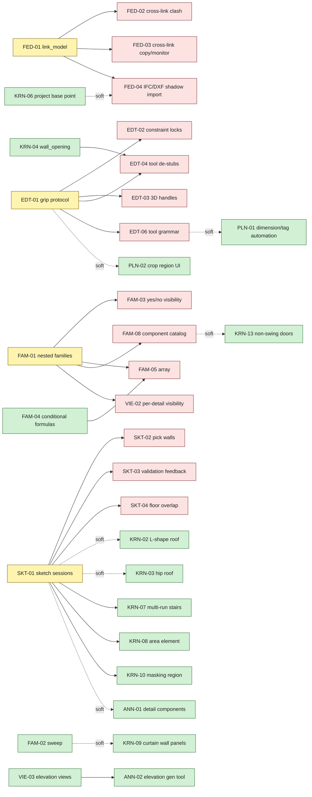

# BIM AI — Workpackage Tracker

Single source of truth for outstanding implementation work. Waves 0–6 are merged to main; their prompt files have been deleted per protocol. Earlier wave-by-wave specs and the screenshot-driven PRD have been consolidated here.

Verified against code on 2026-05-07; everything not listed here is shipped.

## Status Legend

| Symbol     | Meaning                                                         |
| ---------- | --------------------------------------------------------------- |
| `done`     | Meets the done rule — tested, type-clean, merged to main        |
| `partial`  | Some slice exists; measurable progress; spec requirements unmet |
| `open`     | Not started                                                     |
| `deferred` | Explicitly out of scope for current roadmap                     |

## Done Rule

A workpackage is `done` when all of: (a) `pnpm exec tsc --noEmit` clean; (b) new logic has vitest / pytest unit coverage; (c) `make verify` passes; (d) merged to main and pushed.

## How to read this tracker

The bulk of the backlog is structured around **five strategic primitives**:

- **P1 Federation** (linked models, in-DB coordination) — Navisworks-grade coordination without file round-trip.
- **P2 In-Place Editing** (canvas grips + 3D handles) — the Revit "click and drag with live dimensions" feel.
- **P3 Sketch Mode** (closed-loop authoring sessions) — irregular geometry from canvas.
- **P4 Family System Depth** (nested, sweep, yes/no, conditional formulas, arrays) — families that actually flex.
- **P5 View Discipline** (detail levels, elevations, isolate, templates) — production documentation control.

Each primitive is a multi-WP programme that, once landed, unlocks a large surface of Revit-equivalent capability. Below the primitives is a list of **standalone WPs** that are either smaller, narrower, or independent of the primitives.

Reading order if you want to spend an hour with this doc:

1. The **Cross-Epic Dependency Map** below — tells you what can run in parallel and what blocks what
2. The "Why it matters" and "What it unlocks" lines for each primitive
3. The summary table at the top of each primitive section
4. The detailed WP entries for whichever primitive you intend to sequence next

---

## Cross-Epic Dependency Map

Within-epic deps appear in each primitive's summary table. This section captures the **cross-epic** picture so you can sequence sprints without surprises.

### TL;DR

- **Most of the backlog is parallelisable.** Roughly half (~30 WPs) have no dependencies anywhere and can start today.
- **Four keystone WPs** unlock most of the second half: **FED-01, EDT-01, SKT-01, FAM-01.** Land these in any order (they are independent of each other) and the rest cascades into mass parallel work.
- **The target-house demo critical path is fully parallelisable today** — KRN-11/12/13/14 + MAT-01 have zero cross-epic deps. Five engineers could ship the target-house in ~1 calendar week each.

### Dependency graph



Legend: yellow = keystone (no deps, unblocks many); green = ready (no cross-epic deps); red = blocked until its prerequisite ships. Solid arrows are hard deps (cannot ship without); dashed arrows are soft deps (can ship a degraded version, full version needs the prereq).

### Cross-epic dependency table

Only the **cross-primitive** edges are listed (within-primitive deps are already in each section's summary table). Soft = can ship a degraded version without; Hard = cannot ship at all without.

| Dependent WP | Depends on (cross-epic)             | Hard / Soft | Reason                                                                          |
| ------------ | ----------------------------------- | ----------- | ------------------------------------------------------------------------------- |
| EDT-04       | KRN-04                              | Hard        | Wall-Opening tool commits `CreateWallOpening`; needs the element kind first      |
| FED-04       | KRN-06                              | Soft        | Proper CAD alignment with `origin_to_origin` benefits from project base point   |
| KRN-02       | SKT-01                              | Soft        | Authorable today via API; sketch mode makes interactive authoring practical     |
| KRN-03       | SKT-01                              | Soft        | Same as KRN-02                                                                  |
| KRN-07       | SKT-01                              | Hard        | Sketch-based stair shape variant requires sketch sessions                       |
| KRN-08       | SKT-01                              | Hard        | Area boundary is sketch-authored                                                |
| KRN-09       | FAM-01, FAM-02                      | Soft        | Panel-as-family-instance needs FAM-01; mullion profile rendering needs FAM-02   |
| KRN-10       | SKT-01                              | Hard        | Masking region boundary is sketch-authored                                      |
| KRN-13       | FAM-08                              | Soft        | Catalog-driven door variants benefit from FAM-08; can hardcode types otherwise   |
| VIE-02       | FAM-01                              | Hard        | Per-element / per-family-geometry visibility uses FAM-01's geometry node infra  |
| ANN-01       | SKT-01                              | Soft        | `detail_region` is sketch-authored; `detail_line` and `text_note` are not       |
| ANN-02       | VIE-03                              | Hard        | "Generate elevation from wall face" creates a `VIE-03 elevation_view` element   |
| PLN-01       | EDT-06                              | Soft        | Auto-tag-everything generalises EDT-06's Tag-on-Place modifier                  |
| PLN-02       | EDT-01                              | Soft        | Crop region drag handles use the EDT-01 grip protocol                           |

**Notable independence:** Federation, In-Place Editing, Sketch Mode, and Family System Depth are mutually independent at the keystone level — FED-01, EDT-01, SKT-01, and FAM-01 share no dependencies and can be sequenced in any order or in parallel. Five engineers could each take one keystone (plus FAM-02, FAM-04, or any of the standalone WPs) and ship in parallel for ~3 calendar weeks before any cross-epic synchronisation is required.

### Parallelisation waves

Group WPs by when they can start.

#### Wave 0 — start today, all parallel (no deps anywhere)

**Federation foundations:** FED-01, FED-05
**Editing foundations:** EDT-01, EDT-05
**Sketch foundation:** SKT-01
**Family foundations:** FAM-01, FAM-02, FAM-04, FAM-06, FAM-07, FAM-09, FAM-10
**View independent:** VIE-01, VIE-03, VIE-04, VIE-05, VIE-06, VIE-07
**Kernel independent:** KRN-01, KRN-04, KRN-05, KRN-06, KRN-11, KRN-12, KRN-14
**Materials:** MAT-01
**Validation:** VAL-01
**Exchange:** IFC-01, IFC-02, IFC-03, IFC-04
**Plan / annotation independent:** ANN-02 (after VIE-03 is in Wave 0, also parallel-safe), ANN-01 (`detail_line` + `text_note` parts)
**CLI:** CLI-01, CLI-02, AGT-01

**~33 WPs.** Headcount ceiling here is not technical — it's coordination and review capacity.

#### Wave 1 — start once Wave 0 keystone(s) land

After **FED-01:** FED-02, FED-03, FED-04 (3 WPs in parallel)
After **EDT-01:** EDT-02, EDT-03, EDT-04, EDT-06 (4 WPs in parallel)
After **SKT-01:** SKT-02, SKT-03, SKT-04, KRN-02, KRN-03, KRN-07, KRN-08, KRN-10, ANN-01 `detail_region` part (9 WPs in parallel)
After **FAM-01:** FAM-03, FAM-05 (waits for FAM-04 too), FAM-08, VIE-02 (4 WPs)

**~20 WPs**, all in their own dependency cluster.

#### Wave 2 — second-order deps

After **FAM-04 + FAM-01:** FAM-05
After **FAM-02:** KRN-09 panel-as-family-instance variant
After **FAM-08:** KRN-13 catalog-driven (or ship inline as Wave 0)
After **VIE-03:** ANN-02 (already in Wave 0 if VIE-03 is)
After **EDT-06:** PLN-01 (auto-tag-everything)
After **EDT-01:** PLN-02 (crop drag handles)
After **KRN-04:** EDT-04 (tool de-stub for wall opening)

**~7 WPs** that need a single Wave-1 prereq, then ship in parallel.

### Critical paths to user-facing capabilities

What's the smallest WP set required to ship a specific user-visible goal? Useful for sprint scoping when leadership asks "what would it take to demo X next month?"

| Goal                                                  | Required WPs (in order)                                  | Calendar (1 eng) | Calendar (parallel) |
| ----------------------------------------------------- | -------------------------------------------------------- | ---------------- | ------------------- |
| **Author the demo target-house from scratch**         | KRN-11 + KRN-12 + KRN-13 + KRN-14 + MAT-01               | ~6 weeks         | ~1.5 weeks (5 eng)  |
| **Federated coordination (Navisworks-grade clash)**   | FED-01 → FED-02                                          | ~3.5 weeks       | ~3.5 weeks (serial) |
| **Drag walls in 3D viewport to change height**        | EDT-01 → EDT-03                                          | ~7 weeks         | ~7 weeks (serial)   |
| **Author L-shaped floors from canvas**                | SKT-01 → SKT-02                                          | ~5 weeks         | ~5 weeks (serial)   |
| **Parametric chair-array dining-table family**        | FAM-01 → FAM-04 → FAM-05                                 | ~5 weeks         | ~4 weeks (FAM-04 ‖ FAM-01) |
| **Production plan documentation (Coarse/Med/Fine)**   | VIE-01 + VIE-02 (parallel after FAM-01)                  | ~3 weeks         | ~2 weeks            |
| **N/S/E/W elevations on a sheet**                     | VIE-03 + ANN-02                                          | ~2 weeks         | ~1.5 weeks          |
| **IFC import → linked shadow model**                  | FED-01 → FED-04 (KRN-06 soft prereq)                     | ~5.5 weeks       | ~5 weeks (overlap KRN-06) |
| **Full Revit-style "click and edit" feel for walls**  | EDT-01 → EDT-02 → EDT-03 + EDT-05 + EDT-06               | ~10 weeks        | ~7 weeks            |
| **Asymmetric-roof seed renders correctly in 3D**      | KRN-11 alone                                             | 1 week           | 1 week              |
| **Loggia frame on target-house**                      | FAM-02 sweep alone (compose with existing walls)         | 1 week           | 1 week              |
| **Multi-run stair (dog-leg)**                         | SKT-01 → KRN-07                                          | ~6 weeks         | ~6 weeks (serial)   |

**Shortest demonstrable wins:** KRN-11 (asymmetric roof, 1 wk) and FAM-02 (sweep, 1 wk) each ship a visible product capability in a week with zero cross-epic blockers. Good candidates for a quick first sprint to validate the new tracker.

**Highest leverage single sprint:** SKT-01 unblocks 9 downstream WPs. EDT-01 unblocks 4 + 2 standalone. FED-01 unblocks 3. FAM-01 unblocks 4 + 1 cross-epic. Pick whichever keystone aligns with the most pressing customer feedback.

---

## Strategic Primitive 1 — Federation (linked models, in-DB coordination)

**Why it matters.** Today bim-ai is a single-model authoring environment. Revit projects in real practice are *federations*: an Architecture model links a Structure model, links MEP, links Site. Coordination (clash, copy/monitor, constructibility review) happens across the federation. Without federation, bim-ai cannot reach Navisworks-grade coordination; with it, the database-native version is **strictly stronger** than Revit's file-based linking because element IDs are stable across reload (no NWC round-trip needed).

**What it unlocks.** Cross-discipline clash detection, cross-discipline Copy/Monitor, IFC/DXF import (via shadow models), multi-discipline workspaces, future Revit `.rvt` import (via the same shadow-model pattern through whatever conversion route lands), and obsolescence of "Synchronize with Central" (already true continuously in our architecture, just unmarketed).

**Sequence:** FED-01 first; FED-02 / FED-03 / FED-04 are independent of each other but all depend on FED-01.

| ID     | Item                                                  | Effort | State  | Depends on |
| ------ | ----------------------------------------------------- | ------ | ------ | ---------- |
| FED-01 | `link_model` element kind + read-only enforcement     | L      | `open` | —          |
| FED-02 | Cross-link clash detection (extends WP-V2-13)         | M      | `open` | FED-01     |
| FED-03 | Cross-link Copy/Monitor (extends WP-V2-12)            | M      | `open` | FED-01     |
| FED-04 | IFC / DXF → shadow-model link import                  | L      | `open` | FED-01     |
| FED-05 | "Worksharing-via-DB" positioning + docs               | XS     | `done` | —          |

### FED-01 — `link_model` element kind + read-only enforcement

**Scope.** First-class linked-model element. Host model references another bim-ai model in the same DB; host treats the link's elements as read-only renderable context. Selection works, snap-to works, clash queries work, but edits are blocked at the engine level.

**Data model (`packages/core/src/index.ts`):**

```ts
{
  kind: 'link_model';
  id: string;
  name: string;
  sourceModelId: string;                 // UUID of another bim-ai model
  sourceModelRevision?: number | null;   // null = follow latest; pin = hold at revision
  positionMm: { xMm: number; yMm: number; zMm: number };
  rotationDeg: number;                   // around Z axis at sourceModel origin
  originAlignmentMode:
    | 'origin_to_origin'
    | 'project_origin'
    | 'shared_coords';
  visibilityMode: 'host_view' | 'linked_view';   // matches Revit's VV → Revit Links
  worksetId?: string | null;
  hidden?: boolean;
  pinned?: boolean;                      // prevent accidental move
}
```

**Engine (`app/bim_ai/engine.py`, `commands.py`):**

- New commands: `CreateLinkModel`, `UpdateLinkModel`, `UnloadLinkModel`, `ReloadLinkModel`, `DeleteLinkModel`
- Validation: `sourceModelId` must exist; non-self-referential; non-circular (BFS the link graph at apply time)
- Read-only enforcement: any command targeting an element ID that resolves through a link returns a new advisory `linked_element_readonly` (blocking)
- Revision pinning: when `sourceModelRevision` is set, snapshot resolution looks up the source's snapshot at that revision (requires per-model revision history, already shipped)
- Snapshot expansion: `GET /api/models/:id/snapshot?expandLinks=true` returns linked elements inline with provenance markers (`_linkedFromLinkId`, `_linkedFromElementId`); default omits to keep payload small

**Renderer (`packages/web/src/Viewport.tsx`, `packages/web/src/plan/`):**

- Linked elements render with reduced opacity (configurable per VV); a small "🔗" badge in the inspector when selected
- Snap-to works against linked geometry without modification
- Edit attempts open inspector with disabled fields and tooltip "Linked from <model name> — open in source to edit"
- Performance: linked snapshots cached per `(sourceModelId, sourceRevision)` tuple; invalidate on commit to source

**CLI (`packages/cli/cli.mjs`):**

- `bim-ai link --source <uuid> --pos x,y,z --rot 0 --align origin_to_origin`
- `bim-ai unlink <link_id>`
- `bim-ai links` lists active links with their resolved revisions
- `bim-ai expand-links <bundle.json>` evaluates a bundle against an expanded snapshot for clash analysis

**UI (`packages/web/src/workspace/`):**

- Project Browser left rail: new "Links" group with expand/collapse, eye toggle, drift badge (when latest source revision > pinned)
- New `ManageLinksDialog.tsx`: list, reload, unload, pin/unpin revision, replace source, change `originAlignmentMode`
- VV dialog (`VVDialog.tsx`): new "Revit Links" tab with per-link visibility mode toggle

**Acceptance.** Two seeded models (Architecture host + Structure source) load; host can be authored normally; structure shows up as ghosted geometry; selecting a structural beam shows its inspector with all fields disabled and the "linked from STR.bim" tooltip; deleting the link cleanly removes structural geometry from host views; cycling pin / latest changes which revision is rendered.

**Effort.** L — 2-3 weeks for one engineer.

### FED-02 — Cross-link clash detection

**Scope.** Extend the Wave-6 clash detection (`clash_test` + `selection_set`) to operate across linked models. Today both sets must come from the host model; this WP makes them resolve through the link graph.

**Data model.** `SelectionSetRule` gains an optional `linkScope`:

```ts
export type SelectionSetRule = {
  field: 'category' | 'level' | 'typeName';
  operator: 'equals' | 'contains';
  value: string;
  linkScope?: 'host' | 'all_links' | { specificLinkId: string };  // default 'host'
};
```

**Engine.** `clash_test` apply path expands selection sets across `linkScope` before AABB / mesh proximity test. Link-relative transforms (position + rotation) applied to AABBs at expansion time. `ClashResult` rows gain `linkChainA: string[]` and `linkChainB: string[]` to identify each element's source.

**UI.** Set A/Set B rule editor adds a "Scope" dropdown (Host only / All links / Specific link). Result list shows link chain in element pair labels (e.g. `STR/Beams/B-12 ↔ MEP/Ducts/D-04`). Camera fly-to crosses link boundaries; transforms applied to camera target.

**Acceptance.** Loading the demo Architecture model with Structure linked, configuring clash test "All Architecture walls vs Structure beams", running it, and seeing pairs identified with link chains in the result list. Clicking a result flies the camera to the clash regardless of which model the geometry comes from.

**Effort.** M — 1 week (depends on FED-01).

### FED-03 — Cross-link Copy/Monitor

**Scope.** Extend `monitorSourceId` (Wave-5 Copy/Monitor) to point at an element in a *linked* model, not just intra-model. Drift detection runs across link revisions.

**Data model.** Existing `monitorSourceId: string` becomes `monitorSource: { linkId?: string; elementId: string; sourceRevisionAtCopy: number }` (with a migration path that reads the legacy string as `{ elementId: string }`).

**Engine.**

- New `BumpMonitoredRevisions` command: walks all elements with `monitorSource`, looks up the current revision of the source link, marks drift if the monitored fields differ
- Drift detection: deep-equal on a configurable list of monitored fields per element kind (e.g. for grids: `lineStartMm`, `lineEndMm`, `name`)
- Conflicts surface as advisory `monitored_source_drift` rows (warning severity)

**UI.**

- Inspector "Monitored from" field shows link name + element ID + revision-at-copy
- "Reconcile" button: recompute drift; offer "Accept source" (overwrite host fields) or "Keep host" (bump revision-at-copy)
- Canvas badge: yellow triangle when source has drifted

**Acceptance.** Copying a structural grid line from a linked Structure model into Architecture host; modifying the line in the source; reopening the host; seeing drift badge + advisory; accept-source updates host to match.

**Effort.** M — 1 week (depends on FED-01).

### FED-04 — IFC / DXF → shadow-model link import

**Scope.** When a customer wants to bring a Revit / IFC / DWG file into bim-ai, we don't write a native parser into the host model. Instead we import the file into a brand-new bim-ai model in the same DB, then create a `link_model` row in the host pointing at that shadow model. This preserves the database-native collaboration story even when the source data came from a file.

**Engine.**

- IFC: existing `authoritativeReplay_v0` command sketch (`app/bim_ai/export_ifc.py`, kernel-replay path) already reconstructs commands from an IFC re-parse. Pipe that into a fresh model created via `POST /api/projects/:projectId/models`. Endpoint: `POST /api/models/:hostId/import-ifc?file=foo.ifc` → returns `{ linkedModelId, linkElementId }`
- DXF (instead of DWG, which is proprietary): use Python `ezdxf` to read 2D linework. New element kind `link_dxf` (separate from `link_model`) holds raw DXF data + render hints — used as 2D plan underlay only, not 3D geometry
- Revit `.rvt`: out of scope per OpenBIM Stance until a viable conversion route exists (Autodesk Forge / customer-built plugin / Speckle); the same shadow-model pattern accepts whatever converter writes

**UI.** File menu → Insert → Link IFC / Link DXF / Link Revit (disabled with tooltip). After import, automatically opens `ManageLinksDialog` with the new entry highlighted.

**Acceptance.**

- IFC: import a small IFC file (the seed demo's own IFC export), confirm a new shadow model is created and renders ghosted in the host
- DXF: import a 2D site-plan DXF, confirm linework appears as plan underlay on the active level
- Revit: button is greyed with explanatory tooltip; no panic if a customer drops a `.rvt` (clear "deferred" message)

**Effort.** L — 3 weeks for IFC; +1 week for DXF underlay. Revit is out of scope.

### FED-05 — Worksharing-via-DB positioning + docs

**Scope.** Not a code change — a documentation / marketing positioning WP. Today bim-ai is server-authoritative on every command commit, broadcast via websocket, with per-user undo stacks. That's strictly stronger than Revit's central-file model with periodic Synchronize. Worth being explicit about this in product copy and in the agent-evidence loop docs.

**Deliverables.**

- A `docs/collaboration-model.md` (or section in the README) explaining the continuous-commit model and why "Synchronize with Central" is unnecessary
- Updated CLI / API `--help` text for collaboration-related commands to reference this
- A short marketing line: *"BIM AI is the first BIM authoring environment with continuous server-authoritative collaboration; there is no central file to synchronize."*

**Effort.** XS — half a day.

---

## Strategic Primitive 2 — In-Place Editing (canvas grips + 3D handles)

**Why it matters.** Today the Inspector panel is the primary editing surface; in Revit it's the secondary one — primary editing in Revit is on-canvas grips with live temporary dimensions and 3D direct-manipulation handles. This is what users mean when they say *"the editor can do much more"*. The data model already supports everything the Revit grips do (constraint-driven heights via `topConstraintLevelId` etc., location-line offsets, host relationships); the UX just doesn't expose it.

**What it unlocks.** All 9 currently-stubbed plan-canvas tools (`splitWall`, `alignElement`, `trimElement`, `wall-opening`, `wall-join`, `column placement`, `beam placement`, `ceiling`, `shaft`); 3D direct manipulation; on-canvas dimensions; constraint locks; the full Revit "draw and tweak fast" feel.

**Sequence:** EDT-01 is foundational and must come first. EDT-02 / EDT-03 / EDT-04 / EDT-05 / EDT-06 are then largely parallelisable once the protocol exists.

| ID     | Item                                                            | Effort | State  | Depends on |
| ------ | --------------------------------------------------------------- | ------ | ------ | ---------- |
| EDT-01 | Universal grip + temp-dimension protocol on plan canvas         | XL     | `open` | —          |
| EDT-02 | Constraint locks via padlock UI                                 | M      | `open` | EDT-01     |
| EDT-03 | 3D direct-manipulation handles                                  | L      | `open` | EDT-01     |
| EDT-04 | De-stub the 9 plan-canvas tools                                 | M      | `open` | EDT-01     |
| EDT-05 | Snap-engine upgrade (intersection / perp / tangent / extension) | M      | `open` | —          |
| EDT-06 | Tool grammar polish (Chain / Multiple / Tag-on-Place / Numeric) | M      | `open` | EDT-01     |

### EDT-01 — Universal grip + temp-dimension protocol on plan canvas

**Scope.** Build the grip + temp-dim infrastructure once; make every element kind opt in by registering grip descriptors and temp-dim targets. This replaces "select → open Inspector → type number → tab away" with "select → drag grip → type override → release".

**Protocol.** Each element kind that supports in-place editing exports two functions:

```ts
type GripDescriptor = {
  id: string;
  positionMm: { xMm: number; yMm: number };
  shape: 'square' | 'circle' | 'arrow';
  axis: 'x' | 'y' | 'free' | 'normal_to_element';
  hint?: string;
  onDrag: (deltaMm: XY) => DraftMutation;       // returns a draft element for live preview
  onCommit: (deltaMm: XY) => Command;            // returns the command to commit on release
  onNumericOverride: (absoluteMm: number) => Command;
};

type TempDimTarget = {
  id: string;
  fromMm: XY;
  toMm: XY;
  direction: 'x' | 'y';
  onClick: () => Command;                        // converts to persistent dimension
  onLockToggle: () => Command;                   // adds a constraint
};

interface ElementGripProvider<E extends Element> {
  grips(element: E, context: PlanContext): GripDescriptor[];
  tempDimensionTargets(element: E, context: PlanContext): TempDimTarget[];
}
```

**Plan canvas integration (`packages/web/src/plan/PlanCanvas.tsx`):**

- New `gripLayer` rendered above element layer; raycast grips before element pick so grips take priority on hover
- New `tempDimLayer` rendered when exactly one element is selected; computes nearest plan element in each cardinal direction; renders faint blue dimension lines with a small lock icon
- Drag handler: on drag-start clones the element into a draft, calls `onDrag(delta)` for each frame, calls `onCommit(delta)` on release. Esc cancels
- Numeric override: while dragging, typing a digit pops a small input field at cursor; Enter commits via `onNumericOverride`; Tab cycles between dimension chains

**Element kinds wired in this WP:**

- Wall: endpoint grips + midpoint move + thickness handle
- Door / Window: alongT slide grip on host wall
- Floor: vertex grips on each boundary corner
- Column / Beam: position grip + rotation handle
- Section line: endpoints
- Dimension: anchor + offset
- Reference plane (after KRN-05 lands): endpoints

**Acceptance.** Selecting a wall in plan view shows two endpoint squares + one midpoint circle + a thickness arrow on the cut edge. Hovering shows blue temp dimensions to the nearest neighbours. Dragging the endpoint emits a live preview at 60fps; releasing commits `MoveWallEndpoints`. Typing "5000" while dragging snaps to exactly 5000mm from the start point.

**Effort.** XL — 4 weeks for the full infra + walls done end-to-end. Add roughly 0.5 week per additional element kind once the protocol is proven; budget 6 weeks total to wire the seven kinds above.

### EDT-02 — Constraint locks via padlock UI

**Scope.** When a temp dimension is shown, render a small padlock icon on the dimension. Clicking the lock persists that distance as a constraint; subsequent commands that would violate the constraint are rejected at engine apply.

**Data model.** New element kind:

```ts
{
  kind: 'constraint';
  id: string;
  rule:
    | 'equal_distance'
    | 'equal_length'
    | 'parallel'
    | 'perpendicular'
    | 'collinear';
  refsA: { elementId: string; anchor: 'start' | 'end' | 'mid' | 'center' }[];
  refsB: { elementId: string; anchor: 'start' | 'end' | 'mid' | 'center' }[];
  lockedValueMm?: number;   // only for equal_distance
}
```

**Engine.** Constraints recomputed after every command apply (similar to existing constraint pipeline). Violations reject commands with a new advisory `constraint_violation` (severity `error`). Soft conflicts (e.g. user drags within tolerance) snap back to the locked value.

**UI.** Padlock icon on temp dims (open / closed states); right-click constraint in inspector → Delete; constraints list in left rail under "Constraints" group.

**Note.** EQ symmetry already exists in the family editor (WP-V2-11) — port that constraint code into the project-level constraint engine.

**Acceptance.** Lock the distance between two parallel walls at 4000mm; moving one wall pulls the other along to maintain 4000mm; explicit conflict (try to move both into a contradictory state) raises an error advisory and rejects the command.

**Effort.** M — 1.5 weeks (depends on EDT-01).

### EDT-03 — 3D direct-manipulation handles

**Scope.** Same protocol as EDT-01 but in the 3D viewport. Specifically what the Revit videos show: click a wall in 3D, drag its top edge upward to change height; click a roof, drag the ridge to change pitch; click a slab edge, drag to extend; click a wall face, get a "Add door / window / opening" radial menu.

**Renderer (`packages/web/src/Viewport.tsx`):**

- Handles drawn via Three.js LineSegments + Sprite, raycast detection runs before element pick so handles take precedence when hovered
- New `viewport/grip3d.ts` module exports `register3dGripProvider(kind, provider)`
- Provider returns `{ position, axis, onDrag, onCommit }` — same shape as plan grips but in 3D
- A glowing axis (red/green/blue per direction) shown during drag

**Element kinds wired:**

- Wall: top-edge handle → drag-up changes `topConstraintOffsetMm`; bottom edge changes `baseConstraintOffsetMm`; click face → radial menu (Add Door / Window / Opening)
- Floor: edge handle drags vertex; corner handle drags two adjacent edges; thickness handle on visible cut edge
- Roof: ridge handle drags ridge height; eave handle drags slope; gable-end handle drags overhang
- Column / Beam: top / bottom handles change endpoints
- Door / Window (in elevation view only): width / height handles
- Section box (already partly there via `SectionBox.tsx`): six face handles (already wired) — extend with corner handles for free-form cuts

**Acceptance.** From the seeded demo SSW viewpoint: clicking a wall reveals top + bottom handles; dragging the top handle commits `topConstraintOffsetMm` and the wall visibly grows in real time; the floor above (constrained to top of wall) follows. Clicking a face of a wall opens a small radial menu offering "Insert Door" / "Insert Window" / "Insert Opening", placing the resulting hosted element at the click point.

**Effort.** L — 3 weeks for walls + floors + roof; +1 week for openings + columns. Total budget ~4 weeks.

### EDT-04 — De-stub the 9 plan-canvas tools

**Scope.** Once EDT-01 lands, finish off the 9 tool stubs in `packages/web/src/plan/PlanCanvas.tsx`:

| Stub                       | Line  | Tool name (UI / shortcut)             | Engine command on commit              |
| -------------------------- | ----- | -------------------------------------- | ------------------------------------- |
| `splitWall`                | 1103  | Split Element (SD)                    | `SplitWallAt`                         |
| `alignElement`             | 1085  | Align (AL)                            | `AlignElementToReference`             |
| `trimElement`              | 1158  | Trim/Extend (TR)                      | `TrimElementToReference`              |
| `wall-opening`             | 924   | Wall Opening                          | `CreateWallOpening` (see KRN-04)      |
| `wall-join`                | 1409  | Wall Joins (interactive variant)      | `SetWallJoinVariant`                  |
| `column placement`         | 1256  | Place Column                          | `CreateColumn`                        |
| `beam placement`           | 1265  | Place Beam                            | `CreateBeam`                          |
| `ceiling`                  | 1286  | Ceiling                               | `CreateCeiling` (sketch via SKT-01)   |
| `shaft`                    | 1243  | Shaft (slab opening)                  | `CreateSlabOpeningShaft`              |

**Note.** The element-create commands (`CreateColumn`, `CreateBeam`, `CreateCeiling`) already exist in the API; this WP just wires the canvas tool flows. `CreateWallOpening` requires KRN-04 first.

**Per-stub shape.** Each tool follows the same pattern:

1. User clicks tool / types shortcut → tool enters its own state (with options bar)
2. User clicks one or more reference points / elements
3. Tool emits a draft mutation that PlanCanvas renders as live preview
4. User confirms (Enter / final click) → command commits
5. With Multiple modifier active, tool stays active for next placement

**Acceptance.** Each tool's stub `console.warn` is replaced by an actual command commit; the tool's hotkey works; Multiple-mode keeps the tool active; Esc exits the tool.

**Effort.** M — ~1 week per tool, parallelisable across multiple engineers; ~3 calendar weeks total with two engineers (depends on EDT-01).

### EDT-05 — Snap-engine upgrade

**Scope.** Today's snap engine handles endpoint, midpoint, and grid. Revit-grade authoring requires more — and the snap glyphs are a critical visual feedback channel.

**Snap targets to add (all in plan + 3D where applicable):**

- **Intersection** — line-line crossing point of two non-parallel edges (X glyph)
- **Perpendicular** — drop a perpendicular from cursor to nearest edge (⊥ glyph)
- **Tangent** — to circles / arcs (once curved walls exist; defer the tangent code until then but design the glyph hookup)
- **Extension** — along the line of an existing edge, beyond its endpoint (dashed line back to source)
- **Midpoint of segment** — distinct from element midpoint (▲ glyph)
- **Work-plane** — project cursor to the active reference plane (cube glyph)
- **Parallel** — offset from a selected edge (∥ glyph)

**Visual glyphs.** Each snap target type has a distinct glyph drawn at the snap point in a contrasting colour during cursor hover. Cycle with Tab when multiple are available at the cursor. A small ribbon at the bottom of the canvas indicates which snap is active and lets the user toggle individual snap types.

**Acceptance.** Drawing a wall, the cursor visibly snaps to perpendicular onto the nearest existing wall when within tolerance; snap glyphs appear correctly; Tab cycles between competing snaps; a settings panel allows enabling / disabling each snap type globally.

**Effort.** M — 1.5 weeks.

### EDT-06 — Tool grammar polish (Chain / Multiple / Tag-on-Place / Numeric)

**Scope.** Tools today fire-once. Revit tools support a small but critical state grammar that makes drawing fast.

**Modifiers to add (UI: an "Options Bar" that appears when a tool is active, mimicking Revit's):**

- **Chain** — Place Wall continues from the last endpoint until Esc / different tool selected. Indicated by a checkbox in Options Bar
- **Multiple** — Insert Door / Window stays in tool until Esc; otherwise the tool exits after first placement
- **Tag on Place** — during wall / door / window placement, auto-generate a tag of a configurable family
- **Numeric input mode while drawing** — type "5000" while drawing → input field appears at cursor; Enter commits a 5000mm-long segment in the cursor direction; Tab switches to other axis; type "3000" + Enter → places endpoint at exact (5000, 3000) relative to start point

**Tool grammar (`packages/web/src/tools/toolGrammar.ts`):** already a small state machine. Extend with `chainable: boolean`, `multipleable: boolean`, `tagOnPlace: { enabled: boolean; tagFamilyId?: string }`, `numericInputActive: boolean`.

**Acceptance.** Drawing four walls of a rectangular room takes four clicks (chain mode) instead of eight; Insert Door with Multiple stays active until Esc; numeric input lets you draw a wall to exactly 5000mm by typing a number rather than relying on snap.

**Effort.** M — 1 week (depends on EDT-01 for the canvas state machine).

---

## Strategic Primitive 3 — Sketch Mode (closed-loop authoring sessions)

**Why it matters.** Roughly half of Revit's authoring tools (floor, ceiling, roof, room separation, in-place mass, void cut, sweep path, detail region) work by entering a **modal sketch session**: enter sketch mode, draw a closed loop with constraints, validate, then Finish or Cancel. Today bim-ai supports the *output* of sketch sessions (floors with `boundaryMm`, ceilings, openings) but not the *session itself* on canvas. Without sketch mode, irregular geometry can be authored only via the API/CLI/agent — a human can't draw an L-shaped floor on canvas.

**What it unlocks.** Floor / ceiling / roof Pick-Walls authoring, hip / L-shaped roof footprints (KRN-02 / KRN-03 become much smaller after sketch lands), wall opening tool (when combined with KRN-04), in-place generic mass, room separation lines as a first-class authoring flow, detail regions, and the validation feedback patterns from Revit ("Line must be in closed loop", "Highlighted floors overlap").

**Sequence:** SKT-01 first; SKT-02 / SKT-03 / SKT-04 build on it.

| ID     | Item                                                  | Effort | State  | Depends on |
| ------ | ----------------------------------------------------- | ------ | ------ | ---------- |
| SKT-01 | `SketchSession` state machine + canvas mode           | XL     | `open` | —          |
| SKT-02 | Pick Walls sub-tool inside sketch sessions            | S      | `open` | SKT-01     |
| SKT-03 | Sketch validation feedback (Revit-style messages)     | S      | `open` | SKT-01     |
| SKT-04 | Floor / slab overlap warning (formerly VAL-02)        | XS     | `open` | SKT-01     |

### SKT-01 — `SketchSession` state machine + canvas mode

**Scope.** A first-class top-level UI state. Entering sketch mode for an element kind:

- Hides everything except the sketch context (host wall for void cuts, base level for floors)
- Shows a special toolbar: Line, Rectangle, Circle, Polygon, Pick Walls (SKT-02), Pick Lines, Trim, Extend, Split, Offset
- Renders the in-progress sketch as turquoise lines (Revit convention)
- Validates continuously: closed loop, planarity, no self-intersection
- Top bar: Finish ✓ / Cancel ✗
- Esc cancels; Tab cycles through validation issues (after SKT-03)

**Engine.** Server-side transient session model (not persisted to model state):

```python
class SketchSession:
    session_id: str
    element_kind: Literal['floor', 'ceiling', 'roof', 'room_separation',
                          'in_place_mass', 'void_cut', 'detail_region']
    host_element_id: str | None        # for void cuts
    level_id: str | None               # for floors / ceilings / roofs
    work_plane: WorkPlane              # planarity reference
    lines: list[SketchLine]
    status: Literal['open', 'finished', 'cancelled']
```

**Commands:** `OpenSketchSession`, `AddSketchLine`, `RemoveSketchLine`, `MoveSketchVertex`, `FinishSketchSession`, `CancelSketchSession`. `Finish` translates the line set into the appropriate element command (e.g. `CreateFloor` with `boundaryMm` derived from ordered loop) and emits the result as the only persisted command.

**Validation rules (run continuously during the session, also at Finish):**

- All lines coplanar (within tolerance, defined by `WorkPlane`)
- Lines form one or more closed loops — each vertex has exactly 2 incident edges
- No self-intersection (segment intersection test, O(n log n) via sweep line)
- For Pick Walls: selected walls form a contiguous chain; offset applies on the inside

**Element kinds that need sketch sessions (in priority):**

1. Floor (currently authored via API only) — high impact
2. Ceiling (currently authored via API only) — high impact
3. Roof footprint (covers KRN-02 / KRN-03 once sketch lands) — high impact
4. Room separation lines (already exists as element; sketch entry missing) — medium
5. In-place mass / generic model — new feature; medium
6. Void cut sketch on family (already exists in WP-V2-11; align to common protocol) — low (refactor)
7. Detail region (filled 2D region) — covered by ANN-01

**Acceptance.** Click "Floor" tool → enters sketch mode with turquoise rendering, hides irrelevant elements; draw a closed L-shape via Line tool; Finish ✓ commits a single `CreateFloor` command with the L-boundary; the floor renders correctly in 3D with a non-rectangular footprint.

**Effort.** XL — 4 weeks for the infrastructure plus Floor and Ceiling done end-to-end.

### SKT-02 — Pick Walls sub-tool inside sketch sessions

**Scope.** Sub-tool inside a sketch session: click on existing walls (host or linked), each pick adds the wall's centerline (or interior face, configurable) as a sketch line. Loop must close to Finish.

**Auto-offset.** The floor / ceiling boundary follows the interior face of selected walls by default (matches Revit's "offset = -0.1m for slab over walls" pattern). Configurable per session.

**Acceptance.** Enter floor sketch → click Pick Walls → click 4 walls of a room → walls auto-trim at corners → Finish commits a closed-loop floor exactly inside the wall faces.

**Effort.** S — 3-5 days, on top of SKT-01.

### SKT-03 — Sketch validation feedback

**Scope.** When the sketch is invalid, Finish is disabled and a status panel shows the specific issue with element-level highlighting on canvas:

- *"Line must be in closed loop"* — open vertices marked red
- *"Lines must not intersect"* — crossing pairs highlighted
- *"Lines must be on the same plane"* — outliers highlighted
- *"Selected walls do not form a contiguous chain"* — broken segments dimmed (Pick Walls only)

**Behaviour.** Tab cycles to the next issue, zooming the camera to it. Status panel offers a one-click "auto-close" suggestion when there's an obvious gap (single missing segment between two endpoints).

**Acceptance.** Drawing 3 sides of a rectangle and trying to Finish → button disabled, status panel shows "Line must be in closed loop", offending vertex highlighted red.

**Effort.** S — 3 days.

### SKT-04 — Floor / slab overlap warning

**Scope.** Once floors are authored via sketch session, check pairwise overlap during apply; emit warning advisory `floor_overlap` per pair (matches Revit's "Highlighted floors overlap" message).

**Engine.** New constraint rule `floor_overlap` (severity `warning`); pairwise polygon-intersection test in `app/bim_ai/constraints.py`. Bounded by O(n²) for n floors; acceptable up to ~500 floors per model.

**Acceptance.** Authoring two floors that overlap by ≥ 1m² emits a `floor_overlap` advisory; result list shows both floor IDs; click navigates to the overlap region.

**Effort.** XS — 1 day.

---

## Strategic Primitive 4 — Family System Depth (nested, sweep, conditional, arrays)

**Why it matters.** Revit's family system is the foundation of reusable, parametric, multi-discipline modeling. We have basic family editor (V2-11) and a family library panel (FL-06). But the *deep* parametric features that make families actually flex — nested families, sweeps, conditional visibility, yes/no parameters, formula-driven arrays — are missing. Without this depth, families are static 3D meshes with a few exposed parameters, not the building blocks Revit users assemble buildings out of. Watching the 6-hour Revit course, **almost every authored family relies on at least one of these features**: door swing arcs are nested 2D families, window shutters are nested generic models, mullions are profile families swept along grid lines, dining tables array chairs by formula.

**What it unlocks.** Door swing symbols, mullion profiles, window shutters, parametric furniture (chair / table arrays), curtain wall panel variations, framed/frameless toggles, Autodesk-style content libraries.

**Sequence.** FAM-01 (nested families) is the keystone — it unblocks ~70% of the remaining WPs. After FAM-01, the rest can run in parallel.

| ID     | Item                                                          | Effort | State  | Depends on |
| ------ | ------------------------------------------------------------- | ------ | ------ | ---------- |
| FAM-01 | Nested families (loadable family-in-family)                   | L      | `open` | —          |
| FAM-02 | Sweep tool (path + profile → swept solid)                     | M      | `open` | —          |
| FAM-03 | Yes/No parameters with geometry visibility binding            | M      | `open` | FAM-01     |
| FAM-04 | Conditional formula support (`if()`, `rounddown()`, `mod()`)   | M      | `open` | —          |
| FAM-05 | Array tool (linear + radial, parameter-driven count)          | L      | `open` | FAM-04, FAM-01 |
| FAM-06 | 3D text element kind                                          | S      | `done` | —          |
| FAM-07 | Mirror tool (axis reflection in family editor + project)      | S      | `open` | —          |
| FAM-08 | Component tool + external family catalog (Autodesk-style)     | M      | `open` | FAM-01     |
| FAM-09 | "Flex the family" parameter test mode                         | S      | `done` | done in 21d8f228 |
| FAM-10 | Cross-project family / element copy-paste                     | M      | `open` | —          |

### FAM-01 — Nested families

**Scope.** Allow loading a family-instance into another family during family-editor authoring. The host family references the nested family by ID and exposes its parameters as a sub-namespace. Used for: door swing symbols (2D arc inside door), window shutters (movable glass panels inside frame), mullion profiles (cross-section inside curtain-wall mullion).

**Data model.** Family geometry gains a new node type `family_instance_ref`:

```ts
{
  kind: 'family_instance_ref';
  familyId: string;
  positionMm: { xMm: number; yMm: number; zMm: number };
  rotationDeg: number;
  parameterBindings: Record<string /* nested param name */, ParameterBinding>;
  visibilityBinding?: { paramName: string; whenTrue: boolean };
}
type ParameterBinding =
  | { kind: 'literal'; value: number | string | boolean }
  | { kind: 'host_param'; paramName: string }
  | { kind: 'formula'; expression: string };
```

**Engine.** Recursion limit (default 10) to prevent infinite loops. Cycle detection at family-save time. Bake-time resolution: a family-instance is expanded into its constituent geometry with parameter values propagated through bindings.

**UI.** Family editor sidebar gains "Loaded Families" section. Drag-drop a family from the FL-06 library into the editing canvas places an instance. Properties panel shows binding mappings.

**Acceptance.** Build a door family containing a nested 2D swing-arc family. Bind the swing arc's `Radius` parameter to the formula `Rough Width - 2 * Frame Width`. Loading the door into a project and changing the door width causes the swing arc to update automatically.

**Effort.** L — 2 weeks.

### FAM-02 — Sweep tool

**Scope.** New geometry primitive in family editor: define a 2D path on a work plane + a 2D profile (closed loop) and produce a swept solid. Used for window handles, trim, mullion bodies, gutters, railings.

**Data model.** New family geometry node `sweep`:

```ts
{
  kind: 'sweep';
  pathLines: SketchLine[];                     // open or closed polyline
  profile: SketchLine[];                       // closed loop
  profilePlane: 'normal_to_path_start' | 'work_plane';
  profileFamilyId?: string;                    // optional: load from a profile family
  materialKey?: string;
}
```

Profile families (introduced in V2-11) optionally referenced via `profileFamilyId` so a single profile can drive many sweeps.

**UI.** Family editor toolbar: new "Sweep" tool. Click-through workflow: (1) draw path → (2) "Edit Profile" button enters sketch session for the profile cross-section → (3) Finish ✓.

**Acceptance.** Build a cylindrical window-handle family using a path + circular profile. Change the handle radius via the profile parameter — handle thickens. Build a curtain-wall mullion using a sweep along a grid line with an I-section profile family.

**Effort.** M — 1 week.

### FAM-03 — Yes/No parameters with visibility binding

**Scope.** Family parameters of type `boolean`, bound to geometry-node `visible` flags. Toggle the parameter → that geometry shows or hides. Used for: framed/frameless window option; door with/without 3D panel; chair with/without armrest; balcony with/without glass balustrade.

**Data model.** Family parameter spec gains `type: 'boolean'`. Each geometry node gains `visibilityBinding?: { paramName: string; whenTrue: boolean }` (default `whenTrue: true`, default param `'always_visible'`).

**UI.** Properties panel on geometry node: "Visible When" dropdown listing boolean params + "always" sentinel.

**Acceptance.** Build a window with a "Has Frame" yes/no parameter; toggling it in the project hides/shows the frame extrusion without editing the family.

**Effort.** M — 1 week (depends on FAM-01 because nested-family visibility uses the same binding mechanism).

### FAM-04 — Conditional formula support

**Scope.** Today's `evaluateExpression()` (in `Inspector.tsx` and the Python equivalent) handles arithmetic. Revit's full formula grammar includes `if()`, `rounddown()`, `roundup()`, `round()`, `mod()`, `min()`, `max()`, comparison operators, boolean logic, and string concatenation. Used heavily for parameter-driven arrays.

**Engine.** Replace the current evaluator with a real expression parser (e.g. `mathjs` for TS, `simpleeval` for Python — both safe for untrusted input with whitelist mode). Supported grammar:

- Arithmetic: `+ - * / mod ** ()`
- Functions: `if(cond, a, b)`, `rounddown(x)`, `roundup(x)`, `round(x)`, `min(a,b,...)`, `max(a,b,...)`, `abs(x)`, `sqrt(x)`
- Boolean: `<` `>` `<=` `>=` `=` `<>` `not(x)` `and(x,y)` `or(x,y)`
- Type coercion: number ↔ boolean (Revit-compatible)

**Acceptance.** A family parameter `Chair Count = if(Width < 1400, 1, rounddown((Width - 200) / (320 + 80)))` correctly produces 1, 2, 3, 4 chairs as Width grows from 1200 → 2800.

**Effort.** M — 1 week.

### FAM-05 — Array tool (linear + radial, parameter-driven)

**Scope.** Linear or radial array of family instances within a family. Count is parameter-driven (`Chair Count` formula); spacing computed from total length / count or from a fixed-spacing param. Used for chair arrays around tables, baluster arrays along railings, pavers along walkways, parking spaces in lots.

**Data model.** New family geometry node `array`:

```ts
{
  kind: 'array';
  target: { kind: 'family_instance_ref'; familyId: string; ... };
  mode: 'linear' | 'radial';
  countParam: string;           // name of the family parameter driving count
  spacing:
    | { kind: 'fixed_mm'; mm: number }
    | { kind: 'fit_total'; totalLengthParam: string };
  axisStart: { xMm; yMm; zMm };
  axisEnd: { xMm; yMm; zMm };   // for linear; for radial, this is the rotation axis
  centerVisibilityBinding?: { paramName: string };  // toggle "head of table" item
}
```

**UI.** Family editor "Array" tool. Click target instance, define axis, set count parameter, finish.

**Acceptance.** A dining-table family with 6 chairs arrayed along its long edge; changing Width to 2400 produces 8 chairs at correct spacing.

**Effort.** L — 2 weeks (depends on FAM-01 for nested chairs and FAM-04 for conditional count).

### FAM-06 — 3D text element kind

**Scope.** Real geometric 3D text (extruded letterforms) — distinct from text annotations. Used for warehouse labels, signage families, sculptural building elements, project showcase pieces.

**Data model.** New element kind `text_3d`:

```ts
{
  kind: 'text_3d';
  id: string;
  text: string;
  fontFamily: 'helvetiker' | 'optimer' | 'gentilis';   // ship a small set
  fontSizeMm: number;
  depthMm: number;
  positionMm: { xMm; yMm; zMm };
  rotationDeg: number;
  materialKey?: string | null;
}
```

**Renderer.** Three.js `TextGeometry` with bundled fonts.

**Acceptance.** Place a 3D text element labelling "ENTRANCE" at 200mm height; visible in 3D, prints in elevations.

**Effort.** S — 3 days.

### FAM-07 — Mirror tool

**Scope.** Axis-based reflection of an element or geometry. Works in family editor (mirror an extrusion across a reference plane) and in projects (mirror a wall, door, room across a chosen axis line).

**Engine.** New command `MirrorElements({ elementIds: string[]; axis: { startMm: XY; endMm: XY }; alsoCopy: boolean })`. Per-kind transforms:

- Wall: flip start/end across axis; recompute hosted openings' alongT
- Door / window: recompute alongT after host-wall mirror
- Floor / room / ceiling: reflect boundary polygon vertex order
- Family instance: emit a mirrored variant if the family has a `Mirrored` boolean param (FAM-03), otherwise reflect via `rotationDeg + 180` plus a sign flag
- Asymmetric families that don't support mirror: emit a `mirror_asymmetric` warning advisory

**UI.** Modify ribbon → Mirror tool. Click axis line (or pick reference plane), then click elements (or pre-select).

**Acceptance.** Mirror a window family across its center reference plane in family editor; mirror an entire wing of the demo house across the entry axis in a project; both produce visually correct results with hosted openings preserved.

**Effort.** S — 4 days.

### FAM-08 — Component tool + external family catalog

**Scope.** A "Component" tool that places a family from an external catalog (without authoring it). Plus a way to load Autodesk-style family libraries into a project. Today's FL-06 panel lists in-project + built-in families; this WP extends it to external catalogs.

**Data model.** Catalog file format:

```ts
{
  catalogId: string;
  name: string;
  version: string;
  families: FamilyDefinition[];          // same shape as in-project family_type
  thumbnailsBaseUrl?: string;
}
```

`family_type` element gains `catalogSource?: { catalogId: string; familyId: string; version: string }` provenance field.

**UI.** Architecture / Structure / MEP ribbons → Component button. Opens FL-06 panel filtered to "External catalogs" tab. Catalog browser supports search, category filter, and on-demand download.

**Acceptance.** Loading a sample "Living Room Furniture" catalog (sofa, coffee table, lamp) into a project; placing a sofa via Component tool; sofa appears in 3D and is selectable as any family instance; family library shows the catalog source provenance.

**Effort.** M — 1.5 weeks (depends on FAM-01).

### FAM-09 — Family flex test mode

**Scope.** A family-editor mode that lets the author type test parameter values and see the family update *without committing the values to types*. Critical for verifying parametric behaviour during authoring — every parametric family in the Revit course is "flexed" before save.

**Engine.** Family editor tracks `flexValues: Record<paramName, value>` separate from `defaultValues`. Resolution at render time uses flex values when flex mode is on. Flex values are not persisted on save; only defaults are.

**UI.** Family editor toolbar: "Flex" toggle button. Sidebar shows current flex parameters; typing values updates the canvas live; "Reset" reverts to defaults; exiting flex mode discards.

**Acceptance.** Open a parametric door family; enter Flex mode; type Rough Width = 1500; door visibly resizes; exit Flex without saving — values revert to authored defaults.

**Effort.** S — 4 days.

### FAM-10 — Cross-project family / element copy-paste

**Scope.** Cmd+C in project A copies elements + their family definitions to a clipboard; Cmd+V in project B pastes them, including any required family loads. Used for reusing custom furniture across projects (the Revit course's "warehouse project" pattern).

**Engine.** Clipboard payload format: `{ elements: [...], familyDefinitions: [...], sourceProjectId: string }`. On paste: detect family-ID collisions; offer "Use Source Version" / "Keep Project Version" / "Rename".

**UI.** Standard Cmd+C / Cmd+V plus a "Recent Clipboard" tray showing payload preview. Across-project paste also works via a "Copy URL" link the user can paste into another browser tab.

**Acceptance.** Build a "Library" project with custom furniture; copy a sofa; switch to "House" project; paste; sofa places at cursor and the family is loaded into the House project.

**Effort.** M — 1 week.

---

## Strategic Primitive 5 — View Discipline (detail levels, elevations, isolate, templates)

**Why it matters.** Real BIM documentation requires fine control over what shows in each view. Today we have `plan_view` + `section_cut` + `viewFilters` + `underlayLevelId`. We have `planDetailLevel` data + UI. What's missing is the **rendering binding** for detail levels, **per-element / per-family-geometry visibility per detail level**, **named elevation views** as a first-class concept, **temporary isolate / hide category**, **plan-view auto-generation when a level is created**, and **project templates** with preconfigured levels / grids / wall types.

**What it unlocks.** Coarse-mode plan that shows simplified 2D symbols in place of 3D family geometry; clean N/S/E/W elevations; one-click "Isolate Walls" debugging; "New Level → New Plan View" automatic flow; starter templates for residential / cleanroom / industrial.

| ID     | Item                                                            | Effort | State     | Depends on |
| ------ | --------------------------------------------------------------- | ------ | --------- | ---------- |
| VIE-01 | Detail levels render binding                                    | M      | `partial` | —          |
| VIE-02 | Per-element / per-family-geometry visibility per detail level    | M      | `open`    | FAM-01     |
| VIE-03 | Named elevation views (N/S/E/W) + auto-generation                | M      | `open`    | —          |
| VIE-04 | Temporary isolate / hide category                                | S      | `open`    | —          |
| VIE-05 | Plan view auto-generation when a level is created                | S      | `done`    | —          |
| VIE-06 | Project templates (starter models)                               | M      | `open`    | —          |
| VIE-07 | Pin element / unpin (UP shortcut, prevents accidental edit)      | S      | `open`    | —          |

### VIE-01 — Detail levels render binding

**Scope.** `planDetailLevel: 'coarse' | 'medium' | 'fine'` already exists on `plan_view` and is used in `planProjection.test.ts`. This WP completes the binding: rendering must change based on the active detail level. At Coarse, walls show a single solid line; at Medium, they show core boundaries; at Fine, they show all layer boundaries (FL-08). Same gating for door swings, window mullions, stair treads, family instances.

**Status.** `partial` — data model + tests + Inspector field exist; rendering doesn't yet differentiate visibly across the three levels.

**Renderer.** Plan projection layer reads `planDetailLevel` and gates which lines are emitted:
- Coarse: outer wall outline only (single line)
- Medium: outer + core boundaries (two lines per wall)
- Fine: full layer stack (all layer boundaries from FL-08 catalog)

**Acceptance.** Switching the demo plan view from Fine → Coarse visibly simplifies rendering; switching back restores layer detail.

**Effort.** M — 1 week.

### VIE-02 — Per-element / per-family-geometry visibility per detail level

**Scope.** Family geometry nodes gain a `visibilityByDetailLevel: { coarse: boolean; medium: boolean; fine: boolean }` field. Used to hide a door's 3D panel in plan/RCP views (Coarse), showing only the 2D swing arc; hide window mullions in Coarse; hide chair legs in Coarse, etc.

**Data model.** Adds `visibilityByDetailLevel?: { coarse?: boolean; medium?: boolean; fine?: boolean }` to family geometry nodes. Defaults to `{ coarse: true, medium: true, fine: true }`. Plan projection respects this when projecting family instances.

**UI.** Family editor: properties panel on geometry node has a 3-checkbox visibility row (Coarse / Medium / Fine).

**Acceptance.** Open a door family; mark its 3D panel `visible: false` at Coarse; in a project Coarse plan view, the panel hides while the 2D swing arc still shows; in Fine view, the panel shows.

**Effort.** M — 1 week (depends on FAM-01 for the family geometry node infrastructure).

### VIE-03 — Named elevation views

**Scope.** A first-class `elevation_view` element kind, separate from `section_cut` (although they share the projection engine). Each elevation has a `direction: 'north' | 'south' | 'east' | 'west' | 'custom'` and a name. Auto-generated when creating a project from template (one elevation per cardinal direction). Elevation markers render on plan canvas similarly to section heads.

**Data model.**

```ts
{
  kind: 'elevation_view';
  id: string;
  name: string;                                       // "North Elevation"
  direction: 'north' | 'south' | 'east' | 'west' | 'custom';
  customAngleDeg?: number;
  cropMinMm?: XY;
  cropMaxMm?: XY;
  scale: number;
  planDetailLevel?: 'coarse' | 'medium' | 'fine';
  visibilityOverrides?: ViewFilter[];                 // reuse plan_view filter mechanism
}
```

**Engine.** Reuse the `section_cut` projection pipeline; only the marker rendering on plan view differs (triangle pointing in cardinal direction vs. line + arrow).

**UI.** View ribbon → Elevation tool. Drop an elevation marker on the canvas; it auto-orients perpendicular to the nearest exterior wall; double-click marker to enter the elevation view.

**Cross-ref.** Overlaps with ANN-02 (section/elevation generation from a wall face). VIE-03 is the element kind; ANN-02 is the right-click-to-generate tool. Land VIE-03 first; ANN-02 becomes a thin wrapper after.

**Effort.** M — 1.5 weeks.

### VIE-04 — Temporary isolate / hide category

**Scope.** A view-local override that temporarily hides everything except a chosen category (Isolate) or hides only that category (Hide). Cleared when leaving the view or via "Reset Temporary Visibility". Used pervasively in the Revit course for debugging alignment / cleanup / verification.

**Data model.** Transient view state, lives in client store (not persisted in snapshot): `temporaryVisibility: { mode: 'isolate' | 'hide'; categories: string[] } | null`.

**UI.** Status bar: temporary visibility chip with category list; click to clear. Right-click an element → "Isolate Category" / "Hide Category". Keyboard shortcuts HI (hide isolate) / HC (hide category) match Revit.

**Acceptance.** Right-click a wall → Isolate Category → only walls visible in current view; click clear → all categories visible again. Switching to a different view automatically clears the temporary visibility.

**Effort.** S — 3 days.

### VIE-05 — Plan view auto-generation when a level is created

**Scope.** When a new level is created via `CreateLevel`, optionally also create a `plan_view` referencing that level. Today's flow: create level → manually go to View → New Plan View → select level. New flow: create level → bim-ai also creates "<Level Name> — Plan" automatically.

**Engine.** `CreateLevel` command gains `alsoCreatePlanView?: boolean` (default `true`). Server emits a follow-up `CreatePlanView` in the same bundle.

**UI.** Create-Level dialog gains a checkbox "Also create plan view" (default on). The Project Browser refreshes to include the new plan view automatically.

**Acceptance.** Creating a level "Roof Deck" results in both the level *and* a "Roof Deck — Plan" plan view appearing in the project browser without further user action.

**Effort.** S — 2 days. **Done in commit 85aae161** (engine emits the companion `plan_view` directly in `apply_inplace(CreateLevelCmd)`; pytest covers default-on, explicit id, and `alsoCreatePlanView: false`).

### VIE-06 — Project templates

**Scope.** A starter-model concept. `bim-ai init-model --template residential-eu` creates a model preconfigured with: standard levels (Ground Floor at 0, First Floor at 3000mm, Roof at 6000mm), a default grid, basic wall types (Ext-Timber / Int-Partition), pre-made plan + elevation views, project base point at origin, optional discipline-specific worksets.

**Data model.** Templates are themselves bim-ai models — stored in `app/bim_ai/templates/` as JSON snapshots. `init-model --template <name>` resolves the template, copies its content into a new model, and clears template-only metadata (project name, dates, sample elements flagged `templateScaffold: true`).

**Templates to ship in v1:**

- `residential-eu` — UK/EU residential, mm, 2-storey, gable roof, basic wall types
- `residential-imperial` — US residential, ft/in, 2-storey
- `cleanroom-iso` — pharma cleanroom shell with class metadata
- `industrial-shell` — warehouse / industrial steel-frame skeleton

**UI.** Home Screen "New Model" → template chooser dropdown. Each template shows a thumbnail + 1-line description.

**Acceptance.** `bim-ai init-model --template residential-eu` produces a model that opens with two levels, four named elevation views, a default grid, a starter wall type, and renders coherently in 3D.

**Effort.** M — 1.5 weeks.

### VIE-07 — Pin element / unpin

**Scope.** Per-element pin flag preventing accidental editing/moving in plan canvas. Pinned elements show a small pin icon when selected; commands targeting them require explicit unpin or a `--force-pin-override` flag. Used heavily for grids, levels, project base point, and link models.

**Data model.** Add `pinned?: boolean` to base element shape (already exists on `link_model` — generalise to all kinds).

**Engine.** Commands targeting a pinned element return `pinned_element_blocked` (warning severity, blocking) unless override flag is set. `PinElement` / `UnpinElement` commands toggle the flag.

**UI.** Inspector pin toggle; UP shortcut (matches Revit); small pin glyph on selection halo.

**Acceptance.** Place a grid; pin it; try to drag the grid line endpoint — drag is blocked with a "pinned" tooltip. Unpin → drag works.

**Effort.** S — 3 days.

---

## Standalone Backlog

### Kernel + element kinds

| ID     | Item                                                         | Note                                                                                                            | Effort | State  |
| ------ | ------------------------------------------------------------ | --------------------------------------------------------------------------------------------------------------- | ------ | ------ |
| KRN-01 | `property_line` element kind                                 | `SiteElem.uniform_setback_mm` exists; no line element yet. Used for site setbacks and zoning visualisation.     | M      | `open` |
| KRN-02 | Concave / L-shaped roof footprint 3D mesh                    | Today: `valley_candidate_deferred` placeholder; section view OK. Substantially smaller after SKT-01 lands.      | M      | `open` |
| KRN-03 | Hip roof (convex polygon >4 corners) 3D mesh                 | Today: `hip_candidate_deferred` placeholder; section view OK. Substantially smaller after SKT-01 lands.         | M      | `open` |
| KRN-04 | `wall_opening` element kind (rectangular, no host family)    | Distinct from doors / windows. Used for shafts, MEP penetrations, basement ducts. Renders as CSG cut, no frame. | S      | `open` |
| KRN-05 | Reference work planes in projects (not just family editor)   | Project-level `reference_plane` element. Sketch sessions and family placements anchor to active ref plane.      | M      | `open` |
| KRN-06 | Project base point + survey point + internal origin           | Today no explicit origin elements. Required for shared coordinates with linked CAD/IFC and for round-trip exchange. | M  | `open` |
| KRN-07 | Multi-run stairs (dog-leg, L-shape, U-shape, spiral, winders) | Today's `stair` element is single-run. Real stairs are runs + landings, optionally sketch-based for arbitrary shapes. | L | `open` |
| KRN-08 | `area` element kind (legal / permit area calculations)        | Distinct from `room`. Areas may include exterior porches and exclude interior shafts; rules differ by jurisdiction. | M | `open` |
| KRN-09 | Curtain wall panel kinds (empty / system / custom-family)     | Today curtain walls have grid + `materialKey`; no panel-by-panel substitution (e.g. replace one panel with door).    | M | `open` |
| KRN-10 | Masking region (2D filled region that blocks underlying linework) | Used in family editor (Hour 4: 2D chair plan symbol blocks floor-tile hatch underneath). View-local 2D element. | S      | `open` |
| KRN-11 | Asymmetric gable roof (ridge offset, per-side eave heights) | Today's `gable_pitched_rectangle` is symmetric. The target demo house has the ridge significantly east of center with very different east/west wall heights — currently un-authorable. | M | `done` (a03da35f) |
| KRN-12 | Variable-shape window outline (trapezoidal, arched, gable-end, custom polygon) | Today's window is `widthMm × heightMm` rectangle. Real architecture uses arched, eyebrow, octagonal, and gable-end-trapezoidal windows whose top edge follows the roof slope. | M | `open` |
| KRN-13 | Non-swing door operation types (sliding, pocket, bi-fold, pivot, automatic) | Today all doors swing. Target house's loggia uses a floor-to-ceiling sliding glass door; dormer access is glass doors (sliding or bi-fold). | S | `open` |
| KRN-14 | Dormer element kind (cuts host roof, adds own walls + roof)                  | Target house has a "massive rectangular dormer cut-out" on the east roof slope opening onto the flat roof deck. Common attic-conversion primitive in residential. | L | `open` |

**KRN-04 detail.** Element shape:

```ts
{
  kind: 'wall_opening';
  id: string;
  name?: string;
  hostWallId: string;
  alongTStart: number;
  alongTEnd: number;
  sillHeightMm: number;
  headHeightMm: number;
}
```

Renderer: CSG subtraction on the host wall, no frame geometry. Section view shows clean opening. Schedule entry omitted (no door/window family). Bound to EDT-04 stub at `PlanCanvas.tsx:924`.

**KRN-05 detail.** Element shape:

```ts
{
  kind: 'reference_plane';
  id: string;
  name?: string;
  startMm: { xMm; yMm };
  endMm: { xMm; yMm };
  levelId: string;
  isWorkPlane?: boolean;     // active sketch / placement plane
  pinned?: boolean;
}
```

UI: Architecture tab → Reference Plane tool. Drawing creates the plane on the active level; setting `isWorkPlane: true` makes it the active anchor for next sketch session. Already exists in family editor — port the rendering and grammar.

**KRN-06 detail.** Three element kinds:

```ts
{ kind: 'project_base_point'; id: string; positionMm: { xMm; yMm; zMm }; angleToTrueNorthDeg: number }
{ kind: 'survey_point'; id: string; positionMm: { xMm; yMm; zMm }; sharedElevationMm: number }
{ kind: 'internal_origin'; id: string }   // singleton, never moves
```

A model has at most one of each. The internal origin is the modelling space origin (matches Three.js `(0,0,0)`). Project base point and survey point can be moved (translates rendering / shared coordinates) without moving model geometry. VV adds a "Site / Origin" toggle so users can see them. Critical for FED-04 import — a linked CAD's project base point determines where it lands inside the host.

**KRN-07 detail.** Replace today's flat single-run `stair`:

```ts
{
  kind: 'stair';
  id: string;
  shape: 'straight' | 'l_shape' | 'u_shape' | 'spiral' | 'sketch';
  runs: StairRun[];
  landings: StairLanding[];
  baseLevelId: string;
  topLevelId: string;
  desiredRiserCount: number;
  treadDepthMm: number;
  riserHeightMm: number;        // computed from level delta / count
  widthMm: number;
  monolithic: boolean;
  hasNosing: boolean;
  // ... existing fields preserved
}
```

`StairRun` and `StairLanding` are sub-shapes with start/end/width. For `shape: 'sketch'` the runs/landings are produced from a sketch session (SKT-01) drawing boundary lines, riser lines, and a path line — matching the Hour 5/6 workflow. Mass proxies for sketch-based stairs are deferred until SKT-01 lands.

**KRN-08 detail.** Element shape:

```ts
{
  kind: 'area';
  id: string;
  name: string;
  levelId: string;
  boundaryMm: { xMm: number; yMm: number }[];   // closed polygon
  ruleSet: 'gross' | 'net' | 'no_rules';        // matches Revit "Apply area rules"
  computedAreaSqMm?: number;                    // engine recomputes
}
```

Authored via sketch session (SKT-01) — Pick Walls or freehand. Distinct from `room`: areas may include covered porches / balconies and exclude interior shafts based on `ruleSet`. Tagged like rooms.

**KRN-09 detail.** Add `panelOverrides` to the `wall` shape (when `isCurtainWall: true`):

```ts
{
  // ... existing curtain wall fields
  curtainPanelOverrides?: {
    [gridCellId: string]: {
      kind: 'empty' | 'system' | 'family_instance';
      familyTypeId?: string;     // for family_instance
      materialKey?: string;       // for system
    };
  };
}
```

Lets the user replace individual curtain wall panels with empty (no glass), system (custom system panel), or a family instance (door, vent). Hour 6's slatted wooden facade uses an empty system panel as the base. UI: TAB-cycle into a panel (already supported by tool grammar), inspector offers a panel-kind dropdown.

**KRN-10 detail.** Element shape:

```ts
{
  kind: 'masking_region';
  id: string;
  hostViewId: string;             // view-local
  boundaryMm: { xMm; yMm }[];     // closed polygon
  fillColor?: string;
}
```

Renders on plan canvas as an opaque region that occludes underlying linework / hatches; not visible in 3D. Authored via SKT-01 with `element_kind: 'masking_region'`. The Hour 4 "2D chair plan symbol" used a masking region to block the floor-tile hatch.

**KRN-11 detail.** Extend the `roof` shape:

```ts
{
  // existing fields preserved
  roofGeometryMode:
    | 'mass_box'
    | 'gable_pitched_rectangle'      // existing — symmetric
    | 'asymmetric_gable'             // new — ridge offset + per-side eave heights
    | 'flat'
    | 'hip'                          // pending KRN-03
    | 'l_shape';                     // pending KRN-02
  ridgeOffsetTransverseMm?: number;  // signed offset of ridge from rectangle center, perpendicular to ridge axis. Required when mode = 'asymmetric_gable'
  eaveHeightLeftMm?: number;          // alternative parametrisation; either set ridgeOffsetTransverseMm or per-side eave heights
  eaveHeightRightMm?: number;
}
```

Rendering: extend `makeRoofMassMesh` in `meshBuilders.ts`. Vertex generation walks the rectangle perimeter, lifting the ridge edge to a position offset transversely from center (or computes the offset from per-side eave heights). The resulting mesh has different left and right pitch slopes meeting at an off-center ridge. Section view uses the same projection logic with the offset ridge as input.

Bound to GAP-R-asymmetric (target-house seed §1.2) — the off-center ridge is the *core essence* of the demo house and can't be authored today.

**KRN-12 detail.** Extend the `window` shape:

```ts
{
  // existing widthMm / heightMm preserved as bounding-box
  outlineKind?: 'rectangle' | 'arched_top' | 'gable_trapezoid' | 'circle' | 'octagon' | 'custom';
  outlineMm?: { xMm: number; yMm: number }[];   // required when outlineKind === 'custom'; relative to host wall face, origin at sill-center
  attachedRoofId?: string;                       // required when outlineKind === 'gable_trapezoid'; system computes outline from roof slope
}
```

Rendering: CSG cut on host wall uses the resolved polygon (today uses an axis-aligned rectangle). Glass pane geometry uses the same outline. Frame geometry sweeps along the polygon perimeter (after FAM-02 lands; before that, frame is omitted for non-rectangular outlines).

Use cases: gable-end windows (target-house §1.4 trapezoidal upper-floor window), arched windows (heritage / Mediterranean), eyebrow windows (Cape-Cod attics), octagonal windows (Victorian gable peaks), full-custom (architect-designed feature glazing).

**KRN-13 detail.** Add to `door` shape:

```ts
{
  // existing fields preserved
  operationType?:
    | 'swing_single'        // default; matches today's behaviour
    | 'swing_double'
    | 'sliding_single'
    | 'sliding_double'
    | 'bi_fold'
    | 'pocket'
    | 'pivot'
    | 'automatic_double';
  slidingTrackSide?: 'wall_face' | 'in_pocket';   // sliding only
}
```

Rendering: 3D geometry varies by operation type. Plan symbol differs:
- Swing: arc (today's symbol)
- Sliding: parallel arrows + track line
- Bi-fold: zigzag panel symbol
- Pocket: dashed pocket extent
- Pivot: pivot dot + offset arc
- Automatic: arrows pointing away from threshold

Built-in family catalog (FAM-08) ships first-class door types for each: `door.sliding-single-2400h`, `door.sliding-double-2700h`, etc.

**KRN-14 detail.** Element shape:

```ts
{
  kind: 'dormer';
  id: string;
  name?: string;
  hostRoofId: string;
  positionOnRoof: { alongRidgeMm: number; acrossRidgeMm: number };  // local roof coords; (0,0) at ridge midpoint
  widthMm: number;
  wallHeightMm: number;       // height of dormer side walls before its own roof starts
  depthMm: number;            // how far the dormer projects from the host roof slope
  dormerRoofKind: 'flat' | 'shed' | 'gable' | 'hipped';
  dormerRoofPitchDeg?: number;
  wallMaterialKey?: string;
  roofMaterialKey?: string;
  hasFloorOpening?: boolean;  // when true, the floor below the dormer is also opened (e.g. dormer extends headroom in attic)
}
```

Engine: validation that dormer footprint fits inside host roof; CSG cut produces a clean opening through the host roof; floor below gets a matching opening when `hasFloorOpening: true`. Constraint advisory `dormer_overflow` when the dormer extends beyond host roof eaves.

Rendering: cut the host roof mesh (CSG); add four dormer walls (front + two cheeks + back-against-roof) plus a dormer roof on top.

Use cases: target-house §1.6 east-slope dormer cut-out opening to the flat roof deck; heritage attic conversions; modern shed dormers.

### Plan views

| ID     | Item                                       | Note                                                                                                              | Effort | State  |
| ------ | ------------------------------------------ | ----------------------------------------------------------------------------------------------------------------- | ------ | ------ |
| PLN-01 | Dimension / tag automation                 | Manual placement works; auto-dimension chains and auto-tag-everything modes missing. Related to EDT-06 Tag-on-Place. | M      | `open` |
| PLN-02 | Crop region UI toggle on plan canvas        | `cropMinMm`/`cropMaxMm` data exists on `plan_view` but only used in sheet viewports. Add canvas drag handles.     | S      | `open` |

### Annotation / 2D linework

| ID     | Item                                                  | Note                                                                                            | Effort | State  |
| ------ | ----------------------------------------------------- | ----------------------------------------------------------------------------------------------- | ------ | ------ |
| ANN-01 | Detail components (`detail_line`, `detail_region`, `text_note`) | View-local 2D linework; not in 3D. `detail_region` overlaps with SKT-01 (sketch mode for filled regions). | M      | `open` |
| ANN-02 | Section / elevation generation from a wall face        | Right-click wall face → "Generate Elevation" → creates `section_cut` perpendicular + new `plan_view`. | S      | `open` |

### Materials & visual rendering

| ID     | Item                                                  | Note                                                                                                              | Effort | State  |
| ------ | ----------------------------------------------------- | ----------------------------------------------------------------------------------------------------------------- | ------ | ------ |
| MAT-01 | Material catalog enrichment + standing-seam metal roof | Today's catalog covers a handful of materialKeys (`timber_cladding`, `white_cladding`, `white_render`). Target house needs more breadth + a real visual gap: standing-seam metal roof rendering. | M      | `open` |

**MAT-01 detail.** Two parts:

**Part A — catalog breadth.** Add materialKeys for common architectural surfaces, each with PBR parameters (baseColor, roughness, metalness, optional normal-map texture, optional hatch pattern for plan/section):

- Cladding variants: `cladding_beige_grey`, `cladding_warm_wood`, `cladding_dark_grey` (extends today's `timber_cladding` / `white_cladding`)
- Render variants: `render_white` (shipped), `render_light_grey`, `render_beige`, `render_terracotta`
- Aluminium: `aluminium_dark_grey`, `aluminium_natural`, `aluminium_black` (for window / door frames)
- Brick: `brick_red`, `brick_yellow`, `brick_grey`
- Stone: `stone_limestone`, `stone_slate`, `stone_sandstone`
- Concrete: `concrete_smooth`, `concrete_board_formed`
- Glass: `glass_clear`, `glass_low_iron`, `glass_fritted`, `glass_obscured`

**Part B — standing-seam metal roof rendering.** Today's roof renders as a flat-coloured plane. Real metal roofs feature visible vertical seams every ~600mm. New renderer extension `addStandingSeamPattern(roofMesh, seamSpacingMm, seamHeightMm)` analogous to today's `addCladdingBoards(wallMesh, …)`. Triggers when roof's `materialKey` matches `metal_standing_seam_*`.

**Acceptance.** The seeded demo house, after this WP, can author every material called out in target-house-seed.md §1.7 (Material + Colour Summary) using only built-in materialKeys. The roof shows visible standing-seam grooves at the demo's SSW viewpoint.

**Effort.** M — 1.5 weeks (catalog expansion 4 days, standing-seam pattern 4 days).

### Validation

| ID     | Item                                                  | Note                                                                          | Effort | State  |
| ------ | ----------------------------------------------------- | ----------------------------------------------------------------------------- | ------ | ------ |
| VAL-01 | Topological room enclosure (wall-graph closure)        | Replaces the `room_no_door` centroid heuristic. Detects truly-unbounded rooms. | M      | `done` (in 3f7e4a28) |

### Exchange formats

| ID     | Item                                                       | Note                                                                                              | Effort | State  |
| ------ | ---------------------------------------------------------- | ------------------------------------------------------------------------------------------------- | ------ | ------ |
| IFC-01 | `roofTypeId` round-trip through IFC                        | Kernel has the field; `app/bim_ai/export_ifc.py` doesn't write it.                                | S      | `open` |
| IFC-02 | Distinguish `gable_pitched_rectangle` in IFC body          | Currently always emits prism mass.                                                                | M      | `open` |
| IFC-03 | Roof-hosted void replay                                    | Today rolled up as `slabRoofHostedVoidReplaySkipped_v0` only.                                     | M      | `open` |
| IFC-04 | Broader QTO + materials + classifications + composites     | Narrow QTO slice shipped; full takeoff pending. Layered composites become more relevant after FL-08. | L      | `open` |
| GLT-01 | Draco / mesh compression on glTF export                    | Tracked previously under WP-X02. Lower priority given file-export is no longer critical for federation. | S      | `deferred` |

### CLI / agent loop

| ID     | Item                                                  | Note                                                                                                                    | Effort | State  |
| ------ | ----------------------------------------------------- | ----------------------------------------------------------------------------------------------------------------------- | ------ | ------ |
| CLI-01 | `bim-ai export json`                                  | Stub at `packages/cli/cli.mjs:404`; ifc / gltf / glb already shipped. Should emit canonical command-bundle JSON for agents. | XS     | `done` (in 674836de) |
| CLI-02 | `bim-ai diff --from <rev> --to <rev>`                 | Stub at `packages/cli/cli.mjs:372`. Element-level diff between two revisions of the same model.                          | M      | `open` |
| AGT-01 | Closed iterative-correction agent loop                 | `evidence-package` + `apply-bundle --dry-run` ship; the loop wiring (read evidence → generate patch → apply → re-evaluate) is manual. | L      | `open` |

---

## Locked Decisions

These answers to PRD §17 govern implementation defaults. Revisit quarterly or when IFC scope expands.

| Topic                    | Decision                                                                                                                                                                                                                                       |
| ------------------------ | ---------------------------------------------------------------------------------------------------------------------------------------------------------------------------------------------------------------------------------------------- |
| Regional building code   | **EU residential proxy** — mm dimensions; staircase comfort `tread ≥ 260 mm × riser ≤ 190 mm` as advisory only; egress not enforced in v1.                                                                                                     |
| Residential vs cleanroom | **Residential reference house first**; cleanroom class / pressure / interlock metadata supported in schema; **IDS fixtures** phased after IFC subset.                                                                                          |
| Titleblock / sheet sizes | First-class layout: **A1 landscape metaphor** (`594×841` mm portrait stored as ×1000 coords in existing `sheet`/`viewportsMm` convention — keep mm paper space); titleblock strings: project name, sheet number, revision, drawn/checked/date. |
| AI vision automation     | **Assumptions-first** — agent MUST log assumptions JSON before apply; automated screenshot comparison is CI opt-in (`compare` PNG diff tolerances), not silent vision-from-screenshot in core product.                                         |
| File-based interop       | **Database-native first.** External-file imports (IFC / DXF / RVT) land into shadow bim-ai models in the same DB and link in via FED-04, not into the host model directly. Preserves the in-DB collaboration story.                              |

## OpenBIM Stance

Integration ladder (priority order): (1) JSON command bundles + snapshots → (2) IFC import / export → (3) BCF → (4) IDS → (5) glTF → (6) RVT bridge.

**Native RVT I/O is explicitly deferred** until OpenBIM semantics stabilise. When it lands, the route is the FED-04 shadow-model pattern — RVT data is converted (via Autodesk Forge / Speckle / customer-specific plugin) into a fresh bim-ai model, then linked. We never write a native RVT parser into the host model.

**"Synchronize with Central" is obsolete** in our architecture. Every command is server-authoritative on commit, broadcast via websocket, with per-user undo stacks. This is strictly stronger than Revit's central-file model and worth marketing explicitly (see FED-05).

Engineering invariants:
- (a) Web + CLI must stay symmetric — anything the UI edits must be reproducible via API commands logged in undo stacks
- (b) Authoring-side IDS checks live in `constraints.evaluate`; exported IFC semantics summarised by `inspect_kernel_ifc_semantics()` / `summarize_kernel_ifc_semantic_roundtrip()` in `app/bim_ai/export_ifc.py`
- (c) Linked elements are read-only at the engine level; never accept edits routed through a link

---

## Reference Files

`spec/` only contains:

- `workpackage-master-tracker.md` — **this file, single source of truth**.
- `target-house-seed.md` — architect-quality description of the demo seed house (kept as reference data, not backlog).

The actual product behaviour is the source of truth for everything else: code (`app/`, `packages/`), CLI `--help`, API schemas, and tests. The validation taxonomy formerly anchored in a markdown PRD now lives in code at `app/bim_ai/prd_blocking_advisor_matrix.py` (each row's `prdNeedle` field).

## Update Protocol

1. When a backlog item ships: change `open` / `partial` → `done` in the relevant table.
2. Once a category is fully drained (all rows `done`), drop the table.
3. New work starts as a row here; only spin up a fresh wave / prompt directory if a coordinated multi-WP batch is needed.
4. Strategic primitives (P1 / P2 / P3) are programmes spanning multiple WPs. They aren't "done" until every WP under them is `done`. Before declaring a primitive done, audit that the unlocked capability set actually works end-to-end (e.g. P1 done ⇒ a federated demo with cross-link clash works in the seeded environment).

## Effort Key

| Symbol | Meaning                                                       |
| ------ | ------------------------------------------------------------- |
| XS     | < 1 day                                                       |
| S      | 2-5 days                                                      |
| M      | 1-2 weeks                                                     |
| L      | 2-3 weeks                                                     |
| XL     | 4 weeks or more                                               |

These estimates are for one engineer at the experience level needed for the WP. They assume the engineer is familiar with the relevant subsystem.
