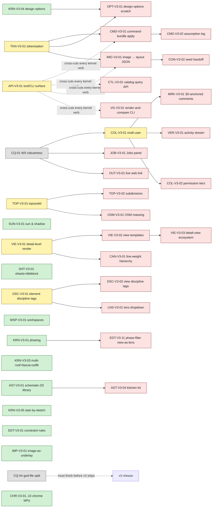

# BIM AI v3 — Product Strategy & Build Backlog

> Authored 2026-05-08 from `spec/v3-research-plan.md` + the seven research streams in `spec/v3-research/`. v2 (`spec/workpackage-master-tracker.md`) is ~99 % `done`; v3 is the next 3–6 month programme. v3's ambition: **build the first BIM authoring tool that combines Revit-grade kernel depth, Rayon-grade first-experience UX, Motif-grade async-first 3D-anchored collaboration, HighArc-grade tokenised generative AI, and a brand-layer design system that lets a customer's CI sit on top without breaking the architectural feel.** No competitor has this combination today.

---

## §1 Vision

**v2 asked _"can we model X?"_; v3 asks _"why does a young architect choose us over Revit when Revit has 30 years of features?"_**

The honest answer is not a single feature. Revit can copy any one of design, UX, collaboration, output, or AI in isolation — but Revit cannot rebuild itself around all five at once without forking the product. v3's bet is that **the combination is the moat**:

1. **Revit-grade kernel depth.** Phasing, design options, multi-roof composition, stacked and slanted walls, stair-by-sketch, plan regions, view templates, the detail-view ecosystem. v2 shipped the residential MVP; v3 closes the working-architect's daily gap.
2. **Rayon-grade first-experience UX.** Single-letter shortcuts, command palette as universal escape hatch, padlock-snap cursor language, associative dimensions with three states (linked / partial / unlinked), live-presentation URL as the modern PDF.
3. **Motif-grade async-first collaboration.** 3D-anchored comments, threaded markup on sheet + plan + 3D, an activity stream that reads like Linear's history, named milestones that work like git tags, public-link viewers who can measure and comment without an account.
4. **AI-native tool surface (HighArc-grade representation, no embedded AI).** Buildings tokenised by `(host, t, δ, s, ρ)` per HighArc's GBM pattern, exposed via a deterministic CLI / API contract — every kernel verb is callable by an external AI agent (Claude Code today, MCP-aware agents tomorrow), by a human, or by CI. **No AI is embedded in v3 itself.** What we ship is the _surface_ that any AI architect can drive: tokenised representation, command-bundle apply API, image-input boundary tool (deterministic CV today, AI-swappable later), render-and-compare for visual gates, Jobs-panel UX for long-running ops, catalog query API. The Bill-of-Rights stance (no-training-on-customer-data) applies to any AI integration that lands later. AI rendering, conversational UI, voice are corralled in `spec/vision-corral.md` until the surface is stable.
5. **A brand-layer design system that re-themes to a customer's CI without breaking the architectural feel.** Three layers: structural (drafting palette, line-weights, motion — always ours), semantic shell (chrome backgrounds — light/dark/customer), brand (a single accent + typeface + logo swap surface). The plan canvas line-weight hierarchy at multiple plot scales is the single biggest design-quality lever; the chrome warm-neutralization (cobalt → ochre) is the second-largest. Both are token-driven.

**Anti-thesis: what v3 is _not_.** Not a 2D-only tool (R-A reject). Not an infinite-canvas review companion (R-B reject). Not a closed catalog-bound configurator for production homebuilders (R-C reject). Not a Revit feature clone (R-D's anti-pattern catalog A1–A10 is the negative reference). Not a CAD precision drafter (out of scope). Not a render farm (Lumion territory). Not a structural-FEA or MEP-flow-simulation tool — though basic MEP element kinds (duct, pipe, conduit) ship for clash + display, see §L. Not a marketplace yet. **And critically: v3 does not embed AI features.** It ships the deterministic agent-callable tool surface (T9) that an external AI agent uses to drive bim-ai end-to-end.

**Reading order.** §2 names the four Strategic Bets that bundle WPs across themes — read these first. §3 captures the cross-cutting Design Pillars (carry the user's "looks architectural" emphasis). §6 holds the nine Strategic Themes, each with its WP backlog. §7 is the parallel Code Quality track (architectural debt that v3 cannot ignore). §V points at `spec/vision-corral.md` for items deliberately out of scope but worth keeping warm.

---

## §2 Strategic Bets

Each bet bundles WPs across multiple themes. v3 ships when all four bets land. Bets are quartal-level rollups; the WPs underneath are sprintable.

### B1 — Renovation-First (the European small-practice bet)

**Themes:** T1 + T4 + T2.
**One sentence:** A young architect can pick bim-ai over Revit for a residential renovation project, end-to-end.
**Why this bet first.** Renovation / extension is **60–70 % of small-practice work in Europe** (R-D). Without phasing + multi-roof composition + design options + stacked walls, a young architect cannot do their actual job — and a Revit-grade kernel that misses these is functionally not Revit-grade.
**WPs bundled.** Phasing primitive (R-D G4) → Stacked walls (G1) → Multi-roof + fascia/gutter/soffit (G11+G12+G13) → Design Options (G5) → Sketch stair (G8) → Plan Region (G23) → carry-over EDT-02 constraint rules (parallel/perpendicular/collinear) → carry-over VIE-01 detail-level rendering completion → carry-over ANN-01 detail-region drawing-mode authoring.
**Felt outcome.** Demolition phase shows grey-dashed, new phase shows bold-black, walls stack timber-on-brick honestly, the L-shaped roof reads watertight from any 3D angle, design options A vs B kitchen toggle in one dropdown without losing context.
**Critical path estimate.** 3 calendar months with 3 engineers in parallel.

### B2 — Sketch-to-Deck (the agent-driven authoring bet)

**Themes:** T6 + T9 + T4.
**One sentence:** _An external AI agent (e.g. Claude Code today) drives bim-ai's CLI tools end-to-end to take a hand sketch from a customer to a client-ready 12-page deck in under 4 hours — and the deck is a live web link, not a PDF you e-mail._
**Why this bet.** R-A's cycle-time-as-judge philosophy + the user's "AI architects work on bim-ai too" thesis. v3 ships the **agent-callable surface**, not the agent. AI rendering integration + conversational refinement land later via Vision Corral once the surface is stable; until then, the agent (Claude in Claude Code today) is the user's collaborator in their _own_ chat surface, calling our tools.
**WPs bundled.** API-V3-01 (tool/CLI surface contract — keystone) → TKN-V3-01 (tokenised representation) → CMD-V3-01 (command-bundle apply API) → IMG-V3-01 (image → structured layout — deterministic CV today, AI-swappable later) → CMD-V3-02 (assumption log primitive) → JOB-V3-01 (Jobs panel for long-running ops) → OPT-V3-01 (Design Options as scratch) → VG-V3-01 (render-and-compare CLI tool) → CTL-V3-01 (catalog query API) → OUT-V3-01 (live web link) + OUT-V3-02 (Frames + Views to PPTX). The actual AI rendering integration (RND-V3-01) is `vision`.
**Felt outcome.** _A Claude Code session:_ the user drops a marked-up PDF onto the conversation; Claude calls `bim-ai trace input.pdf -o layout.json` (deterministic CV produces a structured layout); Claude calls `bim-ai apply --bundle commands.json --base @latest` to commit a bundle of kernel commands that materialises the seed; Claude runs `bim-ai compare snapshot.png target.png` for visual validation, iterates twice, calls `bim-ai export --views v1,v2,v3 --as pptx` for the deck and `bim-ai publish --link` for the shareable URL. **All AI logic lives in the agent (Claude); bim-ai's tools are deterministic.**
**Critical path estimate.** 4 calendar months — gated by API-V3-01 + TKN-V3-01.

### B3 — Live Collaboration with Time Machine (the Figma-meets-Bluebeam bet)

**Themes:** T3 + Design Pillars.
**One sentence:** Two architects co-author live, a third reviewer leaves twelve 3D-anchored comments on a sheet, and the activity stream is a real time machine — no merge-pain, no central-file vocabulary.
**Why this bet.** R-B's biggest finding — Motif's collaboration semantics are far ahead of Rayon's. Owns the area where Revit's worksets feel Subversion-era (R-D anti-pattern A6). v3's distinctive collab vibe is **async-first + spatially-anchored**, not live-cursor-voice (which lives in Vision V-06).
**WPs bundled.** Multi-user editing on yjs/WebSocket (with **CQ-01 WS-robustness** as hard prerequisite) → 3D-anchored comments + threading + @mention → Markups on plan + 3D + sheet (Rayon `AN` pattern + freehand surface markup) → Activity stream as time-machine (Linear-grade history, Rayon's snapshot model with named milestones) → permission tiers (admin / editor / viewer / public-link viewer) → Designer's Bill of Rights as customer-facing artifact (R-B copyable).
**Felt outcome.** Open a model from a public link, see "JT and Anna are here," add a comment to the wall flange in 3D, post — Anna sees it pinned to the same wall in her 2D plan view, replies, you scroll back to "version 12" in the activity stream and watch the same moment from two days ago.
**Critical path estimate.** 3 calendar months. CQ-01 must complete before T3 ships.

### B4 — Architectural Design Quality (the "feels architectural" bet)

**Themes:** Design Pillars + T4 canvas + cross-cutting.
**One sentence:** The first time a customer's CI is overlaid on top, only the brand layer changes — the line weights, hatches, shadow language, motion, all stay ours, because that's what makes it feel like architecture.
**Why this bet.** The user's emphasis was unambiguous — _"Software soll wirklich nach Architektur wirken."_ R-G's audit shows the system has 85 % of the structural ingredients already; v3's job is the 15 % token + canvas refinement + the ESLint discipline that prevents regression. R-D's anti-pattern catalog (A1–A10) is the negative reference.
**WPs bundled in three phases:**
- **Phase 1 — Sprint 0 pre-flight (1 PR, ~1 week, lands BEFORE any other v3 WP).** `tokens-v3.css` (warm ochre accent, discipline tints, drift token, `--text-2xs`, `--ease-paper`, `--radius-canvas: 0`); `brand-layer.css` (Layer C); Vite alias `VITE_DESIGN_SYSTEM=v3`; ESLint `no-hex-in-chrome`; brand-swap CI invariant test (R-G §2.3). _This is the keystone — every subsequent v3 WP inherits the tokens._
- **Phase 2 — per-folder migration (parallel with theme work).** Workspace, plan, viewport, families, tools — folder-by-folder PRs migrating v2-era hex literals to v3 tokens. Allowlist shrinks per PR.
- **Phase 3 — canvas-rendering quality (T4 cousin).** Plan-canvas line-weight hierarchy at multiple plot scales (CAN-V3-01 — _the single biggest design-quality lever_); 3D viewport sun + line + AO retuning (CAN-V3-04); hatches scaling with paper-mm; dimension typography tabular-nums + `--text-2xs`. Bundled with VIE-V3-01 (T4 detail-level rendering completion) — they ship together.

Plus cross-cutting: Designer's Bill of Rights + monthly essay program (R-B brand layer); chrome discipline tinting (LNS-V3-02 + CHR-V3-09).

**Felt outcome.** Open a plan at 1:50, the cut walls are visibly heavier than projection lines, brick hatches are at 45° at the right paper-mm density, dimension labels are tabular-aligned at 10 px, the chrome accent is ochre not cobalt, the empty-state screen has a serif Söhne-class display headline that reads like a magazine.
**Critical path estimate.** Phase 1 ships in **week 1** (Sprint 0 pre-flight). Phases 2 + 3 run in parallel throughout v3 (~7 calendar weeks aggregated). **Sequencing matters:** Phase 1 must land first or every theme WP accumulates token debt; the front-loading is what makes B4 free for the rest of v3.

---

## §3 Design Pillars + tokens

These are cross-cutting principles every WP in v3 references. Synthesised from R-A whitespace + cursor language, R-B AI-philosophy posture, R-G token-system audit, and R-D's anti-pattern catalog (the **negative reference**).

### Pillars

| ID  | Pillar                                                | One-line                                                                                                                       |
| --- | ----------------------------------------------------- | ------------------------------------------------------------------------------------------------------------------------------ |
| D1  | **Direct manipulation first, panels second**          | If a property has a visible representation, you should be able to drag it. Inspector is the secondary path, not primary.       |
| D2  | **Live preview always**                                | No drag, no input, no command should ever be type-and-pray. 60 fps preview before commit.                                       |
| D3  | **Density-conscious, but never crowded**               | Small typography, tight spacing, but every glyph carries meaning. No decorative chrome.                                        |
| D4  | **Color is information, not decoration**               | Palette serves discipline tints, advisory severity, drift, and category — never branding flourish.                              |
| D5  | **Motion conveys causality**                           | Every state change has an 80–240 ms motion arc that explains what happened. No teleporting elements.                              |
| D6  | **Comment & markup is first-class, not bolt-on**       | Anchor any comment to any element / region / sheet at any zoom level. Threadable. Resolvable. Never modal.                       |
| D7  | **The activity stream is the time machine**            | Every change is rewindable + restorable. Undo is the keyboard shortcut; the activity stream is the visual surface.               |
| D8  | **Context, not configuration**                         | Tools change behavior based on what's selected, what's hovered, what view is active. Less mode-switching, more sensing.            |
| D9  | **Mobile is parallel, not nested**                     | iPad sketch + viewer is its own surface — not a "responsive" version of desktop. Different jobs.                                  |
| D10 | **Output is a feature, not an afterthought**           | PDF / PPTX / web export is in the same code-paths as the canvas, not a separate exporter team. Brand templates are first-class.   |

### Anti-pattern catalog (negative reference, from R-D §5)

| Anti-pattern (R-D)                          | Pillar violated     | v3 antidote                                                          |
| ------------------------------------------- | ------------------- | -------------------------------------------------------------------- |
| A1 Modal sketch sessions                     | D8                  | Soft contextual scopes (already shipped via SKT-01)                    |
| A2 Type vs Instance dichotomy in dialog      | D1                  | Single Inspector with "applies to: this / all 12" radio                 |
| A3 Ribbon-with-30-tabs                       | D3                  | Cmd palette + contextual panel                                          |
| A4 Dialog-for-everything                     | D1                  | Inspector + drawer overlay                                              |
| A5 Tooltip-as-documentation                   | D3                  | Text labels at panel widths ≥ 240 px                                    |
| A6 Worksets / central-file vocab              | D7                  | Figma-grade vocab; activity stream as time machine                       |
| A7 Phasing dual-dropdown                     | D8                  | Single "view shows: existing / demolition / new" dropdown bound to view  |
| A8 VG matrix dialog (~120 toggles)           | D8                  | Discipline lens + view template + view filter + right-click on a category |
| A9 Always-visible Properties panel           | D1                  | Inspector appears only on selection; empty-state is the model itself     |
| A10 "Project Browser blue" engineering palette | D4                | Warm ochre accent + drafting palette + R-G phased adoption                |

### Token reference (full proposal in `spec/v3-research/design-tokens.md`)

The v3 token set is 3-layer-separated:

- **Layer A — Structural (always ours).** `--space-*`, `--radius-*`, `--text-*`, `--motion-*`, `--ease-*`, `--draft-*`, `--cat-*`, `--disc-*`, `--color-{success,warning,danger,info,drift}`. Never themed.
- **Layer B — Semantic Shell (light / dark / customer).** `--color-{background,foreground,surface*,border*,muted-foreground,ring}`. Swap between light, dark, and customer-tinted variants without touching brand.
- **Layer C — Brand (re-themable to customer's CI).** `--brand-accent`, `--brand-accent-fg`, `--brand-logo-mark`, `--brand-typeface`. A customer's CI is a single CSS file. **Brand-swap CI invariant test** asserts only Layer C resolves change when the brand is swapped — drafting palette, line weights, motion stay byte-identical.

**Headline token shifts in v3:**

- Chrome accent `hsl(214 88% 50%)` cobalt → `#b8763a` warm ochre (light) / `#d9924a` (dark). The single biggest "feels engineering" tell, replaced.
- Discipline tints: `--disc-arch` sage `#6e8a72`, `--disc-struct` taupe `#8b6f57`, `--disc-mep` slate-blue `#5b7a8c`. Each with a `-soft` variant via `color-mix`. Feeds T8.
- New `--color-drift` (light `#9b6f1b` / dark `#d2a256`) — first-class severity, separates drift from warning.
- New `--text-2xs` (10 px / 14 px) — legitimises the canvas-overlay regime where 627 `text-[Npx]` escapes live today.
- New `--ease-paper` cubic-bezier(0.32, 0.72, 0, 1) — slow-finish for commit/settle moments. Reads as ink hitting paper.
- New `--radius-canvas: 0` — sidebars, rails, status bar, plan / 3D / sheet canvases never get radius. Codifies the "sidebars are sidebars, not cards" rule.

Adoption is phased: introduce `tokens-v3.css` alongside v1 (no component changes), then migrate by feature folder (workspace → plan → viewport → families → tools), then deprecate hex literals via an ESLint rule.

### Rendering-quality opinions (canvas-side, the marquee surface)

**Plan canvas (the single biggest design-quality lever):**

- Cut lines heavy, projection fine, witness hairline. Hatches scale with paper-mm at the active plot scale, not screen pixels. Dimension typography in tabular nums at `--text-2xs`. Witness lines `--draft-witness` at `--draft-lw-witness`. The padlock glyph from R-A (associative-snap acquired) is implemented as a 12 × 12 px overlay near the cursor when `snapEngine` returns an associative match.
- Line weights at zoom levels: at 1:50 plot scale, cut lines are 2 px (major) / 1.4 px (minor); at 1:100, 70 %; at 1:200, 50 %; at 1:500, 0.4 px cut + projection suppressed.
- Grid: major at zoom > 1:200 only; minor at zoom > 1:100 only.

**3D viewport:**

- Background is a linear vertical gradient, `--draft-paper` at horizon to slightly darker at top. Avoid pure white (studio-photo) and pure grey (engineering-drab).
- Sun at 35° elevation, 145° azimuth — north-east-by-east, a real architectural sun position.
- Ochre selection halo at 2 px stroke + 0.4 opacity glow. Never blue. Never a thick rectangle.
- SSAO tuned toward "drawn shadow," not "rendered shadow" — short occlusion radius, gentle falloff.
- Paper-grain noise on wall / floor materials at low intensity so surfaces don't read as plastic.

These canvas decisions are tracked as WPs inside T2 and T4. Token tables alone don't make a product feel architectural — canvas rendering with token-driven discipline does.

---

## §UX Workflow Design — chrome layout, top bar, role-based workspaces, tool grammar

### Why this section

The nine themes describe **what bim-ai does**; this section describes **the chrome it does it inside** — top bar, side rails, status bar, command grammar, workspace switcher. Revit's chrome is the counter-example: a 12-tab ribbon (A3), an always-visible 320 px Properties panel (A9), a 120-toggle VG matrix dialog (A8), icon-only buttons that depend on tooltips for documentation (A5), and a "Project Browser blue" palette (A10). Every one of those is a chrome decision; every one is what we are not building.

The bet is that **good chrome is invisible**. Where Revit asks "what dialog do I open?" bim-ai answers "the rails appear on selection; the dropdown lives where you'd expect; `Cmd+K` covers everything else." T1's phasing dropdown lives in the view header, T3's activity stream behind the top-bar entry, T8's lens in the status bar, T9's agent panel slides in from the right. Get the chrome right and themes inherit; get it wrong and every theme fights the chassis.

### The chrome model

```
┌──────────────────────────────────────────────────────────────────────────┐
│  TOP BAR  (≈40 px, fixed, --radius-canvas:0)                              │
│  [Logo]  Project ▾   Workspace ▾  │  Cmd+K  Activity ⌃  ☉☉☉  Profile ▾   │
├──────────────────────────────────────────────────────────────────────────┤
│  SECONDARY CONTEXTUAL BAR  (≈36 px, morphs by active tool)                │
│  [W] Wall   Align: ◐ Center ▾   Chain ☑   Multiple ☐   Loop (L)   …      │
├────────┬───────────────────────────────────────────────────┬──────────────┤
│        │                                                   │              │
│  LEFT  │              CENTER — CANVAS                      │   RIGHT      │
│  RAIL  │  ┌──────────────┬───────┬─────────┬─────────┬──┐  │   RAIL       │
│        │  │Floor: Level 1│ {3D} ⊗│Section 1│Sheet A101│ +│  │  (Inspector, │
│ Project│  └──────────────┴───────┴─────────┴─────────┴──┘  │   only on    │
│ Browser│        view-tab strip · Ctrl+Tab · Cmd+W close    │   selection) │
│  ≈240  │                                                   │     ≈300     │
│  px    │            (active view fills frame)              │     px       │
│        │                                                   │              │
├────────┴───────────────────────────────────────────────────┴──────────────┤
│  STATUS BAR  (≈28 px, fixed, --radius-canvas:0)                            │
│  Architekt ▾   Show: All ▾   ⚠ 2 drift   1:50   78%   ●online            │
└──────────────────────────────────────────────────────────────────────────┘

  Floating layers (invoked, not chrome):
  • Cmd+K palette (centred modal, 480 px)
  • Snap glyph + temp-dim layer (cursor-attached)
  • Jobs panel (slide-in from right edge, T9)
  • Activity drawer (slide-in from right, top-bar entry)
```

Six surfaces, each with one job. **No floating toolbox, no ribbon, no fixed Plan / 3D / Sheet trichotomy.** All four edges are square (`--radius-canvas: 0`, R-G §1.5) — sidebars are sidebars, not cards. The canvas is figure; everything else is ground.

### View-tab strip — Revit-aligned

The view-tab strip at the top of the canvas is **Revit-equivalent by design** (not a made-up trichotomy). Every view the user opens — from the Project Browser, from a Cmd+K command, from a sheet's view-tile, from a callout's parent — becomes a **tab** at the top of the canvas. **Tabs are not predetermined view _kinds_** like Plan / 3D / Sheet; they are _openings_ of any view kind the project supports.

**Tab behaviour (mirrors Revit conventions):**
- Tabs are **closeable** (× glyph on hover or `Cmd+W` / `Ctrl+W`); closing a tab does **not** delete the view — it only closes the tab. The view stays in the Project Browser; double-clicking the entry reopens it.
- **Reorderable** by drag (Revit allows tab drag).
- `Ctrl+Tab` cycles forward, `Ctrl+Shift+Tab` backward.
- Active tab indicator: 2 px ochre underline (`--color-accent`).
- Tab label format: `<KindGlyph> <ViewName>`. E.g. `▦ Floor Plan: Level 1`, `▣ Ceiling: Level 2`, `◇ {3D}`, `⌖ Section 1`, `⊟ Sheet A-101`, `▤ Schedule: Doors`. Glyphs match the Project Browser hierarchy.
- Overflow → `+N` chip on the far right; click drops a list to switch tabs that scrolled off.
- **No simultaneous side-by-side primary metaphor.** `Window → Tile` (Revit-style) is a secondary multi-window arrangement only — invoked deliberately, not the default canvas. **The default is one active view per workspace tab.**

**View kinds the strip supports** (matches Revit's view taxonomy verbatim — see T4 + v2 carry-forwards):

| Group | View kinds (each a possible tab) |
| ----- | --------------------------------- |
| **Plans** | Floor Plan · Ceiling Plan · Structural Plan · Site Plan · Area Plan |
| **3D** | Default 3D ({3D}) · Camera (perspective) · Walkthrough animation _(vision)_ |
| **Elevations** | Interior · Exterior · Building · Framing |
| **Sections** | Longitudinal · Cross · Callout-bound |
| **Detail / annotation** | Callout · Drafting View · Detail Callout · Cut-Profile Override (T1 KRN-V3-12) |
| **Legend** | Legend View · Window Legend (T4 SHT-V3-01) |
| **Schedule** | Schedule/Quantities · Material Takeoff · Graphical Column Schedule · Sheet List · Note Block · View List |
| **Sheet** | Sheet (with tiled view-frames + titleblock) |
| **v3-only additions** | Concept Board (T6 CON-V3-01) · Site Plan v3 (T7 LOT-V3-02 — toposolid + neighborhood massing variant of the Plans family) |

Each kind has its own **header strip** below the tab — phase dropdown (T1 KRN-V3-01), design-option dropdown (T1 KRN-V3-04), detail-level toggle (T4 VIE-V3-01: Coarse / Medium / Fine), scale chip, view-template badge (T4 VIE-V3-02). Per-view chrome lives in the header; per-discipline chrome lives in the status bar (T8 lens). The split is deliberate.

### Workspace switcher (top-bar pattern)

Slot 3 — a chip labelled with the active workspace (`Architekt ▾`). Click opens a 4-row menu: **Architekt** (sage), **Statiker** (taupe), **TGA** (slate-blue), plus **Concept** (T6), each with its `--disc-*` swatch. Selection swaps in 240 ms with `--ease-paper`: chrome tint stripe flips, left-rail tool order re-ranks, status-bar default lens preselects. Not a separate file — a re-aspect of the same project (T8 cousin). `userPreferredWorkspace` preselects on project open.

### Top-bar layout — verbatim

| Slot | Width | Element | Behaviour |
| ---- | ----- | ------- | --------- |
| 1 | 40 px | Logo mark | Click → home; `--brand-logo-mark` token |
| 2 | auto | Project name dropdown | Recent / new / open |
| 3 | auto | Workspace switcher chip | Discipline trio + Concept |
| 4 | flex | (empty stretch) | Visual breath; never tools |
| 5 | 32 px | Cmd+K palette button | Tooltip "⌘K" |
| 6 | 32 px | Activity-stream entry | Click → drawer slide-in from right |
| 7 | auto | Presence avatars row | Up to 4 avatars; "+N" overflow chip |
| 8 | 32 px | Profile / settings menu | Account, theme, preferences |

Height **40 px**. `--text-sm` menus, `--text-base` project name. `--color-surface` background, 1 px `--color-border` bottom. **No tools.** The top bar carries identity and meta-actions (search, history, presence, account); authoring verbs live elsewhere. The hard split.

Iconography is the existing 1.5 px stroke set; no labels at this density. Hovers expand a tooltip with shortcut chip on the right. Keyboard tab order left-to-right; `Cmd+K` bypasses cycling.

### Command grammar (cross-cuts every tool)

Three layers, borrowing AutoCAD command-line ergonomics with no visible command line (R-A §3.1):

1. **Single-letter shortcuts surfaced in tooltips and on-icon chips** (EDT-V3-04). `W` Wall, `D` Door, `WI` Window, `DI` Dimension, `PH` Phase, `S` Stair, `R` Roof, `C` Column. Every tool ships a chip in the bottom-right of its icon, always visible, `--text-2xs` on `--surface-2`. Students learn the keyboard by reading the toolbar.
2. **Mid-command modifiers**. `L` toggles loop mode (EDT-V3-05); `A` toggles arc; `S` cycles wall alignment; `O` cycles dimension orientation; `C` enables chained dimensions. Modifiers display as chips in the cursor glyph stack.
3. **Numeric override during draw** (EDT-V3-12). Type a number while rubber-banding — `5400` or `5.4m` interchangeable; `Tab` cycles fields; `Enter` commits.

Grammar is **uniform across tools**. Users learn the verbs once.

### Tool grammar (per-tool consistency)

Every authoring tool surfaces the same modifier vocabulary in the secondary contextual bar:

| Modifier | Meaning | Default |
| -------- | ------- | ------- |
| **Place** | Single-shot drop, exit on commit | varies |
| **Chain** | After commit, restart from previous endpoint | on for line-like tools |
| **Multiple** | Place repeatedly without re-pressing tool key | off |
| **Loop (L)** | Auto-restart after each completed segment | off; sticky per session |
| **Tag-on-Place** | Place a tag/dimension at create time | off |
| **Numeric** | Type to override value mid-draw | always armed |
| **Tab-cycle** | Tab moves between numeric fields | always armed |

A v2 EDT-06 follow-through: today the modifiers are scattered per-tool. CHR-V3-08 codifies them in a single `<ToolModifierBar>` mounted by every authoring tool. **The same vocabulary works in every tool** — consistency by construction.

### Inspector behaviour

The right rail is **only visible when something is selected** — D1 + A9 antidote, non-negotiable. With nothing selected the canvas extends edge-to-edge against the left rail; empty-state is the model itself, not a pinned 320 px column. On selection, the rail slides in from right in 200 ms `--ease-paper`, 300 px wide. Sticky during drag.

The Inspector replaces Revit's Type-vs-Instance dichotomy (A2). Each field carries a radio: **applies to: this** | **all 12 like it**. Flipping applies to every same-type sibling and surfaces a non-blocking toast. One panel, two scopes, no dialog.

Groups: **Identity** (name, discipline, phase), **Geometry** (drag-the-number per EDT-V3-06), **Type & material** (click opens drawer overlay, never a modal — A4 antidote), **Phasing** (T1), **Comments** (T3). Group headers `--text-xs`, field labels `--text-sm`.

### Activity stream entry on top bar

Slot 6 is a clock-with-dot glyph. Click → drawer slides in from right edge, 380 px, layered over the right rail (dims 50 %). Default shows latest 10 events (`--text-sm` author + verb + target + timestamp). Filter chips at top — author, type, date range. Click → canvas time-travels in 240 ms `--ease-paper`; `[restore]` chip floats centred. Hover → 200 ms ghost preview without committing.

Replaces the Revit "synch with central / relinquish / open backup" vocabulary entirely (A6). Keyboard `Cmd+H`.

### Status bar — the lens dropdown

28 px, fixed-bottom, `--radius-canvas: 0`, `--color-surface-strong`. Left to right: workspace chip · **lens dropdown `Show: ▾`** · drift badge · scale · zoom % · online indicator.

Slot 2 is the keystone. `Show: Architecture` (or Structure / MEP / All). One click opens a 4-row dropdown; selection swaps in 240 ms `--ease-paper`: off-discipline ghosts to 25 % in `--draft-witness` grey; on-discipline goes full opacity (T8 LNS-V3-01). **Single dropdown, view-bound, no separate filter dialog** — A8 antidote. Same view-as-lens grammar in the view header for **phase** (T1 KRN-V3-01) and **design option** (T1 KRN-V3-04): discipline at workspace level (status bar), phase + option per view (view header).

### Cmd+K palette as universal escape

`Cmd+K` on Mac, `Ctrl+K` on Windows / Linux (R-A §3; EDT-V3-03). Modal-but-non-blocking: canvas dims 40 %, 480 px × max-60vh panel centres. Three categories: **Commands** (`"phase"` → "Set view phase: Demolition"), **Navigate** (`"A101"` → "Open sheet A101"), **Select** (`"kit"` → "Element: kitchen 02"). Ranked recency × fuzzy × surface-mass.

The palette is **the antidote to ribbon bloat** (A3). Every new feature registers a command instead of adding a toolbar button; the toolbar holds the 12 most-used verbs, the palette holds the long tail. Three keystrokes from any moment to any command. One binding declaration ships `Cmd+K` on macOS and `Ctrl+K` on Windows / Linux, surfacing the right glyph in tooltips per OS.

### Mobile / iPad chrome (D9 — mobile is parallel, not nested)

Tablet is a parallel surface, not a responsive desktop. The iPad surface (V-03) is a **sketch + viewer** — different jobs. Reduced chrome: no left rail (Project Browser becomes a slide-in drawer), no Inspector (selection opens a bottom sheet), no secondary contextual bar (modifiers collapse into a compact floating row). Top bar 44 px, status bar 36 px. Authoring bounded to comment / markup / sketch-import; full kernel authoring desktop-only. Its own design problem in V-03, not a media-query of desktop.

### Anti-pattern audit (cross-cut to R-D §5)

| v3 chrome decision | R-D anti-pattern rejected | Pillar served |
| ------------------ | ------------------------- | ------------- |
| Cmd+K palette + 12-button toolbar | A3 ribbon-with-30-tabs | D3, D8 |
| Inspector via drawer overlay (no modals) | A4 dialog-for-everything | D1 |
| Single Inspector, "applies to: this / all 12" | A2 Type-vs-Instance dialog | D1 |
| Inspector hidden when nothing selected | A9 always-visible Properties | D1 |
| Activity drawer with time-travel | A6 worksets / synch / relinquish | D7 |
| Status-bar lens dropdown | A8 VG matrix dialog | D8 |
| View-header phase dropdown (single) | A7 phasing dual-dropdown | D8 |
| `--radius-canvas: 0` on rails + bars | "feels-like-SaaS" rounding | D3 |
| Warm ochre + discipline tints | A10 "Project Browser blue" | D4 |
| Toolbar shortcut chips on icons | A5 tooltip-as-documentation | D3 |
| Right-click → "Hide category in this view" | A8 long-tail half | D8 |
| Mobile is its own surface (V-03) | "responsive desktop" trap | D9 |

### WPs that ship the chrome

Cross-theme WPs — the chassis under T1–T9. No single theme owns them; every theme depends on them.

#### CHR-V3-01 — Top-bar component

**Status.** `done`. R-A §4, A3 antidote, D3.
**Scope.** 8-slot top bar as `<TopBar>` at `packages/web/src/workspace/chrome/TopBar.tsx`. 40 px, `--color-surface`, 1 px `--color-border` bottom, `--radius-canvas: 0`.
**Data model.** Consumes `currentProjectId`, `userPreferredWorkspace`, `activeWorkspaceId`, `presence` slices.
**Engine.** Frontend-only. Wires `Cmd+K` (mac) / `Ctrl+K` (win/linux); activity entry binds `Cmd+H`.
**UI.** `--text-sm` menus, `--text-base` project name. 16 × 16 icons. Tooltips with shortcut chip.
**Acceptance.** Visual regression on empty / loaded / 4-presence / 8-presence. Keyboard left-to-right. No tools.
**Effort.** M.

#### CHR-V3-02 — Workspace switcher

**Status.** `done`. T8 cousin; D4 + D8.
**Scope.** Switcher chip in slot 3. Architekt / Statiker / TGA + Concept (T6). Click → 4-row menu with `--disc-*` swatches. Dispatches `SetActiveWorkspace`; chrome tint flips in 240 ms `--ease-paper`.
**Data model.** Reuses T8 WSP-V3-01.
**Engine.** Reuses `SetActiveWorkspace`.
**UI.** Chip at `--text-sm`, 4 px `--disc-*` stripe at left edge.
**Acceptance.** Architekt → Statiker flips stripe, re-orders left-rail stack, preselects status-bar lens to "Structure" in 240 ms. No model mutation.
**Effort.** M.

#### CHR-V3-03 — Status bar with lens dropdown

**Status.** `done`. T8 LNS-V3-01 home.
**Scope.** 6-slot status bar; lens dropdown is the keystone (A8 antidote). 28 px, `--color-surface-strong`, `--radius-canvas: 0`.
**Data model.** Reuses T8 DSC-V3-02 `defaultLens: LensMode`.
**Engine.** Lens dispatch reuses T8 commands. Drift count from `monitorDriftBadge` aggregate.
**UI.** `--text-2xs` slots; lens menu `--text-sm`. `--ease-paper` 240 ms. Drift in `--color-drift`.
**Acceptance.** "Show: All" → "Show: Structure" ghosts arch to 25 % in 240 ms. No filter dialog. Drift opens federation panel.
**Effort.** S.

#### CHR-V3-04 — Cmd+K command palette

**Status.** `done`. Cross-ref T2 EDT-V3-03 (commands engine; this WP is chrome placement + cross-platform binding).
**Scope.** Wire palette to slot 5; OS-aware keybinding; ensure palette is universal escape across all themes.
**Data model.** Reuses `cmdPalette/registry.ts`.
**Engine.** Reuses fuzzysort + recency slice.
**UI.** Centred 480 px modal; canvas dims 40 %; results `--text-sm`. Three categories.
**Acceptance.** `Cmd+K` opens anywhere; `"phase"` → top match invokes; `Esc` closes. Cross-platform verified.
**Effort.** M.

#### CHR-V3-05 — Activity-stream entry + drawer

**Status.** `done`. T3 VER-V3-01 cousin.
**Scope.** Slot 6 entry + drawer slide-in from right edge. 380 px, layered over right rail (dims 50 %); latest 10 events. Hover preview, click time-travel.
**Data model.** Reuses T3 activity-stream schema.
**Engine.** Reuses T3 snapshot replay; hover preview to off-screen frame.
**UI.** `--text-sm` event rows, `--text-2xs` timestamp. `--ease-paper` 200 ms slide. `Cmd+H`.
**Acceptance.** Click event → time-travel in 240 ms with floating `[restore]` chip. Hover does not commit. Filter chips reduce list.
**Effort.** M.

#### CHR-V3-06 — Right-rail Inspector behaviour

**Status.** `done`. D1 + A9 antidote codified.
**Scope.** Hidden when nothing selected (`display: none`). On selection slides in from right in 200 ms `--ease-paper`, 300 px. Sticky during drag. "applies to: this / all 12" radio replaces A2. Type / material edits open drawer overlay (never modal).
**Data model.** None.
**Engine.** Selection store-slice gates rail visibility.
**UI.** Group headers `--text-xs`, field labels `--text-sm`.
**Acceptance.** Empty → rail not in DOM. Pick a wall → slides in 200 ms. "all 12" radio surfaces non-blocking toast. Type drawer is not a modal.
**Effort.** S.

#### CHR-V3-07 — Left-rail Project Browser refresh

**Status.** `done`. R-G §1.5 holdouts already suppress radius correctly; this refreshes the structural tree.
**Scope.** 240 px expanded, 36 px collapsed. Groups: Views, Schedules, Links / Imports, Discipline groups (auto-derived), Phases. Drag-to-reorder views. Right-click — duplicate / template-create / rename / delete. Search at top.
**Data model.** Reuses project-browser slice.
**Engine.** Drag-reorder dispatches `ReorderView`.
**UI.** `--text-sm` group headers in `text-eyebrow-tracking`; rows `--text-sm`. `--radius-canvas: 0` rail, `--radius-md` interior buttons / search.
**Acceptance.** Visual regression on expanded / collapsed / discipline-grouped / phase-grouped. CQ-03 soft prereq.
**Effort.** M.

#### CHR-V3-08 — Secondary contextual bar

**Status.** `done`. Cross-ref T2 EDT-V3-04 + EDT-V3-05.
**Scope.** 36 px secondary bar morphs by active tool. Every authoring tool ships a `<ToolModifierBar>` mount with the same vocabulary (Place / Chain / Multiple / Loop / Tag-on-Place / Numeric / Tab-cycle).
**Data model.** New `ToolModifierDescriptor` interface in `packages/web/src/tools/modifierBar.ts`.
**Engine.** Modifier flips dispatch tool-state actions; sticky-per-session via zustand `toolPrefs`.
**UI.** `--text-xs` modifier labels with shortcut chips. `--surface-2` background, 1 px `--color-border` bottom.
**Acceptance.** Wall → alignment cycle (`S`), Loop (`L`), Multiple, Tag-on-Place. Door → swing-side cycle. Same vocabulary, different content.
**Effort.** M.

#### CHR-V3-09 — Discipline-tinted chrome via `--disc-*` tokens

**Status.** `partial`. T8 LNS-V3-02 cousin.
**Scope.** Active workspace's tint propagates to: status-bar 4 px left-edge stripe, workspace-chip swatch, selection halo (0.3 opacity blend with ochre), discipline group dividers. **Brand-swap CI invariant test** stays green: only Layer C changes on brand swap; tints are Layer A.
**Data model.** Reuses R-G §2.2.2 `--disc-arch | --disc-struct | --disc-mep`.
**Engine.** Chrome-tint store-slice exposes active discipline's hex; chrome surfaces subscribe.
**UI.** All four edges carry tint at low intensity. Selection halo blends with `--color-accent` so ochre stays primary.
**Acceptance.** Architekt → Statiker → stripe flips sage → taupe in 240 ms. Brand-swap CI stays byte-identical for Layer C.
**Effort.** S.

#### CHR-V3-10 — Empty-state canvas (Inspector hidden)

**Status.** `done`. Cleanest D1 + A9 expression.
**Scope.** Nothing selected, no tool → right rail hidden (`display: none`); canvas extends to right edge. Empty hint `--text-display` centred: "Select an element, or press `W` to draw a wall." Fades after 6 s; reappears after 60 s idle.
**Data model.** None.
**Engine.** Idle timer in workspace store-slice.
**UI.** Söhne / Inter, `--color-muted-foreground`. `--ease-paper` 320 ms fade.
**Acceptance.** New project → rail not in DOM, hint visible, canvas full-width minus left rail. Move cursor → hint fades.
**Effort.** S.

### Section takeaway

Chrome that gets out of the way is the second-largest design-quality lever after canvas rendering quality. A top bar that holds identity not tools, a status bar that holds the lens not a 120-toggle dialog, an Inspector that appears only on selection, a `Cmd+K` palette that absorbs every long-tail action, a tool grammar uniform across every authoring verb, and discipline-tinted chrome that signals workspace at a glance — together these make a young architect say "this feels architectural, not engineering" in the first thirty seconds. **Chrome and canvas are 90 % of the "feels architectural" bet.**

**Completion sync 2026-05-11.** `spec/v3-build-state.md` records CHR-V3-01, CHR-V3-02, CHR-V3-03, CHR-V3-04, CHR-V3-05, CHR-V3-06, CHR-V3-07, CHR-V3-08, and CHR-V3-10 as merged to `main`. CHR-V3-09 remains `partial` because it is the chrome surface for LNS-V3-02, which has token/swatch/data-disc slices but not the full discipline-tint acceptance proof.

---

## §4 How to read this tracker

1. Read **§2 Strategic Bets** first — they tell you what v3 is *for*.
2. Read **§3 Design Pillars** — they're cross-cutting; every WP cites them.
3. The bulk is **§6 Strategic Themes** (T1–T9), each with positioning + UX target moments + WP backlog. Theme bodies follow the v2 per-WP entry format: Status / Scope / Data model / Engine / UI / Acceptance / Effort.
4. **§7 Code Quality** is a parallel track of architectural debt that rides alongside theme work.
5. **§X Cross-Theme Dependency Map** + **Parallelisation Waves** + **Critical Paths** answer "what can I sequence in parallel?" and "what would it take to demo X?"
6. **§V Vision Corral** is items deliberately not in v3 build scope. Lives in `spec/vision-corral.md`; cross-referenced here.

If you have an hour with this doc, read §1 + §2 + §3 + the headers of §6, plus the WP table at the top of whichever theme is your current sprint.

---

## §5 Status legend, Done Rule, Effort Key

### Status legend

| Symbol     | Meaning                                                                  |
| ---------- | ------------------------------------------------------------------------ |
| `done`     | Meets the done rule — tested, type-clean, merged to main                  |
| `now`      | In current sprint                                                         |
| `next`     | Sprint-after-next; design work in progress                                 |
| `vision`   | Captured but not yet committed to a build window — see `spec/vision-corral.md` |
| `partial`  | Some slice exists; measurable progress; spec requirements unmet            |
| `open`     | Authored but not started                                                  |
| `deferred` | Explicitly out of scope for v3                                            |


### Tracker sync 2026-05-11

`spec/v3-build-state.md` records the wave-7, wave-8, wave-9A, and wave-9B WPs as merged to `main`. This tracker has been synced for those explicit build-state rows only; unsynced `now` / `next` rows remain active backlog until a matching implementation and test audit is recorded.


### Tracker reliability audit 2026-05-11

This pass resolves stale status drift between this tracker, `spec/v3-build-state.md`, and `spec/code-quality-tracker.md`. Rows are marked `done` only when a merged build-state/code-quality source or direct implementation evidence supports the WP acceptance. Rows are marked `partial` when implementation slices exist but the exact acceptance path remains incomplete or not demonstrably covered.

### Done Rule

A WP is `done` when all of: (a) `pnpm exec tsc --noEmit` clean; (b) new logic has vitest / pytest unit coverage; (c) `make verify` passes; (d) merged to main and pushed; (e) any cross-theme acceptance moments named in §X are exercised in an integration test or recorded demo.

### Effort Key

| Symbol | Meaning         |
| ------ | --------------- |
| XS     | < 1 day         |
| S      | 2–5 days        |
| M      | 1–2 weeks       |
| L      | 2–3 weeks       |
| XL     | 4 weeks or more |

---

## §6 Strategic Themes

The nine themes hold v3's WP backlog. Each theme follows this shape:

1. Header + 1-paragraph "why it matters."
2. **Closest competitor** lens (Revit / Rayon / Motif / HighArc).
3. **Positioning sentence** — what we'd say to a young architect.
4. **10/10 UX target moments** — 3–5 concrete user moments that judge whether the theme has landed.
5. **WP summary table** — ID / Item / Effort / State / Depends on.
6. **Per-WP entries** — Status / Scope / Data model / Engine / UI / Acceptance / Effort.
7. **Cross-theme references**.

Theme contents below are filled in by parallel chapter authors (Phase 2 dispatch). Anchor comments mark each chapter; do not write outside your assigned section.

<!-- BEGIN T1 -->
### T1 — Authoring Depth

**Why it matters.** T1 is the wedge for **B1 Renovation-First** — the European small-practice bet. Renovation and extension are 60–70 % of small-practice work in Europe (R-D §3 G4); without phasing, multi-roof composition, design options, and stacked walls, a young architect literally cannot do their daily job in bim-ai today. v2 shipped a residential MVP that gets a model on the screen; v3 closes the **Revit-grade kernel gap** that today blocks a renovation project from being authored end-to-end. Closing T1 unlocks the whole B1 felt-outcome — demolition phase shown grey-dashed, new phase shown bold-black, walls stack timber-on-brick honestly, the L-shaped roof reads watertight from any 3D angle, design options A vs B kitchen toggle in one dropdown without losing context. T1 is also the **load-bearing primitive surface** that T9 (AI-Native Tool Foundations) edits against: without G5 Design Options, every agent edit destructively overwrites the host model. T1 is therefore the kernel-depth substrate that B1, B2, and T9 all sit on top of.

**Closest competitor.** Revit (the literal target — Balkan Architect's curriculum is the negative reference for what we must close, and the positive reference for the daily-architect workflows we must support). HighArc is a distant second — it has rule-bound parametric depth (multi-roof composition, stair-by-sketch, cabinet kits) but its customer is the production homebuilder, not the architect; its design space is catalog-bound (R-C reject). Rayon and Motif have effectively no kernel depth in this dimension (Rayon is 2D only; Motif is read-mostly).

**Positioning sentence.** "You can model a real European renovation in bim-ai — phasing dropdown on every view, walls that stack honestly across materials, a multi-roof composition that reads watertight from any angle, design options for the kitchen A/B conversation, and a stair-by-sketch that lets you draw winders the way you draw them on trace paper."

**10/10 UX target moments.** Five concrete moments that judge whether T1 has landed.

1. **Phasing dropdown bound to view (R-D U7).** Open a view, the view header has a dropdown: _existing_ → _demolition_ → _new_. The same plan re-renders three ways — existing walls solid grey, demolition walls grey-dashed with a red "X" overlay, new walls bold-black — without touching the model. Single-dropdown, view-bound, no separate "working phase." Negative reference: A7 dual-dropdown.
2. **Multi-roof watertightness (R-D G11 + U3).** Two roof primitives — a gable over the main mass, a hip over the L-extension. Select both, hit "Join roofs," see the CSG seam previewed in faint orange before commit; commit, the roof reads watertight from any 3D angle and the lower clips correctly into the upper's wall.
3. **Design Options A/B toggle in one dropdown (R-D G5).** Same view, dropdown labelled "Option: Kitchen A | Kitchen B"; flip, the kitchen geometry swaps in 60 fps with `--ease-paper` motion; the rest of the model stays put. T9's agent uses the same surface as a scratch surface for proposed edits.
4. **Stair-sketch tread auto-balance (R-D U2).** In sketch-stair mode, draw a winder boundary, place tread lines; the kernel auto-distributes treads by the rise-run rule. Drag any tread line and the others rebalance live to maintain comfort. Gold-standard "rebalance-others-as-you-drag" invariant.
5. **Plan region cut-plane re-render (R-D U1).** Stretch a plan-region rectangle across a sloped-ceiling room; the cut beneath re-renders live; doors that were hidden under the sloped ceiling appear as the rectangle's overridden cut plane sweeps over them. Aligns D2 (live preview always).

**WP summary table.**

| ID | Item | Effort | State | Depends on |
| -- | ---- | ------ | ----- | ---------- |
| KRN-V3-01 | Phasing primitive (B1 keystone) | L | done | — |
| KRN-V3-02 | Stacked walls | M | done | — |
| KRN-V3-03 | Multi-roof composition + fascia/gutter + soffit (G11+G12+G13 bundled) | XL | done | — |
| KRN-V3-04 | Design Options | L | done | KRN-V3-01 (phasing pattern) |
| KRN-V3-05 | Stair by sketch | L | done | — |
| KRN-V3-06 | Plan region | M | done | — |
| KRN-V3-07 | Slanted & tapered walls | M | done | KRN-V3-02 |
| KRN-V3-08 | Wall sweeps & reveals | M | done | KRN-V3-03 (edge-profile-run pattern) |
| KRN-V3-09 | Curved curtain walls | M | next | — |
| KRN-V3-10 | Monolithic / floating stair sub-kinds | M | next | KRN-V3-05 |
| KRN-V3-11 | Railing baluster pattern + handrail supports | M | done | KRN-V3-05 |
| KRN-V3-12 | Cut profile (per-view per-category override) | S | next | — |
| KRN-V3-13 | Massing & divided-surface façades | L | vision | — |
| KRN-V3-14 | Adaptive components | L | vision | KRN-V3-13 |
| EDT-V3-01 | Sketch-element grips (EDT-01 follow-up) | S | done | — |
| EDT-V3-02 | Constraint rules (parallel / perpendicular / collinear) | M | done | EDT-02 (v2 shipped) |

**Per-WP entries** (one per WP).

#### KRN-V3-01 — Phasing primitive

_Source: R-D §3 G4. Severity Blocker. The B1 keystone — without phasing, a young architect cannot do the renovation work that is 60–70 % of European small-practice billable hours._

**Status.** `done`.
**Scope.** Project-level `Phase` enum (default chain: Existing → Demolition → New, extensible). Every kernel element gains `phase_created` (mandatory) + `phase_demolished` (optional). Views gain a `phase_filter` field that maps the element-kind set into a render-style triple (existing grey, demolition grey-dashed-with-red-overlay, new bold-black). The single dropdown is bound to the view, not to a project-level "working phase" — A7 negative reference.
**Data model.**
```ts
// Project-level
type Phase = { id: string; name: string; ord: number };
type PhaseFilter =
  | 'show_all'
  | 'show_new_plus_existing'   // hides demolished
  | 'show_demolition_only'
  | 'show_existing_only'
  | 'show_new_only';

// Element-level (every element)
phase_created: string;             // Phase.id; default = active phase
phase_demolished?: string | null;  // Phase.id; null = not yet demolished

// View-level
phase: string;                     // Phase.id (the view's "as-of" phase)
phase_filter: PhaseFilter;         // default 'show_new_plus_existing'
```
**Engine.** New commands: `CreatePhase`, `RenamePhase`, `ReorderPhase`, `DeletePhase` (with element-migration), `SetElementPhase` (sets `phase_created` / `phase_demolished`), `SetViewPhase`, `SetViewPhaseFilter`. Validation: `phase_demolished.ord ≥ phase_created.ord`; deleting a phase with elements requires re-target. Snapshot resolution: any view's `getElements()` walks the filter and returns the kept set + per-element render-style hint (`existing` / `demolition` / `new`).
**UI.** **Single dropdown** in the view header (D8 antidote to A7). Inspector for any element gains a "Phase Created" + "Phase Demolished" pair. Project Browser left rail gains a "Phases" group (re-order, rename, add). Plan and 3D both honour the view's phase filter; existing renders at `--draft-existing-grey`, demolition renders dashed with a red overlay, new renders at `--draft-cut-major`.
**Acceptance.** Demo: load a renovation seed (existing brick house + new timber extension). Switch the active view's phase to _Existing_ — only brick house renders. Switch to _Demolition_ — three walls show grey-dashed (the ones being knocked through). Switch to _New_ — extension shows bold-black plus the surviving existing walls show grey. The dropdown is the only control the user touches.
**Effort.** L — 2.5 weeks for one engineer.
**Cross-theme references.** T2 (the dropdown UX is the U7 view-as-lens pattern); T4 (phase-filter view template, which will rebind the dropdown into the view-template `template_id`); T9 (Design Options agent edits must respect phase filters).

#### KRN-V3-02 — Stacked walls

_Source: R-D §3 G1. Severity High. Brick-up-to-3m + cladding-above is the dominant residential vertical assembly in Central Europe._

**Status.** `done`.
**Scope.** A single wall element composed of multiple wall-types stacked vertically (e.g. brick to 3 m, timber-frame above). Today we force two adjacent walls + a horizontal dim gap, which breaks plan modify ops + schedule counts. Stacked walls treat the column as one kernel element; the plan cut chooses the component intersecting the cut plane; elevation paints all components.
**Data model.**
```ts
{
  kind: 'wall';
  // existing fields preserved
  stack?: {
    components: Array<{
      wallTypeId: string;
      heightMm: number;       // measured base-up; last component is "remainder"
    }>;
  };
}
```
**Engine.** `try_commit_bundle` validates `Σ heightMm ≤ wall.heightMm` (last component is remainder, optional). Plan rendering: pick the component that contains the active view's cut-plane height; render its hatch + line weight. Elevation rendering: paint each component as a rectangle with its own material hatch. Schedule queries unchanged at the wall level (one element); a new `schedule_stacked_components` helper enumerates components when needed.
**UI.** Inspector gains a "Stack" expandable section: list of components with `wallType` dropdown + `height` input; reorder by drag; "+ Add component" / "− Remove" buttons. Plan canvas re-cuts on cut-plane change. Elevation canvas paints stacked.
**Acceptance.** Author a wall 6 m tall with brick (3.0 m) + cladding (3.0 m); cut-plane at 1.0 m shows brick hatch in plan; cut-plane at 4.0 m shows cladding hatch; elevation shows both rectangles with the seam visible at 3.0 m.
**Effort.** M — 1.5 weeks.
**Cross-theme references.** T5 (wall-type catalog + material tokens); T2 (stack inspector reuses Inspector pattern from EDT-01).

#### KRN-V3-03 — Multi-roof composition + fascia/gutter + soffit (bundled)

_Source: R-D §3 G11 + G12 + G13. **Bundled triple — they ship together as the "looks finished" gate.** Without all three, presentation drawings of pitched-roof houses look unfinished._

**Status.** `done`.
**Scope.** Three coupled WPs that ship as one bundle because together they are the "B1 looks-finished" gate. **(a)** Multi-roof composition via `RoofJoin` operator: pick two roofs → resolve intersection into a watertight composite (CSG-stitched). Most ≥3-bedroom houses are gable+hip+shed combinations. **(b)** Fascia / gutter / downpipe: roof-attached profile runs along eave / rake edges. Generalises into an `EdgeProfileRun` pattern that also serves G2 wall sweeps (KRN-V3-08). **(c)** Soffit: horizontal under-side of a roof eave, sketched 2D boundary + thickness, lives between roof and wall top.
**Data model.**
```ts
// (a) RoofJoin
{
  kind: 'roof_join';
  primaryRoofId: string;
  secondaryRoofId: string;
  seamMode: 'clip_secondary_into_primary' | 'merge_at_ridge';
}

// (b) EdgeProfileRun
{
  kind: 'edge_profile_run';
  hostElementId: string;            // roof | wall | floor
  hostEdge: 'eave' | 'rake' | 'ridge' | 'top' | 'bottom' | { startMm; endMm };
  profileFamilyId: string;          // 2D profile (cornice, fascia, gutter, plinth, water-table)
  offsetMm: { xMm: number; yMm: number };
  miterMode: 'auto' | 'manual';
}

// (c) Soffit
{
  kind: 'soffit';
  boundary: Array<{ xMm: number; yMm: number }>;   // 2D polygon in plan
  hostRoofId?: string;
  thicknessMm: number;
  zMm: number;
}
```
**Engine.** **(a)** `RoofJoin` apply runs Three.js / OpenCASCADE-style CSG against the two roof solids; result is a derived `roof_join` element that renders the seam. Validation: roofs must intersect; no degenerate seams. UX: select two → "Join Roofs" → show seam in `--draft-warning` orange before commit (U3 CSG-preview pattern). **(b)** `EdgeProfileRun` solves a swept solid: 2D profile × edge polyline → 3D solid. Auto-mitres at corners (≤ tolerance). Renders in plan as a thin line, in elevation / 3D as the swept solid. **(c)** Soffit is solved as a thickened 2D extrusion; snap-to-eave-edge helper places it correctly under the roof overhang.
**UI.** New tools in the right rail: "Join Roofs" (prompts for two roofs); "Edge Profile" (prompts for host edge + profile family — fascia, gutter, downpipe, plinth, cornice, water-table all ship as profile families); "Soffit" (sketch-mode polygon + thickness). The pre-commit CSG preview is the marquee UX moment.
**Acceptance.** Demo seed has a gable over the main mass + a hip over an L-extension. Pre-T1: the two roofs collide visibly at the join. Post-T1: select both → "Join Roofs" → preview seam in orange → commit; the join reads watertight from any 3D angle. Then: select the eave edge → "Edge Profile" → fascia → run in 60 fps. Then: sketch a soffit polygon under the eave → "Soffit" 50 mm thick → ships. Final demo angle: warm-shadow render of the full house with no naked edges anywhere.
**Effort.** XL — 4 weeks (1.5 weeks G11 + 1 week G12 + 0.5 week G13 + 1 week shared CSG / preview / mitering plumbing).
**Cross-theme references.** T2 (CSG-preview pattern is reusable for floor/wall joins; U3 lives here); T5 (profile families catalog: fascia, gutter, downpipe, plinth, cornice, water-table); T4 (multi-roof composition is what makes 3D presentation drawings publishable).

#### KRN-V3-04 — Design Options

_Source: R-D §3 G5. Severity High. Gates B2 Sketch-to-Deck **and** T9 — without options, every agent edit destructively overwrites the host model._

**Status.** `done`.
**Scope.** Multiple alternatives (Option A vs B kitchen) coexisting in the same model. A `DesignOptionSet` is project-level with N `DesignOption` children; one is `primary`. Elements taggable with `optionId`; default null = "main" (always rendered). Views can lock to a specific option. Activity-stream / undo aware. The agent in T9 uses Design Options as its scratch surface for proposed edits — this is **the** unsung hero of T9.
**Data model.**
```ts
// Project-level
type DesignOptionSet = {
  id: string;
  name: string;       // e.g. "Kitchen variant"
  options: Array<{
    id: string;
    name: string;     // e.g. "A — galley", "B — island"
    isPrimary: boolean;
  }>;
};

// Element-level
optionSetId?: string;    // null = main, present in every option
optionId?: string;       // null = main; else the specific option

// View-level
optionLocks: Record<string /* optionSetId */, string /* optionId */>;
```
**Engine.** Commands: `CreateOptionSet`, `AddOption`, `RemoveOption`, `RenameOption`, `SetPrimaryOption`, `AssignElementToOption`, `SetViewOptionLock`. Snapshot resolution: when a view computes its element set, for each option-set it picks the locked option (or the primary if unlocked); elements with no `optionId` are always included. Undo / redo: option assignment is a normal commandable mutation. Activity stream: option-set lifecycle events render distinctly.
**UI.** Project Browser left rail gains a "Design Options" group (sets + options, drag to assign primary). View header gains a chip per active option-set: "Kitchen: A ▾"; click flips the lock on this view only. Inspector gains "Belongs to option" pair (set + option) for any selectable element. Default authoring is to "main" — only deliberately-tagged elements live inside an option.
**Acceptance.** Demo seed has two kitchen layouts authored in two design options of one set. The view dropdown flips between them in 60 fps with `--ease-paper` motion; the dining room (which is in main) does not move. Then: T9's agent runs "add an island ~3 m² in the kitchen" — the agent creates a new design option "Island" inside the existing set, populates it, surfaces a notification "Option created: Kitchen / Island"; the user can flip to it without losing the original.
**Effort.** L — 2.5 weeks.
**Cross-theme references.** T9 (agent scratch-surface — load-bearing dependency); T2 (the option-chip in the view header reuses U7 view-as-lens pattern); T4 (printed deck variants — option-locked sheets).

#### KRN-V3-05 — Stair by sketch

_Source: R-D §3 G8. Severity High. Sketch-mode is what architects actually use for winders / scissor / custom shapes / renovation work._

**Status.** `done`.
**Scope.** Add a second authoring mode to `Stair`: `kind="by_sketch"`. User draws a 2D boundary polygon + tread lines + riser lines in plan; the kernel extrudes each tread to step height; supports winders (non-parallel tread lines). Component-mode (run + landing + run) stays the v2 default. Sketch-mode is a soft contextual scope per A1 antidote (D8) — the rest of the model stays editable.
**Data model.**
```ts
{
  kind: 'stair';
  authoringMode: 'by_component' | 'by_sketch';   // existing 'by_component' preserved
  // by_sketch fields (only set when authoringMode='by_sketch'):
  boundary: Array<{ xMm: number; yMm: number }>;
  treadLines: Array<{
    fromMm: { xMm: number; yMm: number };
    toMm: { xMm: number; yMm: number };
    riserHeightMm?: number;    // default = (totalRise / treadCount); editable per-line
  }>;
  totalRiseMm: number;
}
```
**Engine.** Apply: validate boundary is a simple polygon; tread lines monotonic by stair direction; total tread count + riser sum match `totalRiseMm` ± tolerance. Auto-balance solver: when `riserHeightMm` is null on a tread line, distribute remaining rise equally across nulls; when one tread is dragged, rebalance the others (U2 invariant). Render: extrude each tread cell (between two adjacent tread lines) to its step height; assemble vertical risers between cells.
**UI.** Stair tool gains a mode toggle "By component | By sketch". Sketch mode opens a contextual scope: tread-line drawing tool active, comfort advisory chip ("260 × 190" target) live. Drag any tread line → others rebalance live (U2 gold-standard). Comfort advisory follows EU residential proxy (`tread ≥ 260 mm × riser ≤ 190 mm`).
**Acceptance.** Author a winder stair in a renovation L-shape: 12 risers, 11 treads with 3 winder treads in the corner; the auto-balance distributes uniform risers; drag the central winder tread, the others rebalance; commit; the stair reads correctly in plan + 3D. Comfort advisory stays green throughout; if it goes red the chip explains why.
**Effort.** L — 2.5 weeks.
**Cross-theme references.** T2 (U2 auto-balance is the marquee invariant — the gold-standard "rebalance-others-as-you-drag" pattern lives here); T9 (sketch-stair is a tokenisable kind for the agent).

#### KRN-V3-06 — Plan region

_Source: R-D §3 G23. Severity Medium. Critical for sloped-ceiling rooms, split-level plans, stairs crossing levels._

**Status.** `done`.
**Scope.** Sub-rectangle in a plan view with a different cut-plane height than the parent view. Critical for sloped-ceiling rooms (lower the cut-plane to capture the door under a sloped ceiling), split-level plans, and stairs crossing levels. Renders as a re-cut model inside the rectangle at the override height.
**Data model.**
```ts
{
  kind: 'plan_region';
  parentViewId: string;
  rectMm: { xMm: number; yMm: number; widthMm: number; heightMm: number };
  cutPlaneOverrideMm: number;     // overrides the parent view's cut-plane
}
```
**Engine.** When the parent view computes its element set, plan regions are queried; inside each rectangle the cut-plane is overridden and the model re-cut. Boundary rendering: thin dashed line at `--draft-witness` weight. Element-cut hatches re-resolve at the override height inside the rectangle. Live re-render on rectangle resize (U1 invariant).
**UI.** Plan tool "Plan region": draw a rectangle, type the override cut-plane height (or relative offset). Drag corner handles to resize → live re-cut. Inspector: cut-plane height, parent view, optional name.
**Acceptance.** A sloped-ceiling attic room with a door whose head is below the parent view's 1.2 m cut-plane. Without plan region: door doesn't render. Stretch a plan-region rectangle over the room with cut-plane at 0.9 m → door appears live as the rectangle covers it (U1 invariant).
**Effort.** M — 1.5 weeks.
**Cross-theme references.** T4 (plan regions print correctly in sheets); T2 (U1 cut-plane live re-render is the marquee UX moment).

#### KRN-V3-07 — Slanted & tapered walls

_Source: R-D §3 G3. Severity Medium → High residential. Lofts, attics, retaining walls._

**Status.** `done`.
**Scope.** Walls that lean (top-edge offset relative to base) or taper (top thickness ≠ base thickness). The kernel handles non-prismatic solids; openings follow lean (a window in a leaning wall stays in the wall plane).
**Data model.**
```ts
{
  kind: 'wall';
  // existing fields preserved
  leanMm?: { xMm: number; yMm: number };     // top-vs-base XY offset
  taperRatio?: number;                        // top thickness / base thickness; 1 = prismatic
}
```
**Engine.** Wall solid generation walks a non-prismatic profile (base rectangle + lean offset + taper). Hosted elements (doors, windows, openings) compute on the lean plane, not the vertical plane. Plan cut-plane intersects the slanted volume correctly; elevation paints the trapezoid honestly. Validation: lean ≤ wall height tan(60°); taper ratio ∈ (0.1, 10).
**UI.** Inspector adds "Lean" (Vec2 input) + "Taper ratio" (number); 3D viewport gains a top-edge handle that drags in XY for lean.
**Acceptance.** Author a 3 m wall with 200 mm lean to the south; place a window at mid-height; in 3D, the wall reads slanted; in elevation, the window stays flush with the wall plane; in plan, the cut at 1.2 m shows the wall offset by `lean × (1.2/3.0)`.
**Effort.** M — 1.5 weeks.
**Cross-theme references.** T2 (3D top-edge lean handle reuses EDT-03 grip protocol); T7 (retaining walls on toposolid).

#### KRN-V3-08 — Wall sweeps & reveals

_Source: R-D §3 G2. Severity Medium. Cornice, water-table, plinth — first-class wall children in Revit._

**Status.** `done`.
**Scope.** Horizontal profile run along a wall (sweep — additive, e.g. cornice / water-table / plinth) or inverse cut (reveal). Reuses the `EdgeProfileRun` infra shipped in KRN-V3-03 — wall sweeps are just edge-profile-runs hosted to a wall edge instead of a roof edge. Auto-mitred at corners.
**Data model.** Reuses `EdgeProfileRun` (KRN-V3-03 shape) with `hostElementId` pointing at a wall and `hostEdge: 'top' | 'bottom' | { startMm; endMm }`. Adds an inverse-cut variant via `mode: 'sweep' | 'reveal'`.
**Engine.** Sweep: solid added to wall via boolean union. Reveal: solid subtracted from wall via boolean difference. Auto-mitering at wall-wall corners. Profile families ship: cornice, water-table, plinth, baseboard, chair-rail, picture-rail.
**UI.** "Edge Profile" tool (already shipped in KRN-V3-03) accepts a wall edge as host. Mode toggle: sweep / reveal.
**Acceptance.** Apply a `cornice` sweep at the top edge of every exterior wall in the demo seed; the cornices auto-mitre at the corners; in elevation, the cornice reads as a continuous trim band.
**Effort.** M — 1 week (most plumbing already in KRN-V3-03; just hosts onto walls + reveal mode).
**Cross-theme references.** T5 (profile family catalog).

#### KRN-V3-09 — Curved curtain walls

_Source: R-D §3 G6. Severity Medium → High commercial. Curtain walls along an arc or bezier, not just polyline._

**Status.** `next`.
**Scope.** Extend the curtain-wall curve from polyline-only to `kind: 'arc' | 'bezier'`. Mullion solver handles a non-straight rail. Critical for commercial / loft conversions where the curtain wall follows a curved façade.
**Data model.**
```ts
// Wall fields
curveMode?: 'polyline' | 'arc' | 'bezier';
arcCenter?: { xMm: number; yMm: number };
arcRadiusMm?: number;
arcStartAngle?: number;
arcEndAngle?: number;
bezierControl?: Array<{ xMm: number; yMm: number }>;   // 4 control points (cubic)
```
**Engine.** Curtain panel placement walks the curve at the configured grid spacing; each panel is a quad approximation (or a true ruled surface if `--render-quality high`). Mullion solver runs along the curve; mullion segments are short straight runs between panel corners. Curtain-wall openings (doors) project onto the curved rail.
**UI.** Wall draw-tool gains a curve-mode chip: "Polyline | Arc | Bezier"; arc draws by 3-point (start + arc-on + end); bezier draws by 4-point.
**Acceptance.** Author a curved curtain wall along a 6 m radius arc; mullions at 1.5 m spacing; 4 panels render correctly; insert a curtain-wall door at the apex; door geometry follows the curve.
**Effort.** M — 1.5 weeks.
**Cross-theme references.** T5 (curtain panel + mullion families); T2 (arc / bezier draw-mode is a tool-grammar polish to pair with EDT-06).

#### KRN-V3-10 — Monolithic / floating stair sub-kinds

_Source: R-D §3 G9. Severity Medium. Modern single-element stairs — solid concrete or floating wood-on-stringer._

**Status.** `next`.
**Scope.** Two new sub-kinds of `Stair`: `monolithic` (single solid prismatic step series, typically poured concrete) and `floating` (cantilevered tread + hidden stringer in the wall). Both are visually distinct from the v2 component-stair: monolithic reads as one solid block in 3D; floating reads as separated treads with no visible stringer.
**Data model.**
```ts
{
  kind: 'stair';
  subKind?: 'standard' | 'monolithic' | 'floating';  // default 'standard'
  // monolithic-specific:
  monolithicMaterial?: string;     // material id
  // floating-specific:
  floatingTreadDepthMm?: number;
  floatingHostWallId?: string;     // the wall holding the cantilever
}
```
**Engine.** Monolithic: extrude a single solid following the staircase profile (no separate tread / riser pieces). Floating: render only the treads as cantilever solids hosted to the host wall; suppress the stringer.
**UI.** Stair tool subKind dropdown. Inspector branches based on subKind.
**Acceptance.** Author a monolithic concrete stair in a modern extension; render reads as one solid block. Author a floating wood stair into a brick wall; treads cantilever; no visible stringer.
**Effort.** M — 1 week.
**Cross-theme references.** T5 (cantilever tread material).

#### KRN-V3-11 — Railing baluster pattern + handrail supports

_Source: R-D §3 G10. Severity Medium. Parametric baluster pattern + handrail supports (brackets to wall)._

**Status.** `done`.
**Scope.** Extend the v2 single-profile-run railing to support: **(a)** Parametric baluster pattern (regular spacing rule, optional double-baluster, glass-panel mode); **(b)** Handrail supports (brackets at intervals to wall when railing runs along a wall).
**Data model.**
```ts
{
  kind: 'railing';
  // existing fields preserved
  balusterPattern?: {
    rule: 'regular' | 'glass_panel' | 'cable';
    spacingMm?: number;            // for 'regular'
    profileFamilyId?: string;
  };
  handrailSupports?: Array<{
    intervalMm: number;
    bracketFamilyId: string;
    hostWallId: string;
  }>;
}
```
**Engine.** Baluster solver walks the railing path at `spacingMm`, places baluster instances at each step. Handrail-support solver places brackets at intervals along the wall-hosted edge; each bracket is a family instance.
**UI.** Inspector "Baluster" + "Supports" expandable sections.
**Acceptance.** Author a railing along a balcony with `regular` baluster pattern at 120 mm; balusters appear; switch to `glass_panel`, panels appear; add `handrail_supports` at 800 mm to a host wall, brackets appear.
**Effort.** M — 1.5 weeks.
**Cross-theme references.** T5 (baluster + bracket families).

#### KRN-V3-12 — Cut profile (per-view per-category override)

_Source: R-D §3 G24. Severity Low. Override cut shape of a single category in a single view (e.g. layered floor → single line for schematic sections)._

**Status.** `next`.
**Scope.** A `ViewElementOverride` record: per-view, per-category, swap the rendered cut representation. Concrete use: render layered floors as single lines in schematic sections; render walls as single fill in 1:200 plans.
**Data model.**
```ts
type ViewElementOverride = {
  viewId: string;
  category: string;          // 'wall' | 'floor' | 'roof' | …
  cutMode: 'detailed' | 'single_line' | 'single_fill' | 'hidden';
};
```
**Engine.** Render path: when computing cut representation for an element, check the active view's overrides; if a matching override exists, swap the cut shape accordingly.
**UI.** Right-click on a category in the Project Browser → "Override cut in this view"; override list per view in Inspector.
**Acceptance.** A 1:200 plan overrides walls to `single_fill`; the same plan at 1:50 (no override) shows full layered hatches.
**Effort.** S — 4 days.
**Cross-theme references.** T4 (view templates bundle these overrides).

#### KRN-V3-13 — Massing & divided-surface façades

_Source: R-D §3 G16. Severity Medium → High at T9 hook. Conceptual massing: model tower as single solid + drape panel grid across each face._

**Status.** `vision`.
**Scope.** A lightweight kernel separate from full BIM: model a building as a single solid (the mass) + a "Divide Surface" operator (UV grid on a face) + adaptive-component placement riding the grid. Direct T9 unlock — agent generates massing, panellizes surface, drops adaptive components into each cell. Out of scope for v3 unless customer-blocked or T9 demands it.
**Data model.** `MassingSolid` element + `DivideSurface` derivation + `AdaptivePanelInstance` array.
**Engine.** UV-grid generator; per-cell adaptive-component placement; conversion path "massing → BIM" that turns the panellised surface into curtain walls + windows.
**UI.** Massing mode toggle in the workspace; "Divide Surface" tool.
**Acceptance.** Author a Turning-Torso-style mass; divide each face into a 6 × 8 UV grid; drop a window adaptive component into every cell; convert to BIM.
**Effort.** L — 3 weeks.
**Cross-theme references.** T9 (agent scaffolding for tall-building gen).

#### KRN-V3-14 — Adaptive components

_Source: R-D §3 G17. Severity Medium → High when paired with G16. Family kind that takes 2..N "adaptive points" instead of fixed insertion point._

**Status.** `vision`.
**Scope.** Family kind `AdaptiveFamily` with `adaptive_points: AdaptivePoint[]` (≥1, typically 4); placement asks user to click N points; family flexes between them. Without it, divided-surface panels can only be uniform. Tied to KRN-V3-13.
**Data model.**
```ts
type AdaptiveFamily = {
  kind: 'family_adaptive';
  adaptive_points: Array<{ id: string; locationConstraint: 'free' | 'on_curve' | 'on_surface' }>;
};
```
**Engine.** Family-instance placement waits for N clicks; family flexes between points (parametric solid generated from point positions).
**UI.** Placement tool "Place adaptive component": waits for N clicks; component flexes live between placed points + cursor (U5 invariant).
**Acceptance.** Place a 4-point curtain panel on a non-rectangular grid cell; panel flexes correctly; matches Revit behaviour.
**Effort.** L — 3 weeks.
**Cross-theme references.** T2 (U5 place-by-N-clicks pattern); T5 (family library); T9 (load-bearing for divided-surface façades from the agent).

#### EDT-V3-01 — Sketch-element grips (EDT-01 follow-up)

_Source: R-E carry-forward (EDT-01 deferred bullet — sketch-element grips). Severity Medium. Closes the v2 EDT-01 protocol gap._

**Status.** `done`.
**Scope.** Extend the EDT-01 grip protocol to sketch-mode boundaries (sketch floor, sketch ceiling, sketch stair-by-sketch boundary, sketch soffit boundary). Currently sketch elements have no grips — only Inspector edits. After this WP, every sketch boundary has vertex grips + edge midpoint grips, exactly like polyline floors.
**Data model.** No new fields; reuses `GripDescriptor` from EDT-01.
**Engine.** Each sketch-mode element kind exports a `gripProvider` that yields vertex-grips + edge-mid-grips. Drag commits via existing `MoveSketchVertex` command. Ties into KRN-V3-05 (stair-by-sketch boundary editing).
**UI.** Sketch elements show grips on selection; drag, type-override, all the EDT-01 affordances.
**Acceptance.** Select a sketched stair boundary → vertex grips appear → drag → boundary updates → re-extrudes. Same for soffit, sketch floor, sketch ceiling.
**Effort.** S — 4 days.
**Cross-theme references.** T2 (polish to EDT-01 from v2).

#### EDT-V3-02 — Constraint rules (parallel / perpendicular / collinear)

_Source: R-E carry-forward (EDT-02 deferred bullet — non-equal_distance rules). Severity High. Single biggest gap for v2's "feels alive" promise._

**Status.** `done`.
**Scope.** v2 EDT-02 shipped only `equal_distance`; the other rules (`parallel`, `perpendicular`, `collinear`, `equal_length`) remain pass-through. This WP wires the engine evaluator for each. Without these, T2's editing feel is incomplete next to Revit's soft-lock affordances.
**Data model.** No new fields; existing `Constraint.rule` enum already declares all five rules.
**Engine.** Extend `bim_ai/edt/constraints.evaluate_all`: `parallel` checks angle equality between two refs (line elements); `perpendicular` checks 90° angle; `collinear` checks both points on the same line; `equal_length` checks scalar equality. Each violates as `edt_constraint_violated` advisory with `rule` + `residual`.
**UI.** Padlock UI in `GripLayer.tsx` (already shipped in v2 EDT-02) accepts the new rule kinds; the temp-dimension inference picks the right rule based on the selected pair (two parallel walls → parallel; two endpoints aligned → collinear).
**Acceptance.** Lock two walls as parallel; move one — the other rotates to maintain parallelism; explicit conflict raises `edt_constraint_violated`. Same for the other rules.
**Effort.** M — 1.5 weeks.
**Cross-theme references.** T2 (this is the v2 carry-forward that completes EDT-02's non-goal list — see the v2 master tracker §EDT-02 deferred bullets).

#### Out of scope for v3

The following items are explicitly **not** v3 build scope; let them stay in `vision-corral.md` or in v2's `done`-with-deferred-bullets state:

- **KRN-07 advanced stair profiles** (Bezier / NURBS curved treads, stair calculator UI, railing layout helpers). v2 ships the MVP; advanced profiles wait for customer signal.
- **KRN-14 advanced dormers** (shed / eyebrow / wall dormers, auto-window placement). Same rationale — customer demand will signal next tier.
- **G7 Model text** (3D extruded text for address numbers / signage). Low priority; lives behind a chip-level Inspector field if customer asks. Cheap when needed; not v3 build.
- **KRN-V3-13 / KRN-V3-14 (Massing + Adaptive Components)** are listed `vision` rather than `now` / `next` — they ride into v3 only if T9 explicitly demands them as the agent's tall-building scaffolding. Otherwise wait for v3.1.
- **GLT-01 glTF Draco compression** — file export is no longer critical given federation; skip unless customer-blocked.
- **Native `.rvt` I/O** — locked per OpenBIM stance; the FED-04 shadow-model pattern accepts whatever conversion route lands (Forge / Speckle / customer-built).

---

**Theme takeaway.** Shipping T1 turns bim-ai from a residential-MVP authoring tool into a **kernel that can hold a real European renovation project end-to-end**. The keystone is **KRN-V3-01 Phasing** — without it B1 is unbuildable. The "looks finished" gate is **KRN-V3-03 Multi-roof + fascia/gutter + soffit** — without all three the most photographed angle of any pitched-roof house reads naked. The unsung hero is **KRN-V3-04 Design Options** — the agent in T9 cannot work non-destructively without it, so T9's marquee bet (B2 Sketch-to-Deck) silently depends on shipping T1 first. **KRN-V3-02 Stacked walls** + **KRN-V3-05 Stair-by-sketch** + **KRN-V3-06 Plan region** round out the daily-architect workflows. Together the six `now`-state WPs are the B1 critical path; the six `next`-state WPs are the Wave-2 follow-on that lets a young architect feel that bim-ai has _no_ embarrassing kernel gaps. When T1's `now` cohort lands, B1's felt outcome — demolition phase grey-dashed, new phase bold-black, walls stacking timber-on-brick honestly, the L-shaped roof reading watertight from any 3D angle, design options A vs B kitchen toggle in one dropdown — is unblocked end-to-end. That is the moment a young architect can pick bim-ai over Revit for a residential renovation project, which is the moment B1 ships.
<!-- END T1 -->

<!-- BEGIN T2 -->
### T2 — In-Place UX

_Theme posture._ T2 is where the user's hand meets the model. v2 shipped the foundation — universal grips (EDT-01), padlock chip on temp dimensions for `equal_distance` locks (EDT-02), 3D direct-manipulation handles (EDT-03). v3's job: (a) close v2's load-bearing gap — the four constraint rules beyond `equal_distance` — and (b) layer Rayon-grade _cursor language_ + _command grammar_ + _associative dimensions_ so the editor reads as a feedback channel, not a drag-and-tab CAD harness. The marquee feeling: when an architect pulls a wall, **the cursor itself tells them what just happened**, and on release the dimensions adapt without a second click.

#### Closest competitor

Rayon (R-A) — best-in-class first-experience UX with single-letter shortcuts, command-bar, padlock-snap glyph, and associative dimensions with three states. Revit (R-D) — the reverse-image: dialog-heavy, ribbon-trapped, tooltip-as-documentation. T2 is where v3 most aggressively borrows from Rayon and most aggressively rejects Revit's anti-patterns.

#### Positioning sentence

_"Editing in bim-ai feels like the model is meeting you halfway — the cursor narrates what's happening, every command has a single letter, every dimension adapts when geometry moves, and `Ctrl+K` always finds the next move."_

#### 10/10 UX target moments

1. _Pulling a wall while a parallel constraint is locked._ The padlock-snap glyph rides next to the cursor; the parallel partner wall slides in lockstep; the dimension number updates live; release commits both walls atomically.
2. _Drawing a chain of walls in loop mode._ Press `W`, click, click, mid-command tap `L`, the rest of the perimeter chains until `Esc` — never re-pressing `W`, never opening a panel.
3. _Switching a plan view from "Existing" to "Demolition" to "New" via a single dropdown bound to the view._ The model never moves; only the lens changes. Same dropdown pattern toggles Design Options A vs B.
4. _Dragging the number on a helper dimension._ Click the digit chip on a selected wall, type `5400`, hit Enter — wall snaps to 5.4 m. The dimension is the input field; no Inspector trip required.
5. _Hitting `Ctrl+K`, typing "phase," picking "Set view phase: Demolition" from a fuzzy match._ Three keystrokes, no toolbar hunt, no submenu walk.

#### WP summary table

| ID         | Item                                                                  | Effort | State    | Depends on                   |
| ---------- | --------------------------------------------------------------------- | ------ | -------- | ---------------------------- |
| EDT-V3-01  | Constraint rules (parallel / perpendicular / collinear / equal_length) | L      | done | v2 EDT-02 (padlock baseline) |
| EDT-V3-02  | Padlock-snap cursor glyph + named snap markers + drag arrow           | M      | done | EDT-V3-01                    |
| EDT-V3-03  | `Ctrl+K` universal command palette                                    | M      | done | —                            |
| EDT-V3-04  | Single-letter shortcuts surfaced in toolbar tooltips                  | S      | done      | —                            |
| EDT-V3-05  | Loop-mode mid-command modifier (`L`)                                  | S      | done      | EDT-V3-04                    |
| EDT-V3-06  | Helper dimensions on selection (drag-the-number)                      | M      | done      | v2 EDT-01                    |
| EDT-V3-07  | Associative dimensions with three states (Linked / Partial / Unlinked) | L      | next     | EDT-V3-06                    |
| EDT-V3-08  | EDT-03 free-axis projection refinement                                | S      | next     | v2 EDT-03                    |
| EDT-V3-09  | Stair-sketch tread auto-balance (R-D U2)                              | M      | done     | T1 G8 (sketch stair)         |
| EDT-V3-10  | Roof-join CSG preview before commit (R-D U3)                          | M      | next     | T1 G11 (multi-roof)          |
| EDT-V3-11  | Phase-filter as view-as-lens (R-D U7)                                 | M      | done | T1 G4 (phasing primitive)    |
| EDT-V3-12  | Numeric-override-during-draw polish (R-D U8)                          | S      | next     | EDT-V3-04                    |
| EDT-V3-13  | EDT-01 sketch-element grips                                           | S      | next     | v2 EDT-01                    |
| EDT-V3-14  | EDT-02 3D-viewport padlock                                            | M      | vision   | EDT-V3-01                    |

`now` block is the keystone for **B1 Renovation-First** and **B4 Architectural Design Quality** — without constraint rules, padlock glyph, command palette, and the phase-filter lens, neither bet lands its felt outcome. `next` block is polish + the cousins of T1's stair-sketch and roof-join primitives. `vision` block is the 3D padlock — UX polish for v3.1 once the plan-canvas surface is solid.

---

#### EDT-V3-01 — Constraint rules: parallel / perpendicular / collinear / equal_length

**Status.** `done`. The single highest-priority carry-forward from R-E (key takeaway): _"EDT-02 constraint rules are the missing piece that makes T2's drag-and-feel-alive UX competitive with Revit."_ v2 shipped only `equal_distance`; the other four rules are pass-through and silently ignore violations.

**Scope.** Promote `parallel`, `perpendicular`, `collinear`, `equal_length` from pass-through schema fields into first-class evaluator + UI surfaces. Locking two walls parallel keeps angular delta at zero; collinear keeps endpoints on a shared infinite line; equal-length keeps spine lengths matching; perpendicular pins the delta at π/2.

**Data model.** No schema change — `'constraint'` element kind already carries all five `rule` values (see `packages/core/src/index.ts`). What changes is `bim_ai.edt.constraints.evaluate_all`: four new evaluator branches returning `Violation` rows with `residual_angle_rad` / `residual_length_mm` / `residual_offset_mm`. Tolerances: 0.5° angular, 1 mm linear — config-driven, not hard-coded.

**Engine.** Closed-form evaluators per rule, run after every `try_commit_bundle`; rejection emits a `constraint_error` advisory tagged with `rule` + residual — same shape as v2. **Soft-snap option:** per-rule `mode: 'reject' | 'snap_back'`; snap-back rounds the violating delta back into tolerance and re-applies, gaining the Revit-grade soft-lock feel. Default `reject` in v3.0; flip after a dogfood sprint.

**UI.** Three creation paths: (1) two-element select → `Cmd+L` → applicable-rules palette. (2) right-click on a temp-dim padlock → "Lock parallel to…" dropdown. (3) `Ctrl+K` → "lock parallel" → click two walls. Plan visualisation: faint ochre tie-line between locked elements with rule glyph at midpoint (∥ ⊥ ─ ⇌). Constraints rail lists each entry with a delete affordance.

**Acceptance.** Lock two walls parallel; rotate one — the second rotates within 0.5° tolerance. Drag a collinear wall perpendicular to its spine — partner slides to stay on the shared line. Stretch one equal-length wall — the partner stretches by the same delta. With `mode: 'reject'`, a violating drag rejects with toast `"constraint violated: parallel (residual 1.2°)"`; with `mode: 'snap_back'`, it commits and rounds back.

**Effort.** L — 2.5 weeks. Four evaluators at ~3 days each plus UI (`Cmd+L` palette, tie-line render, rail item).

---

#### EDT-V3-02 — Padlock-snap cursor glyph + named snap markers + drag arrow

**Status.** `done`. Rayon's single best example of cursor language (R-A §3.5, §4 cursor-language paragraph; R-A "What we'd copy" #1).

**Scope.** When the snap engine acquires an associative target (endpoint, midpoint, intersection, extension, perpendicular projection, or constraint-locked partner), render a **12 × 12 px glyph next to the cursor** confirming the snap kind. Three families: (a) **named snap marker** — `END`, `MID`, `INT`, `EXT`, `PERP`, `CTR` in `--text-2xs` next to a coloured dot. (b) **padlock glyph** — closed when the snap is associative, open when positional. (c) **drag arrow** — directional chevron pointing along the constrained drag axis (matches EDT-01's `axis` field).

**Data model.** No schema change. Snap-engine return shape gains `cursorGlyph: { kind, label, associative }`.

**Engine.** New module `packages/web/src/plan/cursorGlyph.ts` exports a pure function `(snapHit, dragContext) → CursorGlyphSpec`. Plan canvas (and 3D viewport in EDT-V3-14) renders an absolutely-positioned overlay at `(cursorX + 14, cursorY - 14)`. Glyphs use discipline tints — sage `--disc-arch` for snap markers, ochre `--brand-accent` for padlock, `--color-foreground` for drag arrow. No animation on render.

**UI.** 3 px breathing space; never overlaps cursor. Suppressed during fast pan/zoom. Padlock glyph **always** accompanies `DI` (dimension tool) clicks on associative targets — visible affordance that the dimension will track.

**Acceptance.** Hover near a wall endpoint — `END` marker + sage dot + closed padlock. Hover at intersection — `INT`. While dimensioning, padlock confirms each click is associative. Grab a midpoint grip — drag arrow points perpendicular to spine. Pan suppresses glyphs. Playwright snapshot regression on a fixed seed.

**Effort.** M — 1.5 weeks.

---

#### EDT-V3-03 — `Ctrl+K` universal command palette

**Status.** `done`. The keystone for B4's "feels architectural" anti-pattern A3 (Revit ribbon-with-30-tabs); the antidote to "by-feature toolbar bloat." R-A "What we'd copy" #3.

**Scope.** Modal-but-non-blocking palette invoked by `Ctrl+K` / `Cmd+K`. Fuzzy-searches every named command, view, and element. Three result categories: **Commands** (typed actions — "Place column," "Lock parallel," "Set view phase: Demolition"), **Navigate** (named views, sheets, sections, callouts, design options), **Select** (named elements — "wall: SSW," "kitchen 02"). Ranked by recency × fuzzy × surface-mass. `Esc` closes; `Enter` invokes top match; arrows cycle.

**Data model.** New `packages/web/src/cmdPalette/registry.ts` exposes `registerCommand({id, label, keywords, shortcut, invoke, isAvailable})`. Every toolbar button registers itself; engine commands are codegened from `packages/core/src/commands/*.ts` into `palette-commands.generated.ts`.

**Engine.** Fuzzy via `fuzzysort` (already a dep). Recency in a new zustand slice `cmdPaletteRecency` (last 100 invocations, exponential decay over 14 days). `isAvailable(context)` predicates: "Lock parallel" requires ≥2 walls selected; "Apply view template" requires a view-bearing surface.

**UI.** Centered modal 480 px × max 60 vh. Search input at `--text-base`. Result list at `--text-sm` — label + keyword-match highlight + shortcut chip (`W`, `Ctrl+L`). Section dividers between Commands / Navigate / Select. Three keystrokes from any moment to any command.

**Acceptance.** `Ctrl+K → "phase"` → "Set view phase: Demolition" top-3 → Enter renders. With two walls selected, `"ww" → "Lock parallel"` top-3 → Enter constrains. `"kit"` returns design-option + element matches. Garbage input shows empty state.

**Effort.** M — 2 weeks.

---

#### EDT-V3-04 — Single-letter shortcuts surfaced in toolbar tooltips

**Status.** `done`. R-A "What we'd copy" #2. Tiny WP, big readability win — students learn the keyboard by reading the toolbar.

**Scope.** Every toolbar button shows its single-letter shortcut as a chip in the tooltip _and_ as an 8 px chip in the bottom-right corner of the icon (always visible, no hover). Shortcuts are already wired in code — this WP surfaces them in chrome.

**Data model.** Audit `PlanToolbar.tsx` + `Toolbar3d.tsx` + viewport ribbons. Each tool registration gains a `shortcut: string` field used for both keyboard binding and chip label. Conflicts fail at type-check via const-asserted union.

**UI.** 8 × 8 px chip in `--text-2xs`, `--color-muted-foreground` on `--surface-2`, top-right corner. Tooltip uses existing primitive plus chip on the right.

**Acceptance.** Wall tool tooltip reads "Wall (W)" with `W` chip permanently visible on the icon. Door/Window/Dimension/Phase show `D`/`WI`/`DI`/`PH`. Visual regression confirms placement.

**Effort.** S — 3 days.

---

#### EDT-V3-05 — Loop-mode mid-command modifier (`L`)

**Status.** `done`. R-A §3.1 ("Mid-command modifiers: `L` toggles loop mode"); R-A "What we'd copy" #4.

**Scope.** In any chained drawing tool (Wall, Beam, Section line, polyline primitives), pressing `L` mid-command toggles **loop mode** — tool auto-restarts after each completed segment so the user can draw an entire perimeter without re-pressing the tool key. Sticky for the session; cursor shows a small `L` chip until toggled off. `Esc` cancels both the in-flight segment and loop mode.

**Data model.** No schema change. Add `loopMode: boolean` to chained-tool component state; persist to zustand `toolPrefs` for session-default users.

**Engine.** Frontend-only — tool's "command complete" handler checks `loopMode` and either exits or re-arms.

**UI.** `L` flips a `LOOP` indicator in the cursor glyph stack. Status bar: "Loop mode on — `L` to toggle, `Esc` to exit."

**Acceptance.** `W` + click×3 + `L` + click×3 = five walls without re-pressing `W`. `L` again ends the chain. Same with `B` and `S`. `L` outside a chained tool is a no-op.

**Effort.** S — 2 days.

---

#### EDT-V3-06 — Helper dimensions on selection (drag-the-number)

**Status.** `done`. R-A "What we'd copy" #5. Direct-manipulation principle D1 in its purest form — the dimension chip _is_ the input.

**Scope.** On single-element selection, render **helper dimension chips** at salient measurements (wall length/thickness, door width, window sill height). Each chip shows its value in `--text-2xs` tabular nums. **Click the chip → it becomes a numeric input → type → Enter commits.** Tab cycles between chains (length → thickness → height). The chip _is_ the input field — no Inspector trip.

**Data model.** Extend `ElementGripProvider` with a sibling `helperDimensions(element, context): HelperDimensionDescriptor[]` returning `{ id, valueMm, label, fromMm, toMm, onCommit: (newValueMm) => Command }`. Reuse v2's `TempDimTarget` rendering — visually identical, semantically distinct (helper dims survive deselection).

**Engine.** No engine change. `onCommit` dispatches existing commands (`UpdateWallLength`, etc.).

**UI.** Chips in `--draft-witness` line weight at `--draft-lw-witness`; `--surface-2` background; `--text-2xs` tabular nums. Hover highlights `--brand-accent`. Click flips chip into `<input type="number">`; Enter commits, Esc cancels, Tab cycles. Same pattern as numeric-override-during-draw (EDT-V3-12) at edit time vs draw time.

**Acceptance.** Select a wall — length + thickness chips render (height chip in elevation). `"5400" + Enter` commits 5.4 m wall length. Tab cycles to thickness. Chip values update live when geometry moves (associative — see EDT-V3-07).

**Effort.** M — 1.5 weeks. Provider extension + render + per-element wiring (wall, door, window, floor, column, beam).

---

#### EDT-V3-07 — Associative dimensions with three states (Linked / Partial / Unlinked)

**Status.** `next`. R-A §3.5 + R-A "What we'd copy" #6: _"Dimensions that survive geometry edits and visibly tell you when they're tied."_ Cross-feeds T4 (sheet/plan output quality).

**Scope.** Promote dimensions from "snapshot at place-time" to "live binding to geometric anchors." Each dimension carries a **state**: `Linked` (both anchors track features, auto-updates), `Partial` (one anchor tracks, the other is free), `Unlinked` (both anchors free — static label). On geometry move, Linked / Partial dimensions update (Partial only on linked side); Unlinked stays. Inspector exposes a 3-state segmented control: Linked / Partial / Unlinked.

**Data model.** Extend the v2 `dimension`:
```ts
interface DimensionAnchor {
  kind: 'free' | 'feature';
  feature?: { elementId: string; anchor: 'start' | 'end' | 'mid' | 'center' };
  fallbackPositionMm: { xMm: number; yMm: number };  // snapshot if feature dissolves
}
interface Dimension {
  anchorA: DimensionAnchor;
  anchorB: DimensionAnchor;
  state: 'linked' | 'partial' | 'unlinked';
}
```

**Engine.** Dimension evaluator runs after every command apply: resolves feature anchors → recomputes value + endpoints. On referenced-element deletion, the anchor falls back to `fallbackPositionMm` and state demotes (Linked → Partial → Unlinked). Demotion surfaces a toast: `"Dimension D-12 became Partial — referenced wall deleted."`

**UI.** Padlock glyph during placement (EDT-V3-02) confirms associative acquisition. Sheets render the three states distinctly: Linked in `--color-foreground`, Partial in `--color-muted-foreground`, Unlinked in `--color-drift` (drift signals "this number is no longer a measurement").

**Acceptance.** Dimension between two wall endpoints — Linked. Move one wall — number updates live. Delete one — demotes to Partial + toast. Manual Linked→Unlinked freezes the number. Visual regression covers all three states on a sheet.

**Effort.** L — 3 weeks. Schema migration (v2 dims become Linked-with-snapshots), evaluator, Inspector, sheet integration (cross-theme T4), Playwright.

---

#### EDT-V3-08 — EDT-03 free-axis projection refinement

**Status.** `next`. R-E carry-forward — v2 EDT-03 ships with planar-magnitude approximation for free-axis (xy / xyz) drag.

**Scope.** Replace v2's planar-magnitude approximation in `viewport/grip3d.ts`'s `projectGripDelta` with a UX-aware heuristic. `'xy'` axis: project cursor ray onto local horizontal plane through the grip. `'xyz'` axis: pick dominant axis from initial drag direction (8 px deadzone) and lock for the rest of the drag. **Shift-drag overrides** the lock for true 3D-free motion (sphere projection).

**Data model.** No change.

**Engine.** Refactor `projectGripDelta` into a strategy table keyed by `Grip3dAxis` — `projectXY`, `projectXYZ_dominant`, `projectXYZ_sphere`.

**UI.** Drag-arrow glyph (EDT-V3-02) updates direction live as dominant axis is selected. Status bar: "Hold Shift for free 3D drag."

**Acceptance.** Drag a floor's free-axis vertex — dominant axis picks after 8 px and locks; indicator confirms. Shift releases the lock. Vitest covers deadzone + selection logic.

**Effort.** S — 4 days.

---

#### EDT-V3-09 — Stair-sketch tread auto-balance (R-D U2)

**Status.** `done`. R-D §4 U2: _"sketch boundary, tread+riser lines auto-distribute by rise-run rule, drag one and others rebalance."_ Cousin to T1's G8 stair-by-sketch primitive — T1 ships the kernel, T2 ships the live editing UX.

**Scope.** In stair-sketch mode (T1 G8), the user sees boundary + N tread lines + N+1 riser lines auto-distributed per the rise-run rule (`tread ≥ 260 mm × riser ≤ 190 mm` advisory). Dragging one tread line **auto-rebalances** the others — pulling tread wider narrows the adjacent ones proportionally; total run stays constant. The gold-standard "rebalance-as-you-drag" invariant.

**Data model.** Stair-by-sketch carries `{ boundary, treadLines, riserLines, totalRunMm, totalRiseMm }`. Manual overrides flag treads with `manualOverride: true` so they skip rebalancing.

**Engine.** New `app/bim_ai/stair/autobalance.py`: `(boundary, manuallyPlacedTreads) → rebalancedPositions`. Closed-form for straight stairs; iterative for winders.

**UI.** Drag tread → adjacent treads slide live at 60 fps. Helper-dim chips (EDT-V3-06) on each tread show the new width. `Shift+drag` flags `manualOverride`; `Cmd+R` resets all overrides.

**Acceptance.** Sketch a 14-tread stair → treads auto-distribute. Drag tread #5 wider → #4 and #6 narrow to compensate. `Shift+drag` tread #3 → locks; subsequent drags rebalance only the unlocked treads.

**Effort.** M — 2 weeks.

---

#### EDT-V3-10 — Roof-join CSG preview before commit (R-D U3)

**Status.** `next`. R-D §4 U3: _"pick two roofs → see CSG seam before commit, accept/reject."_ Cousin to T1's G11 multi-roof composition.

**Scope.** Invoking "Join roofs" on two selected roofs surfaces a **preview overlay** rendering the proposed CSG seam in 3D. User can orbit/zoom with the preview live; Accept commits, Esc discards. Replaces "click → undo if wrong" with "click → see → commit." Same pattern reusable for floor / wall joins and slab cuts.

**Data model.** No persisted change; preview is a transient kernel-side draft.

**Engine.** `app/bim_ai/kernel/csg.py` exposes `previewJoin(roofA, roofB) → { seamMesh, watertightnessReport }`. Frontend renders the seam in `--brand-accent` translucent. Watertightness chip: "✓ watertight" / "⚠ 3 mm gap at SE corner."

**UI.** Non-blocking floating dialog with Accept / Reject + watertightness chip + seam description. Camera orbit stays live.

**Acceptance.** Select two roofs → `Cmd+K → "Join roofs"` → ochre seam overlay + watertightness chip → Accept commits; Esc discards. Same pattern wires up for floor joins.

**Effort.** M — 2 weeks.

---

#### EDT-V3-11 — Phase-filter as view-as-lens (R-D U7)

**Status.** `done`. R-D §4 U7 + R-D anti-pattern A7 (Revit's dual-dropdown phasing UX). The single antidote pattern that replaces Revit's "working phase + view phase filter" with one dropdown bound to the view. Cousin to T1's G4 phasing primitive — T1 ships the data model; T2 ships the UX surface.

**Scope.** Each view (plan / elevation / section / 3D / sheet) gains a **phase dropdown** in its top chrome — "Existing," "Demolition," "New Construction," "Show All." Switching re-renders _without touching the model_. Existing in `--phase-existing` grey; demolition grey-dashed; new bold-black. The same dropdown pattern is reused verbatim for **Design Options A/B/Main** switching (T1 G5).

**Data model.** Each view gains `phaseFilter: 'existing' | 'demolition' | 'new' | 'all'` and `designOptionId: string | 'main'`. Defaults `all` / `main`. Persisted with the view doc.

**Engine.** Render-time predicate at scene-graph build: walks elements, applies both filters. Phase-render style is token-driven shader (line dash + colour). Kernel never sees the filter; only the renderer does — so the same model serves three plan-renders simultaneously without state divergence.

**UI.** Top-right dropdown at `--text-sm`. Click cycles; click-and-hold opens menu. Phase glyph in the chip (solid square / dashed-X / filled-bold). Status bar confirms.

**Acceptance.** Renovation seed model: Existing → grey solid walls only; Demolition → grey-dashed only; Show All → phase-coloured render. Same dropdown swapped to Design Option toggles Kitchen A ↔ B without losing camera position. Visual regression on all three phases of the seed.

**Effort.** M — 1.5 weeks. Sequenced after T1 G4 (phasing primitive); cross-theme handshake.

---

#### EDT-V3-12 — Numeric-override-during-draw polish (R-D U8)

**Status.** `next`. R-D §4 U8: _"type '5.4' while rubber-banding; accepts '5.4m' or '5400' interchangeably; tab-cycles next field."_ v2 partial; this is the polish to make it feel finished.

**Scope.** While dragging in any draw tool, typing a digit pops a numeric input at cursor position. Field accepts `5.4`, `5.4 m`, `5400`, `5400 mm`, `5'4"` interchangeably (parser unifies to mm). Tab cycles between chains (length → angle). Enter commits; Esc reverts to live drag. Same parser feeds EDT-V3-06 helper-dim chips.

**Data model.** No schema change. New shared parser `packages/core/src/parseDimensionInput.ts`.

**Engine.** Frontend-only. Parser unit-tested for all four formats + malformed fallback.

**UI.** Pop-up at cursor; same chip styling as EDT-V3-06. Tab adds a small ↹ glyph hint.

**Acceptance.** `W` + click + drag + type `5400` + Enter → 5.4 m wall. `5.4 m` and `5400 mm` parse identically; `5'4"` → 1626 mm; garbage falls back to live drag.

**Effort.** S — 4 days.

---

#### EDT-V3-13 — EDT-01 sketch-element grips

**Status.** `next`. R-E carry-forward (v2 EDT-01 deferred bullet: "Sketch-element grips deferred to follow-up"). Soft follow-up; ties to T1 SKT-01 sketch primitives and T9 Design Options scratch surface.

**Scope.** Extend the EDT-01 grip protocol to sketch-mode elements: boundary polygons, stair-by-sketch tread/riser lines, plan-region rectangles, design-option scope boundaries. Sketch grips render in `--disc-arch` sage (not ochre) to visually mark "in-sketch-mode" vs "main-model" affordances.

**Data model.** New `SketchElementGripProvider` interface. Implementations for stair-by-sketch (boundary corners + tread-line endpoints), plan-region rectangle (corners + edge midpoints), design-option scope (corners). Plumbed through the sketch-session API.

**Engine.** No engine change.

**UI.** 10 px sage grips (vs 8 px ochre for permanent). Drag commits via the sketch session's draft pipeline, not the main command bus.

**Acceptance.** Stair-sketch mode shows sage grips at boundary corners + tread endpoints. Drag a corner — boundary updates live; rise-run advisory recomputes.

**Effort.** S — 5 days.

---

#### EDT-V3-14 — EDT-02 3D-viewport padlock

**Status.** `vision`. R-E low-priority carry-forward (v2 EDT-02 deferred: "no padlock chip in 3D viewport"). UX polish for v3.1 — plan canvas covers the primary editing surface; 3D-padlock is the 5 % case.

**Scope.** Render the padlock-snap glyph (EDT-V3-02) and constraint tie-lines (EDT-V3-01) in the 3D viewport. v3.0 ships plan-canvas-only; v3.1 unifies the language across surfaces.

**Data model.** No change.

**Engine.** Three.js sprite layer for the padlock + LineSegments for tie-lines, driven by the same `cursorGlyph.ts` module.

**UI.** Padlock glyph world-aligned to cursor via `unproject`. Tie-lines as glowing 1-px world lines in `--brand-accent`.

**Acceptance.** Lock two walls parallel from 3D — padlock glyph next to cursor; ochre tie-line glows between them; drag one and the partner rotates with it.

**Effort.** M — 2 weeks. Single sprint at v3.1.

---

#### Cross-theme references

- **T1 (Authoring Depth).** Every kernel-kind landing in T1 needs grips registered against the EDT-01 protocol — G1 stacked walls, G3 slanted/tapered walls, G4 phasing markers, G5 design-option scopes, G8 stair-by-sketch (feeds EDT-V3-09), G11 multi-roof (feeds EDT-V3-10), G15 toposolid, G23 plan-region. Symmetric pattern: T1 ships data + kernel; T2 ships in-place UX. Each kernel-kind PR includes a `grips()` provider as definition-of-done.
- **T4 (Documentation & Output).** Associative dimensions (EDT-V3-07) feed sheet-render quality — Linked/Partial/Unlinked render distinctly on plot output. Helper-dim chips (EDT-V3-06) share line-weight + tabular-nums tokens with sheet dimensions. View-as-lens (EDT-V3-11) is the same dropdown reused in sheet view-tile chrome.
- **T6 (Concept Phase).** Sketch-input UX inherits T2's modifiers wholesale — `L` loop mode, numeric-override-during-draw, padlock-snap glyph — so trace-from-image feels like the rest of the editor, not a bolt-on tool.
- **T9 (AI-Native Tool Foundations).** `Cmd/Ctrl+K` palette is the entry point for invoking an external agent (Claude Code) for refinement (`"Ctrl+K → 'add a powder room near entry'"`). Helper dims + associative dims ground the agent's edits — bound dimensions update consistently when the external agent moves geometry via CMD-V3-01.

---

#### Anti-patterns we're rejecting

T2's design discipline is calibrated against R-D §5 — the Revit anti-pattern catalog. The most relevant rejections:

- **A1 Modal sketch sessions** — _Antidote:_ soft contextual scopes (already shipped via SKT-01); sketch grips in sage tint (EDT-V3-13) make the scope visible without locking out the rest of the model.
- **A2 Type vs Instance dichotomy in dialog** — _Antidote:_ helper-dim chips on selection (EDT-V3-06) are always _instance_; type-level edits route via the Inspector with an "applies to: this / all 12" radio.
- **A3 Ribbon-with-30-tabs** — _Antidote:_ `Ctrl+K` command palette (EDT-V3-03) plus a context-sensitive panel; toolbars carry only the ~10 most-used tools per surface, every other command is a palette query.
- **A4 Dialog-for-everything** — _Antidote:_ Inspector + drawer overlay; helper-dim chips replace numeric-input dialogs; padlock glyph replaces "Edit constraint…" dialog.
- **A5 Tooltip-as-documentation** — _Antidote:_ single-letter shortcut chips (EDT-V3-04) make the keyboard discoverable; toolbar labels expand to text at panel widths ≥240 px.
- **A9 Always-visible Properties panel** — _Antidote:_ helper-dim chips + grips on selection mean the Inspector is the secondary path; on empty selection the editor's empty-state is the model itself.

---

#### Theme takeaway

The cursor-language + command-grammar + associative-dimensions trio is what makes the editing feel _alive_ at Rayon-grade. Cursor language (EDT-V3-02) turns the cursor into a feedback channel — the user always knows what was acquired and whether the gesture is associative. Command grammar (EDT-V3-03 + 04 + 05 + 12) turns the keyboard into a verb — single-letter shortcuts visible in chrome, `Ctrl+K` as universal escape hatch, mid-command modifiers, numeric override during draw — so the architect's hands never leave home row. Associative dimensions (EDT-V3-07) make geometry and dimension labels move as one unit. The three compound: without cursor language the user can't tell when a snap is associative; without command grammar they can't reach the right tool fast enough; without associative dimensions every geometry edit invalidates downstream documentation. Underneath sits **EDT-V3-01 — the four constraint rules** v2 left as pass-through. Without parallel / perpendicular / collinear / equal-length the pipeline still feels like CAD; with them it feels like _drafting in conversation with the model_. That's why EDT-V3-01 is T2's keystone and R-E's highest-priority single carry-forward.
<!-- END T2 -->

<!-- BEGIN T3 -->
### T3 — Collaboration & Versioning

**Why it matters.** T3 is the wedge for **B3 Live Collaboration with Time Machine** — the Figma-meets-Bluebeam bet. Revit's collaboration vocabulary (worksets, central files, "synchronize with central") is Subversion-era and reads as A6 in our anti-pattern catalog (R-D §5). Motif's deepest pillar today is collaboration semantics, not authoring (R-B §6) — Motif is "unambiguously deeper" than Rayon there, and that is the area where v3-T3 should learn most from Motif. Closing T3 unlocks the whole B3 felt-outcome — two architects co-author the model live, a third reviewer leaves twelve 3D-anchored comments on a sheet, and the activity stream is a real time machine. T3 is also the surface that pays back **D6 Comment & markup is first-class** and **D7 Activity stream is the time machine** — the two pillars that distinguish v3 from every Revit-clone in the market. Without T3, B3 is unbuildable; without B3, the small-practice studio that picked bim-ai for B1 still has to ship reviews via marked-up PDFs and email. **CQ-01 (WebSocket robustness) is a hard prerequisite** — unreliable WS = unreliable multi-user; the v3 tracker §7 calls this out explicitly. T3's distinctive vibe is **async-first + spatially-anchored**, deliberately not live-cursor-voice (which lives in V-06).

**Closest competitor.** Motif (the literal target — its 3D-anchored comments, bidirectional Revit sync, sheet review with comment back-flow, and Bill of Rights are the positive references — R-B §6 + §9). Rayon is the secondary reference for permission tiers (admin / editor / viewer / public-link viewer-can-comment-without-account — R-A §5) and for the snapshot-as-named-milestone pattern (Cmd+S snapshot dialog with timestamped history — R-A §5). Revit's worksets / central-file vocab is the **negative reference** (R-D §5 A6); the v3 antidote is Figma-grade vocab. Bluebeam is the legacy that practitioners still default to for sheet review — T3 must replace it without forcing customers through a separate PDF chain.

**Implementation reference (load-bearing).** The hof-os ecosystem (`~/repos/hof-os` + `~/repos/collaboration-ai` + sister products) already implements the transport + presence + activity-stream pattern v3-T3 needs. Detailed audit at [`spec/v3-research/multiuser-hof-pattern.md`](./v3-research/multiuser-hof-pattern.md). **Adopt it directly:** WebSocket (yjs Y-WebSocket) for low-latency sync + long-poll fallback for restrictive networks; **server-tracked presence via Redis TTL** (60 s heartbeat for presence, 4 s for typing); **server-authoritative event log + deterministic projector** (every kernel commit is a transaction boundary, yjs ops collapse to one ordered command stream); **materialised `activity_rows` table** for the activity-stream UX with snapshot-and-banner time-travel and forward-copy "restore as new commit" (never destructive). **Auth is out-of-scope for v3** — bim-ai consumes a bearer token from an external identity layer (the host product / sister-app pattern). Vocabulary alignment: HOF's `workspace / channel / room_id / sender_id / presence` map to bim-ai's `model / view / element_id / user_id / presence` cleanly; we honour the sister-product pattern.

**Positioning sentence.** "Two architects can co-author the model live, a third reviewer can leave twelve 3D-anchored comments on a sheet without an account, and the activity stream lets you scroll back to 'version 12' and watch the same moment from two days ago — no merge-pain, no central-file vocabulary, no marked-up PDFs in your inbox."

**10/10 UX target moments.** Five concrete moments that judge whether T3 has landed.

1. **3D-anchored comment that re-pins on orbit (R-B §6 + §9).** In a 3D view, drop a comment on the wall flange. Orbit the model 90°; the comment pin stays welded to the wall flange in 3D space, not screen space. Open the same model in plan; the same comment surfaces as a pin on the wall in 2D. Reply from the plan view; the 3D pin shows the new reply count. Spatial anchoring is the marquee distinction from PDF-based review tools.
2. **Public-link reviewer comments without an account (R-A §5).** Send a public link to the client. The client opens it in their browser, no signup, sees the model, picks "Comment," drops a comment on the kitchen island, posts. The architect sees it in their activity stream; the client never created an account.
3. **Activity stream as time machine (R-A §5 + R-B §6).** Open the activity stream — it reads like Linear's history. Scroll back two days, click "Version 12 — kitchen options A vs B added." The canvas rewinds; you see the model exactly as it was at that moment. Hover any row → preview the change in-place. Restore is one click; the restore itself becomes a new entry at the top of the stream.
4. **Named milestone snapshot via Cmd+S (R-A §5).** Hit Cmd+S during a working session — a snapshot dialog appears: "Name this milestone." Type "Pre-client review v1." Commit. The activity stream gains a bold marker at this row; the sidebar's milestone list adds the entry. Roll-back to "Pre-client review v1" later in two clicks. Maps onto git tags semantically without exposing git vocabulary.
5. **Sheet review with comment back-flow to source view (R-B §9 #1).** Reviewer opens a published sheet in the browser. Drops a comment on detail B-12. Architect, working in the source plan view that the detail was sliced from, sees a notification chip: "1 comment on detail B-12 from sheet A-301." Click → jumps to the source view with the comment surfaced as a pin on the actual element. The email/PDF chain practices universally hate is removed by construction.

**WP summary table.**

| ID | Item | Effort | State | Depends on |
| -- | ---- | ------ | ----- | ---------- |
| COL-V3-01 | Multi-user editing infra (yjs / CRDT) | XL | done | CQ-01 (hard) |
| MRK-V3-01 | 3D-anchored comments + threading + @mention | L | done | COL-V3-01 |
| MRK-V3-02 | Plan + 3D + sheet markups (freehand + comment) | M | done | MRK-V3-01 |
| VER-V3-01 | Activity stream as time-machine | L | done | COL-V3-01 |
| VER-V3-02 | Named milestones (Cmd+S snapshot dialog) | M | done | VER-V3-01 |
| COL-V3-02 | Permission tiers (admin / editor / viewer / public-link viewer) | M | done | COL-V3-01 |
| COL-V3-03 | Shareable public link | M | done | COL-V3-02 |
| COL-V3-05 | Designer's Bill of Rights customer-facing artifact | XS | done | — |
| COL-V3-04 | Presence avatars + live cursors (v3.1 stretch) | S | done | COL-V3-01 |
| MRK-V3-03 | Sheet review surface with comment-anchoring | L | done | MRK-V3-02 + T4 sheets |
| COL-V3-06 | Offline-tolerant authoring with conflict resolution | L | done | COL-V3-01 |
| VER-V3-03 | Bidirectional Revit sync via IFC + BCF | — | vision | COL-V3-01 + IFC roundtrip |

**Per-WP entries** (one per WP).

#### COL-V3-01 — Multi-user editing infra (yjs / CRDT)

_Source: R-B §6 (Motif's collab is unambiguously deeper than Rayon's) + R-A §5 (real-time multiplayer baseline). The B3 keystone — without live multi-user, every other T3 WP is reduced to single-user with a comment box._

**Status.** `done`.
**Scope.** **Hard prerequisite: CQ-01 WebSocket robustness must complete before this WP ships** — unreliable WS = silent state divergence in multi-user sessions; the v3 tracker §7 calls this out explicitly. Pick **yjs** (CRDT) over WS+OT for v3 — yjs is the production-grade web CRDT, integrates with Y-WebSocket on the server, supports awareness (presence) as a side-channel, and naturally extends to offline-tolerant authoring (COL-V3-06). The v2 architecture is server-authoritative on commit with broadcast via websocket and per-user undo stacks (per §O OpenBIM Stance) — yjs slots in as the in-flight transport between commits without changing the snapshot model. Each kernel command becomes a yjs Y.Doc transaction; the server is still the authority that resolves the canonical snapshot at every commit boundary.
**Data model.**
```ts
// Per-model session
type CollabSession = {
  modelId: string;
  ydoc: Y.Doc;                       // root yjs document for this model
  awareness: Y.Awareness;            // presence side-channel
  participants: Array<{
    userId: string;
    role: 'admin' | 'editor' | 'viewer' | 'public-link-viewer';
    color: string;                   // assigned from --cat-* palette
    sessionStartedAt: number;
  }>;
};

// In-flight kernel command (transient, pre-commit)
type InFlightCommand = {
  commandId: string;
  authorId: string;
  kind: string;                      // 'MoveWall', 'PlaceDoor', etc.
  ydocOps: Y.RelativePosition[];     // CRDT-encoded mutation
  proposedAt: number;
};
```
**Engine.** New server-side service `collab-orchestrator` accepts yjs Y-WebSocket connections, multiplexes by `modelId`, resolves CRDT operations, and emits `commit_bundle` events that flow through the existing `try_commit_bundle` pipeline. Conflict resolution is CRDT-native — yjs's algorithms handle two simultaneous "move wall" operations by deterministic merge; the kernel sees a single ordered command stream at the commit boundary. Per-user undo stacks remain (yjs supports `Y.UndoManager` scoped by origin). Cross-theme: T2's selection halos extend across users (each user's selection broadcasts via awareness, with their assigned color); T1's command stream is unchanged at the kernel level.
**UI.** No marquee surface — this WP is infrastructure. Surface tells: a top-right participant strip (initials + color, max 5 visible) appears in any view as soon as a second user joins. T2's selection halo paints at the joining user's color when they select. The `--motion-snap` token is the global in-flight motion duration (already in v2); collab-broadcast operations use the same motion arc so remote operations feel local.
**Acceptance.** Two browsers open the same model. User A drags a wall in 3D; User B's 3D view shows the same wall moving in 60 fps with a 2px halo at User A's color; the dim labels update on both sides. User A commits; the activity stream gains one row "User A — Move wall." Drop User A's WS connection mid-drag; on reconnect (CQ-01 robust path), state converges (yjs merges); no silent divergence. Latency budget: ≤ 100 ms perceived for in-flight ops; ≤ 250 ms for commit broadcast.
**Effort.** XL — 4+ weeks for one engineer plus 1 week of CQ-01 prerequisite buffering.
**Cross-theme references.** **Hard dep: CQ-01.** T2 (selection halos visible to others reuse the EDT-01 halo protocol with cross-user color); T9 (agent edits flow through the same yjs commit stream — agent operations look like another participant); §7 CQ-04 (Python god-file split affects the kernel's ability to ingest concurrent command streams cleanly).

#### MRK-V3-01 — 3D-anchored comments with threading + @mention

_Source: R-B §6 + §9 #3. Severity Blocker for B3. Spatial anchoring is the marquee distinction from PDF-based review tools — without it, T3 reads as "Bluebeam in a browser."_

**Status.** `done`.
**Scope.** A `Comment` is an entity-anchored or geometry-anchored thread. Three anchor modes: **(a)** element-anchored (pinned to a kernel element id — wall, door, slab); **(b)** point-anchored (3D world coordinate, e.g. "this corner detail"); **(c)** region-anchored (3D bounding volume, e.g. "this whole bay"). Comments are threadable, support `@mention` with email + in-app notification, and re-pin correctly when the model element they reference moves (associativity). Surfaces in plan view + 3D view + sheet view at the same anchor. Resolvable; resolved comments fade to the projection line-weight per D6.
**Data model.**
```ts
type Comment = {
  id: string;
  modelId: string;
  threadId: string;                  // top-level comment shares own id; replies share parent's
  authorId: string;
  body: string;                      // markdown subset; @mentions are inline
  mentions: Array<{ userId: string; offsetMm: number }>;
  anchor:
    | { kind: 'element'; elementId: string; offsetLocalMm?: { xMm; yMm; zMm } }
    | { kind: 'point'; worldMm: { xMm; yMm; zMm } }
    | { kind: 'region'; bboxMm: { minMm; maxMm } };
  createdAt: number;
  resolvedAt?: number;
  resolvedBy?: string;
};
```
**Engine.** New `comments` Y.Doc subspace inside the collab session. Pinning math: element-anchored comments survive geometry edits — when the host element moves, the comment's projected pin moves with it; when the host element is deleted, the comment becomes "orphaned" with a soft warning chip but is not lost. Point-anchored comments occlusion-test against the model in each view: in 3D, the pin renders at the world coordinate with depth-aware occlusion (hidden behind walls); in plan, projects to the 2D cut plane with depth dot-pattern. `@mention` resolution: yjs awareness lookup → email + notification dispatch via existing notification service.
**UI.** Comment tool invoked via `CM` (matches Rayon's R-A §5 single-letter shortcut). Click anywhere → drops anchor → opens a thread popover at `--space-2` from the pin with author avatar + body input + post button. Replies thread inline. Resolved threads collapse to a checkmark glyph at the pin. T2's cursor-language extension: cursor shows a `comment-pin` glyph during `CM` mode. In 3D, pins use SDF-rendered glyphs at constant screen size; in plan, pins render as `--draft-comment-pin` weight (new draft token).
**Acceptance.** Open a 3D view. Press `CM`, click on a wall flange, type "this needs a sealant detail," post. Orbit 90° — the pin stays welded to the wall flange. Switch to plan view — the same pin appears at the wall's plan position. Reply from plan; the 3D pin's reply count updates live. Move the host wall 500 mm; the pin moves with it. Delete the wall; the comment shows "orphaned" with a chip "host element deleted — restore?"
**Effort.** L — 2.5 weeks.
**Cross-theme references.** T2 (cursor language `CM` mode reuses the padlock-glyph pattern); T4 (sheet-anchored comments are the MRK-V3-03 follow-on); T8 (discipline-aware comment filtering — show only Architekt comments in Architekt lens); D6 (this WP is the load-bearing implementation of pillar D6).

#### MRK-V3-02 — Plan + 3D + sheet markups (freehand + comment)

_Source: R-A §5 (Rayon's `AN` annotate as freehand sketch markup, distinct from comments) + R-B §9 (Motif's draw-on-surface markup). Severity High. Architects sketch over plans during review — the markup tool is a tablestakes review surface._

**Status.** `done`.
**Scope.** Two markup primitives that pair with comments: **(a)** freehand stroke markup (pencil-like overlay on plan, 3D, or sheet); **(b)** stamp markup (revision clouds, redlines, pinned arrows). Both are anchored to a view + a model element when one is hit-tested under the stroke; otherwise float in view-screen space with a fallback world-coordinate. Distinct from comments (which are point-pinned thread containers); markups are visual annotations that don't carry threads. Both are resolvable and surface in the activity stream.
**Data model.**
```ts
type Markup = {
  id: string;
  modelId: string;
  viewId?: string;                   // null = visible in all views; set = view-anchored
  anchor:
    | { kind: 'element'; elementId: string }
    | { kind: 'world'; worldMm: { xMm; yMm; zMm } }
    | { kind: 'screen'; viewId: string; xPx: number; yPx: number };
  shape:
    | { kind: 'freehand'; pathPx: Array<{ xPx: number; yPx: number }>; color: string; strokeWidthPx: number }
    | { kind: 'arrow'; fromMm; toMm; color: string }
    | { kind: 'cloud'; pointsMm: Array<{ xMm; yMm }> }
    | { kind: 'text'; bodyMd: string; positionMm };
  authorId: string;
  createdAt: number;
  resolvedAt?: number;
};
```
**Engine.** Markups live in the same `comments` Y.Doc subspace as comments (shared CRDT timeline). Freehand strokes are simplified via Ramer-Douglas-Peucker at capture time; 3D markups project the screen path onto a hit-tested element's surface (drape mode) when an element is under the path, otherwise into the view's working plane. Sheet markups are 2D screen-space and persist with the sheet. Markups carry author color (assigned from `--cat-*` palette via collab session).
**UI.** Markup tool invoked via `AN` (matches Rayon's R-A §5 `AN` Annotate shortcut). Mode chip on toolbar: freehand / arrow / cloud / text. Color picker → constrained to the v3 token palette per D4. Freehand input feels paper-like via `--ease-paper` on commit. T2's cursor language: cursor shows the active markup glyph + author color.
**Acceptance.** Press `AN`, freehand-draw a circle around a door in plan, post. The markup appears for all session participants; switch to 3D view, the markup re-projects onto the door's surface. Resolve the markup; it fades to projection line-weight. Markup actions appear in the activity stream as "User A — added freehand markup near Door 12."
**Effort.** M — 1.5 weeks.
**Cross-theme references.** T2 (`AN` cursor mode reuses the cursor-language pattern); T4 (sheet markups persist with sheet exports); T9 (the agent can drop "proposed change" markups as a non-destructive overlay before committing).

#### VER-V3-01 — Activity stream as time-machine (Linear-grade)

_Source: R-A §5 (Rayon's syncing-status indicator + drawing-session history) + R-B §6 (Motif's "version history, organize discussions in context"). Severity High. The single biggest D7 deliverable — the activity stream is the time machine, not a side-effect log._

**Status.** `done`.
**Scope.** Every commit, every comment, every markup, every snapshot, every option-set lifecycle event renders as a row in the activity stream. The stream is the primary versioning surface; rows are clickable to time-travel. Read-write via yjs commit log (already produced by COL-V3-01). Visual quality: Linear-grade — dense, scannable, with avatars + verb + noun + timestamp. Filterable by author / type / date. Each row preview-renders the change on hover (canvas dims, change highlights at `--cat-edit` color).
**Data model.**
```ts
type ActivityRow = {
  id: string;
  modelId: string;
  authorId: string;
  kind:
    | 'commit'                       // kernel command commit
    | 'comment_created' | 'comment_resolved'
    | 'markup_created' | 'markup_resolved'
    | 'milestone_created'
    | 'option_set_lifecycle'
    | 'collab_join' | 'collab_leave';
  payload: Record<string, unknown>;  // discriminated by kind
  ts: number;                        // ms epoch
  parentSnapshotId?: string;         // commit rows
  resultSnapshotId?: string;         // commit rows
};
```
**Engine.** Server materialises an `activity_rows` table per model, indexed on `modelId + ts`. Time-travel: clicking a row sets the canvas to the row's `parentSnapshotId` and renders read-only with a "viewing version 12" banner; "Restore" creates a fresh commit that copies the historical state forward (never destructive — restore is a new row at the top, not a rewind). Hover preview: row hover queries the row's snapshot diff and renders at `--cat-edit` color overlay on the canvas at 60 fps. Filter: client-side index over `kind / authorId / ts`.
**UI.** Right rail panel "Activity" with virtualised list at `--text-2xs`. Each row: avatar + colored verb (`commit` ochre, `comment` sage, `markup` taupe per D4) + concise noun ("kitchen wall moved 200 mm") + timestamp. Click → time-travel; hover → in-canvas preview. "Restore" button on each row's hover state. Filter chips at the top: `All / Mine / Comments / Commits / Milestones`.
**Acceptance.** Edit the model — every commit / comment / markup appears as a row within 250 ms of dispatch. Scroll back two days, click a row labelled "Kitchen options A vs B added"; the canvas rewinds with a "viewing version 12" banner. Hover the next row up; the canvas dims and previews the diff. Click "Restore"; a new row appears at the top "Restored to version 12." Time-travel is reversible without ever destroying state.
**Effort.** L — 2.5 weeks.
**Cross-theme references.** T2 (hover-preview reuses the live-preview pattern from EDT-01); T4 (named milestones from VER-V3-02 surface in this stream); T9 (agent operations appear as "Agent — added Design Option 'Kitchen Island'" rows); D7 (this WP is the load-bearing implementation of pillar D7).

#### VER-V3-02 — Named milestones (Cmd+S snapshot dialog)

_Source: R-A §5 (Rayon's `Cmd+S` opens snapshot dialog to name a milestone). Severity High. Named milestones are git tags without git vocabulary — a young architect understands "Pre-client review v1" without learning the word "tag."_

**Status.** `done`.
**Scope.** Hit `Cmd+S` → snapshot dialog appears: "Name this milestone." Input commits to a `Milestone` entity that pins to the current snapshot id. Milestones surface as bold rows in VER-V3-01's activity stream and as a separate left-rail "Milestones" list. Restorable to in two clicks. Named milestones survive forever (unlike auto-snapshots which can be GC'd at server discretion). Maps onto git tag semantics without exposing git vocabulary.
**Data model.**
```ts
type Milestone = {
  id: string;
  modelId: string;
  name: string;                      // "Pre-client review v1"
  description?: string;
  snapshotId: string;                // pinned snapshot
  authorId: string;
  createdAt: number;
};
```
**Engine.** `Cmd+S` intercepts the browser save shortcut → opens a dialog component. On submit, server creates a `Milestone` row + ensures the underlying snapshot is GC-immune. Milestone rows in the activity stream render at `--text-xs` (one step heavier than activity rows) with a flag glyph. Restore: clicking a milestone time-travels to its snapshot then offers "Restore to this version" → new commit forward-copies state.
**UI.** Snapshot dialog: small modal at viewport center with name input + optional description textarea + commit button. Animation enters at `--ease-paper` (the "ink hitting paper" tell). Milestones list in left rail: virtualised list, each row clickable. Activity stream renders milestones at heavier weight than commits.
**Acceptance.** Hit Cmd+S, type "Pre-client review v1," commit; the dialog dismisses with `--ease-paper` animation. The activity stream gains a bold row at the top. The left rail "Milestones" list shows the entry. Two days later, click "Pre-client review v1" in the milestones list → canvas time-travels with the version banner. Click "Restore" → new commit forward-copies state.
**Effort.** M — 1.5 weeks.
**Cross-theme references.** T2 (dialog uses `--ease-paper` motion language); T9 (agent can create milestones automatically before destructive operations — "agent-snapshot before refactor").

#### COL-V3-02 — Permission tiers

_Source: R-A §5 (admin / editor / viewer with public-link viewer-can-comment-without-account). Severity High. Permission tiers without account-creation friction is the GTM unlock for B3._

**Status.** `done`.
**Scope.** Four roles: **admin** (manage / edit / delete / share), **editor** (edit / comment / markup / no delete or share), **viewer** (view / measure / comment / markup, no edit), **public-link viewer** (same as viewer but no account required). Permissions enforced at three layers: **(a)** UI gates (no edit toolbar for viewers); **(b)** API gates (server rejects unauthorized commands); **(c)** yjs origin tagging (CRDT operations from non-editors are rejected at the orchestrator). The public-link viewer role is the GTM keystone — a client clicks a link, comments, posts, never creates an account.
**Data model.**
```ts
type RoleAssignment = {
  modelId: string;
  subjectKind: 'user' | 'public-link';
  subjectId: string;                 // userId or link token
  role: 'admin' | 'editor' | 'viewer' | 'public-link-viewer';
  grantedBy: string;
  grantedAt: number;
  expiresAt?: number;                // public-link can carry expiry
};
```
**Engine.** Server-side `authorize_command(userId, modelId, command)` resolves role → allowed verbs. Public-link viewers carry an opaque token in the URL; server resolves to a synthetic `subjectId` and role. yjs orchestrator filters incoming operations by role: viewer operations on the `comments` subspace are accepted, on the kernel subspace are rejected with a soft "you're in viewer mode" toast. T8's discipline-lens permissions stack on top — a TGA editor cannot edit Architekt walls.
**UI.** Share modal: a single dialog with three tabs: **(a)** "Workspace members" (default org view), **(b)** "Invite by email" (per-person role select), **(c)** "Public link" (toggle on/off, optional expiry, optional password). Top-right participant strip shows roles via a subtle glyph (admin = solid dot, editor = ring, viewer = hairline ring, public-link = dashed ring per D4).
**Acceptance.** Send a public link to a non-account email. The recipient opens it, sees the model in viewer-with-comments mode (no edit toolbar). Drops a comment on the kitchen island, posts. The architect sees the comment in the activity stream attributed to "anonymous-link-viewer" with the link's display name. Try to edit a wall as a viewer; the toolbar greys out with a tooltip "Viewer mode — edit not available."
**Effort.** M — 1.5 weeks.
**Cross-theme references.** T8 (discipline-aware permission stacks on top of role); §O OpenBIM (link-shareable canvas without account is the "live presentation URL is the modern PDF" thesis from R-A).

#### COL-V3-03 — Shareable public link

_Source: R-B §9 #5 (frictionless link-share packaging) + R-A §5 (public-link viewers). Severity High. The "live presentation URL as the modern PDF" GTM artifact._

**Status.** `done`.
**Scope.** A model can be published as a public URL (revocable, optional expiry, optional password). The URL renders the canvas in `public-link-viewer` mode (per COL-V3-02); reviewers can view, measure, comment, markup without an account. The URL is **always-current** — refreshing shows the latest model state (no cached PDF that goes stale). Revocable instantly without breaking out-of-band notifications. Per-link analytics: which model, who opened it, when (privacy-preserving aggregate).
**Data model.**
```ts
type PublicLink = {
  id: string;
  modelId: string;
  token: string;                     // opaque URL fragment
  createdBy: string;
  createdAt: number;
  expiresAt?: number;
  passwordHash?: string;             // optional viewer-side password gate
  isRevoked: boolean;
  displayName?: string;              // shown to viewer in chrome
};
```
**Engine.** New endpoint `POST /api/public-links/:modelId` creates a link; `GET /shared/:token` resolves to a synthetic session in COL-V3-02's role system. Revocation flips `isRevoked=true`; subsequent loads show a "Link revoked" page. Optional password is bcrypt-hashed and gated at the resolver. Analytics: log open events server-side; surface in the share modal as "Opened 3 times."
**UI.** Share modal "Public link" tab (per COL-V3-02) with: copy-link button + revoke button + "Set expiry" + "Add password." The viewer-side chrome shows a thin top banner: "Shared by [author]" + a "Sign in to edit" CTA on the right.
**Acceptance.** Click "Public link → on." Copy URL. Open URL in incognito browser. Model loads in viewer mode within 2 s. Drop a comment; it surfaces in the architect's activity stream as "anonymous-link-viewer." Click "Revoke link"; refresh the incognito browser; the page now reads "Link revoked."
**Effort.** M — 1 week.
**Cross-theme references.** T4 (the public link includes the live presentation surface — frames + views from T4); T9 (agent-rendered exports can be linked rather than downloaded).

#### COL-V3-05 — Designer's Bill of Rights (customer-facing artifact)

_Source: R-B §9 #2 (Motif's nine-right document does real GTM work — copyable in a week, signals trust currency). Severity Medium — small effort, asymmetric brand pay-back._

**Status.** `done`.
**Scope.** A customer-facing essay-grade document published at `bim-ai.com/bill-of-rights`. Nine rights, drawing on Motif's structure but specific to bim-ai's wedge. Concrete clauses: **(1)** your designs are not used to train our AI models; **(2)** you can export your model in IFC or BCF at any time; **(3)** the activity stream is your audit trail — never silently rewritten; **(4)** every AI agent action logs assumptions before applying; **(5)** you can revoke any public link instantly; **(6)** brand customisation never alters drafting palette, line-weights, or motion language; **(7)** your data is encrypted in transit and at rest; **(8)** we never lock you into a proprietary file format; **(9)** you can leave at any time and take your data with you. Cross-references the **§L Locked Decisions** in the v3 tracker and the **§O OpenBIM Stance**.
**Data model.** No data model — this is a static page + an MDX source + a print-friendly layout for PDF download.
**Engine.** Static MDX file in the marketing site repo. PDF export via build-time Puppeteer.
**UI.** A long-form page using the v3 brand layer's Söhne-class display headline + serif body (per B4 felt outcome). Nine numbered rights with ~150-word essays each. Footer: "Last updated [date]" + "Sign to acknowledge" (no-op, but signal of seriousness).
**Acceptance.** The page lives at `/bill-of-rights`, prints cleanly to PDF, references the relevant §L + §O decisions, and is linked from the marketing footer + the in-app help menu. Customer interview confirms it reads as a credible commitment, not boilerplate.
**Effort.** XS — 4 days writing + 1 day layout.
**Cross-theme references.** B4 (this is a brand-layer artifact); T9 (clause #4 commits to the assumption-logging discipline that ships with the agent).

**Completion 2026-05-11.** Implemented as `legal/bill-of-rights.md` with nine project-specific rights, including no-training, OpenBIM export, activity-stream audit trail, assumption logging, revocable links, drafting-token invariants, data protection, no proprietary lock-in, and data exit. The document is reachable from the app at `/bill-of-rights` and from the API at `/api/v3/bill-of-rights`; `app/tests/api/test_agt_v3_06.py` asserts the artifact exists and contains the required clauses.

#### COL-V3-04 — Presence avatars + live cursors (v3.1 stretch)

_Source: R-A §5 (avatars top-right) + R-B §6 (Motif's spatial presence). Severity Medium. **Live cursors are explicitly a v3.1 stretch — note this; the v3 tracker §V V-06 reserves live-cursor + voice for post-v3.**_

**Status.** `done`. **Note:** live cursors are **v3.1 stretch** — not v3 ship scope. v3 ships only the participant-strip avatars; live cursors and live selection halos are scoped for v3.1. This is consistent with §V V-06 which keeps real-time multi-user voice + live-cursor for post-v3.
**Scope.** Two slices: **(a)** participant-strip avatars in v3 ship — top-right strip showing initials + assigned color, max 5 visible with overflow chip; **(b)** live cursors + selection halos painted in each user's color in v3.1 stretch — implemented via yjs awareness, throttled to 30 Hz, color-coded to participant strip. Cursor labels show participant name on hover. Selection halos are visible across users — a wall I select shows my halo color to others.
**Data model.**
```ts
// yjs awareness state per participant
type Awareness = {
  userId: string;
  displayName: string;
  color: string;                     // from --cat-* palette
  cursor?: { viewId: string; xMm: number; yMm: number; zMm?: number };
  selection?: { viewId: string; elementIds: string[] };
};
```
**Engine.** Awareness broadcasts at 30 Hz on cursor move; selection broadcasts on commit. Cursor render: SDF glyph at the awareness coordinate; label reveals on hover. Selection halo render: T2's halo protocol extended with cross-user color resolution.
**UI.** Avatar strip top-right in v3. Cursor overlays + cross-user halos in v3.1.
**Acceptance.** v3 acceptance: top-right strip shows 1+ avatars when 2+ participants are in the model; click an avatar → camera flies to that user's current view. v3.1 acceptance: live cursor of user B paints in real-time across user A's view; user B's selection halo is visible to user A in their color.
**Effort.** S — 4 days for v3 avatar strip; M — 1.5 weeks for v3.1 live cursors.
**Cross-theme references.** T2 (selection halos visible to others — cross-user halo color resolution).

#### MRK-V3-03 — Sheet review surface with comment-anchoring

_Source: R-B §9 #1 (sheet review with bidirectional Revit comments — the email/PDF chain practices universally hate). Severity High. The Bluebeam-replacement WP._

**Status.** `done`.
**Scope.** Published sheets render in a dedicated review surface inside the canvas. Reviewers (including public-link viewers) can drop comments + markups on sheet detail callouts; the comment back-flows to the source view from which the detail was sliced. Comment chip appears in the source view's chrome: "1 comment on detail B-12 from sheet A-301." Click → jumps to source view with the comment surfaced as a pin. Removes the email/PDF chain that practices universally hate.
**Data model.** Reuses MRK-V3-01 `Comment` entity with extended anchor:
```ts
anchor:
  | …
  | { kind: 'sheet'; sheetId: string; xPx: number; yPx: number; sourceViewId?: string; sourceElementId?: string };
```
**Engine.** Sheet anchor includes optional `sourceViewId` + `sourceElementId` populated by the sheet renderer (which knows which view and element each pixel maps from). When the comment is created with a sheet anchor, server resolves the source binding and surfaces a notification chip on the source view. Bidirectional: closing the comment in either surface (sheet or source view) closes both.
**UI.** Sheet review surface is a dedicated full-screen surface (not a modal) — sheet renders at print fidelity, review toolbar at the bottom (`CM` comment, `AN` markup, `MR` resolve). Source-view chip: small flag glyph in the view header with a count; click opens a panel listing sheet-originated comments.
**Acceptance.** Publish a sheet with detail B-12 sliced from plan view P-1. Reviewer opens the public link, drops a comment on detail B-12. Architect, working in plan view P-1, sees a chip "1 comment from sheet A-301" within 2s. Click → comment surfaces as a pin on the actual element in P-1. Resolve from P-1; the sheet-side comment also resolves.
**Effort.** L — 2.5 weeks (depends on T4's sheet rendering being mature enough to expose source-element bindings).
**Cross-theme references.** T4 (sheets + source-element bindings); MRK-V3-01 (Comment entity); T9 (reviewer-suggested edits on sheets can be picked up by the agent as a refinement prompt).

#### COL-V3-06 — Offline-tolerant authoring with conflict resolution

_Source: derived from yjs's CRDT properties (R-B §6 doesn't cover this; it's an architecture-level affordance we get for free with COL-V3-01)._

**Status.** `done`.
**Scope.** A user who loses their network connection can continue editing locally; on reconnect, yjs's CRDT merge converges all participants to a consistent state. No "you're offline — please reconnect" modal. Local edits persist in IndexedDB during the offline window. Conflict resolution is CRDT-deterministic; rare semantic conflicts (e.g. two users delete the same wall) surface as activity-stream entries with a "merge note" chip.
**Data model.** No new entities; reuses COL-V3-01's Y.Doc structure with persistence to IndexedDB via `y-indexeddb` provider.
**Engine.** Add `y-indexeddb` provider on the client; the Y.Doc persists to IndexedDB on every transaction. On disconnect, the client switches to "offline mode" — writes accumulate locally. On reconnect, yjs syncs the offline ops with the server-side document; CRDT merge resolves; semantic-conflict detection (e.g. delete-of-deleted-element) surfaces as activity-stream merge notes.
**UI.** Top-right participant strip gains an offline indicator (subtle ochre dot) when the user is offline. Edits during offline are tagged in the activity stream with a "synced from offline" badge once reconnect completes.
**Acceptance.** User A drops to offline mode (devtools throttle). Authors three edits over 2 minutes. Reconnects. The three edits sync within 5 s; activity stream shows them with the "synced from offline" badge. User B, who was online, sees A's edits appear in chronological order. No silent state divergence.
**Effort.** L — 2.5 weeks.
**Cross-theme references.** T2 (offline indicator UI); D7 (offline edits are first-class activity-stream entries, not invisible).

#### VER-V3-03 — Bidirectional Revit sync via IFC + BCF

_Source: R-B §6 (Motif's bidirectional comment sync to Revit/Rhino is a marquee feature — but their path uses native plugins). Severity Medium-High. Per §L Locked Decisions, native `.rvt` I/O is deferred; we ship the equivalent felt-outcome via IFC + BCF._

**Status.** `vision`. **Per §L Locked Decisions + §O OpenBIM Stance: native `.rvt` I/O is deferred indefinitely. We ship the equivalent felt-outcome via IFC + BCF — the OpenBIM-canonical pair for model + issue exchange.** This explicitly **rejects** Motif's native-Revit-plugin path (which lock customers into Autodesk's surface) in favor of the standards path. The customer's felt outcome is identical: comments authored in bim-ai surface in Revit; comments authored in Revit (via BCF) surface in bim-ai. The mechanism differs.
**Scope.** Two slices: **(a)** IFC roundtrip for the model itself (already in v3 via §O OpenBIM ladder step 2); **(b)** BCF roundtrip for comments + issues. BCF is the OpenBIM standard for issue / comment exchange; native Revit, ArchiCAD, Solibri all support BCF natively. A bim-ai comment exports as a BCF topic; a BCF topic imports as a bim-ai comment. The Revit user opens the BCF in their BCF Manager plugin (Solibri, Bimcollab, etc.) and sees the comment pinned to the same element.
**Data model.** Reuses MRK-V3-01 `Comment` entity. New export path: `comment_to_bcf_topic(commentId) → BcfTopic` and import path: `bcf_topic_to_comment(topic) → Comment`.
**Engine.** BCF 3.0 spec: each Topic is a folder with `markup.bcf` (XML), `viewpoint.bcfv` (camera state), and `snapshot.png` (rendered view). Export: walk a comment thread, generate one BCF topic per top-level comment, map element-anchors to BCF Component GUIDs (via the IFC export's GUID mapping), serialize. Import: parse `.bcfzip`, resolve Component GUIDs to bim-ai element ids via the same mapping, create comments with element-anchor.
**UI.** Share modal gains a "BCF export / import" tab. Activity stream entries for BCF imports are tagged "from BCF — Revit user @[name]."
**Acceptance.** Export comments as `.bcfzip`; open in Solibri's BCF Manager; the comments appear pinned to the same elements (matched via IFC GUID). Reverse: a Revit user authors a comment in BCF Manager, exports `.bcfzip`, imports into bim-ai; the comment surfaces on the same element with the Revit user's name.
**Effort.** L — 2.5 weeks (depends on IFC GUID stability from the §O ladder step 2).
**Cross-theme references.** §O OpenBIM (BCF is OpenBIM ladder step 3); T4 (BCF includes viewpoint snapshots that ship with sheets).

#### Out of scope for v3

The following items are explicitly **not** v3 build scope; let them stay in `vision-corral.md`:

- **V-06 Real-time multi-user voice + live-cursor** — T3 ships async-first by deliberate strategy. Live cursors are v3.1 stretch (per COL-V3-04 note) but voice is post-v3. Async-first + spatially-anchored is the wedge against Revit's worksets / central-file vocabulary; live-voice would compete with Zoom for the wrong reason.
- **Native `.rvt` sync** — locked per §L + §O OpenBIM Stance. The FED-04 shadow-model pattern accepts whatever conversion route lands (Forge / Speckle / customer-built); we never write a native RVT parser into the host model. The bidirectional-sync felt-outcome ships via VER-V3-03 IFC + BCF.
- **Password-protected + expiring public links beyond the basic surface** — COL-V3-03 ships the basic affordance (optional password, optional expiry); SAML / SSO / IP-restricted public links are post-v3 enterprise concerns.
- **Embed / iframe sharing** — public link is enough for v3; embed surface for marketing pages and wikis is a v3.1 polish.
- **Audit log export (SOC2 / ISO 27001 surface)** — the activity stream is the audit trail per the Bill of Rights, but a compliance-grade export pipe is post-v3 enterprise concern.
- **Comment translation** — a German review on a model authored in English is a real workflow but the translation layer is post-v3.

---

**Theme takeaway.** Shipping T3 turns bim-ai from a single-user authoring tool into the **first BIM tool with async-first + spatially-anchored collaboration on a Linear-grade activity stream** — the wedge against Revit's worksets / central-file vocabulary. The keystone is **COL-V3-01 yjs multi-user infra**, with **CQ-01 WebSocket robustness as a hard prerequisite** (without robust WS, every other T3 WP is a single-user fiction with a comment box). The marquee felt-quality moments are **MRK-V3-01 3D-anchored comments** (the Motif-grade spatial-anchoring distinction from PDF-based review) and **VER-V3-01 activity stream as time-machine** (the D7 load-bearing implementation). The unsung hero is **COL-V3-02 + COL-V3-03 permission tiers + public link** — the GTM unlock that lets a client open a model and post a comment without ever creating an account, which is what removes the email/PDF chain from a small-practice review cycle. **VER-V3-02 named milestones** (Cmd+S snapshot dialog) gives architects git-tag semantics without git vocabulary. **MRK-V3-02 + MRK-V3-03 markups + sheet review** replace Bluebeam by construction. **COL-V3-05 Designer's Bill of Rights** is the cheap-to-ship asymmetric brand artifact that signals trust currency in a way no feature does. The `next`-state cohort — **COL-V3-04 live cursors, COL-V3-06 offline-tolerant authoring, MRK-V3-03 sheet review** — fills out the depth that lets B3 feel like a real Figma-meets-Bluebeam moat. **VER-V3-03 IFC + BCF bidirectional sync** is `vision` because it lands the same felt-outcome as Motif's native Revit plugin via the OpenBIM standards path — explicitly rejecting the vendor-lock-in route per §O. When T3's `now` cohort lands, B3's felt outcome — two architects co-authoring live, a third reviewer leaving twelve 3D-anchored comments on a sheet without an account, the activity stream as a real time machine — is unblocked end-to-end. That is the moment a small European practice can pick bim-ai over the Revit + Bluebeam + email-PDFs stack for their entire review cycle, which is the moment B3 ships.
<!-- END T3 -->

<!-- BEGIN T4 -->
### T4 — Documentation & Output

_Chapter author: A6. Inputs: R-A §6 + §9 #8/#10 (live presentation URL, Frames-as-canvas-state, Page-frame export, AI tracing, custom-properties + tables); R-B §7 + §9 #1/#5/#7 (link-shareable canvas, Sheet Review with bidirectional Revit comments, Frames-and-Views as canvas state); R-C §3 + §8 (CD philosophy "designed for the people that use them" — visual-first, jobsite-ready, QR-linked 3D details); R-D §3 (G14, G18, G20, G22) + R-D §4 U6 template propagation toast; R-E VIE-01 + ANN-01 carry-forward; R-G §2.4 canvas rendering quality._

T4 is bim-ai's deliverables surface and the home of the documentation half of **B1 Renovation-First**, the closing half of **B2 Sketch-to-Deck**, and the canvas-rendering half of **B4 Architectural Design Quality**. v2 shipped a plan / sheet / titleblock skeleton; v3 hardens it into the surface where the **plan canvas line-weight hierarchy at multiple plot scales** — per R-G the **single biggest design-quality lever for v3** — actually lands. T4 also owns R-C's "construction documents designed for the people who use them" philosophy: framers and trades read jobsite-ready instructions, not ribbon-densified Revit annotation.

**Closest competitor lens.** Revit dominates the detail-view ecosystem (drafting / callout / cut profile / view break / view templates) but bakes annotation density in as a virtue. Rayon ships a beautiful Page-frame export but stays 2D-only. Motif owns Sheet Review with bidirectional comments and the live-shareable canvas, but does not author. HighArc redefines what a CD is for — visual-first, QR-linked, jobsite-ready — but stays catalog-bound. **No competitor combines a Revit-grade detail ecosystem with a Rayon-grade live link, a Motif-grade reviewer surface, and a HighArc-grade visual-first CD philosophy.**

**Positioning sentence.** _"Open a renovation plan at 1:50 and cut walls visibly outweigh projection, brick hatches sit at 45° at the right paper-mm density, dimensions are tabular-aligned at the 2xs step, and the same view exports as a branded PDF, ships as a live web link, and drops into a 12-page PPTX deck — all from one canvas, all token-driven."_

**10/10 UX target moments.**

1. **The 1:50 plan moment** — at 1:50, cut lines 2 px / 1.4 px, projection 1 px / 0.7 px, witness 0.5 px hairlines, dimensions at 10 px tabular. At 1:200 weights drop to 50 %; at 1:500 projection suppresses. Reads as a printed architectural sheet at every zoom.
2. **The renovation phase moment** — flip the view's phase filter "Show Existing" → "Show New Construction" in a single dropdown; demolition reads grey-dashed, new reads bold-black. Same model, three lenses, no second dialog.
3. **The view-template propagation moment (R-D U6)** — change a template's cut-plane height from 1200 mm to 1500 mm; a non-modal toast reads _"42 views updated, 3 unbound."_ "Show me" scopes the project browser to affected views.
4. **The detail-bundle moment (R-D G18)** — right-click a wall in section → "Add callout"; a clipped sub-view spawns at 1:5; drop a Drafting View for a typical eaves detail. Cut-profile override turns a layered slab into a single line in one view, no model edit.
5. **The live-presentation-URL moment** — hit "Share live presentation"; refreshable + revocable URL hits the clipboard; public viewer opens without an account, can measure and comment but not edit, refreshes whenever the source canvas changes.

---

#### WP summary table

| ID        | Item                                                                  | Effort | State  | Depends on                  |
| --------- | --------------------------------------------------------------------- | ------ | ------ | --------------------------- |
| VIE-V3-01 | Detail-level rendering completion (VIE-01 carry-forward)              | M      | done | v2 VIE-01, FL-08            |
| ANN-V3-01 | Detail-region drawing-mode authoring (ANN-01 carry-forward)            | M      | done    | v2 ANN-01, EDT-01           |
| ANN-V3-02 | Detail-component library (regular + repeating + batting)              | L      | partial    | ANN-V3-01, G14              |
| VIE-V3-02 | Drafting-view + callout + cut-profile + view-break (G18 bundle)        | XL     | done | VIE-V3-01                    |
| VIE-V3-03 | View templates + apply + edit + propagation toast (G22)                | L      | done | VIE-V3-02                    |
| CAN-V3-01 | Plan canvas line-weight hierarchy at multiple plot scales (§2.4.2)     | L      | done | VIE-V3-01                    |
| CAN-V3-02 | Hatch patterns scaling with paper-mm at the active plot scale          | M      | done    | CAN-V3-01                    |
| CAN-V3-03 | Dimension typography — tabular nums + 2xs step + padlock glyph         | S      | partial    | tokens-v3, snapEngine        |
| CAN-V3-04 | 3D viewport sun + line + AO retuning (§2.4.1)                          | M      | partial    | tokens-v3                    |
| SHT-V3-01 | Sheet + titleblock + cartouche + window-legend (G20 bundle)            | L      | done | v2 sheets-partial            |
| OUT-V3-01 | Live presentation URL — refreshable + revocable + public-link          | L      | done   | T3 link-share infra, CQ-01   |
| OUT-V3-02 | Frames + Views as canvas state, exportable to PPTX                     | L      | done   | SHT-V3-01, OUT-V3-01         |
| OUT-V3-03 | Branded PDF / PPTX export with brand-layer-aware templates             | M      | done   | SHT-V3-01, brand-layer.css   |
| OUT-V3-04 | Page-frame-as-export-region + image-underlay tracing                   | M      | next   | SHT-V3-01, T9 IMG-V3-01      |
| OUT-V3-05 | CD philosophy — visual-first jobsite instructions + QR-linked 3D       | XL     | vision | SHT-V3-01, OUT-V3-02         |
| OUT-V3-06 | 3D-detail explosion videos (Veo 3 / Sora 2 stack)                       | XL     | vision | OUT-V3-05, T9 AI rendering   |

Sixteen WPs: ten in `now` (the B1 + B4 critical-path), four `next` (the B2 deck loop), two `vision`. The four `now` canvas-rendering WPs (CAN-V3-01..04) plus VIE-V3-01 are the **single biggest design-quality lever for v3** — sequence ahead of every "polish" task.

---

#### VIE-V3-01 — Detail-level rendering completion (VIE-01 carry-forward)

**Status.** `done` — load-bearing. v2 left this `partial`: data model + tests + Inspector field exist; rendering doesn't yet differentiate visibly across Coarse / Medium / Fine.

**Scope.** Complete the binding so `planDetailLevel` materially changes what walls / doors / windows / stairs / family instances render. Coarse: outer wall outline only (single line). Medium: outer + core boundaries. Fine: full layer stack (FL-08). Door swings, window mullions, stair treads, family geometry gate the same way.

**Engine.** No new schema. Wires the four other plan-projection helpers (`planDoorMesh`, `planWindowMesh`, `planStairMesh`, `planFamilyInstanceMesh`) to read `mergedGraphicHints.detailLevel` and route accordingly. v2's `planWallMesh(detailLevel)` already accepts the argument. `PlanDetailLevelToolbar` (v2-shipped) already dispatches the active view's setter — no UI change.

**Acceptance.** Switching the demo plan from Fine → Coarse visibly simplifies all four element kinds; switching back restores layer detail. Visual-regression baseline per level. Cross-tested with the phase filter so a "Coarse + demolition phase" view reads as bold-dashed-grey single lines.

**Effort.** M — 1 week (mostly wiring; the kernel side is done).

---

#### ANN-V3-01 — Detail-region drawing-mode authoring (ANN-01 carry-forward)

**Status.** `done`. v2 ANN-01 deferred drawing-mode UX; setter + chip exist.

**Scope.** Click-to-author polyline / region tool that drops a `detail_region` element on a plan, section, drafting view, or callout. Polyline (open path) or region (closed path with hatch). Live preview, escape cancels, return commits.

**Engine + UI.** v2 partial schema `{ kind: 'detail_region'; viewId; vertices; closed; hatchId?; lineweightOverride?; phase_* }`. `CreateDetailRegion` / `UpdateDetailRegion` exist; this WP adds a `DraftDetailRegion` transient hosting live-preview vertices. Tool palette → "Detail Region", shortcut `DR`. Soft contextual scope per SKT-01. Polyline default; tap `R` mid-command to switch to region. Hatch picker in OptionsBar (CAN-V3-02 library).

**Acceptance.** In a callout view, draw a 5-segment closed region; assign brick hatch; commit; renders at the callout's plot scale with paper-mm-correct hatch density. Phase-aware.

**Effort.** M — 1 week.

---

#### ANN-V3-02 — Detail-component library (regular + repeating + batting line) — R-D G14

**Status.** `partial`.

**Scope.** First-class library of 2D detail components placed only in 2D detail / drafting / callout / section views. Three kinds: **regular** (single-instance 2D linework — brick course, flashing, connector clip), **repeating** (array along a polyline path with parametric spacing — block courses, fence rails), **batting line** (insulation symbol along a polyline). v2 has masking + partial filled regions; the first-class library is missing.

**Data model.**

```ts
{
  kind: 'detail_component';
  componentKind: 'regular' | 'repeating' | 'batting';
  viewId: string;                                         // 2D views only
  componentTypeId: string;
  pathOrPoint: XY | XY[];
  spacing?: number;                                       // repeating: mm between instances
  scaleWithView: boolean;
  phase_created?; phase_demolished?;
}
```

**Engine.** New `detail_component_library` registry seeded with brick course (73 mm), concrete batten, flashing L-profile, batting at 12 standardised widths. `placeDetailComponent` / `placeRepeatingDetailComponent` / `placeBattingLine`. Repeating uses path-arc-length parameterisation so curved polylines distribute spacing along the curve.

**UI.** Library panel under Insert → Detail Components. Schematic 2D thumbnails (R-A §7 — "schematic 2D plan thumbnails, not e-commerce photos"). Drag-drop or click-to-place. Spacing parameter editable in OptionsBar mid-placement. `Tab` overrides spacing numerically (R-A U8).

**Acceptance.** Place a brick-course repeating component along a 2.4 m wall section at 1:5; instances distribute every 73 mm; resize the path → instances rebalance live (R-D U2 pattern). Batting line on a 400 mm path at 1:5 reads as the canonical insulation curve.

**Effort.** L — 2 weeks.

---

#### VIE-V3-02 — Drafting-view + callout + cut-profile + view-break (R-D G18 bundle)

**Status.** `done` — **ship as a bundle** per the prompt. The four sub-features are the raison d'être for T4 and the difference between a 3D model and DD/CD-grade documentation.

**Scope.** **Drafting view** = `View.subKind="drafting"`, no model render; only annotation + detail components + filled regions + 2D linework. Used for typical details (eaves, head-jamb, sill) authored once and referenced from multiple sheets. **Callout** = clipped sub-view of a parent plan / section / elevation; `View.parent: viewId` + `View.clipRectInParent`. Parent shows a callout marker (rectangle + leader + circle with view number). **Cut profile** = per-view per-category override of the cut shape (layered floor → single line at Coarse; wall cut as outline only at small scale). Lives on `view.elementOverrides[]`. **View break** = render-time transform that hides a middle gap of a long elevation; renderer composes pre-break + post-break with a wavy cut line.

**Data model.**

```ts
{
  kind: 'view';
  subKind: 'plan' | 'section' | 'elevation' | 'drafting' | 'callout' | '3d';
  parentViewId?: string;
  clipRectInParent?: { minXY: XY; maxXY: XY };
  elementOverrides?: { categoryOrId: string; alternateRender: 'singleLine' | 'outline' | string }[];
  breaks?: { axisMM: number; widthMM: number }[];
  scale: number; detailLevel: 'coarse' | 'medium' | 'fine';
}
```

**Engine.** Drafting bypasses the projection pipeline. Callout reuses the parent's projection but clips to `clipRectInParent`. Cut profile injects per-element render alternates into the projection callback. View-break composes the rendered elevation as two viewports separated by an SVG break-line at `--draft-lw-cut-minor`.

**UI.** View ribbon → Drafting / Callout / View Break tools. Drafting: dialog asks for view name + scale. Callout: rectangle drag in parent; auto-creates child view at 1:5; marker renders in parent at the rectangle bounds. Cut profile: right-click an element category → "Override cut in this view" → picker. View break: "Add break" tool drops a break line; drag handles to widen.

**Acceptance.** A renovation drawing has a 1:50 plan with a callout to a 1:5 head-jamb detail (drafting view) reused across two other sections. Cut profile on the floor slab reads as a single line at 1:200 but full-stack at 1:50. A 12 m elevation displays as a 9 m elevation with a 3 m view break.

**Effort.** XL — 4–5 weeks. Callout-clipping math + break composition are the riskiest pieces.

---

#### VIE-V3-03 — View templates with apply + edit + propagation toast (R-D G22 + R-D U6)

**Status.** `done`.

**Scope.** Saved bundle of view filter + visibility-graphic overrides + scale + detail level + crop region + display style. Applied to N views. Editing the template propagates to all bound views with a non-modal toast — _"42 views updated, 3 unbound."_ The difference between a 1-hour and a 5-hour drawing pass.

**Data model.** `{ kind: 'view_template'; id; name; scale?; detailLevel?; cropDefault?; visibilityFilters?; elementOverrides?; phase?; phaseFilter? }`. View gains optional `templateId`.

**Engine.** `CreateViewTemplate` / `UpdateViewTemplate` / `ApplyViewTemplate` / `UnbindViewTemplate`. On `UpdateViewTemplate`, kernel walks `views.filter(v => v.templateId === tpl.id)`, re-resolves their effective bundle, fires a typed `ViewTemplatePropagation { affected, unbound }` event for the toast.

**UI.** Project Browser → "View Templates" group. Per-template Apply / Edit / Duplicate / Delete. Edit opens a panel mirroring a normal view's properties; on save fires the propagation event. Toast reads _"42 views updated, 3 unbound. View list."_ "View list" scopes the project browser to the affected views.

**Acceptance.** Define a "1:100 plan + phase filter" template, apply to 4 plan views; change cut-plane height; toast reads "4 views updated"; all four reflect the new height. Bind a 5th view; toast reads "1 view added." Unbind a view; toast reads "1 view unbound."

**Effort.** L — 2 weeks.

---

#### CAN-V3-01 — Plan canvas line-weight hierarchy at multiple plot scales (R-G §2.4.2)

**Status.** `done` — **single biggest design-quality lever for v3** per R-G §2.4.2 and v3 tracker §3 rendering opinions.

**Scope.** At 1:50: cut lines 2 px (major) / 1.4 px (minor), projection 1 px / 0.7 px. At 1:100: weights drop to 70 %. At 1:200: 50 %. At 1:500: cut lines 0.4 px, projection lines suppress entirely. Witness lines `--draft-witness` at 0.5 px hairline at all scales. Grid major at zoom > 1:200; minor at zoom > 1:100.

**Engine.** No new schema; `view.scale` is the input. New helper `lineWeightsForScale(scaleDenominator)` returns `{ cutMajor; cutMinor; projMajor; projMinor; witness; gridMajor: number | null; gridMinor: number | null }`. Plan-projection callback reads it once per render and applies the values to every wall / floor / roof / stair / family-instance line.

**Acceptance.** Open the seed-house plan; switch the active view's scale through the four steps; cut lines visibly outweigh projection at every step; at 1:500 projection suppresses; at the zoom levels that trigger grid suppression, the grid genuinely vanishes (not just fades). Brand-swap CI invariant test asserts these line weights are byte-identical when only `--brand-accent` changes.

**Effort.** L — 2–3 weeks. Calibrating the four step ratios against printed references and writing the visual-regression suite is the bulk.

---

#### CAN-V3-02 — Hatch patterns scaling with paper-mm at the active plot scale

**Status.** `done`.

**Scope.** Canon hatches per material — brick at 45° offset, concrete dotted, insulation curve-stroked, plaster cross-hatched, timber grain striped, gypsum dotted-finer, stone irregular-poly. **Hatches scale with paper-mm at the active plot scale, not with screen pixels** — non-negotiable for the "feels like a real plan" goal per R-G.

**Data model.** `{ kind: 'hatch_pattern_def'; id; name; paperMmRepeat; rotationDeg; strokeWidthMm; patternKind: 'lines' | 'crosshatch' | 'dots' | 'curve' | 'svg'; svgSource?; }`.

**Engine.** Hatch renderer takes `(view.scale, viewport.zoom)` and computes the screen-pixel repeat: `screenRepeat = paperMmRepeat * (1/scaleDenom) * zoomFactor`. Every wall / floor / detail-region with a hatchId resolves through this. Standard hatches seeded as `--hatch-*` in `tokens-drafting.css`.

**UI.** Material editor (T5 surface) gains "Plan hatch" picker. Detail-region OptionsBar (per ANN-V3-01) picks from the same library.

**Acceptance.** Open a 1:50 plan with a brick wall; brick hatch repeats at 73 mm × scale. Switch to 1:100; the same wall's hatch repeats at half the screen density but stays the same brick rhythm in real-world mm. Hatches do **not** rescale on viewport zoom (zoom is navigation, not plot-scale).

**Effort.** M — 1.5 weeks.

---

#### CAN-V3-03 — Dimension typography — tabular nums + 2xs step + padlock glyph

**Status.** `partial`.

**Scope.** Three coupled changes. **(1)** Dimension labels render at `--text-2xs` (10 px), scaled-with-zoom thereafter. **(2)** All dimension / schedule numeric cells use `font-feature-settings: 'tnum'` so digits column-align (R-G §2.2.4). **(3)** Implement Rayon's padlock glyph (R-A §3.5 / §9.1) — when `snapEngine` returns an associative match, render a 12 × 12 px padlock SVG near the cursor; cursor-language feedback channel announcing "this dimension is associative."

**Engine.** No schema change. Reads `dimension.associative: 'linked' | 'partial' | 'unlinked'` already in v2. New helper `dimensionTextStyle(view, dimension)`. Padlock glyph rendered by the existing canvas-overlay layer subscribed to `snapEngine.lastMatch.associative`.

**Acceptance.** Place a dimension between two walls; label renders at 10 px tabular nums at 1:1. Drag one wall; label updates live; padlock glyph appears next to the cursor when the snap acquires an associative target.

**Effort.** S — 4 days.

---

#### CAN-V3-04 — 3D viewport sun + line + AO retuning (R-G §2.4.1)

**Status.** `partial`.

**Scope.** T4 owns canvas-rendering quality across plan **and** 3D. Per R-G §2.4.1: linear vertical gradient (`--draft-paper` at horizon → 4 % darker at top); sun at 35° elevation, 145° azimuth (north-east-by-east, real architectural sun); cut edges at 1.4–2 px per `--draft-lw-cut-*`; silhouette outline at 1 px high zoom + far-edge falloff after ~30 m; ochre selection halo at 2 px stroke + 0.4 opacity glow (never blue, never thick rectangle); SSAO tuned toward "drawn shadow" (short occlusion radius, gentle falloff); paper-grain noise on wall / floor materials at low intensity.

**Engine.** Shader updates in `Viewport.tsx`. Line-pass adds silhouette detection from camera angle. Selection halo replaces existing blue with `--color-accent` at 0.4 opacity. SSAO kernel = 0.25, max distance = 0.12 (already shipped); document why so future agents don't re-tune. Paper-grain texture at `--mat-paper-grain-intensity: 0.04` injected into wall / floor / roof PBR.

**Acceptance.** 3D viewport at the seed house at 35° elevation + 145° azimuth shows raking shadows on the gable. Selection halo on a wall is ochre + glowing, not blue + rectangular. Brand-swap CI invariant: changing `--brand-accent` shifts only the selection halo; sun direction, AO, gradient, silhouette weights are byte-identical.

**Effort.** M — 1.5 weeks.

---

#### SHT-V3-01 — Sheet + titleblock + cartouche + window-legend (R-D G20 bundle)

**Status.** `done`. Extends v2's partial sheet support.

**Scope.** **(a) Sheet** = printable page with view placements; **(b) Titleblock** = parametric family for project metadata + revision table + sheet number / drawn / checked / date; **(c) Cartouche** = the bottom-right titleblock cartouche per A1-landscape convention; **(d) Window legend** = a graphical legend view auto-pulling one elevation per window type, with width / height / sill height labels (distinct from a tabular schedule). Locked decisions §L: A1 landscape, titleblock strings as defined.

**Data model.**

```ts
{
  kind: 'sheet';
  id; name; number;                           // "A-101"
  size: 'A0' | 'A1' | 'A2' | 'A3'; orientation: 'landscape' | 'portrait';
  titleblockTypeId: string; revisionId?;
  viewPlacements: { viewId; minXY: XY; size: XY; scale? }[];
  metadata: { projectName, drawnBy, checkedBy, date, ... };
  brandTemplateId?;
}
{ kind: 'titleblock_type'; svgTemplate: string; tokenSlots: TokenSlot[]; }
{ kind: 'window_legend_view'; scope: 'all' | 'sheet' | 'project'; perWindowTypeRender; sortBy: 'type' | 'width' | 'count'; }
```

**Engine.** `CreateSheet` / `PlaceViewOnSheet` / `MoveViewOnSheet` / `SetSheetTitleblock`. Window-legend auto-generates: walk all windows, group by `windowTypeId`, render one elevation per group at uniform scale, label width × height × sill. Re-runs on window-type change.

**UI.** Project Browser → "Sheets" group. New-sheet picker (size + orientation + titleblock). Drop a view via drag from the project browser; placement is a snap-to-grid rectangle; resize to override scale. Titleblock fields editable inline.

**Acceptance.** Create an A1 landscape sheet, place 1 plan + 1 elevation + 1 callout + 1 window-legend; cartouche shows project / drawn / date; window legend shows 5 unique window types each as a small elevation with `1200 × 1500 / sill 900`. Edit a window's height; legend re-renders within 100 ms.

**Effort.** L — 2.5 weeks.

---

#### OUT-V3-01 — Live presentation URL — refreshable + revocable + public-link viewer

**Status.** `done`. Ships after T3 link-share infra + CQ-01 lands. The B2 marquee output and Rayon copy item #8.

**Scope.** Hit "Share live presentation" → refreshable, revocable URL on clipboard; public viewer opens in a browser without an account; shows current Pages / Frames / Views state of the canvas; refreshes whenever the source canvas changes (websocket-driven). "Revoke" rotates the URL; existing readers see "presentation revoked." Per R-A §5: 10 000+ presentations published since soft launch — a top-of-funnel growth lever.

**Data model.** `{ kind: 'presentation_link'; id; modelId; pageScopeIds; token; permission: 'viewer'; allowMeasurement; allowComment; expiresAt?; createdAt; revokedAt? }`.

**Engine.** `POST /api/presentations/:modelId` issues a token-scoped read-only handle. Public route `GET /p/:token` resolves to a server-rendered viewer; viewer subscribes to a server-side websocket with the read-only token; updates stream as the canvas changes (CQ-01 makes this reliable). Rotating the token invalidates the WS session.

**UI.** Top bar → "Share live presentation" (inactive until at least one Page exists). Modal: scope chooser, measurement / comment toggles, optional expiry. "Copy link." Existing presentations list with "Revoke" per row. Public viewer is its own React route with no chrome editing affordances — only navigation, measurement, comment if enabled.

**Acceptance.** Create a 5-page Pages bundle; click "Share live presentation"; URL drops to clipboard; open in incognito → presentation visible without account; edit a wall on the source canvas → viewer refreshes within 500 ms; click "Revoke" → incognito viewer shows "presentation revoked" in <1 s. Brand-swap CI invariant on the public viewer (only Layer C changes).

**Effort.** L — 2–3 weeks. CQ-01 hard prerequisite.

---

#### OUT-V3-02 — Frames + Views as canvas state, exportable to PPTX

**Status.** `done`. Motif-inspired (R-B §7 + R-B §9 #7); per the prompt, T4 owns this.

**Scope.** Build the canvas state for a presentation deck out of two primitives: **Frames** (rectangular crops on a presentation canvas, each pointing at a `viewId` + display options) and **Views** (saved camera + visibility state on a 3D / plan / sheet view). The presentation canvas state IS the deck — there is no separate "PowerPoint exporter" team. PPTX export is a pretty-print of the same state. Per R-B §9 #7: _"don't build a separate PowerPoint exporter; make the canvas itself the deliverable; pretty-print on demand."_

**Data model.** `{ kind: 'frame'; id; presentationCanvasId; viewId; positionMM; sizeMM; cropOverride?; caption?; brandTemplateId?; }`. `{ kind: 'saved_view'; id; baseViewId; cameraState?; cropState?; visibilityOverrides?; detailLevel?; thumbnailDataUri?; }`.

**Engine.** New `presentation_canvas` element kind hosts Frames. PPTX exporter walks Frames in order, rasterises each (or vector-PDFs and embeds), inserts as 1-frame-per-slide, applies a brand-layer-aware master. Web export of the same state goes through OUT-V3-01.

**UI.** "Pages" panel (R-A pattern) lists Pages, each Page is a presentation canvas with N Frames. Drag a saved view onto a page → spawns a Frame. Captions inline-editable. "Export → PPTX" button.

**Acceptance.** Create a 12-page deck with mixed plan / 3D / sheet Frames; save 4 axonometric views from the 3D viewport; drop them into Frames; "Export PPTX" produces a 12-slide deck where each slide matches its Frame at A1-print quality. Brand-swap CI invariant: PPTX master shifts only Layer C tokens.

**Effort.** L — 2.5 weeks.

---

#### OUT-V3-03 — Branded PDF / PPTX export with brand-layer-aware templates

**Status.** `done`. Locked decision §L (d): brand-layer overrides are CSS-only — no component or kernel changes. PDF / PPTX exporters honour the same constraint.

**Scope.** PDF + PPTX export accepts a `brandTemplateId`. The template defines a Layer-C override (accent / typeface / logo). Exporter writes the file with that brand applied — chrome accents in titleblocks, font in captions, logo in cartouche — without touching Layer A (drafting palette, line weights, motion).

**Data model.** `{ kind: 'brand_template'; id; name; accentHex; accentForegroundHex; typeface; logoMarkSvgUri?; cssOverrideSnippet?; }`.

**Engine.** PDF exporter wraps the rendering pass in a CSS scope where Layer C resolves to the chosen brand. PPTX master gets the same overrides. Both exporters run a brand-swap invariant check: assert only Layer-C tokens differ from the default render.

**UI.** Project Settings → "Brand Templates" CRUD. Export dialog → "Brand: [default ▾]" picker.

**Acceptance.** Create a brand template "Acme Architects" with `--brand-accent: #00d97e`; export a 12-page deck → titleblocks read green, fonts swap, logo replaces; line weights, hatches, drafting palette are byte-identical to the default-brand export.

**Effort.** M — 1 week.

---

#### OUT-V3-04 — Page-frame-as-export-region + AI image-underlay tracing

**Status.** `next`. R-A §6 bonus + R-A §8 + R-C §2.

**Scope.** Two coupled features. **(a)** Selecting a Page frame and hitting Export → PDF / PNG / DWG / DXF exports exactly that frame's bounds (Rayon's pattern: the frame IS the export region). **(b)** Importing a PDF / PNG / JPG image underlay → Tracing (T9 IMG-V3-01 deterministic CV; AI-augmented later) converts the underlay to vector geometry that becomes a `detail_region` polyline / region on the active view. Per R-C §2 ("brochure floorplan, scanned hand drawing, marked-up PDF" all welcome).

**Engine.** Frames already shipped (OUT-V3-02). New `image_underlay` element kind with `imageDataUri` + `placementMM` + `scale` + `vectorisedTraceId?`. Per-format exporter (PDF / PNG / DWG / DXF) reads Frame bounds + view + scale. Tracing pipe is T9 IMG-V3-01 (deterministic CV); T4 just consumes the output. Locked: any AI augmentation lives in the external agent (Locked Decisions §L "Agent / software boundary").

**UI.** Right-click a Frame → "Export → PDF / PNG / DWG / DXF." Drag an image onto the canvas → image underlay; right-click → "Trace with AI" → Jobs queue (R-A §8 pattern).

**Acceptance.** Place a 240 × 160 mm Frame on a Page, export PDF; bounds match exactly. Drop a marked-up sketch → "Trace with AI" → result becomes a detail-region polyline on the active view that respects view's plot scale.

**Effort.** M — 1.5 weeks. T9-coupled.

---

#### OUT-V3-05 — CD philosophy: visual-first jobsite instructions + QR-linked 3D details

**Status.** `vision` — full HighArc-grade construction-document philosophy is a stretch but worth a single WP per the prompt. R-C §3 + §8: visual-first, jobsite-ready, QR-linked 3D details and videos replacing dense annotation. The antithesis of Revit's annotation density.

**Scope.** A separate sheet style "CD-Visual" that renders detail callouts as visual diagrams (axonometric explosions, photo-real renders) with QR codes leading to a public 3D viewer of that specific detail. Sheet generates with minimal annotation — clear photo of "this is what this thing looks like" replaces dense leaders + text.

**Data model + Engine.** `{ kind: 'visual_detail_callout'; hostViewId; detailViewId; axonometricViewId?; qrTargetUrl; layout: 'axon-only' | 'axon-plus-photo' | 'photo-only' | 'video-link'; }`. Generates a sheet template that lays out callouts in a visual-first grid; per detail places (axonometric image, optional photo or render, QR code, 1-line caption). QR target is a deep-link into the OUT-V3-01 presentation infra scoped to the detail.

**UI.** Sheet template picker → "CD-Visual." Visual-detail-callout authoring tool drops a placeholder; user picks the detail view + saved axonometric.

**Acceptance.** A renovation project produces a 4-page CD-Visual sheet set; each detail has a 3D axonometric thumbnail + QR code; scanning the QR on a phone opens the public 3D viewer scoped to that detail; the detail rotates / zooms; jobsite-grade.

**Effort.** XL — 4–5 weeks.

---

#### OUT-V3-06 — 3D-detail explosion videos (Veo 3 / Sora 2 stack)

**Status.** `vision` — full stretch. Composes OUT-V3-05 with T9's AI rendering surface.

**Scope.** Generate a short (5–10 s) video per detail — 3D model rotates, parts explode, labels fade in, settles back. Embed as MP4 next to the QR code. Models the "framer scans the QR, watches the connector seat itself" jobsite moment R-C describes.

**Engine + UI.** `{ kind: 'detail_explosion_video'; detailViewId; modelStateRef; videoDataUri?; generationJobId?; durationS; }`. T9 rendering pipe (Veo 3 / Sora 2 / Gen-4 Turbo per Locked Decisions §L AI boundary — generation in agent, video result is a data URI consumed by T4). Visual-detail-callout extension → "Generate explosion video" → Jobs queue → result attaches to callout.

**Acceptance.** A complex eaves detail produces a 7 s video showing soffit + fascia + gutter assembly; QR-link viewer plays it inline; field tradesperson scans + watches.

**Effort.** XL — blocked by AI-rendering primitives in T9.

---

#### Canvas rendering quality (B4 home)

T4 owns the design-pillars-driven canvas WPs from R-G §2.4 because canvas-rendering quality is the marquee surface. **CAN-V3-01** (line-weight hierarchy at multiple plot scales), **CAN-V3-02** (hatch patterns scaling with paper-mm), **CAN-V3-03** (dimension typography + padlock glyph), **CAN-V3-04** (3D viewport sun + line + AO retuning) collectively constitute T4's contribution to **B4 Architectural Design Quality**. The R-G judgement is unambiguous: **the plan canvas line-weight hierarchy at multiple plot scales is the single biggest design-quality lever for v3, followed closely by replacing the cobalt accent with warm ochre.** Token tables don't deliver that; canvas rendering with token-driven discipline does. The four CAN- WPs sequence ahead of every other "polish" item in T4 — not because the others are unimportant, but because no other lever shifts felt-quality as much as a 1:50 plan that visibly reads as architecture rather than as CAD. The brand-swap CI invariant test (R-G §2.5 phase 3) is the gate that prevents these four from regressing as customers' CIs ride on top: only Layer-C tokens may differ between brand renders, never the line weights or hatch densities.

**Anti-pattern guard.** Per R-D §5: T4 explicitly rejects A8 (VG matrix dialog with ~120 toggles) — VIE-V3-03 view templates + future T8 discipline lens + view filter + right-click on a category cover 90 % of the use cases without subjecting the user to a 20-row × 6-column toggle grid. T4 also rejects A7 (phasing dual-dropdown) — phase filter is bound to a view, not to a project cursor that lives in two places.

---

#### Cross-theme references

- **T1 Authoring Depth** — Each kernel kind T1 ships needs T4 to define its detail-view representation. Phase tokens (G4) drive T4's phase-filter rendering; plan-region (G23) is rendered per VIE-V3-02's cut-profile semantics. T4 cannot ship line-weight hierarchy honestly until T1 lands stacked walls + multi-roof (otherwise the seed plans don't exercise enough variety to prove the rendering).
- **T2 In-Place UX** — Live preview during edits is what makes T4's documentation feel alive; EDT-02 constraint locks (parallel / perpendicular / collinear) feed the same dimension-associativity engine that powers CAN-V3-03's padlock glyph. R-D U6 (template propagation toast) is a T2 surface but T4 generates the event.
- **T3 Collaboration & Versioning** — OUT-V3-01 live presentation URL depends on T3's link-share infrastructure + CQ-01 WebSocket robustness. Sheet Review (R-B §9 #1) is a T3 cousin; T4 ships the sheet primitive that T3 reviews against.
- **T9 AI-Native Tool Foundations** — saved views from OUT-V3-02 are the input to T9 EXP-V3-01 (export-to-rendering-pipeline). Image-underlay tracing (OUT-V3-04) consumes T9 IMG-V3-01's deterministic image-to-vector tool. AI rendering integrations (RND-V3-01) are `vision`; the export shape ships in v3. The 3D-detail explosion videos (OUT-V3-06) sit at the T4/T9 boundary entirely.
- **T5 Asset & Material Ecosystem** — Material library hatches feed CAN-V3-02. The window-legend view in SHT-V3-01 surfaces window-type metadata that T5 maintains.

---

#### Theme takeaway

T4 is where bim-ai's documentation surface beats Revit's by default rather than by configuration. In Revit, getting a 1:50 plan to read as architecture demands a 5-hour view-template configuration pass and an annotation-density discipline most practices outsource; in v3, the plan reads architecturally the moment a view's scale flips to 1:50 because line-weight hierarchy, hatch density, dimension typography, and witness-line hairlines are token-driven canvas-rendering primitives — not dialog choices. Sheets are A1-landscape with cartouche metadata by default, the live presentation URL is a one-click share, the deck is the canvas state pretty-printed to PPTX, and the brand-swap test guards every export against drifting away from the architectural feel when a customer's CI rides on top. The four `now` canvas-rendering WPs (CAN-V3-01..04) plus the VIE-V3-01..03 detail-view ecosystem land the B1 + B4 critical path; the four `next` output WPs (OUT-V3-01..04) compose the B2 sketch-to-deck terminus; the two `vision` WPs (OUT-V3-05..06) preview a future where the construction document is genuinely "designed for the people who use them" — visual-first, jobsite-ready, QR-linked, video-augmented. Every WP is judged against one acceptance line: _does the deliverable read as architecture, not as CAD?_ When that is true by default, T4 has done its job.
<!-- END T4 -->

<!-- BEGIN T5 -->
### T5 — Asset & Material Ecosystem

**Why it matters.** T5 is the theme that turns a kernel-correct empty room into a populated, scheduled, parameter-driven interior — and it is the **catalog substrate that T9's agent edits against**. Without a first-class asset & material library, the moment after a young architect finishes massing is hollow: the kernel can host elements, but there is nothing to host. T5 closes that gap by shipping the four primitives that make a model feel _furnished_ rather than _drafted_: (a) a searchable asset library with schematic-2D thumbnails (Rayon-grade, not e-commerce), (b) custom-published libraries with subscriber refresh (so an office can author a kit once and propagate updates), (c) PBR materials + decals + a `--mat-*` token family that finally migrates the `wallTypeCatalog.ts` hex-leak into the design system, and (d) first-class custom-properties + filterable schedule views (Rayon "light-BIM"). Together, T5 is also the unsung dependency for **B2 Sketch-to-Deck** — the agent in T9 can only place from the catalog (HighArc's `AutoEntity`-with-builder-rules pattern), so the catalog _is_ the agent's vocabulary. T5 is therefore the bridge between the kernel (T1) and the AI loop (T9), with hooks into documentation (T4 schedules + materials affect plan/sheet rendering) and discipline lenses (T8 filters the catalog by `--disc-*` tag).

**Closest competitor.** Rayon (the literal target — block library, custom-published org libraries, subscriber refresh, schematic-2D thumbnails, AI block generation from product photo are all Rayon-shipped patterns; their 5,000+ block library at `rayon.design/kits/blocks` is the negative reference for the "library is a panel afterthought" anti-pattern). Revit is the depth reference for materials + PBR + decals + parametric kitchen kit (Materials Masterclass + Kitchen Interior Design course in R-D), but its family-editor depth is the wrong shape for v3 — we copy the daily-architect surface, not the family-editor priesthood. HighArc is the reference for **catalog-bound generation** (R-C §8 #2): their `AutoEntity` populates only from the builder's catalog, which is exactly the constraint T9's agent needs to avoid hallucinated families.

**Positioning sentence.** "An empty room takes 5 minutes to populate, not an afternoon — open the asset library by `Alt+2`, search by what it does (`oven housing`, `glass-balcony panel`, `slate-roof cap`) instead of by SKU, drop a parametric kitchen kit that snap-aligns to the wall, paint the cabinets in a brushed-oak PBR material with a real `--mat-oak-warm` token, and watch the schedule on sheet A3 update in the same heartbeat."

**10/10 UX target moments.** Five concrete moments that judge whether T5 has landed.

1. **Schematic-2D library card grid (R-A §7).** Open `Alt+2` Asset Library: cards show **schematic 2D plan thumbnails** at the right paper-mm density — not photo-grid e-commerce screenshots. A "kitchen sink" card reads as a tiny architectural plan symbol with a faucet glyph, drawn in `--cat-fixture` line weight. Search "sink" and the grid filters live. The card itself is the answer to "what does it look like in plan?"
2. **Subscriber refresh on a published library (R-A §7).** An office publishes its custom-kit library; a project that subscribes shows a small drift dot on the library tab when the publisher updates a block. Click the dot → "3 blocks updated" advisory drawer with a per-block diff (old thumbnail / new thumbnail) → accept all / accept selected / decline. Every project that subscribed gets the update without any one running a manual sync.
3. **AI block generation from product photo (R-A §8).** Paste a product photo (a chair from a manufacturer's catalog) → AI Toolbar "Generate Block" → 30 s job in the Jobs queue → returns a 3-view CAD block (plan + elevation + 3D) with reasonable parametric defaults. The job is in the same Jobs queue as render / trace ops (T9 cross-ref); the result lives in your project library, not the public catalog. The bridge between "catalog doesn't have it" and "I need it now."
4. **Parametric kitchen kit snap-align (R-D G21).** Pick "Kitchen Kit" from the library, click a wall — base cabinet + tall pantry + oven housing + sink + countertop chain themselves along the wall in 60 fps; widths auto-adjust to fill the wall length; the user can drag any single component grip to override its width and the chain rebalances. The kitchen feels like a coherent kit, not eight independent assets.
5. **Live schedule with custom-properties (R-A §9 #10).** Right rail tab "Schedules" shows a filterable spreadsheet of every wall in the model with `wallTypeId`, `lengthMm`, `areaM2`, plus user-added `cost_per_m2`. Filter by `wallType=brick_300mm`, the table narrows; the matching walls highlight in plan with a pulse. Drop the filtered table onto sheet A3 (T4 cross-ref) — the schedule lives on the page, regenerates on every kernel edit, prints in tabular nums at `--text-2xs`.

**WP summary table.**

| ID | Item | Effort | State | Depends on |
| -- | ---- | ------ | ----- | ---------- |
| AST-V3-01 | Searchable asset library + schematic-2D thumbnails | M-L | done | — |
| MAT-V3-01 | Material PBR map slots + decals | M | done | — |
| MAT-V3-02 | `--mat-*` token family (wallTypeCatalog migration) | S | done | — |
| AST-V3-04 | Parametric kitchen kit | L | done | AST-V3-01 |
| SCH-V3-01 | Custom-properties + filterable spreadsheet view | M | done | — |
| AST-V3-02 | Custom-published libraries + subscriber refresh | M | next | AST-V3-01 |
| AST-V3-03 | AI block generation from product photo | M | next | AST-V3-01, T9 Jobs queue |
| AST-V3-05 | Curved-surface UV positioning (viewport handle) | S | next | MAT-V3-01 |
| SCH-V3-02 | Schedule export to layout page | S | next | SCH-V3-01, T4 Sheet |
| LIB-V3-01 | Discipline-tagged asset filter | S | next | AST-V3-01, T8 `--disc-*` |

**Per-WP entries** (one per WP).

#### AST-V3-01 — Searchable asset library with schematic-2D thumbnails

_Source: R-A §7 (block library, ~5,000 blocks, schematic 2D plan thumbnails as designer-curated visual language); R-A §9 #10 (first-class library is a v3 must)._

**Status.** `done`.
**Scope.** First-class searchable asset library invoked by `Alt+2` (Rayon shortcut). Card grid, fuzzy search across `name + tag + description`, category facets in a left rail (Furniture / Kitchen / Bathroom / Doors / Windows / Decals / Profiles / Casework). Each card renders a **schematic-2D plan thumbnail** drawn at paper-mm density — not a photo-grid e-commerce screenshot. The thumbnail is generated from the asset's plan-cut representation at a fixed paper scale (1:50) using the same `--draft-*` line weights as the plan canvas. v2 has a partial families panel; this WP rewrites it as the primary library surface and ships the thumbnail-renderer pipeline.
**Data model.**
```ts
type AssetLibraryEntry = {
  id: string;
  kind: 'family_instance' | 'block_2d' | 'kit' | 'decal' | 'profile';
  name: string;
  tags: string[];
  category: 'furniture' | 'kitchen' | 'bathroom' | 'door' | 'window' | 'decal' | 'profile' | 'casework';
  disciplineTags?: Array<'arch' | 'struct' | 'mep'>;     // feeds LIB-V3-01
  thumbnailKind: 'schematic_plan' | 'rendered_3d';
  thumbnailMm?: { widthMm: number; heightMm: number };   // for schematic_plan
  paramSchema?: ParamSchema;                              // parametric kits / families
  publishedFromOrgId?: string;                            // feeds AST-V3-02
};

type ParamSchema = Array<{ key: string; kind: 'mm' | 'enum' | 'material' | 'bool'; default: unknown; constraints?: unknown }>;
```
**Engine.** New `bim_ai/assets` module owning library indexing, search (FlexSearch / MiniSearch tokenisation on `name + tags + description`), thumbnail rendering. Schematic-2D thumbnails are produced by a headless plan-render pipeline that takes the asset's plan-cut representation at 1:50 paper scale and rasterises through the same `--draft-*` line-weight stack as the live plan canvas; output is a PNG cached against `(assetId, version)`. Library state is backed by a per-project `ProjectLibrary` (subscribed catalogs + locally-authored entries) plus the public bim-ai catalog.
**UI.** `Alt+2` opens the Library overlay (drawer, not modal — D8 antidote). Left rail = category facets + discipline filter (LIB-V3-01) + subscribed-libraries list. Centre = card grid with schematic-2D thumbnails. Right edge = preview pane with `paramSchema` editor. Drag a card onto the canvas, or click "Place" → enters placement mode (U5 N-clicks pattern from T2). Keyboard-only: `Alt+2 → type query → Enter → click in canvas`.
**Acceptance.** Open `Alt+2`, type "sink" — five card results appear, each with a 2D plan symbol drawn in `--cat-fixture` line weight (not a manufacturer's photo). Pick "kitchen sink, double basin," drag onto a counter — placed in 60 fps with associative-snap to the counter edge. Card thumbnails render at the same line-weight density as the live plan at 1:50 plot scale.
**Effort.** M-L — 2 weeks (1 week library + search + drawer UI; 1 week schematic-thumbnail render pipeline).
**Cross-theme references.** T1 (asset placement uses kernel hosting — wall, floor, ceiling, counter); T2 (`Alt+2` shortcut + cmd-palette routing follows the R-A command grammar; placement uses U5 N-clicks); T9 (the agent's `AutoEntity` placements draw from this library — load-bearing); T8 (LIB-V3-01 layers `--disc-*` filtering on top).

**Audit 2026-05-11.** The 3D stack includes sun settings, shadows, SSAO, hemisphere lighting, material/lighting tests, and the VIS-V3-03/VIS-V3-04 visual-finesse work. The row remains `partial` because the full CAN-V3-04 acceptance is broader than those slices: seed-house raking-shadow visual proof, ochre wall-selection halo proof, silhouette/far-edge falloff, paper-grain material intensity, and brand-swap invariant coverage for the 3D viewport are not all recorded here.

**Audit 2026-05-11.** The core visual primitives exist: `--text-2xs` tokens and brand-swap tests, tabular numeric styling in helper dimensions and schedule surfaces, snap glyph rendering/tests, and padlock/temp-dimension lock tests. The row remains `partial` until the exact dimension-label acceptance is covered end-to-end: placed dimension at 10 px tabular nums, live label update on wall drag, and associative padlock glyph on snap acquisition.

**Audit 2026-05-11.** `detail_component`, `repeating_detail`, insulation annotation primitives, command handlers, plan rendering, and Annotate ribbon entry points exist (`app/bim_ai/commands.py`, `app/bim_ai/elements.py`, `app/bim_ai/engine_dispatch_documentation.py`, `packages/web/src/plan/detailComponentsRender.ts`, `packages/web/src/plan/AnnotateRibbon.tsx`). The row remains `partial` because the scoped detail-component library registry, schematic thumbnail library panel, batting-width catalogue, and spacing edit/Tab override acceptance are not fully evidenced.

#### MAT-V3-01 — Material PBR map slots + decals

_Source: R-D G19. Severity Medium → High long-term for T5. Materials carry PBR maps (albedo / normal / roughness / metallic / height), not just flat colour. Decals = non-tiled material applications._

**Status.** `done`.
**Scope.** Extend the v2 `Material` to optional PBR map slots: `albedoMapId`, `normalMapId`, `roughnessMapId`, `metallicMapId`, `heightMapId`. Each map is an ImageAsset (PNG / JPG / EXR) referenced by id, stored in the project. Add a separate `Decal` element kind for non-tiled, location-specific applications (logo on a wall, graffiti, poster, signage decal) — a 2D image hosted to a parent surface with a rectangle of UV space. Materials render in 3D viewport with a tuned PBR shader; in plan + elevation, materials render as their albedo or as a hatch pattern (existing v2 path). Decals render only in 3D and rendered output (T9 AI rendering surface).
**Data model.**
```ts
{
  kind: 'material';
  id: string;
  name: string;
  albedoColor?: string;                  // existing flat colour fallback
  albedoMapId?: string;                  // ImageAsset id
  normalMapId?: string;
  roughnessMapId?: string;
  metallicMapId?: string;
  heightMapId?: string;
  uvScaleMm?: { uMm: number; vMm: number };
  uvRotationDeg?: number;                // base UV rotation; AST-V3-05 overrides per-face
  hatchPatternId?: string;               // for plan / elevation
}

{
  kind: 'decal';
  id: string;
  hostElementId: string;                 // wall, floor, roof, ceiling
  hostFace: 'front' | 'back' | { faceIndex: number };
  rectMm: { uMm: number; vMm: number; widthMm: number; heightMm: number };  // UV-space rectangle on host face
  imageAssetId: string;
  rotationDeg?: number;
}
```
**Engine.** Three.js / kernel material conversion path: when the viewport renders a material with PBR maps, mount them as a `MeshStandardMaterial` with the relevant map slots; tune defaults so a freshly-imported material reads as a real surface (not as plastic). Decals: hosted to parent's UV space; renderer draws a deferred decal pass over the parent's material at the rectangle. Validation: PBR maps must be in supported formats; height maps clamp to ±2 mm displacement to prevent rogue normals.
**UI.** Material editor (Inspector when a material is selected from the library) gains five image-slot drop zones: drag a PNG into "Normal map" → preview live updates. Decal placement tool: pick host surface → drag to draw rectangle → pick image asset → place. Snap-to-corner / snap-to-edge of host while dragging.
**Acceptance.** Author a brushed-oak material with `albedo + normal + roughness + height` maps, apply to a kitchen kit countertop. In 3D viewport with `--render-quality high`: oak grain reads as real wood, not flat orange. Drop a "studio logo" decal on an exterior wall: appears at correct position in 3D + AI-rendered output; doesn't tile.
**Effort.** M — 1.5 weeks (1 week PBR slots + viewport shader; 0.5 week decal element + placement tool).
**Cross-theme references.** T1 (decals host onto walls / floors / roofs / ceilings via kernel `host_element_id`); T4 (PBR materials affect 3D presentation drawings + AI-rendered sheets); T9 (AI rendering uses PBR materials; decals appear in rendered output); T2 (decal placement uses N-clicks from U5).

#### MAT-V3-02 — `--mat-*` token family (wallTypeCatalog migration)

_Source: R-G §1.9 (`packages/web/src/families/wallTypeCatalog.ts:127–139` leaks 9 material hex literals — `#7c5b3b` timber cladding, `#a45a3f` brick, etc.). Severity High (T5 surface). R-G §11 explicitly names this as the T5 unlock._

**Status.** `done`.
**Scope.** Migrate the 9 material hex literals from `wallTypeCatalog.ts` into a new `--mat-*` token family in `tokens-drafting.css`, then add an ESLint rule entry that the `wallTypeCatalog.ts` file can no longer carry hex literals. Establishes the **canonical material-token family** that every future material in the library reads from, not just walls. The token family carries 12–16 architectural materials at v3 launch, expandable from there: timber (oak, walnut, pine, cedar), brick (red, buff, grey, hand-made), concrete (smooth, rough, polished), stone (limestone, marble, slate), metal (brushed-steel, copper, blackened-zinc), insulation (mineral-wool, EPS, PIR). Each token has light + dark surface variants so materials read correctly in both chrome modes.
**Data model.** No new data-model fields; this is purely a token migration.
```css
/* tokens-drafting.css — new --mat-* family */
--mat-timber-oak       light #a87b4a   dark #c2935b
--mat-timber-walnut    light #6a4525   dark #8a5e38
--mat-timber-pine      light #d4a86a   dark #e0b97f
--mat-timber-cedar     light #7c5b3b   dark #9a7551       /* migrated from wallTypeCatalog L127 */
--mat-brick-red        light #a45a3f   dark #b8704f       /* migrated from wallTypeCatalog L131 */
--mat-brick-buff       light #c4a06a   dark #d4b27d
--mat-concrete-smooth  light #b8b6b0   dark #8a8884
--mat-stone-slate      light #58626a   dark #6f7882
--mat-metal-steel      light #8a8e92   dark #a0a4a8
/* …rest of family… */
```
**Engine.** `wallTypeCatalog.ts` reads tokens via the existing `readToken('--mat-brick-red', '#a45a3f')` pattern (with the hex as a fallback for SSR safety). New material library entries (MAT-V3-01) reference these tokens by name, not by literal colour.
**UI.** No surface change at first; downstream value is that brand-swap CI tests now also cover materials (when a customer's CI changes, materials inherit the warm-neutral base correctly). Material picker in the library inspector lists tokens by their human name ("Brick — red," "Timber — oak").
**Acceptance.** `pnpm exec eslint packages/web/src/families/wallTypeCatalog.ts` passes with the `bim-ai/no-hex-in-chrome` rule active (allowlist for this file is removed). Brand-swap CI snapshot test asserts that swapping the brand layer leaves `--mat-*` resolved values byte-identical (materials are Layer A structural, not Layer C brand). Wall fills in plan + 3D viewport read identically to v2 visually (no regression).
**Effort.** S — 4 days.
**Cross-theme references.** T4 (plan + sheet hatches now token-driven, brand-swap-safe); B4 architectural-design-quality (closes the largest remaining hex-leak per R-G §11); T8 (discipline lenses can compose with material tokens cleanly because both live in the design-token layer).

#### AST-V3-04 — Parametric kitchen kit

_Source: R-D G21. Severity Medium standalone, **High as T5 demo** ("fill an empty interior in 5 minutes"). Direct user-moment unlock for B1 daily-architect workflow + B2 sketch-to-deck demo._

**Status.** `done`.
**Scope.** Bundled cabinet kit — 6–10 parametric families that snap together along a kitchen wall, widths auto-adjust to fill the wall. Components: **base cabinet** (parametric `widthMm × depthMm × heightMm`, door style enum), **upper cabinet** (above base, configurable height + door style), **oven housing** (slot for a built-in oven, height clamped to oven height), **sink unit** (cuts a sink hole in the countertop, hosts a sink fixture), **pantry tower** (full-height column, 600 / 800 / 1000 mm wide), **countertop run** (horizontal slab spanning bases, parametric depth + thickness + material), **end panel** (decorative side-cap), **dishwasher slot**, **fridge slot**. Kit is a `kind: 'family_kit'` library entry with a deterministic snap-chain solver.
**Data model.**
```ts
{
  kind: 'family_kit_instance';
  kitId: 'kitchen_modular';
  hostWallId: string;
  startMm: number;                    // along-wall starting position
  endMm: number;                       // along-wall ending position
  components: Array<{
    componentKind: 'base' | 'upper' | 'oven_housing' | 'sink' | 'pantry' | 'countertop' | 'end_panel' | 'dishwasher' | 'fridge';
    widthMm?: number;                  // null = "remainder" auto-fill
    heightMm?: number;
    depthMm?: number;
    doorStyle?: string;                 // shaker | flat | beaded | glazed
    materialId?: string;                // FK to MAT-V3-01
    hardwareFamilyId?: string;
  }>;
  countertopDepthMm: number;
  countertopThicknessMm: number;
  countertopMaterialId: string;
  toeKickHeightMm: number;
  upperBaseClearanceMm: number;        // typical 460 mm
}
```
**Engine.** Snap-chain solver: given a host wall + start/end positions + component list, pack components along the wall left-to-right. Components with explicit `widthMm` are placed; null-width components share the remainder equally. Width-conflict resolution: if Σ explicit widths > (end − start), the chain reports an `kitchen_kit_overflow_advisory` and clamps the last explicit-width component. Countertop generates as a horizontal slab spanning all base + sink + dishwasher + fridge slots; cuts holes for sink + cooktop. Upper-cabinet row generates above bases at `upperBaseClearanceMm`. Toe-kick generates as a recessed band at the floor.
**UI.** Library card "Kitchen Kit" in the Furniture / Kitchen category. Click → placement mode prompts for a wall + start point + end point. Inspector for the placed kit shows a compact horizontal "chain editor" — each component is a draggable chip; reorder by drag, click a chip to expand its parameters, drag the chip's right-edge grip to widen + the others rebalance live (U2 auto-balance pattern from KRN-V3-05). "+ Add component" inline. Door style + material applied at kit-level inherits to all components (override per-component).
**Acceptance.** Place the kit on a 4.2 m kitchen wall: 2 base cabinets + oven housing + sink + 2 base cabinets + dishwasher fill the run; countertop generates as a 600 × 4200 × 40 mm slab with a sink hole; uppers generate above bases; the kit reads as a coherent single unit in plan + 3D. Drag the oven-housing chip's right grip to widen → other base cabinets rebalance live. Swap door style at kit-level from `shaker` to `flat` → all doors update in 60 fps.
**Effort.** L — 2.5 weeks (1.5 weeks snap-chain solver + components; 1 week chain-editor UI + countertop + uppers).
**Cross-theme references.** T1 (kit hosts to wall via kernel hosting; countertop cuts via boolean); T2 (chain-editor uses the U2 rebalance-as-you-drag pattern from stair-by-sketch); T9 (the agent's "add a kitchen" command lowers to placing this kit + parameter-edit token sequences); MAT-V3-01 (countertop + door materials).

#### SCH-V3-01 — Custom-properties + filterable spreadsheet view

_Source: R-A §9 #10 ("first-class custom-properties + tables… tagged data on walls/zones/blocks → filterable spreadsheet → drop the table into a layout page. This is what 'light-BIM' actually means in UX terms."); R-D §3 schedule cluster._

**Status.** `done`.
**Scope.** Two coupled primitives. **(a)** First-class **custom-properties** on any element: project-level `PropertyDefinition` ({ key, label, kind, defaultValue }); element-level `props: Record<string, unknown>` arbitrary key → value bag with the project-level definitions providing schema + render hints. **(b)** **Schedule view** — a new view kind that is a filterable spreadsheet over a category (walls, doors, kitchen-kit components, decals, etc.); columns = built-in fields (kernel-derived: `lengthMm`, `areaM2`, `wallTypeId`) + custom-properties; rows = element instances. Filter, sort, group. Edit any cell → mutates the underlying element via the standard command bus. Cross-highlight: hover a row → element pulses in plan / 3D.
**Data model.**
```ts
type PropertyDefinition = {
  key: string;                          // e.g. 'cost_per_m2'
  label: string;                         // 'Cost / m²'
  kind: 'mm' | 'm2' | 'currency' | 'enum' | 'string' | 'bool' | 'date';
  enumValues?: string[];
  defaultValue?: unknown;
  appliesTo: Array<'wall' | 'door' | 'window' | 'family_instance' | 'family_kit' | '*'>;
  showInSchedule: boolean;               // default true
};

// Element-level
props?: Record<string, unknown>;         // present on every element kind

// View-level (new view kind)
type ScheduleView = {
  kind: 'schedule';
  id: string;
  category: 'wall' | 'door' | 'window' | 'family_instance' | 'family_kit' | 'decal';
  columns: Array<{ source: 'kernel' | 'prop'; key: string; widthPx?: number }>;
  filters: Array<{ source: 'kernel' | 'prop'; key: string; op: 'eq' | 'neq' | 'lt' | 'gt' | 'contains' | 'in'; value: unknown }>;
  sort?: { source: 'kernel' | 'prop'; key: string; dir: 'asc' | 'desc' };
  groupBy?: { source: 'kernel' | 'prop'; key: string };
};
```
**Engine.** Commands: `DefineProperty`, `RenameProperty`, `DeleteProperty` (cascades default-value to elements), `SetElementProperty`, `CreateScheduleView`, `EditScheduleView`. Schedule resolution: for a given schedule view, query all elements of the configured `category`, project the configured columns (kernel fields lazy-computed; props read from element bag), apply filters + sort + group, return a tabular result. Live update on every kernel mutation via the existing snapshot-resolved view pattern (same as plan / 3D / sheet).
**UI.** Right-rail tab "Schedules" lists all schedule views. Open one → spreadsheet renders in a panel. Header click sorts; left-cell click highlights row + pulses element in plan + 3D. Edit cell inline (kernel field edits route through the relevant command, e.g. `SetWallType`). Add column from a "+" menu listing kernel fields + project property-definitions. Filter chips at the top. Project Browser gains a "Properties" group where new property-definitions are authored (key, label, kind, scope).
**Acceptance.** Define a property `cost_per_m2` (currency, applies to wall). Open a Wall schedule, add the column; values default. Edit the brick-300mm-row's `cost_per_m2` to €120 → all brick-300mm walls inherit (or only this instance, per the inspector toggle). Filter the schedule by `wallType=brick_300mm` → 3 rows visible; matching walls pulse in plan. Edit `lengthMm` cell → wall geometry updates in plan in 60 fps. The schedule lives next to plan / 3D / sheet as a peer view kind, not a panel afterthought.
**Effort.** M — 1.5 weeks.
**Cross-theme references.** T1 (every element kind gains `props` field; commands route through the standard bus); T4 (SCH-V3-02 places schedules on sheets); T8 (filter chips can include `--disc-*` discipline tags so a structural schedule shows only structural walls); T9 (the agent edits `props` + reads schedules as part of the catalog-bound generation loop).

#### AST-V3-02 — Custom-published libraries with subscriber refresh

_Source: R-A §7 (Rayon's `Share modal > Publish styles tab` — any organisation can publish; subscribers can refresh on update). The community-flavoured, not paid-marketplace, posture._

**Status.** `next`.
**Scope.** An organisation (multi-user account) can publish a library (set of asset entries + materials + property-definitions + schedule templates) under a stable id. Other projects can subscribe to that library; the library appears as a category in their `Alt+2` library overlay. When the publisher updates the library, every subscriber sees a drift dot on the library tab; clicking the dot opens an advisory drawer with a per-block diff (old thumbnail / new thumbnail / changelog note). Subscribers accept all, accept selected, or decline. Crucially: **no central marketplace, no money** — this is community-flavoured library sharing, not paid catalogs. (Manufacturer marketplace V-05 is in Vision Corral.)
**Data model.**
```ts
type PublishedLibrary = {
  id: string;
  publishedByOrgId: string;
  name: string;
  version: string;                      // semver
  publishedAt: string;
  entries: AssetLibraryEntry[];          // snapshotted at publish time
  materials: Material[];
  propertyDefinitions: PropertyDefinition[];
  scheduleTemplates?: ScheduleView[];
  changelog?: string;                    // markdown note
};

type LibrarySubscription = {
  projectId: string;
  publishedLibraryId: string;
  subscribedAtVersion: string;
  pendingUpdate?: {
    newVersion: string;
    diff: Array<{ entryId: string; change: 'added' | 'modified' | 'removed' }>;
  };
};
```
**Engine.** New `PublishLibrary` command (org-level): snapshots the current library state into a `PublishedLibrary` row, increments semver. `SubscribeToLibrary` command (project-level): adds a subscription pointer at the current version. Background scan: per project, for each subscription, compare `subscribedAtVersion` vs publisher's latest; if different, populate `pendingUpdate.diff`. On accept-update, replace local snapshot with new version; existing placed instances re-resolve their `assetId → entry` link (parametric instances retain their parameter overrides; geometry-changed entries trigger an `entry_geometry_changed` advisory pinned at each instance).
**UI.** Org settings: "Libraries" tab → list of published libraries + "Publish current state" button + version history. Project Library overlay (`Alt+2`) gains a left-rail "Subscribed Libraries" group; each subscribed library shows a drift dot when updates are pending. Click dot → advisory drawer with the per-entry diff. Accept-all / accept-selected / decline. After accept, the library tab refreshes inline.
**Acceptance.** Org A publishes "Studio Standard Joinery" (10 cabinet families). Org B subscribes from project X. Org A modifies a base-cabinet's default depth from 600 to 580 mm and republishes (v1.1). Project X shows a drift dot within the next sync interval. Open the drawer → "1 modified" with old / new thumbnail + "depth 600 → 580 mm" changelog. Accept → all 4 placed base cabinets in project X re-resolve to depth 580 mm in 60 fps; an `entry_geometry_changed` advisory pins on the most-affected wall (architect can override per-instance if desired).
**Effort.** M — 1.5 weeks.
**Cross-theme references.** T3 (subscription is org-level, intersects with permission tiers); T1 (library updates re-resolve via the standard command bus); B4 (a single office's design DNA propagates correctly to every project — the canonical "studio kit" pattern).

#### AST-V3-03 — AI block generation from product photo

_Source: R-A §8 (AI Toolbar — "AI product generation: text prompt or product photo → 3-view CAD block"); R-A §9 #9 (Jobs panel for AI ops — queue / retry / delete)._

**Status.** `next`.
**Scope.** The Library overlay gains a "Generate" tile: paste a product photo or type a text description ("ergonomic office chair, mesh back"), submit → background job in the T9 Jobs queue. Job calls a vision model that returns a parametric block: estimated bounding-box dimensions + plan symbol + elevation outline + 3D mesh approximation + reasonable material defaults. Result lands in the **project-local** library (not pushed to the public catalog); user can rename, retag, refine in the inspector, then place. Failures are inspectable (the job result includes the model's reasoning summary so the user can re-prompt).
**Data model.**
```ts
type AssetGenerationJob = {
  id: string;
  kind: 'asset_generation';
  source: { type: 'photo'; imageAssetId: string } | { type: 'text'; prompt: string };
  status: 'queued' | 'running' | 'succeeded' | 'failed';
  resultEntryId?: string;                 // FK to AssetLibraryEntry on success
  reasoningSummary?: string;              // model's narration on failure / inspection
  createdAt: string;
  durationMs?: number;
};
```
**Engine.** Job dispatched into the T9 Jobs queue (cross-ref). Vision-model call returns a structured response: `{ name, suggestedTags, planSymbolSvg, elevationOutlineSvg, mesh3dGltf, defaultMaterials, estimatedDimsMm }`. Server pipeline saves the artifacts as a new `AssetLibraryEntry` with `kind: 'family_instance'` and a `paramSchema` derived from the estimated dims. Schematic-2D thumbnail rendered from `planSymbolSvg` rasterised at 1:50 paper scale (reuses AST-V3-01 thumbnail pipeline).
**UI.** "Generate" tile inside the Library overlay. Modal with: "Paste image" drop-zone | text-prompt input | "Submit". On submit → Jobs queue receives a chip; the chip lives in the bottom-right Jobs strip (T9). On success → toast "Generated 'office chair' — placed in your library" with a "View" action that opens the library scrolled to the new entry. On failure → chip turns red, click for the model's reasoning summary + a "Retry with edits" affordance.
**Acceptance.** Paste a manufacturer's product photo of a Knoll-style office chair → submit → Jobs queue chip "queued" → "running" → "succeeded" in ~30 s → toast → entry visible in the library with a 2D plan symbol, 3D mesh, and reasonable W/D/H defaults. Place onto a floor → snap-aligned, looks plausible in plan + 3D + AI-rendered output. Same flow with a text prompt instead of a photo. Failure case (a low-quality blurred photo): job fails with a reasoning summary; user can retry.
**Effort.** M — 1.5 weeks (1 week vision-model integration + result-to-entry pipeline; 0.5 week UI surfaces + Jobs queue chip).
**Cross-theme references.** T9 (Jobs queue is shared infra — load-bearing dependency); AST-V3-01 (entry schema + thumbnail pipeline); T6 (sketch-to-BIM ingestion shares the vision-model surface area at a different abstraction level).

#### AST-V3-05 — Curved-surface UV positioning (viewport rotate handle)

_Source: R-D U9 (T5 + T2 cross-ref — viewport rotate handle so brick courses align with curve apex; **not a panel-side number field**, this is a viewport gesture)._

**Status.** `next`.
**Scope.** When a material with a tiled albedo (brick courses, stone coursing, timber boards) is applied to a curved surface (curved curtain wall from KRN-V3-09, curved roof, curved floor), the per-face UV rotation is exposed as a **viewport rotate handle** attached to the surface centre. Drag the handle — the courses re-align in 60 fps. The intent is to let the brick-course apex sit cleanly on the curve's apex, which in Revit is buried behind a panel-side number field; in v3 it's a direct-manipulation gesture (D1 antidote).
**Data model.**
```ts
// Per-face UV-positioning override (lives on the host element, not the material)
materialUvOverridesByFace?: Record<string /* faceId */, {
  uvRotationDeg: number;
  uvOffsetMm?: { uMm: number; vMm: number };
}>;
```
**Engine.** Renderer reads `materialUvOverridesByFace[faceId].uvRotationDeg` when computing the texture transform per face; default = 0 (use the material's base `uvRotationDeg` from MAT-V3-01). Editor commands: `SetFaceUvRotation`, `SetFaceUvOffset`, `ResetFaceUv`.
**UI.** When a curved surface with a tiled material is selected, a circular "compass" handle appears at the face centre in the 3D viewport; drag rotates UV; hover shows an `--text-2xs` chip with the current rotation in degrees. Snap stops at 0° / 45° / 90°. `Esc` cancels; click-elsewhere commits.
**Acceptance.** Apply a brick material to a curved curtain wall (radius 6 m, arc 90°). Default UV rotation: brick courses run horizontally. Grab the compass handle, rotate 30° → courses re-align live; release → committed. Brick-course "apex" sits cleanly aligned with the arc apex.
**Effort.** S — 4 days.
**Cross-theme references.** T2 (the viewport handle reuses the EDT-03 grip-protocol gesture grammar); T1 (curved curtain walls from KRN-V3-09 are the marquee host); MAT-V3-01 (materials carry the base UV scale + rotation that this WP overrides per-face).

#### SCH-V3-02 — Schedule export to layout page

_Source: R-A §9 #10 (drop the table into a layout page); T4 cross-ref (sheets are T4's primitive)._

**Status.** `next`.
**Scope.** Drop a saved schedule view onto a sheet (T4 primitive) as a placed schedule cell. The cell renders the live schedule on the sheet — same column / sort / filter / group config as the source view — at the sheet's plot scale. On every kernel mutation that changes the schedule's underlying rows, the cell re-renders in place. Header style follows the sheet's titleblock typography (tabular nums at `--text-2xs`, paper-mm column widths, hairline rules).
**Data model.**
```ts
{
  kind: 'sheet_placed_schedule';
  sheetId: string;
  scheduleViewId: string;
  rectMm: { xMm: number; yMm: number; widthMm: number; heightMm: number };
  showHeader: boolean;
  showGroupHeaders: boolean;
  rowsPerPage?: number;                    // null = no pagination on sheet (shrinks to fit)
  spillOverflowToNextSheet?: boolean;      // default false
}
```
**Engine.** Sheet renderer extends to the `sheet_placed_schedule` element kind: queries the schedule view's resolved tabular data, renders rows + columns at sheet plot scale with sheet typography. Pagination: if `rowsPerPage` set, paginate; if `spillOverflowToNextSheet=true`, overflow rows render on the next sheet under a "(continued)" header.
**UI.** Sheet authoring tool gains "Place schedule" — pick a saved schedule view → drag rectangle on the sheet → schedule renders. Inspector controls: header on/off, group headers, rows/page, column widths (drag dividers in place).
**Acceptance.** Author a wall schedule with 12 rows. Open sheet A3, "Place schedule" → drag rectangle 200 × 150 mm → schedule renders at 1:50 sheet plot scale with hairline rules + tabular nums. Edit a wall in plan → schedule cell on sheet updates in 60 fps. Print sheet → schedule prints at the right paper scale.
**Effort.** S — 5 days.
**Cross-theme references.** T4 (sheet primitive is the host — load-bearing); SCH-V3-01 (the schedule view is the source of truth); T2 (drag-rectangle placement uses the U5 N-clicks pattern).

#### LIB-V3-01 — Discipline-tagged asset filter

_Source: R-G §2.2.2 (`--disc-arch / --disc-struct / --disc-mep` discipline tints); T8 cross-ref (discipline lenses use `--disc-*` to tint workspace chrome); R-A §7 library faceting._

**Status.** `next`.
**Scope.** Each `AssetLibraryEntry` carries `disciplineTags: Array<'arch' | 'struct' | 'mep'>` (already in AST-V3-01's data model). The library overlay gains a left-rail "Discipline" filter (chips, multi-select). When a discipline is active, the card grid renders only entries tagged with that discipline; the chip itself is tinted with `--disc-arch-soft` / `--disc-struct-soft` / `--disc-mep-soft` background. When the workspace's active discipline lens (T8) is set, the library defaults to that discipline's filter on open — context-driven default (D8 antidote).
**Data model.** No new fields beyond `disciplineTags` on `AssetLibraryEntry` (already shipped in AST-V3-01).
**Engine.** Library search adds discipline-tag predicate to the existing search pipeline (`disciplineTags.includes(activeDiscipline)`). T8's `activeDiscipline` state is read at library-open time.
**UI.** Left-rail "Discipline" section in the `Alt+2` overlay; chips tinted with `--disc-*-soft`. Single-click toggles; multi-select for cross-discipline searches (e.g. "show me both arch + struct items"). When the workspace's discipline lens is active, the matching chip auto-toggles on open; an `--text-2xs` hint reads "filtered by your active lens — clear to see all."
**Acceptance.** Switch the workspace to the structural lens (T8). Open `Alt+2` → the "Structural" chip is auto-active; only entries tagged `struct` show (steel sections, concrete fixtures, rebar profiles). Toggle "Architecture" on top → the grid expands to include sage-tinted arch entries. Toggle structural off → only arch entries. Clear all → all entries.
**Effort.** S — 3 days.
**Cross-theme references.** T8 (discipline lens drives the auto-active filter — load-bearing); AST-V3-01 (entry schema + library overlay are the host); R-G design-token foundation (`--disc-*-soft` tints come from the v3 token set).

#### Out of scope for v3

The following items are explicitly **not** v3 build scope; let them stay in `vision-corral.md` or in the deferred-bullet state:

- **V-05 manufacturer marketplace (paid catalog).** A future revenue lever — pay-walled libraries from manufacturers (Knoll, Vitra, Schüco, etc.) with SKU-tied pricing and procurement integration. Stays in Vision Corral; AST-V3-02's community-flavoured publish-and-subscribe pattern is the v3 substitute, deliberately.
- **Revit family-editor depth beyond v2.** Locked. Revit's Family Editor is a 30-year priesthood; v2 ships the residential-MVP family kinds; v3 closes the daily-architect surface (kitchen kit, materials with PBR, decals, custom-properties, schedules). Authoring brand-new arbitrary parametric families with their own property surface, formula expressions, and shape-handle solvers is a Wave-3+ ambition — not v3.
- **AI-generated entire kitchens (full-scene generation).** AST-V3-03 generates a single block from a single photo; "generate the whole kitchen layout from a photo of a magazine" is T9 territory (the agent's catalog-bound generation against the kitchen-kit primitive shipped here). T5 ships the catalog; T9 ships the agent.
- **Material-aware structural calculation (e.g. concrete grade → load capacity in plan).** T8 + future structural-engineering theme. T5's materials carry visual + UV + hatch data; FEA-style structural materials are Vision Corral.
- **HighArc-style ERP-integrated takeoffs.** R-C §3 HighArc's schedule → ERP integration (cost estimates, real-time recalc) is a builder-margin pattern not directly relevant to the young-architect customer; SCH-V3-01's filterable spreadsheet is the v3 surface, ERP integration is Vision Corral.
- **Procedural decal generation (e.g. AI graffiti).** Decals (MAT-V3-01) ship as image-asset placement; AI-generated decals can ride on the AST-V3-03 vision-model surface in a later wave.
- **Rayon's "AI Find content" library search via natural language.** R-A §8 ships natural-language search over libraries; in v3 we ship token-based fuzzy search (AST-V3-01) — natural-language search rides on T9's broader chat surface, not as a T5 primitive.

---

**Theme takeaway.** Shipping T5 turns an empty room from grey-block into a populated, scheduled, parameter-driven interior in 5 minutes. The keystone is **AST-V3-01 Searchable asset library with schematic-2D thumbnails** — without it, every other T5 WP has nowhere to live. The "feels like architecture, not e-commerce" gate is the schematic-2D thumbnail pipeline (paper-mm density at 1:50, drawn in `--draft-*` line weights, not photo-grid screenshots) — Rayon-grade. The unsung hero is **MAT-V3-02** — a 4-day token migration that closes the largest remaining hex-leak in `wallTypeCatalog.ts`, finally letting materials live in the design system rather than next to it. **AST-V3-04 Parametric kitchen kit** is the marquee felt-quality demo (4.2 m kitchen wall, snap-chain populates in 60 fps, drag-to-rebalance like the stair-by-sketch); **SCH-V3-01 Custom-properties + filterable schedule view** is the "light-BIM" surface that finally makes a young architect's quantity-takeoff workflow tractable without leaving the canvas. The five `now`-state WPs (AST-V3-01, MAT-V3-01, MAT-V3-02, AST-V3-04, SCH-V3-01) are the B2-Sketch-to-Deck critical-path slice — together they give T9's agent a vocabulary to author against (catalog-bound generation, HighArc's GBM pattern), so T9's marquee bet silently depends on shipping T5 first. The five `next`-state WPs (AST-V3-02, AST-V3-03, AST-V3-05, SCH-V3-02, LIB-V3-01) round out the Wave-2 follow-on: subscriber refresh propagates a studio's design DNA, AI block generation closes the "catalog doesn't have it" gap, schedule-on-sheet completes the T4 documentation loop, the curved-surface UV handle delivers the marquee R-D U9 viewport gesture, and the discipline filter ties the library back into T8's lens architecture. When T5's `now` cohort lands, B1's daily-architect workflow has a real interior to author into and B2's "from sketch to deck in 4 hours" has a catalog the agent can speak in — that is the moment the empty room finally fills itself, and the moment T5 ships.
<!-- END T5 -->

<!-- BEGIN T6 -->
### T6 — Concept Phase

**Why it matters.** T6 is the wedge for **B2 Sketch-to-Deck** — the agent-driven authoring bet. The pre-BIM hour today is paper-only: a brochure floorplan on the desk, a marked-up PDF in the inbox, a photo of a whiteboard from the kick-off. None of it reaches the kernel; the architect re-types the room program from scratch. T6 closes that gap — drop a low-fidelity sketch on the canvas, the kernel produces a sound BIM seed in 30 seconds, and T9 takes over. Without T6 the marquee B2 demo (sketch → 12-page deck in under 4 hours) cannot start. T6 is also the **input substrate** T9 refines against: T6 produces structured layout JSON + envelope tokens; T9 owns the conversational refinement loop. T6 is the kernel-input surface B2 sits on, exactly as T1 is the kernel-depth surface B1 sits on.

**Closest competitor.** HighArc (the literal target — AutoLayout converts _"a brochure floorplan, a scanned hand drawing, or a marked-up PDF"_ into a 3D model; AutoEntity populates fixtures; AutoScale infers dimensions from known elements like toilet width or door width). Rayon is distant second — V3 ships AI tracing (image → 2D vector), AI axonometry (plan → stylized PNG), and a Jobs queue, but stops at 2D vector and gives up on geometric truth (R-A reject #3). Revit and Motif have no concept-phase surface.

**Positioning sentence.** "Drop your sketch — a brochure floorplan, a marked-up PDF, a photo of the kick-off whiteboard, a scanned hand drawing — and bim-ai produces a sound BIM seed in 30 seconds. The seed starts the agent loop in T9. Concept and BIM are one workspace, not a tool you graduate from."

**10/10 UX target moments.** Five concrete moments that judge whether T6 has landed.

1. **Image-as-underlay drop in 5 seconds (R-A §6).** Drag a brochure-floorplan PNG onto the canvas; it lands as a non-modeled underlay, snappable but not selectable. Authoring can start before any AI has run.
2. **Tracing image → BIM seed in 30 s, deterministic CV (R-C §2 + R-A §8).** Right-click the underlay → "Trace to BIM seed" → a Job appears with a progress chip. 30 s later: walls, openings, room labels — not a 2D wireframe (R-A reject #3), a real BIM seed with envelope tokens.
3. **Dimension inference from a known element (R-C §4 AutoScale).** A scanned hand drawing has no dimensions, but a toilet glyph is recognised; AutoScale infers page scale from its 700 mm width; the seed lands at correct world-mm size. The user never types a scale.
4. **Concept-board view alongside BIM (D8 antidote).** Open a "Concept" view kind: paste sketches, link to existing model elements, leave threaded comments per T3. Concept and BIM are one workspace.
5. **Seed → refinement handoff in conversation (R-C GBM).** On seed accept, the agent panel says: "Seed ready — 6 rooms, 412 m². What next?" The user types "add a powder room ~3 m² near the entrance" and T9 takes over. T6's contract ends the moment the seed is committed.

**WP summary table.**

| ID | Item | Effort | State | Depends on |
| -- | ---- | ------ | ----- | ---------- |
| IMP-V3-01 | Image-as-underlay import | S | done | — |
| TRC-V3-01 | Image-to-BIM-seed orchestration (multi-modal; calls T9 IMG-V3-01 deterministic CV) | L | partial | IMP-V3-01, CON-V3-04, T9 IMG-V3-01 |
| CON-V3-02 | Seed → refinement loop handoff to T9 | M | done | TRC-V3-01 |
| CON-V3-04 | Jobs queue integration for slow tracing / inference operations | S | done | T9 JOB-V3-01 |
| TRC-V3-02 | Dimension inference (AutoScale-style; deterministic CV) | M | next | TRC-V3-01 |
| CON-V3-01 | Concept-board view kind | M | next | — |
| MDB-V3-01 | Moodboard-attachment surface | M | next | CON-V3-01 |
| TRC-V3-03 | Image-to-3D-axonometry tool (produces real geometry, not stylized PNG) | M | next | TRC-V3-01 |
| CON-V3-03 | Pre-BIM workflow surface — separate "Concept" workspace mode | S | next | CON-V3-01 |

**Per-WP entries** (one per WP).

#### IMP-V3-01 — Image-as-underlay import

_Source: R-A §6. Severity High. The cheap-and-immediate ramp into T6 — without it every AI-tracing job starts from a file-picker dialog._

**Status.** `done`.
**Scope.** Drag-and-drop a raster image (PNG / JPG / PDF page) onto the canvas; it lands as an `ImageUnderlay` — a non-modeled surface with position + scale + opacity, snappable but not selectable as a kernel target. Coexists with DXF underlay.
**Data model.**
```ts
{
  kind: 'image_underlay';
  src: string;
  rectMm: { xMm: number; yMm: number; widthMm: number; heightMm: number };
  rotationDeg: number;
  opacity: number;        // 0..1, default 0.4
  lockedScale: boolean;   // flips true after AutoScale runs
}
```
**Engine.** New commands: `ImportImageUnderlay`, `MoveImageUnderlay`, `ScaleImageUnderlay`, `RotateImageUnderlay`, `DeleteImageUnderlay`. Validation: format ∈ {png, jpg, pdf-page}; max 50 MB. Snapshot resolution renders the image at z = 0 with hint `underlay`.
**UI.** Drag-and-drop handler on the plan canvas; lands at cursor coordinates. Inspector shows opacity slider + lock-scale toggle. Right-click context menu offers "Trace to BIM seed" — runs TRC-V3-01 which calls T9 IMG-V3-01 (deterministic CV today; AI-augmented later).
**Acceptance.** Drag a brochure-floorplan PNG onto the canvas; underlay appears at cursor at 40 % opacity. Author a wall over it — wall snaps to its own grid, the underlay does not interfere. Right-click → "Trace to BIM seed" enqueues the next WP.
**Effort.** S — 4 days.
**Cross-theme references.** T2 (drop interaction reuses the FED-04 DXF underlay drop pattern); T9 (image underlays are inputs to the agent's vision pipeline).

#### TRC-V3-01 — Image-to-BIM-seed orchestration (multi-modal; calls T9 IMG-V3-01)

_Source: R-C §2 + R-A §8. Severity Blocker for B2. The marquee T6 operation. **Reframed for v3 per §L "no embedded AI":** T6 owns the **orchestration** (UI, queue, job lifecycle, multi-modal mode hint, ImageUnderlay → seed handoff to T9); the actual tracing is **deterministic CV** in T9 IMG-V3-01. AI-augmentation of the tracing step is post-v3 — when an external agent or future model is wired in, it substitutes IMG-V3-01's implementation while keeping the wire format unchanged._

**Status.** `partial`.
**Scope.** Orchestrate the conversion of an `ImageUnderlay` into a sound BIM seed: enqueue a TraceJob (via CON-V3-04 / T9 JOB-V3-01), call T9 IMG-V3-01 (deterministic CV), receive the structured `EnvelopeToken[]` + `KernelElementDraft[]` payload, surface it for user / agent review, hand off to CON-V3-02. Multi-modal — pass a `modeHint` so T9 IMG-V3-01 picks the right CV pipeline for clean brochure floorplan vs noisy scanned hand drawing vs marked-up PDF vs whiteboard photo. Output is _real BIM_ (R-A reject #3 — not a wireframe, not a stylized PNG; geometry the kernel owns). T9 IMG-V3-01 produces the layout JSON deterministically; an external AI agent (Claude Code today) or a future swappable model can substitute the CV step without changing this orchestration.
**Data model.**
```ts
type TraceJob = {
  kind: 'trace_image_to_bim';
  imageUnderlayId: string;
  modeHint?: 'brochure' | 'hand_drawing' | 'marked_pdf' | 'whiteboard_photo';
  status: 'queued' | 'running' | 'succeeded' | 'failed';
  result?: {
    envelopeTokens: EnvelopeToken[];     // GBM-style envelope sequence
    proposedElements: KernelElementDraft[];
    confidenceMap: Record<string, number>;
    assumptionsLog: string;
  };
};
```
**Engine.** Pipeline: (1) image preprocessing (deskew, contrast, mode-specific cleanup); (2) layout extraction via external vision model (agent-side per the locked AI-boundary stance); (3) layout JSON → envelope tokens (T9 reuses this token shape); (4) tokens → kernel-element drafts; (5) commit-bundle with `proposed` flag the user accepts or rejects per region. Confidence below threshold surfaces as advisory.
**UI.** "Trace to BIM seed" right-click on `image_underlay` enqueues the Job. Jobs panel shows progress + thumbnail. On success: "Seed ready — 6 rooms, 412 m². [Review] [Accept] [Reject]." Review shows side-by-side underlay + proposed walls with confidence-tinted strokes (`--draft-warning` for low-confidence segments). Accept commits via `try_commit_bundle`; reject discards.
**Acceptance.** Drop a brochure floorplan → trace → 30 s later seed lands at correct world-mm scale (via TRC-V3-02). Repeat with a whiteboard photo: same pipeline returns a noisier seed; user accepts and refines via T9. Assumptions log committed alongside the seed for auditability per the v2 AI-boundary stance.
**Effort.** XL — 4 weeks (1 week pipeline plumbing + 1.5 weeks vision-agent integration + 0.5 week token-shape contract with T9 + 1 week confidence UX).
**Cross-theme references.** T9 (seed handoff is the T6 → T9 boundary — TRC-V3-01 hands off envelope tokens, T9 owns refinement); T2 (sketch-input UX shares command grammar — drag-image, right-click-trace mirrors a Rayon command); CON-V3-04 (Jobs queue gating).

**Audit 2026-05-11.** The supporting pieces are present: `/api/v3/trace`, deterministic IMG-V3-01 tracing, `image_trace` jobs, and CON-V3-02 `ConceptSeed` handoff. The row is `partial`, not `done`, because the complete orchestration path is not evidenced: right-click image-underlay → trace job → review underlay/proposed seed → accept/reject → committed assumptions log → T9 handoff.

#### CON-V3-02 — Seed → refinement loop handoff to T9

_Source: R-C GBM. Severity High. The contract between T6 and T9 — without it the seam is muddled and T9's agent owns inputs T6 should own._

**Status.** `done`.
**Scope.** Define the typed handoff from T6 to T9: T6 produces structured layout JSON + envelope tokens (GBM `(host, t, δ, s, ρ)` shape) + an assumptions log; T9 owns the refinement loop. The handoff is a typed contract — `ConceptSeed` — that T6 commits and T9 consumes. Once committed, T6 is done.
**Data model.**
```ts
type ConceptSeed = {
  id: string;
  sourceImageUnderlayId: string;
  envelopeTokens: EnvelopeToken[];
  proposedDesignOptionId?: string;       // T9 may scratch into a Design Option
  assumptionsLog: string;
  committedAt: string;
};
```
**Engine.** New element kind `concept_seed` (one per traced underlay). On commit, fires a `seed_ready` event the T9 agent panel subscribes to. Subsequent agent edits read `envelopeTokens` as starting context; refinement happens in a Design Option per KRN-V3-04 (T9's scratch surface). Activity stream entry: "T6 seed committed — 6 rooms, 412 m²".
**UI.** A non-modal banner on seed acceptance: "Seed ready. Continue in T9 agent panel?" with one button. Click opens the T9 agent side-panel with the seed pre-loaded as conversation context.
**Acceptance.** Trace a marked-up PDF → seed accepts → banner appears → click "Continue" → T9 agent side-panel opens primed: "Seed ready — 6 rooms, 412 m². What next?" User types "add a powder room ~3 m² near the entrance"; T9 picks up; T6 is no longer in the loop.
**Effort.** M — 1.5 weeks.
**Cross-theme references.** T9 (load-bearing — T9's agent loop expects this contract); T2 (the banner is a non-modal toast per the U6 template-propagation pattern).

#### CON-V3-04 — Jobs queue integration for slow tracing / inference operations

_Source: R-A §8 (Rayon Jobs panel). Severity High. Without a visible queue, slow AI ops feel broken — the user clicks "Trace" and stares at a frozen canvas._

**Status.** `done`.
**Scope.** A right-rail Jobs panel listing every async AI operation with status (queued / running / succeeded / failed), live progress, retry, delete. T6 enqueues `trace_image_to_bim` jobs; T9 will enqueue refinement / rendering jobs. A single shared queue across themes.
**Data model.**
```ts
type Job = {
  id: string;
  kind: 'trace_image_to_bim' | 't9_refinement' | 't9_render' | string;
  payload: unknown;
  status: 'queued' | 'running' | 'succeeded' | 'failed' | 'cancelled';
  progressPct?: number;
  startedAt?: string;
  finishedAt?: string;
  errorMessage?: string;
  resultRef?: string;
};
```
**Engine.** Job persistence in a `jobs` table (server-authoritative, broadcast via WebSocket per CQ-01). Workers pull, run, update status. Retry: failed jobs surface a "Retry" button that re-enqueues with the same payload + a fresh attempt counter.
**UI.** Right-rail panel with newest-first list, each row showing kind icon + progress bar + status chip + actions (cancel / retry / delete / open result). A small badge on the rail icon pulses while any job is `running`.
**Acceptance.** Trigger a `trace_image_to_bim` job → row appears with `queued` chip → progresses through `running` (with progress %) → `succeeded` chip with "Open" link. Force a failure → `failed` chip + Retry button. Cancel a running job → `cancelled` chip; kernel state untouched.
**Effort.** S — 5 days.
**Cross-theme references.** T9 (T9's refinement + render jobs land in the same queue — shared infra); T3 (Jobs visible across collaborators per CQ-01 broadcast).

**Completion 2026-05-11.** Implemented through the shared `bim_ai.jobs` queue and `/api/jobs` routes, with `image_trace` as an accepted job kind. `/api/v3/trace` enqueues images over 2 MB and returns HTTP 202 with `{ jobId }`; `packages/web/src/jobs/JobsPanel.tsx` renders queued/running/done/error/cancelled jobs with retry/cancel actions and a human-readable Image Trace label. Coverage: `app/tests/api/test_jobs_routes.py` exercises `image_trace` submission and queue controls; `app/tests/test_img_v3_01.py` asserts large trace uploads return a UUID job id.

#### TRC-V3-02 — Dimension inference (AutoScale-style)

_Source: R-C §4 (AutoScale — _"AutoScale infers dimensions from known elements"_). Severity Medium → High. Without it, every traced seed lands at pixel-space and the user has to type a scale before authoring._

**Status.** `next`.
**Scope.** A scale-inference helper that runs as part of TRC-V3-01: detect known elements in the source image (toilet ≈ 700 mm width, door ≈ 800–900 mm leaf, single bed ≈ 1000 × 2000 mm) and use their canonical dimensions to derive page scale. Output is `mmPerPixel` applied to the underlay before tokenisation. Falls back to a manual scale prompt if no known element is found.
**Data model.** Inline within `TraceJob.result` as `inferredScale: { mmPerPixel: number; basis: 'toilet' | 'door' | 'bed' | 'manual'; confidence: number }`.
**Engine.** Vision-agent call returns detected glyphs with bounding boxes; reference table holds canonical dimensions; `mmPerPixel = canonicalWidthMm / detectedPixelWidth`. If multiple known elements found, median is used; if none, the user is prompted with a manual scale dialog (click two points + enter distance).
**UI.** During the trace job, an "Inferring scale…" sub-step appears in the Jobs queue. On success the assumptions log includes "Scale inferred from toilet width (700 mm) at 0.92 confidence." On failure the manual-scale modal opens.
**Acceptance.** A scanned hand drawing with a toilet glyph and no written dimensions traces to a seed at correct world-mm scale; the assumptions log cites the toilet as the basis. Repeat with no detectable known element → manual-scale dialog → user clicks two points + enters 3000 mm → seed traces correctly.
**Effort.** M — 1.5 weeks.
**Cross-theme references.** T9 (scale becomes part of the envelope-token context).

#### CON-V3-01 — Concept-board view kind

_Source: derived from the user's P1 emphasis on a moodboard → BIM workflow + R-B's Frames + Views as canvas state. Severity Medium. The non-modeled surface where pre-BIM material lives without polluting plan / 3D views._

**Status.** `next`.
**Scope.** A new view kind `concept_board` alongside plan / 3D / sheet — a non-modeled surface for moodboards, sketches, references, comments. Lives in the Project Browser like any other view; supports the same comment + activity-stream surface as plan / 3D / sheet (per T3). Distinct from plan: nothing on the concept board is a kernel element.
**Data model.**
```ts
{
  kind: 'view_concept_board';
  id: string;
  name: string;
  attachments: Array<{
    id: string;
    kind: 'image' | 'pdf_page' | 'note' | 'model_link';
    rectMm: { xMm: number; yMm: number; widthMm: number; heightMm: number };
    payload: unknown;
  }>;
}
```
**Engine.** Concept-board attachments are stored at the project level. The board renders as an infinite canvas with snap-to-grid disabled; pan / zoom mirror plan-canvas controls. Comments per T3 anchor to attachment IDs.
**UI.** Project Browser left rail gains a "Concept" group with one default board per project; "+ New board" creates additional ones. The board is a separate tab kind in the workspace.
**Acceptance.** Open the default concept board; paste an image; pan / zoom; leave a threaded comment per T3; switch to plan view — comment count badge persists; switch back — board state unchanged.
**Effort.** M — 1.5 weeks.
**Cross-theme references.** T3 (comments + threading reuse the T3 surface); T8 (concept board is workspace-level, not a discipline-lens cousin).

#### MDB-V3-01 — Moodboard-attachment surface

_Source: derived from P1 user emphasis + V-04 corral note. Severity Medium. The first slice of the moodboard tool — full V-04 (with AI hand-off → BIM) is post-v3._

**Status.** `next`.
**Scope.** Attachments inside the concept board: paste images from clipboard, drag PDF pages, link to existing model elements (a bookmark-style reference that opens the linked element on click), per-attachment threaded comments per T3. Deliberately stops short of V-04's full AI hand-off → BIM (post-v3 companion); MDB-V3-01 ships only what the desktop concept board needs to be useful.
**Data model.** Reuses the `attachments` array on `view_concept_board` (CON-V3-01). New `kind: 'model_link'` payload carries `{ targetElementId: string; targetViewId?: string }`; clicking opens the target view scrolled to the linked element.
**Engine.** Lifecycle: `AddAttachment`, `MoveAttachment`, `ResizeAttachment`, `RemoveAttachment`. Model-link resolution: a navigation command that activates the target view + selects the target element. Attachments are first-class commentable entities per T3.
**UI.** Concept-board toolbar: paste icon, "Link to model element" picker (cursor crosshair → click a wall in plan → returns to the board with a model-link card), comment-thread side panel.
**Acceptance.** On the concept board, paste a clipboard image + a PDF page from the brief + a model-link to the kitchen wall; reorder by drag; leave a comment "match this finish"; commenter @-mentions an architect; the activity stream reads the change. Clicking the model-link opens the plan view at the kitchen wall.
**Effort.** M — 1.5 weeks.
**Cross-theme references.** T3 (comments + @-mentions + activity stream); T9 (moodboard images become inputs to T9's render-style presets).

#### TRC-V3-03 — AI axonometry — produce 3D geometry, not stylized PNG

_Source: R-A §8 + R-A reject #3 (Rayon's axonometry returns a stylized PNG; for us the same operation produces 3D geometry). Severity Medium. Distinguishes us from Rayon's "give up on geometric truth" shortcut._

**Status.** `next`.
**Scope.** When the user has a plan view with traced seed elements, "Make axonometric" produces _3D geometry_ (extruded walls + roofs + floors) rather than a stylized PNG. Reuses the seed's envelope tokens; extrudes walls to a default storey height; closes top / bottom slabs with a default thickness; rough roof from envelope perimeter. Output is editable kernel elements, not a flat image.
**Data model.** No new fields — produces standard `wall` / `floor` / `roof` elements with a `derivedFromSeedId` provenance pointer.
**Engine.** Pipeline: read envelope tokens → walk room boundaries → extrude wall solids at default `storeyHeightMm` (3000) → close floor / ceiling slabs at default thickness → optional rough hipped roof → commit as `proposed`. Defaults tweakable in a single "Axonometric defaults" inspector before commit.
**UI.** Right-click on a traced seed → "Make axonometric"; opens a tiny pre-commit inspector (storey height, slab thickness, roof on/off); "Generate" enqueues a Job; on success the 3D geometry is visible in the 3D viewport with the seed's wall outlines retained in plan.
**Acceptance.** Traced seed of a 6-room house → "Make axonometric" → 3D viewport shows extruded walls + slabs + rough roof; reads as a real building, not a flat axonometric PNG (R-A reject #3 antidote). Walls are editable kernel elements; the user drags a wall and the 3D updates.
**Effort.** M — 1.5 weeks.
**Cross-theme references.** T9 (the 3D scaffold is the substrate the agent refines further); T1 (extrusion reuses the wall + roof primitives).

#### CON-V3-03 — Pre-BIM workflow surface — separate "Concept" workspace mode

_Source: derived from R-A's command-grammar discipline + T8's discipline-lens cousin pattern. Severity Low → Medium. A workspace-level toggle that puts the canvas into a "concept-only" pre-BIM mode for the first hour of a project._

**Status.** `next`.
**Scope.** A workspace mode "Concept" alongside the default authoring mode (and parallel to T8's discipline lenses). In Concept mode, the right rail shows tools relevant to T6 (image underlay, image tracing, concept board, moodboard) and hides plan-authoring tools (wall, roof, opening). Single-press exit. Cousin to T8's discipline-lens architecture but workspace-scoped, not view-scoped.
**Data model.**
```ts
type WorkspaceMode = 'authoring' | 'concept' | DisciplineLens;
mode: WorkspaceMode;     // default 'authoring'
```
**Engine.** Workspace mode is a UI-only field; it does not change kernel state, only which tools are surfaced and which views are pinned. Toggle is recorded in the activity stream per user, not per project.
**UI.** Top-bar mode chip: "Authoring | Concept | Architekt | Statiker | TGA". Clicking "Concept" filters the right rail and pins the concept-board view. Pressing `Esc` or re-clicking "Authoring" returns to the default mode.
**Acceptance.** New project → click "Concept" → right rail shows {Image Underlay, Image Tracing, Concept Board, Moodboard}; Project Browser pins the default concept board on top. Click "Authoring" → right rail returns to wall / opening / roof tools.
**Effort.** S — 5 days.
**Cross-theme references.** T8 (discipline-lens architecture is the cousin — workspace mode vs view-level lens); T2 (mode chip reuses the U7 view-as-lens pattern at workspace scope).

#### Out of scope for v3

The following items are explicitly **not** v3 build scope; they stay in `vision-corral.md`:

- **V-03 iPad sketch companion app** — separate codebase, separate device class, separate input grammar (pencil pressure, touch). T6 ships only what's intrinsic to the desktop authoring surface.
- **V-04 Full moodboard tool with AI hand-off → BIM** — MDB-V3-01 ships the desktop attachment surface, but the full V-04 vision (a dedicated moodboard tool whose output auto-translates to a BIM seed) is a separate post-v3 build.
- **Free-text "house generator"** — _"4-bed in Phoenix on a 50×120 lot for $400k"_ is HighArc's reject for us too (R-C §2). Inputs to T6 are sketch-bound, not prompt-bound.
- **Embedded vision ML in the binary** — per the locked AI-boundary stance, T6's vision models live in the external agent process, not in any bim-ai-shipped binary. The kernel only sees structured tokens + assumptions logs.

---

**Theme takeaway.** Shipping T6 turns the pre-BIM hour from a paper-only exercise into a productive seed-handoff to T9 — the marquee moment of B2 Sketch-to-Deck. The keystone is **TRC-V3-01 Image-to-BIM-seed orchestration** (calling T9 IMG-V3-01 deterministic CV) — without it T6 is just an image-import surface and the B2 demo cannot start. The "low ceremony" gate is **IMP-V3-01 Image-as-underlay** + **CON-V3-04 Jobs queue** — without both the tracing op feels heavy rather than light. The unsung hero is **CON-V3-02 Seed → refinement handoff** — the typed contract that lets T6 stop and T9 start cleanly. **TRC-V3-02 Dimension inference** + **CON-V3-01 Concept board** + **MDB-V3-01 Moodboard attachments** + **TRC-V3-03 Image-to-3D-axonometry (geometry, not PNG)** + **CON-V3-03 Concept workspace mode** round out the pre-BIM surface for the next-wave ship. The four `now`-state WPs are the B2 critical-path entry; the five `next`-state WPs are the Wave-2 follow-on that lets the concept phase feel like one continuous workspace with authoring rather than a separate app. When T6's `now` cohort lands, the seam between paper and kernel disappears: drop the marked-up PDF, the seed lands in 30 s, T9 takes over via the agent-callable tool surface, and the user is in the agent loop before they would otherwise have finished re-typing the room program. That is the moment the pre-BIM hour becomes productive, which is the moment B2's 30-second-seed promise becomes credible.
<!-- END T6 -->

<!-- BEGIN T7 -->
### T7 — Site & Context

_Chapter author: A9. Inputs: R-D §3 (G15 Toposolid as gating primitive, G25 Sun & shadow study, U10 toposolid subdivide-with-paint, U4 property-line bearing-table); R-C §3 (CD philosophy applies to site CDs too) + §9 reject #1 (production-builder positioning — we adopt the lot-as-context idea, not Showroom-as-buyer-config); plus opportunity for OSM neighborhood massing import (V-07 satellite-ML stretch is post-v3; v3 ships OSM-deterministic). Mind: T7 ships **toposolid + neighborhood OSM massing + sun-study**, deliberately not generative-from-satellite (V-07)._

#### Why T7 matters

A model that floats in a void is not a building — it is a study. T7 puts the project on **a real piece of ground, in a real neighborhood, under a real sun.** When a young architect opens the model in front of a client and the client sees their actual lot, the actual neighbors, the late-afternoon shadow falling across the south garden, the conversation changes — _"wie sieht das im Kontext aus"_ stops being a question the architect cannot answer and becomes a felt moment in the demo.

T7 is greenfield — v2 shipped no site primitives (`SiteElem.uniform_setback_mm` is a metadata stub, KRN-01 property-line is plan-only, KRN-06 project base point is shared-coords plumbing). The good news: a small surface is enough. **Toposolid is the gating primitive — without a terrain solid, every other site moment is unreachable.** Once toposolid lands, sun, OSM massing, and site-aware view kinds are all cheap.

T7 supports two Strategic Bets: **B1 Renovation-First** (renovation work lives in a real existing context — phasing alone is not enough if the new wing casts a shadow on the neighbor and there's no way to see that), and **B2 Sketch-to-Deck** (the client deck has to include at least one elevation that reads with neighbors and one shadow study, or the deck looks like a school assignment).

#### Closest competitor lens

| Tool       | Site posture                                                                                                                                                                                |
| ---------- | ------------------------------------------------------------------------------------------------------------------------------------------------------------------------------------------- |
| **Revit**  | First-class. Toposolid (post-2024) is a real solid you can subtract from + host floors on + subdivide. Sun & shadow study + property-line by bearing-table built-in. The benchmark.            |
| **Rayon**  | Out of scope — 2D only.                                                                                                                                                                      |
| **Motif**  | Out of scope — review-and-comment surface.                                                                                                                                                   |
| **HighArc**| Site-aware lot configurator (Showroom maps a plan onto a buyer's lot) — we **reject** the buyer-facing configurator (R-C §9 #1). The idea that survives: lot-as-context for an architect.    |
| **bim-ai today** | None. No terrain primitive exists.                                                                                                                                                     |

**v3 ambition: Revit-grade for the four primitives that matter (toposolid, sun, neighborhood, property line) — plus a single deterministic OSM-import path Revit does not have.** Revit forces you to model context manually or buy a plugin; we ship it as a one-click bounding-box fetch.

#### Positioning sentence

> _"Drop a project on a lot, see it sit on real terrain with the real neighbors and the real sun — without leaving the canvas, without buying a plugin, without exporting to a separate tool."_

#### 10/10 UX target moments

1. **Drop on lot, see it land.** New project → "Set location" → enter address → toposolid auto-generates + OSM fetches neighborhood footprints + heights → 3D viewport shows the project on the slope, surrounded by desaturated grey context massing, real sun at real time-of-day. Under 30 seconds.
2. **Subdivide-with-paint terrain finishes.** Pick toposolid → "Add subdivision" → sketch a polygon (driveway) → assign finish (asphalt). Polygon paints onto the slope, follows contour, renders the material, schedules as paving. Painterly — decorating terrain, not editing a CAD object.
3. **Date-time slider drives the sun.** Drag the slider from 09:00 to 17:00 on June 21 → shadows sweep across the model + the neighborhood + the toposolid live. Drop on December 21 → see how short the south garden's shadow gets in winter. One slider, one viewport, one client conversation.
4. **Property-line bearing-table entry.** Toggle from visual draw to bearing-table mode → type rows ("N 45°12'38" E, 28.45m") + tab to next → polygon updates live alongside numeric input. Surveyor data lands without hand-redrawn approximation.
5. **Site-aware plan view kind.** Add a "Site Plan" view → toposolid contours + neighborhood massing + project footprint + property line + setback, suppresses interior detail. Print at 1:200, ready for the permit dossier.

#### WP summary table

| ID         | Item                                                            | Effort | State    | Depends on                                  |
| ---------- | --------------------------------------------------------------- | ------ | -------- | ------------------------------------------- |
| TOP-V3-01  | Toposolid primitive (terrain solid + heightmap + thickness)      | L      | done | KRN-06 (shared coords carryover)             |
| TOP-V3-02  | Toposolid subdivisions for paving / lawn / road / planting      | M      | done      | TOP-V3-01                                    |
| TOP-V3-03  | Subdivide-with-paint UX (cross-ref T2 U10)                       | M      | done      | TOP-V3-02; T2 in-place UX                    |
| TOP-V3-04  | Site walls + graded regions snapping to toposolid                | M      | done      | TOP-V3-01                                    |
| SUN-V3-01  | Sun & shadow study (SunSettings + date-time slider in 3D)        | M      | done | KRN-06                                       |
| OSM-V3-01  | OSM-import for neighborhood massing                              | M      | done      | TOP-V3-01; KRN-06                            |
| OSM-V3-02  | Neighborhood massing render style (desaturated grey)             | S      | done      | OSM-V3-01                                    |
| LOT-V3-01  | Property-line by bearing-table (cross-ref T2 U4)                 | S      | next     | KRN-01 (v2 element); T2 numeric override     |
| LOT-V3-02  | Site-aware plan view kind                                        | S      | next     | TOP-V3-01; OSM-V3-01; T4 view templates     |

Nine WPs. Seven `now` (TOP cluster + SUN + OSM) form the wave that unlocks the headline client moment. Two `next` round out the surface (LOT cluster). V-07 generative-neighborhood-from-satellite is **explicitly deferred to vision**.

---

#### TOP-V3-01 — Toposolid primitive

**Status.** `done` — gating primitive for T7. Without this, no other WP in the theme is reachable.

**Scope.** Terrain as a kernel-first solid (not a mesh, not a surface). Closed XY footprint polygon with a heightmap (or per-vertex z values) lifting the surface, plus uniform thickness drawing the underside. Hostable (floors sit on it), subtractable (you can excavate a basement), renderable in plan + section + 3D.

**Data model.**

```ts
{
  kind: 'toposolid';
  id: string;
  name?: string;
  boundaryMm: { xMm: number; yMm: number }[];   // closed polygon
  heightSamples: { xMm: number; yMm: number; zMm: number }[];   // sparse points
  // OR: heightmapGridMm?: { stepMm: number; rows: number; cols: number; values: number[] };
  thicknessMm: number;                          // default 1500
  baseElevationMm?: number;                     // datum for the underside
  defaultMaterialKey?: string;                  // overridden per subdivision (TOP-V3-02)
  pinned?: boolean;
}
```

Two parametrisations: sparse height samples (surveyor data) or regular grid (DEM raster). Engine triangulates either into a Delaunay surface for rendering and CSG.

**Engine.** New Python element kind; new `createToposolid` / `updateToposolid` / `deleteToposolid` commands. Engine triangulates samples, lifts to a solid by extruding downward by `thicknessMm`. CSG-aware so basements and footings can subtract from it. New advisor rule `toposolid_pierce_check` fires when a foundation overlaps without a recorded `slab_opening` or excavation.

**UI.** Architecture ribbon → Site → "Toposolid". Two paths: (a) draw closed boundary in plan + uniform z (flat starter), (b) import heightmap from DEM data fetched alongside OSM-V3-01. Plan canvas renders contour lines at 0.5 m intervals; 3D renders the solid; section shows the underside.

**Acceptance.** `bim-ai create-toposolid --boundary "..." --thickness-mm 1500 --height-samples "..."` produces a renderable solid. A floor placed on it inherits surface elevation. CSG with a building footprint produces a clean cut. IFC export round-trips as `IfcGeographicElement`.

**Effort.** L — 2.5 weeks. Risk: CSG against non-trivial footprints; v2 wall-recess + dormer CSG is the precedent.

---

#### TOP-V3-02 — Toposolid subdivisions

**Status.** `done`. Required for paving / lawn / road / planting differentiation.

**Scope.** Sub-regions of a toposolid carrying their own finish material and schedule category. Subdivisions are 2D polygon overlays in plan that drape onto the surface in 3D.

**Data model.**

```ts
{
  kind: 'toposolid_subdivision';
  id: string;
  name?: string;
  hostToposolidId: string;
  boundaryMm: { xMm: number; yMm: number }[];   // must lie inside host boundary
  finishCategory: 'paving' | 'lawn' | 'road' | 'planting' | 'other';
  materialKey: string;                          // resolves to T5 catalog
}
```

**Engine.** `createToposolidSubdivision` / update / delete. Validation: subdivision boundary must lie inside the host's boundary (engine clips, warns on overlap); subdivisions can overlap each other (last-painted wins, render-order is creation-order). Schedule derivation gains a `toposolid_subdivision` category emitting m² per finish.

**UI.** Inspector on the host → "Subdivisions" panel listing children with finish-category icons + areas. Authoring path is TOP-V3-03.

**Acceptance.** A 50 m² driveway with `finishCategory: 'paving'` + `materialKey: 'asphalt'` renders the asphalt material on the slope and schedules as "Paving — 50.00 m²". Cross-ref T5 for materials.

**Effort.** M — 1.5 weeks.

---

#### TOP-V3-03 — Subdivide-with-paint UX

**Status.** `done`. Cross-references **T2 U10**.

**Scope.** Painterly authoring: pick a toposolid → "Add subdivision" → sketch polygon directly on the surface in 3D or in plan → assign finish from a dropdown → polygon paints onto the slope and follows contour. The feel is **decorating terrain, not editing a CAD object** — closer to Procreate's bucket-fill than to Revit's "Edit Boundary" mode.

**Data model.** No new elements; emits `createToposolidSubdivision` per TOP-V3-02.

**Engine.** SKT-01 gains a `toposolid_subdivision` submode whose Finish step emits `createToposolidSubdivision` against the picked host. Sketch boundary is XY-projected; engine drapes onto the host surface during render.

**UI.** Pick toposolid → cursor changes to "paintbrush" → click vertices for polygon → finish-category palette appears as a hovering drawer (paving / lawn / road / planting / other) → click commits. Live-preview drape during authoring. Hotkey TS.

**Acceptance.** From a stock toposolid, a user authors three subdivisions (driveway, lawn, flowerbed) in under 90 seconds without leaving the canvas. Cross-ref D1 (direct manipulation) + D2 (live preview).

**Effort.** M — 1.5 weeks. SKT-01 reuse keeps cost low.

---

#### TOP-V3-04 — Site walls + graded regions

**Status.** `done`. Without snapping, site walls float in air and graded regions don't read.

**Scope.** Site walls (retaining, garden) and graded regions (lawn embankment, sloped driveway pad) anchor to the toposolid. Site wall base follows the slope; graded region locally deforms the surface (flat patio) without changing the underlying solid.

**Data model.** Reuse v2 `wall` with new `siteHostId?: string` (when present, base elevation per-segment follows the surface). New `graded_region` element:

```ts
{
  kind: 'graded_region';
  id: string;
  hostToposolidId: string;
  boundaryMm: { xMm: number; yMm: number }[];
  targetMode: 'flat' | 'slope';
  targetZMm?: number;
  slopeAxisDeg?: number;
  slopeDegPercent?: number;
}
```

**Engine.** Site walls: at render time, walk the centerline + sample the surface at each vertex; per-segment base elevation overrides the wall's default. Graded regions: toposolid mesh is locally re-triangulated within the graded boundary; rendered with a hatched edge to signal it's an override.

**UI.** Site walls draw via existing wall tool; if started inside a toposolid footprint, auto-binds via `siteHostId`. Graded region tool added to Architecture → Site palette.

**Acceptance.** A garden wall on a 5° slope shows a stepped or sloped base (matching the surface), not a floating prismatic block. A flat patio graded region carves a horizontal pad into the slope, edge-hatched in plan.

**Effort.** M — 2 weeks.

---

#### SUN-V3-01 — Sun & shadow study

**Status.** `done`. Highest leverage per dollar in T7 — cheap on the existing 3D engine, used at least once per project, marquee-grade in client demos.

**Scope.** Project-level sun position from lat/long + date + time. 3D viewport renders directional light + shadows from the sun direction. Date-time slider scrubs through the day (or year). Lat/long inherited from KRN-06 (extended below). True north respected via KRN-06's existing `angleToTrueNorthDeg`.

**Data model.** Project-level singleton:

```ts
{
  kind: 'sun_settings';
  id: string;
  latitudeDeg: number;             // -90..90
  longitudeDeg: number;            // -180..180
  dateIso: string;                 // YYYY-MM-DD
  timeOfDay: { hours: number; minutes: number };
  animationRange?: { startIso: string; endIso: string; intervalMinutes: number };
  daylightSavingStrategy: 'auto' | 'on' | 'off';
}
```

KRN-06 project base point gains `latitudeDeg` + `longitudeDeg` (existing `angleToTrueNorthDeg` already covers true-north).

**Engine.** Sun direction computed from lat/long + date + time using NOAA solar position algorithm (deterministic, dependency-free, ~150 LOC). Three.js directional light direction + intensity update on sun_settings change. Shadow camera frustum sized to encompass toposolid + project + neighborhood massing.

**UI.** 3D viewport gains a collapsible "Sun" overlay (top-right). Three controls: location (lat/long input or "Set from address"), date picker, time slider. Animation play scrubs through the configured range. Status-bar readout: "12 May 2026, 14:30 — sun at 142°, 45° elevation."

**Acceptance.** Setting Munich (48.13, 11.58) + 21 June + 14:30 produces a sun at the correct azimuth + elevation; shadows fall in the verifiable direction. Scrubbing updates shadows live at 60 fps. Cross-ref D2 (live preview always).

**Effort.** M — 1.5 weeks.

---

#### OSM-V3-01 — OSM neighborhood massing import

**Status.** `done`. Differentiator vs Revit (which has no built-in OSM path) and the cheap-fast-deterministic answer to V-07.

**Scope.** Fetch OpenStreetMap building footprints + heights for a bounding box around the project (default 200 m radius around the project base point) and instantiate them as **neighborhood massing elements** — lightweight prismatic solids, no walls, no openings, no BIM detail. Pure context. Read-only. Toggleable per view.

**Data model.**

```ts
{
  kind: 'neighborhood_mass';
  id: string;
  osmId?: string;                  // OSM way/relation id
  footprintMm: { xMm: number; yMm: number }[];
  heightMm: number;                // from building:height tag, or building:levels * 3000
  baseElevationMm: number;         // sampled from toposolid at centroid, or 0
  source: 'osm' | 'manual';
  isReadOnly: true;
}
```

Separate `neighborhood_import_session` metadata tracks bbox, fetch timestamp, and OSM ETag for idempotent re-import.

**Engine.** Python module `app/bim_ai/site/osm_import.py` — fetches Overpass-API JSON, parses building ways/relations, builds elements. Heights resolved in priority: (a) `building:height` tag, (b) `building:levels * 3000mm`, (c) default 8000mm. Footprints simplified by Douglas-Peucker. Idempotent re-import: existing OSM masses with matching `osmId` are updated in place; orphans deleted.

**UI.** Architecture → Site → "Import Neighborhood". Dialog: bbox (default 200m radius, adjustable), source (OSM default, manual `.osm` file fallback), preview map. CLI: `bim-ai import-neighborhood --radius-m 200`.

**Acceptance.** With KRN-06 at a Munich address, importing produces ~30–80 grey prismatic masses in a 200m circle, each with a recognizable height profile. Re-running produces zero diffs. Disabling network falls back to a "no neighborhood imported" state without erroring.

**Effort.** M — 2 weeks. Risk: Overpass-API availability + response shape; ship an offline `.osm` fallback for dev/CI.

---

#### OSM-V3-02 — Neighborhood massing render style

**Status.** `done`. The render style is what makes the import _read as context_ instead of as poor-quality BIM.

**Scope.** Dedicated render path for `neighborhood_mass` — desaturated warm grey (not engineering-50%-grey), no edge wires, optional translucency, suppressed in interior plan views, visible in site plan + 3D + elevation. **Visual rule: neighbors must read as background, never as competing foreground.**

**Data model.** No new schema. Adds `--neighborhood-mass-color` design token (default `#a8a39c` neutral warm grey) in the design-tokens layer.

**Engine.** Three.js material for `neighborhood_mass`: `MeshLambertMaterial` (no PBR — context shouldn't compete), token-driven color, 0.85 alpha when behind the project's bounding sphere. SSAO disabled on these elements.

**UI.** Per-view toggle "Show neighborhood" in view inspector. Default on for 3D + site plan + elevation; off for interior plan + section. Activity-stream entry on toggle.

**Acceptance.** Neighbors read as a soft warm-grey field; the project's brick / stucco / glass clearly foreground. Interior plans suppress neighbors. Cross-ref D4 (color is information) + D8 (context, not configuration).

**Effort.** S — 2 days.

---

#### LOT-V3-01 — Property-line by bearing-table

**Status.** `next`. Cross-references **T2 U4**.

**Scope.** Extend v2 KRN-01 `property_line` with structured numeric entry: rows of (bearing, distance) pairs that draw a polygon. Surveyors deliver lot geometry as bearing-tables; today the architect re-draws by eye or types into a separate CAD file. v3 closes the gap.

**Data model.** Extend KRN-01:

```ts
{
  // existing v2 fields preserved
  authoringMode?: 'draw' | 'bearing_table';
  bearingTable?: {
    rows: { bearing: string;     // "N 45°12'38\" E" or decimal "45.21°"
            distanceMm: number; }[];
    closesAt?: { xMm: number; yMm: number };
  };
}
```

**Engine.** Bearing parser handles quadrant ("N 45°12'38" E") and decimal ("45.21°") notation. Polygon built by walking from a start point + bearing-table rows. Validation: closure error within tolerance (default 10 mm); advisor rule `property_line_closure_error` fires (warning, geometry) if exceeded.

**UI.** Property-line tool gains a "Bearing table" mode toggle. When on, opens a side-panel table with one row per segment; tab-cycles fields per T2 U8 (numeric override). Visual draw on canvas updates live as rows are typed.

**Acceptance.** A 4-row bearing table for a 1000 m² lot produces a closed polygon with closure error < 10 mm. Property line snaps to toposolid for setback visualization. Cross-ref T2 U4 + U8.

**Effort.** S — 4 days.

---

#### LOT-V3-02 — Site-aware plan view kind

**Status.** `next`.

**Scope.** New view kind tuned for site CDs — toposolid contours + neighborhood massing + project footprint + property line + setback, suppresses interior wall detail and furniture. The "Site Plan" output that goes into the permit dossier or the first deck page.

**Data model.** Add `viewKind: 'site_plan'` discriminator. Preset:

```ts
{
  viewKind: 'site_plan';
  showCategories: ['toposolid', 'toposolid_subdivision', 'neighborhood_mass',
                    'property_line', 'wall', 'roof', 'door', 'window', 'level_marker'];
  hideCategories: ['furniture', 'fixture', 'detail_component', 'masking_region'];
  cutPlaneMm: 1200;
  contourIntervalMm: 500;
  defaultPlotScale: 1 / 200;
}
```

**Engine.** Renderer respects `viewKind: 'site_plan'` — toposolid as contour lines (not filled), subdivisions as hatched polygons, neighborhood as outlined footprints with small height labels.

**UI.** Project Browser → "Add View" → "Site Plan" alongside Floor Plan / RCP / Elevation / Section. Cross-ref T4 view templates: a stock "Site Plan" template ships with sane defaults.

**Acceptance.** Adding a site plan to a model with toposolid + neighborhood + project produces a 1:200 plan with contour lines + grey neighborhood footprints + project black-ink + dashed property line + setback. A1 print → permit-dossier-grade.

**Effort.** S — 4 days.

---

#### Cross-theme references

- **T1 Authoring Depth.** Toposolid is a kernel primitive — co-equal with G15 in R-D's gap audit. CSG pipeline reuses dormer + wall-recess infrastructure. Site walls reuse v2 `wall` with a new host field.
- **T2 In-Place UX.** Subdivide-with-paint (TOP-V3-03) implements R-D U10. Bearing-table entry (LOT-V3-01) implements R-D U4. Both flagship in-place UX moments — direct manipulation, live preview, structured numeric input alongside visual draw.
- **T4 Documentation & Output.** Site-aware plan view kind (LOT-V3-02) extends T4's view system. Stock "Site Plan" template ships with T4. Sun-study (SUN-V3-01) is exportable as a per-frame PNG sequence into the T4 deck pipeline.
- **T5 Asset & Material Ecosystem.** Toposolid subdivisions consume T5 materials — paving / lawn / road / planting all resolve to material catalog entries.
- **T9 AI-Native Tool Foundations.** Tokenised representation (HighArc GBM pattern) extends naturally to subdivisions — each is a `(host_toposolid, t, δ, s, ρ)` token where `t` is the polygon path along the host. Future T9 can have the agent "add a driveway from the street to the carport" without touching T7 internals.
- **KRN-06 carryover.** Project base point gains `latitudeDeg` + `longitudeDeg`; sun_settings is a sibling singleton. True-north (existing v2 field) drives sun azimuth and OSM bbox alignment.

#### Vision Corral cross-ref

**V-07 generative neighborhood from satellite is explicitly out of v3 scope.** The temptation: satellite-image-to-context-massing ML producing richer reading (textures, materials, vegetation density). The reality: OSM-deterministic is **cheap, deterministic, accurate-enough, and unblocks the felt outcome _today_.** A satellite-ML pipeline would cost months of R&D, drift over time, and add an inference dependency to a feature that resolves in 2 seconds against a public API. v3 ships OSM; V-07 stays in the corral until either (a) OSM coverage proves materially insufficient or (b) a vetted satellite-ML model becomes available off-the-shelf for cents per query. Promotion rule lives in `spec/vision-corral.md`.

A second corral item: **full street-furniture catalog** (street lights, curb stones, sidewalks, parking-stripe paint). v3 ships toposolid subdivisions covering the four major finish categories; richer street-furniture is post-v3 T5 work, not T7's burden.

---

#### Theme takeaway

T7 makes the model live in a real place. **Toposolid is the gating primitive** — without a terrain solid, every other site-context felt moment is unreachable. With toposolid in place, sun + OSM + subdivisions + site-aware plan view all become cheap, and the four 10/10 UX target moments land within a single v3 quartal. The transition from "I will model the context separately" to "the context is just there" is what makes T7 punch above its weight as the smallest theme in v3.
<!-- END T7 -->

<!-- BEGIN T8 -->
### T8 — Discipline Lenses

**Why it matters.** T8 is the workspace dimension of D4 (color is information) and D8 (context, not configuration). A real architectural office has three working personas — Architekt, Statiker, TGA — each opening the same model with a different question. Today bim-ai answers with a single neutral chrome and an undifferentiated element list; Revit answers with the **A8 VG matrix dialog** (~20 categories × 6 settings = ~120 toggles), the canonical anti-pattern for "configuration where context belonged" (R-D §5 A8). T8's bet is that 90 % of the cross-discipline question is answered by a **lens** — one dropdown, bound to the view, decides which discipline renders foreground vs ghost — combined with **discipline tags on elements + views** and **discipline-tinted chrome** (R-G §2.2.2 sage / taupe / slate-blue). The remaining 10 % is right-click-on-a-category + a view template (T4); never a 120-toggle global matrix. T8 also lands the discipline-tint half of the design system — R-G §2.2.2's tints have no consumer until T8 ships, and the brand-swap CI invariant test cannot be exercised without a real surface that consumes them.

**Closest competitor.** Revit (the literal target — discipline ribbons + VG overrides are the negative reference). Rayon has no discipline concept (2D-only). Motif has none (read-only). HighArc has none (catalog-bound).

**Positioning sentence.** "You don't reconfigure 120 visibility toggles to switch from architecture to structure — you click one lens in the status bar. The Statiker workspace surfaces grids, columns, beams, and load paths the moment they open the model; the Architekt workspace stays primary; cross-discipline clashes are a single panel, not a model-wide audit. Revit's VG matrix dialog is what we don't build."

**10/10 UX target moments.**

1. **Workspace switch in 2 s (WSP-V3-01).** A Statiker opens the same model an architect authored. Statiker workspace is preselected from their preferences; chrome status-bar stripe is taupe (`--disc-struct`), the right rail surfaces column / beam / brace at top and demotes door / window / furniture, the default lens is "Show: Structure" — grids and load paths foreground, architectural shell ghosts at 25 %. Time from click to "I see what I came for": under 2 s, zero configuration.
2. **Lens dropdown toggle (LNS-V3-01).** Architect workspace; sanity-check the structural grid. Click "Show: ▾" → "Structure" → in 240 ms with `--ease-paper`, structural elements come to full opacity; arch elements fade to 25 % ghost. No filter dialog, no template applied. Click again → "All" → everything returns. Negative reference: A8.
3. **Right-click-on-a-category, never a global matrix.** Hide just the structural columns in this single plan. Right-click a column → "Hide category in this view" → done in two clicks. No 120-toggle dialog; the user does not need to know what a "view filter" is. Antidote pattern to A8.
4. **Discipline-aware permission (DSC-V3-03).** A Statiker reviewer is invited as `comment-on-structural-only`. Their workspace + lens preselect; commenting on an architectural wall posts but surfaces a non-blocking note: "this element is in the architecture discipline; outside your scope."
5. **Cross-discipline clash filtering (DSC-V3-04).** Federation panel (v2 FED-02) gains a chip-row: "Arch ↔ Struct | Arch ↔ MEP | Struct ↔ MEP | All." Statiker workspace pre-selects Arch ↔ Struct; the clash list reads as a single filtered panel, not a model-wide audit dialog.

**WP summary table.**

| ID | Item | Effort | State | Depends on |
| -- | ---- | ------ | ----- | ---------- |
| WSP-V3-01 | Discipline-aware Workspace concept (Architekt / Statiker / TGA) | L | partial | CQ-03 (soft) |
| DSC-V3-01 | Discipline tags on elements (`element.discipline`) | M | done | T1 (kernel kinds) |
| DSC-V3-02 | Discipline tags on views (default lens) | M | done | DSC-V3-01 |
| LNS-V3-01 | Lens dropdown in status bar | S | done | DSC-V3-01, DSC-V3-02 |
| LNS-V3-02 | Discipline tints on chrome (`--disc-*` tokens) | S | partial | Pillars (R-G §2.2.2) |
| DSC-V3-03 | Discipline-aware permission tier (T3 cousin) | M | next | DSC-V3-01, T3 |
| DSC-V3-04 | Cross-discipline clash filtering UI (extends FED-02) | S | next | DSC-V3-01, FED-02 |
| WSP-V3-02 | Per-discipline OptionsBar + Inspector tabs | M | next | WSP-V3-01, DSC-V3-01 |

**Per-WP entries.**

#### WSP-V3-01 — Discipline-aware Workspace concept

_Source: D8. Severity High. Keystone of T8 — without a workspace dimension, every discipline tag is data with no surface that demotes irrelevant tools. **NOT** a re-implementation of Revit's view-filter graph._

**Status.** `partial`.
**Scope.** A `Workspace` is a project-level context with a `discipline` tag, default lens, tool-surface ranking, and chrome tint. Three ship: **Architekt** (default; arch lens; full residential rail), **Statiker** (struct lens; column / beam / brace / grid up; door / window / furniture demoted), **TGA** (mep lens; duct / pipe / outlet up; placeholders for v3 since MEP authoring stays display-only). Workspace switching: one click in the status bar. There is **no per-element override matrix** — the workspace decides defaults; the lens decides foreground; right-click covers the long tail.
**Data model.**
```ts
type Workspace = {
  id: 'arch' | 'struct' | 'mep';
  name: string;                 // "Architekt" | "Statiker" | "TGA"
  defaultLens: LensMode;        // see LNS-V3-01
  toolRail: { primary: string[]; demoted: string[] };
  chromeTint: '--disc-arch' | '--disc-struct' | '--disc-mep';
};
userPreferredWorkspace: 'arch' | 'struct' | 'mep';   // user setting
activeWorkspaceId: 'arch' | 'struct' | 'mep';        // session
```
**Engine.** `SetActiveWorkspace` command flips active workspace; UI subscribes via the active-view / active-tool store-slice pattern. Workspace definitions are static (shipped in code), not user-editable in v3 — full Revit-style discipline ribbons + per-discipline custom UI surfaces are explicitly post-v3. On first project load, active workspace = `userPreferredWorkspace` (falls back to `arch`).
**UI.** Status-bar workspace chip (leftmost): "Architekt ▾" → menu of three. On switch: chrome tint flips with `--ease-paper`; tool rail re-orders; default lens flips. 240 ms motion, not a hard reload. Soft prereq CQ-03 — `packages/web/src/workspace/` has 137 files in one directory; landing this WP is much easier post-reorg.
**Acceptance.** A Statiker with `userPreferredWorkspace = 'struct'` opens the seed model: in 2 s, chrome stripe is taupe, right rail surfaces column / beam / brace at top, default lens is "Show: Structure." Click "Architekt" — chrome flips sage, rail re-orders, lens flips to "Show: All." Model unchanged.
**Effort.** L — 2.5 weeks; gated on CQ-03 for code-org but not engine work.
**Cross-theme references.** T2 (workspace switch reuses in-place transition pattern); T3 (workspace preference is per-user); T4 (per-discipline view templates pair with workspace defaults); D4 + D8. **Soft prereq: CQ-03 (workspace/ reorg).**

**Audit 2026-05-11.** `WorkspaceSwitcher`, workspace descriptors, `data-disc`, TopBar wiring, and tests exist. The row remains `partial` because the full acceptance is not implemented/evidenced: active workspace command/store semantics, default lens flip on workspace switch, tool rail re-ordering/demotion, and right-rail discipline-priority behavior for Statiker/TGA.

#### DSC-V3-01 — Discipline tags on elements

_Source: D4. Severity High. Foundation primitive — without per-element tags the lens has nothing to filter on._

**Status.** `done`.
**Scope.** Every kernel element gains an optional `discipline?: 'arch' | 'struct' | 'mep'` field. Default at create time is `'arch'` (the primary lens). Structural kinds (column, beam, brace, foundation) default `'struct'`; MEP kinds (duct, pipe, fixture) default `'mep'`. Architects can re-tag (a load-bearing wall → `'struct'`). Tags are commandable + undoable; participate in the activity stream.
**Data model.**
```ts
discipline?: 'arch' | 'struct' | 'mep';   // default 'arch' if absent

DEFAULT_DISCIPLINE_BY_KIND: Record<ElementKind, 'arch' | 'struct' | 'mep'> = {
  wall: 'arch', door: 'arch', window: 'arch',
  column: 'struct', beam: 'struct', brace: 'struct', foundation: 'struct',
  duct: 'mep', pipe: 'mep', outlet: 'mep',
  // ... full table mirrors v2 element kinds
};
```
**Engine.** `SetElementDiscipline` command — sets `discipline` on N elements; undo + activity. New elements pull default at create. Validation: enum or null (treated as `'arch'`). Schedule queries gain `where_discipline`. Phasing + design options stay orthogonal — an element can be `phase_demolished + discipline: 'struct'` simultaneously.
**UI.** Inspector "Discipline" dropdown for any selected element (three options + a "default for this kind" radio). Project Browser categories group gets discipline subgroups for browsability.
**Acceptance.** Author a column → discipline auto-resolves `'struct'`. Re-tag a wall to `'struct'` → activity records it. Lens "Show: Structure" includes the column and the re-tagged wall.
**Effort.** M — 1.5 weeks.
**Cross-theme references.** T1 (kernel kinds get discipline as their default); T9 (agent's tokenisation includes discipline as a token slot); T7 (toposolid is `arch`, not a fourth discipline).

#### DSC-V3-02 — Discipline tags on views

_Source: D4 + D8. Severity High. Without view-level lens defaults, every view re-asks "what should I show?" and the lens dropdown becomes per-view configuration — the very anti-pattern we're avoiding._

**Status.** `done`.
**Scope.** Every view gains a `defaultLens: LensMode`. Values: `'show_arch'`, `'show_struct'`, `'show_mep'`, `'show_all'`. Default at view-create inherits from active workspace's `defaultLens`. View templates (T4) bundle the default lens. The lens is a view modifier (T2 vocabulary) — does not mutate the model; changes which elements are foreground vs ghost.
**Data model.**
```ts
type LensMode = 'show_arch' | 'show_struct' | 'show_mep' | 'show_all';
defaultLens: LensMode;       // view-level; default = active workspace's default at create
```
**Engine.** Snapshot resolution: element matches lens (or lens is `show_all`) → foreground; otherwise ghost at 25 % opacity in `--draft-witness` grey. `'show_all'` puts everything full opacity (the architect default). Lens is opacity / styling, **not visibility** — ghosts exist for spatial reference. Hidden categories (right-click → "Hide category in this view") are a separate axis and override the lens.
**UI.** View-template editor (T4) exposes "Default lens." Inspector for the current view exposes the same. The status-bar dropdown (LNS-V3-01) flips this on the active view.
**Acceptance.** Create a view in Statiker workspace → `defaultLens = show_struct`. Arch walls render 25 % ghost; structural walls + columns + beams render foreground. Switching workspace doesn't mutate views; new views default differently.
**Effort.** M — 1.5 weeks.
**Cross-theme references.** T2 (lens is a view modifier — same family as cut-plane / phase / option-lock); T4 (templates bundle `defaultLens`); D8.

#### LNS-V3-01 — Lens dropdown in status bar

_Source: D8. Severity High. Marquee surface — single click toggles the lens. The antidote to A8._

**Status.** `done`.
**Scope.** Status-bar dropdown labelled "Show: ▾" — opens a four-item menu: "Architecture | Structure | MEP | All." Click flips `defaultLens` on the **active view only** (not project-wide). Foreground/ghost transition runs `--ease-paper` over 240 ms. The dropdown reads the active view's current lens; opening it shows a check-mark on active. **Negative reference: A8 VG matrix dialog with ~120 toggles** — our antidote is one dropdown that flips a discipline view modifier, plus right-click-on-a-category for the long tail, plus view templates (T4) for "save this lens as a preset." Never a global matrix.
**Data model.** No new fields; reuses `defaultLens` from DSC-V3-02.
**Engine.** Click → `SetViewLens(activeViewId, lensMode)` — undoable, activity-stream-aware. Re-render runs the foreground/ghost transition next animation frame.
**UI.** Right side of the status bar (left of the zoom indicator). Chip reads "Show: Architecture ▾." Menu of 4 with check-mark on active. Keyboard `L` cycles forward. When active lens ≠ `show_all`, the chip's left edge tints with `--disc-*-soft` to read as "lens engaged."
**Acceptance.** Statiker reviewing the architect's plan view. Click "Show: ▾" → "Structure." In 240 ms arch walls fade to 25 % ghost; structural elements stay foreground. Click "All" → everything returns. Two clicks vs Revit's 120-toggle dialog.
**Effort.** S — 4 days.
**Cross-theme references.** T2 (lens flip is the view-as-lens pattern, same family as phase dropdown + option chip); T4 (templates can lock the lens). **A8 antidote.**

#### LNS-V3-02 — Discipline tints applied to chrome

_Source: R-G §2.2.2. Severity High. Visual half of T8 — without chrome tints, the lens is invisible until you read its text. With them, the discipline is at-a-glance._

**Status.** `partial`.
**Scope.** Apply the `--disc-*` tokens (R-G §2.2.2 — sage `#6e8a72` arch, taupe `#8b6f57` struct, slate-blue `#5b7a8c` mep, plus `-soft` color-mix variants) to three chrome surfaces: **(a)** status bar — 2 px top stripe in `--disc-{active-workspace}` runs full width; **(b)** view-mode badge top-left — background flips to `--disc-{lens}-soft` when a non-`show_all` lens is engaged; **(c)** selection halo — when active workspace's `chromeTint` differs from the element's `discipline`, the halo picks the discipline's `--disc-*` colour at 0.4 opacity glow (overrides default ochre halo as cross-discipline cue). All consume tokens; no hex literals.
**Data model.** No new fields.
**Engine.** Three React components (`StatusBar`, `ViewModeBadge`, `SelectionHalo`) read CSS variables resolved per active workspace + active lens. ESLint rule (Pillars D4 phase 3) bans hex literals in chrome — these tokens flow through `var(--disc-*)`.
**UI.** As above. Brand-swap CI invariant test gains three new fixtures: tint chrome with each workspace, swap brand, assert `--disc-*` tokens stay byte-identical (Layer A structural — never themed).
**Acceptance.** Switch workspaces: stripe transitions sage → taupe → slate-blue with `--ease-paper`. Engage "Show: Structure" lens in arch workspace → view-mode badge tints taupe-soft. Select a column in arch workspace → halo glows taupe (cross-discipline cue). Brand-swap CI test passes.
**Effort.** S — 4 days.
**Cross-theme references.** Design Pillars (`--disc-*` tokens introduced in R-G §2.2.2 land their first consumer here); D4; T3 (selection halo discipline cue extends to commenters' cursors when T3 ships).

**Audit 2026-05-11.** Discipline tokens, workspace chip tinting, lens dropdown soft tints, and no-hex style tests exist. The row remains `partial` because the full chrome-tint acceptance is not complete: full-width status-bar stripe, view-mode badge tint for engaged lens, discipline-aware selection halo, and dedicated brand-swap fixtures for the tint surfaces.

#### DSC-V3-03 — Discipline-aware permission tier

_Source: T3 cousin + D4. Severity Medium. T3 ships admin / editor / viewer / public-link viewer; this WP adds a discipline-axis on top._

**Status.** `next`.
**Scope.** Extend T3's tiers with optional `disciplineRestriction?: 'arch' | 'struct' | 'mep'` on a member's role. When set: that member can comment + react on elements where `element.discipline` matches; cross-discipline anchors post but surface a non-blocking note. Editing remains gated on the tier; restriction modifies comment-anchor permissions, not the edit gate.
**Data model.**
```ts
type MemberRole = {
  tier: 'admin' | 'editor' | 'commenter' | 'viewer';
  disciplineRestriction?: 'arch' | 'struct' | 'mep';   // T8 extension
};
```
**Engine.** Server-side comment-anchor check: if member has `disciplineRestriction` and target's `discipline ≠ restriction`, mark anchor `cross_discipline_warning` (creates the comment with a soft flag). UI surfaces the flag inline.
**UI.** Project-settings members table gains a "Discipline scope" optional dropdown next to tier (default: any). Comment composer surfaces a single-line non-blocking note for cross-discipline anchors. Reviewer sees model with workspace + lens preselected.
**Acceptance.** Invite a Statiker as `commenter + struct restriction`. They open the model — workspace Statiker, lens "Show: Structure." Comment on a structural column → composer normal. Comment on an arch wall → composer with non-blocking note; comment posts; activity records the cross-discipline anchor.
**Effort.** M — 1.5 weeks.
**Cross-theme references.** T3 (tier extension, not new system); DSC-V3-01 (load-bearing); T4 (per-discipline view templates make a struct-restricted reviewer's defaults match scope).

#### DSC-V3-04 — Cross-discipline clash filtering UI

_Source: extends v2 federation primitive FED-02. Severity Medium. v2 FED-02 detects cross-model clashes; v3 makes them sortable by discipline pair, not raw count._

**Status.** `next`.
**Scope.** Federation panel UI gains a chip-row filter: "Arch ↔ Struct | Arch ↔ MEP | Struct ↔ MEP | All." Each filters the clash list to that pair. Active workspace pre-selects sensible chips (Statiker → Arch ↔ Struct + Struct ↔ MEP). Clash list uses `--disc-*` tints — each row's left edge has a 4 px gradient pip in the pair's colours (sage → taupe for arch ↔ struct).
**Data model.** No new fields — clash records carry source + target ids; discipline lookups via DSC-V3-01.
**Engine.** Helper `clashes_by_discipline_pair(clashes)` groups by unordered pair `(disc_a, disc_b)`. Federation panel store-slice gains `activeClashFilter`.
**UI.** Federation panel header gains chip-row above the clash list; chips toggle. Counts on chips: "Arch ↔ Struct (12)."
**Acceptance.** Open federation panel in Statiker workspace → "Arch ↔ Struct" + "Struct ↔ MEP" chips pre-selected; list filtered. Toggle "Arch ↔ MEP" on → those clashes appear. Rows tinted by pair.
**Effort.** S — 4 days.
**Cross-theme references.** v2 FED-02 (extends); DSC-V3-01 (relies on element discipline lookup); LNS-V3-02 (reuses `--disc-*` tokens).

#### WSP-V3-02 — Per-discipline OptionsBar + Inspector tabs

_Source: D3 + D8. Severity Medium. Once workspace ships, the tool-rail re-order is good but not enough — the OptionsBar and Inspector still surface generic fields regardless of context._

**Status.** `next`.
**Scope.** **(a) OptionsBar per workspace.** When a tool is selected, OptionsBar layout is workspace-aware — Statiker workspace's wall tool shows structural fields first (load-bearing toggle, structural use, fire rating) before architectural fields (finishes, hatches). **(b) Inspector tabs by discipline.** When a multi-discipline element is selected (load-bearing wall, structural floor), Inspector gains a tab strip "Architecture | Structure | (MEP)" — each tab surfaces discipline-specific fields. Active tab defaults to active workspace's discipline. **Out of scope:** full Revit-style per-discipline custom UI surfaces (entire ribbons re-themed) — post-v3.
**Data model.** No new element fields; pure UI configuration. Inspector field-config gains a `discipline?: 'arch' | 'struct' | 'mep'` tag per field.
**Engine.** Tool-config store gains a workspace-keyed override map for OptionsBar layouts. Inspector tab strip groups fields by tag.
**UI.** OptionsBar reads workspace; field order respects workspace overrides. Inspector tab strip appears only on multi-discipline elements; defaults to active-workspace tab. Tabs use `--disc-*-soft` underline when the tab is active workspace's discipline.
**Acceptance.** Statiker workspace: select wall tool → OptionsBar shows "Load-bearing | Structural use | Fire rating" first. Architekt workspace: same tool → OptionsBar shows "Finishes | Hatches | Sweeps" first. Select a load-bearing wall → Inspector shows "Architecture | Structure" tabs; default matches workspace.
**Effort.** M — 1.5 weeks.
**Cross-theme references.** WSP-V3-01 (load-bearing); DSC-V3-01 (Inspector tab tagging consumes element discipline); D8.

#### Out of scope for v3

- **Per-discipline custom UI surfaces (full Revit-style discipline ribbons).** WSP-V3-01 + WSP-V3-02 ship a tool-rail re-order + Inspector tab strip; full ribbon re-theming per discipline is post-v3.
- **Structural FEA / MEP simulation.** Locked per §L; T8 displays + clashes only.
- **MEP authoring depth.** v3 ships duct / pipe / fixture as **display-only** kinds — federation + lens + clash filtering only; full routing / sizing is post-v3.
- **A 120-toggle VG matrix dialog.** Explicit anti-pattern A8. Antidote: lens dropdown + view template + right-click on a category — never a global matrix.
- **Discipline as a fourth view-modifier axis.** T8 makes discipline a workspace dimension + single-dropdown lens, not a fourth axis the user juggles alongside phase + option + cut-plane. Piling a fourth axis on would re-introduce A8 by accretion.

---

**Theme takeaway.** Shipping T8 makes bim-ai feel like a tool that **knows who is using it**. The keystone is **WSP-V3-01 Workspace** — without it, every discipline tag is data with no surface. The marquee surface is **LNS-V3-01 Lens dropdown** — single click, four options, beats Revit's 120-toggle VG matrix dialog (A8) cold. The visual half is **LNS-V3-02 Chrome tints** — discipline at-a-glance, not a text label you read. **DSC-V3-01 + DSC-V3-02** are the data foundation that lets every other WP work; both ship in the same sprint as the lens. The `next`-state cohort (DSC-V3-03 permission tier, DSC-V3-04 clash filter, WSP-V3-02 per-discipline OptionsBar) deepens T8 once the keystones land. **Soft prereq: CQ-03 workspace/ reorg** — landing WSP-V3-01 cleanly is much easier once `packages/web/src/workspace/` is no longer 137 files in one directory. When T8's `now` cohort lands, the felt outcome is the one named in the chapter opener — a Statiker opens the same model and sees grid + load paths immediately, the Architekt's primary lens stays the default, and **nobody ever opens a 120-toggle visibility dialog**. That is the moment T8 has shipped.
<!-- END T8 -->

<!-- BEGIN T9 -->
### T9 — AI-Native Tool Foundations

_The agent-callable tool surface that makes bim-ai 100 %-usable by external AI agents (and humans, and CI), without embedding AI in the product._

**Why it matters.** T9 is the marquee theme of v3 and the wedge for **B2 Sketch-to-Deck** — but the wedge is _not_ "we ship AI features in v3." It is **we ship the deterministic surface that any external AI agent can drive end-to-end.** §L Locked Decisions is unambiguous: _"Software stays deterministic; intelligence lives in the agent. No LLM, no vision model, no other ML inference is embedded in any binary that runs as part of bim-ai."_ T9 v3 takes that posture to its logical conclusion: bim-ai is **AI-native** in the same sense that Linux is automation-native — every kernel verb has a CLI, every CLI has a structured-output mode, every structured output is a wire-format an external agent can read, edit, and write back. The AI logic lives in the agent (Claude via Claude Code today; substitutable per §L). bim-ai's job is to be a tool the agent can wield, not an application with its own opinions about how to use a model. This is the _first_ BIM tool with a first-class agent-callable surface, not a chat-bot bolted on. Revit's "AI Assistant 2027" is the negative reference — a chat box embedded in the ribbon that emits commands the host application interprets through its own logic. We ship the inverse: kernel + tools, no application-level AI, and let the agent (which sits outside the binary, has its own multimodal vision, has its own reasoning) compose them. When the AI substrate matures, bim-ai's product surface stays unchanged — we just add or swap external agents using the same tools. _That_ is what "AI-native" means in production. Every AI feature gestured at in v2's research — sketch-to-BIM, conversational refinement, AI rendering, catalog-bound generation — reframes here as **a deterministic tool the agent calls**: `bim-ai trace`, `bim-ai apply-bundle`, `bim-ai compare`, `bim-ai catalog query`. The 2026-05-07 seed-fidelity failure (`nightshift/seed-fidelity-status.md`) is the negative reference — an agent treating house authoring as one atomic 87-command bundle, never visually verified, never iterated. T9 v3 prevents that outcome _by construction_ because the deterministic tools (visual gate, command-bundle dry-run, assumption log, design-options scratch surface) make iteration cheaper than mass-commit.

**Closest competitor.** _None._ No competitor in the surveyed set ships a first-class agent-callable tool surface. Revit's "AI Assistant 2027" is application-embedded chat; Rayon's chat is search + advice; Motif's AI is rendering-only with no CLI; HighArc's GBM is closed inside their Studio configurator with no public agent surface. The design vocabulary we borrow is **Claude Code's MCP pattern** — tools are listed, discoverable, JSON-schema-typed, and any protocol-aware agent calls them without adapter code. The closest BIM analogue is **Dynamo / Grasshopper** — but those are _human_-driven imperative scripting environments; T9 ships an _agent_-driven structured-output API where every call returns a parseable result, every error is an advisory the agent can repair from, and every state mutation is reproducible by re-running the same bundle. HighArc's GBM remains the source of the **representation** (TKN-V3-01) — we ship the representation, not the model that fills it. Rayon's Jobs panel (R-A §8) is adopted wholesale for slow / non-deterministic ops. Motif's "save-view → click → render" simplicity is the UX benchmark for the export pipeline (EXP-V3-01) — we ship the export shape; rendering integrations land via vision-corral.

**Positioning sentence.** "Drop a sketch on the canvas and an external AI agent — Claude today, others tomorrow — calls a deterministic CV tool to trace it, calls the kernel's command-bundle API to seed the model, calls the visual-gate tool to verify each edit, calls the catalog-query tool to pick fixtures, and writes its assumptions to the kernel's assumption log. bim-ai ships the tools. The agent supplies the intelligence. Every tool is a CLI, every CLI is a structured-output JSON contract, every contract is reproducible. There is no chat box embedded in our ribbon. There is no model embedded in our binary. The product surface is the same whether a human, a CI pipeline, or an AI agent is driving — and that is what makes us AI-native, not the marketing label."

**10/10 UX target moments.** Five concrete moments that judge whether T9 has landed. Each is described from the perspective of the **external agent** (Claude Code in the live demo) so it is unambiguous what the deterministic surface owes the AI side.

1. **Agent traces a sketch via deterministic CV (no model embedded).** External agent runs `bim-ai trace target-house-vis-colored.png --brief brief.md -o layout.json`; the deterministic CV pipeline (line detection, polygon recovery, optional OCR for dimensions) returns a structured layout JSON in <30 s wall-clock; agent reads the JSON with its own multimodal capability, decides whether to refine or seed; calls `bim-ai apply-bundle seed.bundle.json --base initial`; kernel returns `BundleResult{ applied, violations, new_revision }`. Live preview in the 3D viewport (D2). No vision model lives in our binary — only a deterministic CV path that any agent can substitute for or augment with a better external model later.
2. **Command-bundle dry-run before commit (the cycle-time invariant).** Agent emits a refinement bundle. Calls `bim-ai apply-bundle --dry-run powder-room.bundle.json --base rev-12`; kernel returns the would-be advisories without mutating state; agent reads advisories, repairs, calls again with `--commit`; new revision lands as a Design Option (OPT-V3-01 invariant — never `main`). Round-trip is sub-100 ms for typical bundles. The agent's "loop" is composed of these calls; we ship the API, not the loop logic.
3. **Render-and-compare CLI gates an edit deterministically.** Agent invokes `bim-ai compare snapshot-pre.json snapshot-post.json --target south-wall.png --metric ssim --region living-room`; deterministic CV returns `{ score: 0.87, threshold_passed: true, per_region_scores: {...} }`. The agent decides whether to keep the bundle. No "is this better?" model judgement happens inside our binary — only pixel-level structural similarity, which is reproducible byte-for-byte across CI runs.
4. **Catalog query is a tool call, not a database join in chat.** Agent calls `bim-ai catalog query --kind sofa --max-width 2200 --tag warm-studio --output json`; gets back a list of T5 catalog instances with full metadata. Agent picks one and emits an `AddElement` command with `catalogKey: <id>`. Kernel's command-bundle apply rejects the bundle if `catalogKey` does not resolve. The "agent picks from catalog" logic lives in the agent; the **enforcement** (no hallucinated families) lives in the kernel.
5. **Every agent edit lands with a structured assumption log primitive.** Agent emits `CommandBundle{ commands: [...], assumptions: [{ key: "powder-room-area-m2", value: 3.0, confidence: 0.7, source: "brief-line-12" }, ...], parent_revision: "rev-12" }`. Kernel validates that every entry has the four required fields; if missing, rejects with `assumption_log_malformed`. Hover any agent-authored element in the Inspector → see the assumption block; click any contestable assumption → edit + re-run. The kernel does not interpret semantics (it doesn't know what "confidence: 0.7" means about the world); it only enforces the _structure_ that makes the agent's reasoning auditable.

**WP summary table.**

| ID         | Item                                                            | Effort | State  | Depends on                      |
| ---------- | --------------------------------------------------------------- | ------ | ------ | ------------------------------- |
| API-V3-01  | Tool / CLI surface contract (the keystone)                      | XL     | done | — (cross-cuts every theme)      |
| TKN-V3-01  | Tokenised kernel representation (deterministic primitive)       | XL     | done | API-V3-01                       |
| CMD-V3-01  | Command-bundle apply API                                        | XL     | done | API-V3-01, TKN-V3-01            |
| CMD-V3-02  | Assumption log primitive                                        | S      | done | CMD-V3-01                       |
| OPT-V3-01  | Design Options as agent scratch surface (non-destruction)       | M      | done | T1 KRN-V3-04, CMD-V3-01         |
| JOB-V3-01  | Long-running-operations Jobs UX                                 | M      | done | CQ-01                           |
| IMG-V3-01  | Image-input → structured-layout tool (deterministic CV)         | L      | done | API-V3-01                       |
| VG-V3-01   | Render-and-compare CLI tool                                     | M      | done    | API-V3-01, T4 (canvas render)   |
| AGT-V3-06  | No-training-on-customer-data clause                             | S      | done   | —                               |
| CTL-V3-01  | Catalog query API                                               | M      | done    | API-V3-01, T5                   |
| TST-V3-01  | Refinement-reliability CI test pattern                          | S      | done   | CMD-V3-01, OPT-V3-01, VG-V3-01  |
| EXP-V3-01  | Render-pipeline export tool (glTF / IFC / metadata bundles)     | M      | done   | API-V3-01                       |
| AGT-V3-04  | Conversational refinement UI (in-app chat)                      | M      | vision | external agents own this today  |
| RND-V3-01  | AI rendering integration (Veo / Sora / Imagen)                  | M      | vision | EXP-V3-01                       |
| API-V3-02  | MCP server exposing the API-V3-01 surface                       | S      | vision | API-V3-01                       |
| AGT-V3-08  | Voice-first authoring                                           | L      | vision | AGT-V3-04                       |
| AGT-V3-09  | Autonomous overnight agent runs                                 | L      | vision | API-V3-01, OPT-V3-01            |

**Per-WP entries.**

#### API-V3-01 — Tool / CLI surface contract (the keystone)

_Source: §L Locked Decisions (Agent / software boundary) carried to its logical conclusion; user reframe 2026-05-08 ("bim-ai will be AI-native, in that it will be 100 % usable via AI agents directly"); Claude Code's MCP pattern as design vocabulary. **Without API-V3-01, the rest of T9 is fiction** — there is no agent-callable surface, just a kernel some humans drive through a UI._

**Status.** `done`.
**Scope.** Every kernel verb in T1/T2/T3/T4/T5/T6/T7/T8 — every command-bundle commit, every constraint solve, every export, every query — gets three parallel surfaces: **(a) a CLI command** with `--help`, structured `--output json`, and exit codes; **(b) a REST-or-RPC endpoint** that returns the same JSON; **(c) a JSON schema** in `app/api/schemas/` that documents the request + response shapes. The contract lets _any_ external agent drive bim-ai without adapter code or screen-scraping. Existing UI-only verbs gain CLI parity; new verbs ship CLI-first and the UI consumes the same surface — the **Web + CLI symmetry invariant** from §O is now load-bearing.

Five categories of agent-callable tools:

1. **State queries** — `bim-ai model show <id>`, `bim-ai catalog query …`, `bim-ai jobs list …`, `bim-ai revision history …`. Read-only; safe to call freely; idempotent.
2. **Mutation submissions** — `bim-ai apply-bundle <bundle.json> --base <revision> [--dry-run | --commit]` (CMD-V3-01). Returns `BundleResult`. Side-effecting only with `--commit`.
3. **Deterministic transforms** — `bim-ai trace <image>` (IMG-V3-01), `bim-ai compare <snap-a> <snap-b> --target <png>` (VG-V3-01), `bim-ai export gltf <model>` (EXP-V3-01). Pure functions over inputs; no kernel mutation.
4. **Job submissions** — `bim-ai jobs submit <kind> --inputs <json>` (JOB-V3-01). Async surface for slow ops.
5. **Audit / introspection** — `bim-ai inspect-tool <name>` (returns the JSON schema), `bim-ai api version`, `bim-ai api list-tools`. Discoverability primitives that let an agent enumerate the surface without prior knowledge.

**Data model.**
```ts
type ToolDescriptor = {
  name: string;                            // 'apply-bundle', 'compare', 'catalog-query', …
  category: 'query' | 'mutation' | 'transform' | 'job' | 'introspection';
  inputSchema: JsonSchema;                 // JSON-schema-formatted request body
  outputSchema: JsonSchema;                // JSON-schema-formatted response
  exitCodes: Record<string, { code: number; meaning: string }>;
  cliExample: string;
  restEndpoint: { method: 'GET' | 'POST'; path: string };
  sideEffects: 'none' | 'mutates-kernel' | 'enqueues-job' | 'writes-audit';
  agentSafetyNotes?: string;               // e.g. "must include parent_revision; reject otherwise"
};

type ToolCatalog = { schemaVersion: 'api-v3.0'; tools: ToolDescriptor[] };
```
**Engine.** New module `app/bim_ai/api/` houses the registry. Every kernel command registers its `ToolDescriptor` at boot. CI asserts: (a) every UI-reachable kernel verb has a registered descriptor; (b) every descriptor has matching CLI binding + REST route; (c) input + output schemas validate against fixtures. `bim-ai api list-tools` enumerates the surface; `bim-ai api inspect <name>` returns the schema. Web UI bindings reuse the same JSON schemas.
**UI.** No primary UI — this WP _is_ the tool surface. Developer-facing `/api/tools` page renders the catalog (auto-generated). External API doc site published from `app/bim_ai/api/`.
**Acceptance.** (a) `bim-ai api list-tools --output json | jq '.tools | length' >= 60`. (b) Every descriptor's schema validates a representative fixture. (c) A Web UI mutation in CI is reproducible by replaying the CLI call and yields the same revision hash. (d) An external agent harness (Claude Code via the local CLI) can solve a fixture task — "load model X, add a powder room, export glTF" — with no human intervention, calling only enumerated tools.
**Effort.** XL — 6 weeks. The XL is justified because every other WP in T9 (and several in T1–T8) has acceptance criteria that depend on this surface.
**Cross-theme references.** **T1–T8 (every kernel/edit/collab/export/site/lens verb registers a descriptor).** **§O OpenBIM Stance (Web + CLI symmetry invariant).**

#### TKN-V3-01 — Tokenised kernel representation (deterministic primitive)

_Source: R-C §4 GBM tokenisation (load-bearing for the **representation**, not the model that fills it). §L Locked Decisions ("T9's tokenised representation is _deterministic_; only the model that _fills_ tokens is AI"). The defining bet of T9's _representation layer_ — without TKN-V3-01, agents cannot edit kernel state without breaking constraints._

**Status.** `done`.
**Scope.** Every kernel element is addressable as a token tuple in two layers, mirroring HighArc's GBM **representation** (we ship the representation; the model that _fills_ tokens lives in the external agent, out of scope per §L):

- **Envelope tokens** (room-scale composition): `(roomTypeId, layoutAttrs, walls[], doors[], windows[])`.
- **Entity tokens** (anything hosted to a wall / floor / roof / level / room): each entity parametrised as `(host_id, t_along_host, δ_offset_normal, scale, rotation)`. **Placements are host-referenced from the start, so geometry constraints are preserved by the representation.** A door cannot float because it is parametrically tied to a wall + along-wall position.

The tokenisation is a pure function from kernel state → token sequence and back. No AI runs inside `tkn/`. An external agent reads token sequences, edits them, submits through CMD-V3-01 — but the agent could equally be a CI script, a CSP solver, or a human typing JSON. The kernel reconstructs geometry deterministically; invalid tuples (host_id pointing at a deleted element, t out of [0..1]) are rejected with `tkn_invalid_token` advisories.

**Data model.**
```ts
type EntityToken = {
  hostId: string; hostKind: 'wall' | 'floor' | 'roof' | 'level' | 'room';
  tAlongHost: number;            // [0..1]
  offsetNormalMm: number;
  scale: { x: number; y: number; z: number };
  rotationRad: number;
  classKey: string;              // 'door' | 'window' | 'sofa' | 'sink' …
  catalogKey?: string;           // resolves to T5 instance; null = generic
};

type EnvelopeToken = {
  roomId: string; roomTypeKey: string;
  layoutAttrs: Record<string, number | string>;
  hostWallIds: string[]; hostFloorId: string;
  doorIds: string[]; windowIds: string[];
};

type TokenSequence = { envelopes: EnvelopeToken[]; entities: EntityToken[]; schemaVersion: 'tkn-v3.0' };
```
**Engine.** New module `app/bim_ai/tkn/` with `encode(elements) → TokenSequence` (deterministic order), `decode(seq, kernel_state) → list[Command]`, `validate(seq) → list[Advisory]`, `diff(a, b) → TokenSequenceDelta`. Wired into `try_commit_bundle`: every bundle round-trips through `encode → decode → encode` and produces a deep-equal sequence (modulo float epsilon). CLI exposes `bim-ai tokens encode | decode | diff` (registered as tool descriptors per API-V3-01).
**UI.** No direct UI for v3.0 (deterministic engine surface). Long-term a "Token Inspector" debug panel; out of scope.
**Acceptance.** (a) `encode` is deterministic — same model encoded twice → byte-identical. (b) `decode` round-trips. (c) Mutate a single entity token's `tAlongHost` from 0.3 → 0.5; decode emits one `MoveElement`; door slides; SKB-05 + SKB-11 stay green. (d) Validate fixtures: a token referencing a deleted host is rejected with `tkn_orphan_host`. (e) Round-trip on the full `target-house-seed` matches byte-for-byte.
**Effort.** XL — 5 weeks.
**Cross-theme references.** **API-V3-01 (every TKN verb is a registered tool).** **T1 (every kernel kind exports `tokenize()` / `untokenize()`; KRN-V3-04 Design Options live inside the token schema).** **T5 (catalogKey resolves to T5 instances).** **IMG-V3-01 (deterministic CV emits TokenSequence as wire format).**

#### CMD-V3-01 — Command-bundle apply API

_Source: User reframe 2026-05-08 ("the AI features are designed as API / CLI tools"); §L Locked Decisions (deterministic kernel boundary). Reframes the previous "agent edit loop" WP into a _kernel API_ — the loop logic moves out to the agent; we ship the deterministic apply primitive._

**Status.** `done`.
**Scope.** A deterministic kernel API + CLI where any caller submits a `CommandBundle{ commands, assumptions, parent_revision, targetOptionId? }` and gets back `BundleResult{ applied, violations, new_revision }`. The "loop" — propose → dry-run → read advisories → repair → commit — is what an _agent_ does using this API. We ship the API, not the loop. This is the cleanest expression of §L: bim-ai's binary contains zero AI; the agent composes calls using its own reasoning.

Three call modes:
1. `--dry-run` — runs SKB-05 + SKB-11 + SKB-19 + soundness pack against a hypothetical post-bundle state; returns advisories + checkpoint snapshot id; **does not mutate**. Idempotent.
2. `--commit` — same validation, then commits if no blocking advisories fire; returns new revision id; on failure, returns advisories and the bundle is _not_ applied.
3. `--commit --tolerate <advisory-class>` — explicit override; each tolerance recorded in audit log.

Every bundle MUST include a non-empty `assumptions` field (CMD-V3-02 contract), `parent_revision`, and target a Design Option that is not `main` (OPT-V3-01 invariant). The kernel rejects violators with structured advisories.

**Data model.**
```ts
type CommandBundle = {
  schemaVersion: 'cmd-v3.0';
  commands: KernelCommand[];                 // existing kernel command shape
  assumptions: AssumptionEntry[];            // CMD-V3-02 — non-empty
  parentRevision: string;                    // optimistic concurrency
  targetOptionId?: string;                   // OPT-V3-01 — defaults to a fresh option
  tolerances?: Array<{ advisoryClass: string; reason: string }>;
};

type BundleResult = {
  schemaVersion: 'cmd-v3.0';
  applied: boolean;
  newRevision?: string;
  optionId?: string;
  violations: Advisory[];                    // structured, agent-parseable
  checkpointSnapshotId?: string;             // hand-off to VG-V3-01
};
```
**Engine.** New module `app/bim_ai/cmd/` with `apply_bundle(bundle, mode) → BundleResult`. Wraps kernel command application with the validation + assumption + revision contract. CLI: `bim-ai apply-bundle <bundle.json> --base <revision> [--dry-run | --commit]`. REST: `POST /api/v3/bundles`. Both registered per API-V3-01. Idempotent: same bundle replayed against the same parent yields the same new revision.
**UI.** No direct UI; the Web app's existing edit verbs commit through this path once migration completes. The only difference between a UI edit and an agent edit is who composed the bundle.
**Acceptance.** (a) Dry-run returns advisories + checkpoint id; kernel state unchanged. (b) `--commit` produces new revision + new option id; `main` untouched. (c) Bundle missing `assumptions` rejected with `assumption_log_required`. (d) Stale `parent_revision` rejected with `revision_conflict`. (e) Idempotent replay returns existing revision id with `applied: false`. (f) An external agent using only `bim-ai apply-bundle` + `bim-ai compare` can complete the 12-step refinement fixture (TST-V3-01).
**Effort.** XL — 4 weeks.
**Cross-theme references.** **API-V3-01.** **T1 KRN-V3-04 (every commit lands as an option per OPT-V3-01).** **T5 (catalogKey resolution at apply time).** **CQ-04 (`engine.py` split must complete first).**

#### CMD-V3-02 — Assumption log primitive

_Source: §L Locked Decisions ("agent MUST log assumptions JSON before apply"); v2 SKB-08 `AgentAssumptionElem` carried forward as a kernel-level structured field. Reframes from "agent assumption log feature" to "kernel-validated structured field on every bundle."_

**Status.** `done`.
**Scope.** Every CMD-V3-01 bundle MUST carry a non-empty `assumptions: AssumptionEntry[]`. The kernel does **not** interpret semantics — it does not know whether `confidence: 0.7` is calibrated, does not validate that `source: "brief-line-12"` actually points at the brief. The kernel **only** validates _structure_: required fields, correct types, non-empty array, unique keys.

This operationalises §L's "assumptions-first" mandate. The agent fills semantics; the kernel enforces shape. A human script fills the field the same way — the contract is structural, not AI-specific. Every entry's `contestable` flag drives whether the Inspector exposes an "edit + re-run" affordance.

**Data model.**
```ts
type AssumptionEntry = {
  key: string;                                  // 'powder-room-area-m2'
  value: string | number | boolean;             // 3.0
  confidence: number;                           // [0..1]; uncalibrated by the kernel
  source: string;                               // 'brief-line-12' | 'sketch-region-3' | 'agent-default'
  contestable?: boolean;                        // default true
  evidence?: string;                            // optional free-text justification
};
```
**Engine.** Validation in `app/bim_ai/cmd/apply_bundle.py`. Every element the bundle creates gets an `agentTrace` field linking back to the bundle's assumptions array. Activity stream renders assumption entries inline (cross-link to T3). Audit log records every assumption verbatim.
**UI.** Inspector for any element with `agentTrace` shows an "Assumption log" section: list of entries; for `contestable: true` entries, an "Edit + re-run" button that opens a small form (key + value), submits a new bundle with the corrected value via CMD-V3-01.
**Acceptance.** (a) Bundle without `assumptions` → rejected with `assumption_log_required`. (b) Bundle with malformed entry (missing `confidence`) → rejected with `assumption_log_malformed` + which-entry pointer. (c) Bundle with valid 5-entry log → apply lands; Inspector for the new powder room shows 5 entries; editing "area: 3.0" → "1.8" and clicking re-run submits a new bundle. (d) Activity stream filterable by "Show entries with assumption log" (any caller, not just AI).
**Effort.** S — 4 days.
**Cross-theme references.** **API-V3-01.** **CMD-V3-01.** **T3 (activity stream renders assumption entries).** **§L (operational instrument of the locked decision).**

#### OPT-V3-01 — Design Options as agent scratch surface (non-destruction invariant)

_Source: T1 KRN-V3-04 (Design Options primitive). v3 §6 T9 anchor — the unsung hero of T9. T9's contribution to OPT-V3-01 is the **kernel-level non-destruction invariant** exposed as an enforced contract on CMD-V3-01: a bundle cannot directly mutate `main`._

**Status.** `done`.
**Scope.** T1 ships the Design Options primitive. T9's contribution is the kernel-level invariant: **CMD-V3-01 cannot directly commit to `main`** unless the caller explicitly sets `targetOptionId: 'main'` AND has the `commit-to-main` capability (a UI-only capability for the manual "Promote to main" action). Every bundle without explicit `targetOptionId` lands as a new `DesignOption` inside an existing or fresh `DesignOptionSet`. This is the non-destruction property that makes 12-step refinement safe (TST-V3-01). Symmetric: humans hit "Promote to main" via deliberate click; agents cannot bypass that ceremony. Provenance recorded in the option's `provenance` field; activity stream renders option-creation events distinctly.

**Data model.** Reuses `DesignOptionSet` + `DesignOption` from T1's KRN-V3-04. Adds `provenance` field: `{ submitter: 'agent' | 'human' | 'ci', bundleId, assumptionLogIds, createdAt }`.
**Engine.** Wrapper inside CMD-V3-01: every successful apply targets a fresh option unless the bundle explicitly opts into `main` AND the caller's capability set includes `commit-to-main`. Rejected with `direct_main_commit_forbidden` otherwise.
**UI.** View header chip extends KRN-V3-04: agent-authored options render with a small wand glyph + bundle id on hover. "Promote to main" lives in the chip's right-click menu (capability-gated).
**Acceptance.** Run "add a powder room" via CMD-V3-01 with no `targetOptionId`; bundle commits to a fresh option `Powder room v1`; original main intact; flip to see new room; flip back to see original; manual "Promote to main" swaps. Run a 5-iteration refinement chain through CMD-V3-01; 5 sibling options exist; bulk-delete v1+v2+v3 leaves v4 + main untouched. CMD-V3-01 with `targetOptionId: 'main'` and no capability rejected with `direct_main_commit_forbidden`.
**Effort.** M — 1.5 weeks.
**Cross-theme references.** **API-V3-01.** **CMD-V3-01.** **T1 KRN-V3-04 (load-bearing dependency — primitive lives there).** **T3 (activity stream renders option-creation events).**

#### JOB-V3-01 — Long-running-operations Jobs UX

_Source: R-A §8 (Rayon Jobs panel pattern) — _"Every operation is a queued, deletable, re-runnable job. Smart UX: slow + non-deterministic ops surfaced as a queue with retry semantics matches the underlying behavior."_ Generalised beyond AI — used for **any** long-running operation: CSG joins on large models, IFC export, batch operations, DXF imports, agent calls when external integrations land._

**Status.** `done`.
**Scope.** A right-side panel listing every long-running operation as a row: status (queued | running | done | errored), kind, elapsed time, output preview, retry / delete / inspect actions. Used by: large CSG operations, IFC export, batch glTF exports (EXP-V3-01), DXF imports, **and** external AI calls when integrations land via vision-corral. Canonical surface for **all long-running ops in v3** — mental model is "I told the kernel to do X; let me know when it's ready," independent of whether the worker is a CSG solver, an IFC exporter, or an external agent call.

**Data model.**
```ts
type Job = {
  id: string;
  kind: 'csg_solve' | 'ifc_export' | 'dxf_import' | 'gltf_export' | 'sketch_trace' | 'render_still' | 'render_video' | 'agent_call';
  status: 'queued' | 'running' | 'done' | 'errored' | 'cancelled';
  inputs: Record<string, unknown>;
  outputs?: { primaryAssetId?: string; secondaryAssetIds?: string[] };
  createdAt: string; startedAt?: string; completedAt?: string;
  errorMessage?: string;
  costEstimate?: { credits: number };           // non-zero only for external integrations
  parentJobId?: string;                         // retries
};
```
**Engine.** Server-side queue (single-process for v3.0; pluggable later). Endpoints (registered per API-V3-01): `POST /jobs`, `GET /jobs?modelId=X`, `POST /jobs/:id/cancel | retry`. Status broadcast via existing WebSocket. **CQ-01 hard prerequisite** — without reliable broadcast, the panel can show stale state.
**UI.** 320 px right-rail panel, toggleable via `J` shortcut + toolbar button. Each row: status icon + kind + inputs summary + elapsed + thumbnail. Click → full output in sidebar. Right-click → retry / delete / cancel.
**Acceptance.** Submit 3 CSG solves on a large model; all 3 appear `queued`; one progresses to `running` (single-concurrency v3.0); thumbnails appear on completion; retry one with new inputs → new row with `parentJobId` link; cancel → `cancelled`. Reload → state persists. Submit a `gltf_export` and a `csg_solve` interleaved — both surface in the same panel with kind-specific previews.
**Effort.** M — 2 weeks.
**Cross-theme references.** **CQ-01 (hard prerequisite).** **API-V3-01.** **T2 (Jobs panel toggle is part of the U7 view-as-lens chrome).** **EXP-V3-01 (export jobs flow here).** **IMG-V3-01 (sketch-trace runs as a job for large images).**

#### IMG-V3-01 — Image-input → structured-layout tool (deterministic CV)

_Source: R-A §8 (AI tracing image → vector); R-C §2 + §4 (AutoLayout multi-modal input). Reframed entirely from "agent traces sketch via multimodal AI" to "**deterministic CV** tool that produces a structured layout an external agent can read." The wire-format JSON is the contract; the CV implementation is swappable._

**Status.** `done` for the deterministic CV path. `vision` for AI-swappable upgrades.
**Scope.** A deterministic CV tool — line detection, polygon recovery, optional OCR for dimensions — that takes an image and returns a structured layout JSON. **No AI runs inside the binary.** Pipeline:

1. **Preprocessing.** SKB-04 calibrator + SKB-14 edge detection + SKB-07 region colour sampler (v2 primitives).
2. **Polygon recovery.** Hough line detection → contour fitting → room-region segmentation. Pure CV.
3. **Dimension OCR (optional).** Tesseract on labelled strings; rejected gracefully if illegible.
4. **Layout JSON emission.** Returns a `StructuredLayout` round-trippable into TKN-V3-01's `EnvelopeToken[]`.

The output JSON is the wire format an external agent reads. The agent decides how to interpret it — refine with its own vision, call CMD-V3-01 directly, combine with a brief. The CV is the **floor**: a deterministic baseline that always works. AI augmentations are external and optional.

**Data model.** New `StructuredLayout` type designed to be both human-debuggable and TKN-V3-01-compatible:
```ts
type StructuredLayout = {
  schemaVersion: 'img-v3.0';
  imageMetadata: { widthPx: number; heightPx: number; calibrationMmPerPx?: number };
  rooms: Array<{
    id: string;
    polygonMm: Array<{ x: number; y: number }>;
    detectedTypeKey?: string;                // CV-detected room type from glyph / colour
    detectedAreaMm2?: number;
  }>;
  walls: Array<{ id: string; aMm: { x: number; y: number }; bMm: { x: number; y: number }; thicknessMm?: number }>;
  openings: Array<{ id: string; hostWallId: string; tAlongWall: number; widthMm?: number; kindHint?: 'door' | 'window' }>;
  ocrLabels: Array<{ text: string; bboxMm: { x: number; y: number; w: number; h: number }; confidence: number }>;
  advisories: Advisory[];                    // 'low_contrast_image', 'no_dimensions_detected', etc.
};
```
**Engine.** New CLI: `bim-ai trace --image <path> [--brief <path>] [--archetype-hint <key>] -o layout.json`. Runs SKB-04 + SKB-14 + SKB-07 (deterministic) + polygon recovery + optional OCR. Output: `(StructuredLayout, advisories)`. Registered as a tool descriptor per API-V3-01. The brief is passed through as metadata only — the deterministic CV does not interpret it; agents that read the brief do their own thing with it.
**UI.** Drop zone on canvas; "Trace as new model" enqueues a job. On completion, side-by-side preview of the source image + a SVG render of the structured layout. The user can manually correct the layout (edit walls, re-label rooms) before handing off to an agent for downstream interpretation.
**Acceptance.** (a) Drop `target-house-vis-colored.png`; trace completes in <10 s wall-clock on a single CPU; output `StructuredLayout` JSON contains ≥10 rooms and ≥40 walls. (b) Same image dropped twice → byte-identical JSON output (deterministic). (c) `bim-ai trace --image low-contrast.png` returns a layout with `low_contrast_image` advisory + degraded-but-sane polygons. (d) An external agent harness reads the layout JSON, calls CMD-V3-01 to seed the model, kernel reconstructs a valid model with green soundness pack.
**Effort.** L — 3 weeks (deterministic CV is non-trivial; OCR integration adds a week).
**Cross-theme references.** **API-V3-01 (registered tool).** **TKN-V3-01 (output JSON is round-trippable into envelope tokens).** **T6 (image-side primitives — IMG-V3-01 is the bridge from T6 to the kernel).** **JOB-V3-01 (large traces run as jobs).** **v2 SKB-04, SKB-07, SKB-14 (deterministic priors).**

#### VG-V3-01 — Render-and-compare CLI tool

_Source: v2 SKB-03 lineage (visual checkpoint) + SKB-18 phase fixtures. Reframed from "agent visual gate" to "deterministic CV tool the agent calls." The CV (SSIM / MSE / pixel diff) is reproducible byte-for-byte; the agent decides what threshold to enforce._

**Status.** `done`.
**Scope.** Deterministic CLI: `bim-ai compare <snapshot-a.json> <snapshot-b.json> [--target <png>] [--metric ssim|mse|pixel-diff] [--region <name>] [--threshold <float>]`. Renders both snapshots through the deterministic SKB-03 headless three.js wrapper (T4 cross-link), computes the metric, returns a structured score. The agent decides pass / fail based on its own threshold logic; the kernel only computes the score.

This is the deterministic gate that prevents the 2026-05-07 seed-fidelity failure from recurring by construction: if an agent commits an 87-command bundle without calling `bim-ai compare`, the failure is trivially reproducible in CI; if it _does_ call compare and the score is below 0.7, repairing is cheaper than committing-then-undoing. Sub-100 ms for typical snapshots.

**Data model.**
```ts
type CompareResult = {
  schemaVersion: 'vg-v3.0';
  metric: 'ssim' | 'mse' | 'pixel-diff';
  score: number;                              // [0..1] for ssim/pixel-diff; lower=better for mse
  thresholdPassed?: boolean;                  // only set if --threshold supplied
  perRegionScores: Record<string, number>;    // regions defined by name in snapshot metadata
  prePngPath: string;
  postPngPath: string;
  diffPngPath: string;                        // visual diff overlay
};
```
**Engine.** New module `app/bim_ai/vg/`. Wraps the existing SKB-03 headless renderer + a deterministic SSIM / MSE / pixel-diff implementation. CLI: `bim-ai compare …` (registered per API-V3-01). REST: `POST /api/v3/compare`.
**UI.** Jobs panel (JOB-V3-01) renders the pre/post PNG pair with diff overlay for any `compare` job. User can dispute a gate decision; agent re-runs with the user's correction in the assumption log.
**Acceptance.** (a) `bim-ai compare snap-pre.json snap-post.json --metric ssim --threshold 0.7` returns score; same call twice → byte-identical output. (b) An agent harness calling compare during a 12-step refinement gates each step; failures are repaired before commit (TST-V3-01). (c) Per-region scores: pass `--region living-room` → score is computed over the saved-view's region mask only.
**Effort.** M — 1.5 weeks.
**Cross-theme references.** **API-V3-01 (registered tool).** **T4 (canvas rendering produces the PNGs that compare consumes).** **R-E carry-forward (SKB-18 silhouette + SKB-03 Playwright integration).** **TST-V3-01 (the property test that exercises this end-to-end).**

#### AGT-V3-06 — No-training-on-customer-data clause

_Source: R-B §8 — _"No-training-on-customer-data is explicit in the Bill of Rights"_; R-B §9 copy item #6. Bill-of-Rights item; applies to **any** AI integration that happens later via vision-corral, not to v3's deterministic surface (which doesn't call models)._

**Status.** `done`.
**Scope.** Operational + customer-facing artifact, not a code primitive. v3 ships an explicit **No-training-on-customer-data clause** in the Designer's Bill of Rights: _"Your designs, prompts, sketches, and authored content are never used to train any AI model — ours or any third party's."_

Mechanically: when external AI integrations land via vision-corral, the contract is enforced at the integration boundary (no `train_on_input: true` ever set). bim-ai's binary doesn't call models in v3, so v3 ships **the wrapper module + audit-log schema** that future integrations must use. Customer-facing artifact: `legal/bill-of-rights.md` in the repo + marketing-page version on the public site.

**Data model.** Audit-log row schema (live in v3 even if no rows are written yet): `{ jobId, modelId, modelVersion, trainOnInputFlag, timestamp, agentIdentifier }`.
**Engine.** Wraps any future external AI call site in a uniform "external model call" interface that enforces the flag + writes the audit row. v3 ships the wrapper module with no caller; integrations ship later via vision-corral.
**UI.** Bill of Rights renders in the app's About panel + on the marketing site. Account settings show audit-log count + "download all my model calls" CSV export.
**Acceptance.** CI test asserts the wrapper module rejects calls without the flag set; Bill of Rights reachable from About + marketing site; CSV export endpoint exists and returns an empty file in v3 (no external calls yet); when integrations land later, audit rows appear automatically.
**Effort.** S — 4 days.
**Cross-theme references.** **R-B §9 + Bill of Rights as customer-facing artifact (cross-theme — sits in the brand layer alongside T3's Bill-of-Rights item).** **§L (the locked decision that the clause operationalises for future integrations).**

**Completion 2026-05-11.** Implemented in `app/bim_ai/ai_boundary.py` with the audit-log row schema `{ jobId, modelId, modelVersion, trainOnInputFlag, timestamp, agentIdentifier }`, a validator that rejects missing or true `trainOnInputFlag`, deterministic CSV generation, `/api/v3/ai/audit-log.csv` returning header-only CSV for v3, and the `external-model-call-audit-export` API tool descriptor. `app/tests/api/test_agt_v3_06.py` covers the enforcement boundary, empty export, and Bill-of-Rights reachability.

#### CTL-V3-01 — Catalog query API

_Source: R-C §8 (catalog-bound generation). Reframed from "catalog-bound agent" to "catalog query tool" — the kernel exposes the catalog as a queryable surface; the agent (or human, or CI) calls the query and decides what to use. The "agent doesn't hallucinate" property comes from CMD-V3-01's enforcement that unresolved `catalogKey` values reject — that enforcement lives in the apply path, not in this WP._

**Status.** `done`.
**Scope.** A query tool over T5's catalog: `bim-ai catalog query --kind <classKey> [--max-width <mm>] [--tag <name>] [--style <key>] --output json`. Returns a paginated list of T5 catalog instances with full metadata (dimensions, tags, style classification, preview asset id).

The "agent picks from catalog" logic lives in the agent — read the query result, score candidates against the prompt's intent, pick one, emit the bundle with the chosen `catalogKey`. The **enforcement** that prevents hallucination is in CMD-V3-01: unresolved `catalogKey` → kernel rejects with `entity_token_unresolved_catalog`. CTL-V3-01 makes the catalog discoverable; CMD-V3-01 makes hallucination structurally impossible. If the catalog has no match, the query returns an empty list and the agent decides the next move (generic placeholder, `block_from_photo` job when integrations land, ask the user). We ship the query; the agent ships the policy.

**Data model.**
```ts
type CatalogQuery = {
  kind?: string;                        // 'door' | 'window' | 'sofa' | …
  maxWidthMm?: number; minWidthMm?: number;
  tag?: string; style?: string;
  page?: number; pageSize?: number;     // default 50
};

type CatalogQueryResult = {
  schemaVersion: 'ctl-v3.0';
  items: CatalogInstance[];             // T5 shape
  total: number; page: number; pageSize: number;
};
```
**Engine.** Read-only query against T5's instance registry. CLI + REST per API-V3-01. Indexed for sub-50 ms response on a 10 000-instance catalog.
**UI.** No new UI — T5's existing catalog browser already provides the human-side surface. CTL-V3-01 is purely the agent-callable surface.
**Acceptance.** (a) `bim-ai catalog query --kind door --max-width 1000 --output json` returns matching doors; same call twice → identical output (no randomness). (b) Pagination works on a 10 000-instance fixture catalog. (c) An agent harness driving CMD-V3-01 calls CTL-V3-01 first, picks a `catalogKey`, submits a bundle; bundle commits cleanly. (d) Bundle with a hallucinated `catalogKey` (not in the catalog) rejected by CMD-V3-01 with `entity_token_unresolved_catalog`.
**Effort.** M — 2 weeks (the query layer + indexes).
**Cross-theme references.** **API-V3-01 (registered tool).** **T5 (catalog provider; load-bearing).** **CMD-V3-01 (enforcement of catalog resolution at apply time).**

#### TST-V3-01 — Refinement-reliability CI test pattern

_Source: v3 §6 T9 anchor — _"Refinement reliability gate: 12-step refinement on existing model without divergence."_ Reframed from "in-app feature" to "documented CI test pattern + fixtures" — TST-V3-01 ships test fixtures + a pattern in `app/tests/agent/` that anchors whoever later writes agent test suites._

**Status.** `done`.
**Scope.** A CI test pattern + reusable fixtures + property-test harness in `app/tests/agent/refinement_reliability/` that asserts the **deterministic kernel + tool surface is reliable enough for an external agent to drive a 12-step refinement chain without divergence.** No AI in the test; a Python script emits canned bundles — the property under test is the kernel's behaviour.

Asserts: (1) every step lands as a new option (OPT-V3-01); (2) `bim-ai compare` returns ≥ 0.7 score vs. expected post-step PNG (VG-V3-01); (3) every assumption log validates structurally (CMD-V3-02); (4) 12th step's TKN-V3-01 round-trip is byte-identical; (5) revert to step 5 restores kernel state byte-equal to step 5's commit (float epsilon).

YAML fixture in `app/tests/agent/refinement_reliability/12_step_refinement.yaml`. The pattern is documented so when an actual AI agent harness ships (post-v3), the same fixtures become the agent reliability test — the agent passes if it solves the 12-step task using only API-V3-01 calls within the same property bounds. This WP is the **anchor** for later agent test suites.

**Data model.** YAML fixtures + existing `BundleResult` + `CompareResult` shapes.
**Engine.** New CI step `make verify-refinement-reliability`; runs the deterministic harness (no AI) against the 12-step fixture; asserts each step's invariants. Hooked into CI on every PR touching `app/bim_ai/cmd/`, `app/bim_ai/tkn/`, `app/bim_ai/vg/`, or `app/bim_ai/api/` (the main Python job also runs the cheap gate on every PR/push, which is stricter than the path-filtered minimum).
**UI.** None.
**Acceptance.** All 12 steps pass with the deterministic harness; total wall-clock < 2 min in CI; the fixture is referenced from `claude-skills/sketch-to-bim/SKILL.md` as the canonical reliability target. When an AI-integration follow-up lands (post-v3), the same fixture runs as the agent reliability test.
**Completion 2026-05-11.** Implemented in `app/tests/agent/refinement_reliability/`: the YAML fixture now uses real CMD-V3-01 command shapes and per-step assumption logs; the pytest harness exercises `apply_bundle`, OPT-V3-01 auto-option routing, VG-V3-01 compare determinism/thresholds, CMD-V3-02 structural assumptions, TKN-V3-01 byte-identical round-trip, and undo replay from step 12 back to step 5. CI runs the gate through `make verify-refinement-reliability`, and `claude-skills/sketch-to-bim/SKILL.md` references the fixture as the canonical reliability target.
**Effort.** S — 1 week. Hard work is in API-V3-01 + CMD-V3-01 + OPT-V3-01 + VG-V3-01; this WP is the gate that proves they hold together.
**Cross-theme references.** **API-V3-01.** **CMD-V3-01.** **OPT-V3-01.** **VG-V3-01.** **§L (operational verification of the locked decision).**

#### EXP-V3-01 — Render-pipeline export tool

_Source: R-B §8 (Motif rendering UX is the simplicity benchmark). Reframed from "in-app AI rendering UX" to "**deterministic export tool** that produces glTF / IFC / structured metadata bundles ready to be consumed by an external rendering pipeline." The rendering UX (Lumion / Twinmotion / Forma / cloud-AI-render) lives downstream; v3 ships the export shape._

**Status.** `done`.
**Scope.** Deterministic export tool: `bim-ai export <format> <model-id> [--view <id>] [--include <metadata-bundle>] -o output.<ext>`. Formats: `gltf`, `gltf-pbr`, `ifc-bundle`, `metadata-only`. Each writes a clean wire format an external rendering pipeline can consume — Lumion, Twinmotion, Forma, cloud-AI render farms. Not AI-specific; a human rendering professional consumes the same files.

v3 ships the **export shape** + metadata bundles (camera paths from saved views, PBR materials, sun positions). Specific external service integrations land via vision-corral. Per §L, no rendering model lives in the binary; our job is to make the export rich enough for any external service to render from without round-tripping through a less-faithful intermediate.

**Data model.**
```ts
type RenderExportBundle = {
  schemaVersion: 'exp-v3.0';
  format: 'gltf' | 'gltf-pbr' | 'ifc-bundle' | 'metadata-only';
  primaryAsset: { kind: string; pathInArchive: string };
  metadata: {
    cameras: Array<{ viewId: string; positionMm: Vec3; targetMm: Vec3; fovDeg: number }>;
    sunSettings: { azimuthDeg: number; elevationDeg: number; intensity: number };
    materials: Array<{ id: string; pbr: PbrParams }>;
    annotations: Array<{ id: string; text: string; positionMm: Vec3 }>;
  };
};
```
**Engine.** New module `app/bim_ai/exp/` orchestrating existing v2 export primitives (glTF writer, IFC export) + a metadata-bundle composer. CLI: `bim-ai export …` (registered per API-V3-01). Runs as a JOB-V3-01 row for large models.
**UI.** A "Export for rendering" affordance on saved views; opens a small dialog with format + scope choices; submits a job.
**Acceptance.** (a) `bim-ai export gltf-pbr <model> --view front-elev -o front.glb` produces a valid PBR glTF that loads cleanly in three.js + Forma + Twinmotion's importer. (b) `bim-ai export metadata-only <model>` produces a JSON bundle suitable for a cloud-AI-render pipeline (cameras + sun + materials, no geometry). (c) Roundtrip: exporting + re-importing into a fresh bim-ai model preserves structure (geometry equivalent within float epsilon).
**Effort.** M — 2 weeks.
**Cross-theme references.** **API-V3-01.** **JOB-V3-01.** **T4 (saved views provide the camera metadata).** **T5 (catalog materials provide the PBR data).**

#### AGT-V3-04 — Conversational refinement UI (in-app chat)

_Source: v3 §6 T9 anchor (chat surface where agent narrates each step). **Deferred to vision because external agents already provide their own chat UIs (Claude Code, Cursor, chat clients) that call our tools — we don't need to embed one.**_

**Status.** `vision`.
**Scope.** In-app chat sidebar with an embedded agent. **Deliberately deferred.** External agents already provide chat UIs that call our API-V3-01 tools; embedding our own chat would require either (a) embedding an LLM (forbidden by §L), or (b) competing with external agent UIs for the same user. Both are bad bets.

What we ship in v3 _instead_: the **command-bundle reapply primitive** — `bim-ai reapply <bundle.json> --base <new-revision>`. Lets any external agent replay an earlier bundle against a new base revision (e.g. when the user makes manual edits between agent turns). The kernel primitive a chat UI would need; the chat UI itself is post-v3.

**Acceptance.** None for v3; promote when the case for an in-app chat surface (vs. external agent UIs calling our tools) becomes load-bearing — likely never if the external agent ecosystem keeps maturing.
**Effort.** M — 2 weeks (when promoted).
**Cross-theme references.** **§V vision corral.** **API-V3-01 (the surface external agents call instead).** **CMD-V3-01 (reapply primitive that ships in v3).**

#### RND-V3-01 — AI rendering integration (Veo / Sora / Imagen)

_Source: R-B §8 (Motif's "save view → click → render" UX). **Deferred to vision because actual AI rendering integrations require external service contracts + cost discipline that are out of v3's deterministic-foundations remit.** What we ship in v3 instead: EXP-V3-01 (the export shape ready to feed any external rendering pipeline)._

**Status.** `vision`.
**Scope.** Specific integrations with external AI rendering services (Veo 3 / Sora 2 / Imagen / Gen-4 / Nano Banana). Out of v3 because: (a) §L forbids embedding the model; (b) service contracts + cost + auth are integration-engineering problems distinct from the deterministic-foundations work T9 v3 owns; (c) the Motif-style simplicity benchmark only matters once exports are rich enough to feed any service — which EXP-V3-01 ships first. When promoted: a thin layer that submits an EXP-V3-01 bundle to a chosen service via JOB-V3-01, attaches the returned PNG/MP4 to the saved view.

**Acceptance.** None for v3; promote when the exporter is solid + at least one integration partnership is signed.
**Effort.** M — 2 weeks (per service; integrations parallelisable when promoted).
**Cross-theme references.** **§V vision corral.** **EXP-V3-01.** **JOB-V3-01.** **AGT-V3-06 (no-training-on-customer-data enforcement at the integration boundary).**

#### API-V3-02 — MCP server exposing the API-V3-01 surface

_Source: Claude Code's MCP pattern (the design vocabulary cited throughout T9). **Vision because v3 ships the CLI + REST surface; MCP is a low-effort follow-up that can land any time after API-V3-01 is solid.**_

**Status.** `vision`.
**Scope.** Expose the API-V3-01 catalog as an MCP server so MCP-aware agents (Claude Code, etc.) list + call bim-ai tools without adapter code. Thin shim — translate `bim-ai api list-tools` into MCP `tools/list`, route MCP `tools/call` into CLI bindings, stream stdout / stderr through MCP notifications.

`vision` because: (a) v3's CLI + REST already lets any shell-capable agent drive bim-ai today; (b) MCP is additive, not foundational. Becomes a 1–2 week WP once API-V3-01 is solid + MCP adoption signal is strong.

**Acceptance.** None for v3; promote post-API-V3-01 ship + MCP adoption signal.
**Effort.** S — 1 week (when promoted).
**Cross-theme references.** **API-V3-01 (the surface this exposes).** **§V vision corral.**

#### AGT-V3-08 — Voice-first authoring

_Source: v3 §V V-08. Stays vision._

**Status.** `vision`.
**Scope.** _"Hey BIM, add a window on the south wall of the bedroom."_ Voice-input → external agent → API-V3-01 tool calls. The agent runs the same composition we ship today; voice is just the front-end. Out of scope for v3 build; lives as a stub so the integration point is known.
**Acceptance.** None for v3; promote when STT model quality + canvas headphone-mode UX combination ships in a real demo.
**Effort.** L — 3 weeks (when promoted).
**Cross-theme references.** **§V V-08.** **AGT-V3-04 (chat sibling).** **API-V3-01 (the surface a voice harness calls).**

#### AGT-V3-09 — Autonomous overnight agent runs

_Source: §V vision corral. Stays vision._

**Status.** `vision`.
**Scope.** Autonomous agent iteration — user defines a goal ("explore 20 floor-plan variants for this site shape with this room programme") and an external agent runs unsupervised for hours, producing N options via API-V3-01 calls; user picks. Stays out of v3 build because: (a) cost discipline; (b) the supervised refinement loop is the load-bearing surface for B2 and is already supported by CMD-V3-01 + OPT-V3-01 + VG-V3-01; (c) autonomy is its own UX problem.
**Acceptance.** None for v3; promote when budget control + option-cap UX ready.
**Effort.** L — 4+ weeks (when promoted).
**Cross-theme references.** **§V vision corral.** **API-V3-01.** **OPT-V3-01.**

#### Out of scope for v3

The following items are explicitly **not** v3 build scope:

- **Embedding any LLM / vision / ML model in any binary that runs as part of bim-ai.** §L Locked Decisions, non-negotiable. All inference happens in external agents (Claude via Claude Code today; substitutable). Kernel + Jobs panel + visual gate + image trace are deterministic.
- **In-app chat surface** — AGT-V3-04 deferred to vision. External agents own the chat UX; we own the tool surface.
- **In-app AI rendering integrations** — RND-V3-01 deferred to vision. We ship the export shape (EXP-V3-01); integrations land later.
- **MCP server adapter** — API-V3-02 deferred to vision. CLI + REST are sufficient to drive bim-ai from any external agent today.
- **Conversational AI limited to search + advice** — R-A reject #5. We deliberately go further by exposing the full kernel as agent-callable tools.
- **AI rendering as the marquee product surface** — R-B reject #4. Marquee is the agent-callable tool surface; rendering is a downstream consumer of EXP-V3-01.
- **HighArc Showroom-style buyer-facing 3D configurator** — R-C reject.
- **HighArc-style closed catalog requirement** — R-C reject; CTL-V3-01 ships a query API, not a catalog requirement.
- **Voice-first authoring** — V-08; AGT-V3-08 is a `vision` stub.
- **Autonomous overnight agent runs** — vision corral; AGT-V3-09 is a `vision` stub.
- **AI training on customer data, ever** — AGT-V3-06 makes this a permanent non-goal.
- **Revit-style "AI Assistant 2027" embedded chat box** — explicit negative reference. We invert the relationship: model lives outside the application; application is a tool surface.

---

**Theme takeaway.** T9 v3 is the **agent-callable tool surface** — the deterministic CLI / API / structured-output layer that makes bim-ai usable by external AI agents (and humans, and CI) equally. We do _not_ embed AI features in v3; we embed the _surface_ that any AI agent can drive. The keystone is **API-V3-01** — without it, the rest of T9 is fiction, because there is no agent-callable surface, just a kernel some humans drive through a UI. **TKN-V3-01** (deterministic) gives the agent the right shape to reason about — HighArc's GBM pattern adopted as a representation, not a model. **CMD-V3-01** is the kernel mutation primitive; the propose-validate-repair-commit loop lives in the agent. **CMD-V3-02** operationalises §L's "assumptions-first" mandate as a structurally-validated field. **OPT-V3-01** is the kernel-level non-destruction invariant that makes 12-step refinement safe (TST-V3-01 is the property test). **JOB-V3-01** is the Rayon-pattern surface for slow ops, generalised beyond AI. **IMG-V3-01** is _deterministic CV_, not AI — the wire-format JSON is the contract; agents substitute or augment externally. **VG-V3-01** is deterministic SSIM / MSE / pixel-diff — the gate that prevents the 2026-05-07 seed-fidelity failure by construction. **CTL-V3-01** makes the catalog discoverable; CMD-V3-01's enforcement makes hallucination structurally impossible. **AGT-V3-06** is the trust currency for European architects when integrations eventually land. When the `now`-cohort lands (API-V3-01 + TKN-V3-01 + CMD-V3-01..02 + OPT-V3-01 + JOB-V3-01 + IMG-V3-01 + VG-V3-01 + AGT-V3-06 + CTL-V3-01), B2's felt outcome is delivered by an external agent calling our tools — _not_ by an in-app AI feature. The order of magnitude over Revit's "AI Assistant 2027" comes from a different posture: bim-ai is the first BIM tool with a first-class agent-callable surface, where the AI lives _outside_ the binary and the binary is a deterministic toolkit. When the AI substrate matures, the product surface stays unchanged — we just add or swap external agents using the same tools. _That_ is what "AI-native" means in production: not a marketing label about features, but a design posture about which side of the deterministic boundary every line of code sits on. T9 v3 done is the moment a young architect picks bim-ai over Revit because every kernel verb is an agent-callable tool — and that is the moment B2 ships.
<!-- END T9 -->

---

<!-- BEGIN T10 -->
### T10 — Visual Finesse

**Why it matters.** All 77 feature WPs in T1–T9 landed with the kernel, chrome, and canvas tooling correct — but the visual register is not yet coherent. Three compound problems prevent the B4 "feels architectural" felt outcome from landing in practice: (1) the v3 design system is gated behind `VITE_DESIGN_SYSTEM=v3` and is not the default; (2) the dark chrome background remains cold blue-grey even when v3 is active, because `tokens-v3.css` only patches the accent; (3) the 3D viewport's hemisphere light uses a cold steel-blue sky that bleeds into every material via the env map. Beyond these regressions, six UX patterns still signal "CAD software": the sun settings float as an absolute-positioned overlay on the canvas; the left rail is expanded by default (canvas ≈ 60 % of window); hatch patterns exist (CAN-V3-02) but are not the default plan rendering mode; the status bar speaks in engineering short-codes; modals still escape the right-rail inspector in some property paths; and the icon toolbar still uses text labels where icons + tooltips would suffice. T10 is the dedicated finesse pass that closes B4 and turns the visual register from "CAD with warm accent" to "architectural drafting software."

**Closest competitor (visual reference).** Rayon — minimal chrome, white paper canvas, style-first drawing, context-sensitive panels. bim-ai does not become Rayon (Rayon is 2D-only; bim-ai has Revit-grade 3D kernel depth). T10 takes Rayon's chrome discipline and applies it to a tool Rayon cannot match.

**Positioning sentence.** "You open a plan and it looks like a drawing — warm chrome, paper canvas, hatches at the right density, dimension labels at 10 px — not a CAD terminal."

**10/10 UX target moments.**

1. **Warm chrome on first launch.** Plain `pnpm dev` with no env vars — accent is ochre, topbar is warm near-black, no cobalt blue anywhere.
2. **3D model reads as architecture.** Seed house in 3D: walls warm plaster grey, roof clay slate, sky env coherently warm — no vivid pink-coral roof or cold shadow bleed.
3. **Plan view as drawing.** 1:50 plan on a paper-white canvas: brick hatches on cut walls, cut walls visibly heavier than projection lines, dimension labels in tabular nums.
4. **Canvas maximised by default.** Open a model — left rail is collapsed to 36 px, right panel hidden until selection. Canvas fills the window.
5. **Sun control in the inspector.** No `☀ Sun` floating button on the canvas — sun settings live in the right-rail scene section with an SVG arc dial.

**WP summary table.**

| ID | Item | Effort | State | Depends on |
| -- | ---- | ------ | ----- | ---------- |
| VIS-V3-01 | Token activation + warm dark chrome | S | done | — |
| VIS-V3-02 | Inter font loading | XS | done | — |
| VIS-V3-03 | 3D hemi light + category colour recalibration | S | done | — |
| VIS-V3-04 | Sun panel redesign (right-rail inspector) | M | done | CHR-V3-09 (WP-061, merged) |
| VIS-V3-05 | Hatch patterns as default plan rendering | S | done | CAN-V3-02 (WP-051, merged) |
| VIS-V3-06 | Canvas-maximising layout | S | done | CHR-V3-07 (WP-075, merged) |
| VIS-V3-07 | Status bar language polish | S | done | — |
| VIS-V3-08 | Light / paper mode for 2D views | M | done | VIS-V3-01 |
| VIS-V3-09 | Right-rail inspector as default property surface | S | done | CHR-V3-09 (WP-061, merged) |
| VIS-V3-10 | Icon set review pass | S | done | — |

---

#### VIS-V3-01 — Token activation + warm dark chrome

**Status.** `done`.

**Scope.** Two changes: (1) make `VITE_DESIGN_SYSTEM=v3` the default so every developer, CI, and demo environment loads the warm ochre token system without setting an env var; (2) extend the dark-mode override block in `tokens-v3.css` to replace the cold blue-grey chrome backgrounds with warm equivalents. The v3 token system currently patches only the accent — `--color-background`, `--color-surface-*`, and `--color-border` all remain the `tokens-dark.css` cold values. Warm them here so accent + chrome read as a coherent architectural palette.

**Data model.** No schema change.

**Engine.** `packages/web/vite.config.ts`: change both fallback strings from `'default'` to `'v3'` (the inline literal on line 17 and the `return 'default'` on line 25 of `resolveDesignSystemId`). `packages/design-tokens/src/tokens-v3.css`: add warm background/surface/border tokens inside the `:root[data-theme='dark'], :root.dark` block. Target values: `--color-background: hsl(25 8% 9%)` (warm near-black), `--color-surface-1: hsl(25 6% 12%)`, `--color-surface-2: hsl(25 5% 15%)`, `--color-surface-3: hsl(25 5% 18%)`, `--color-border: hsl(25 8% 22%)`, `--color-border-strong: hsl(25 8% 28%)`. Also update the `--color-accent-soft` mix target inside the dark block from the cold `hsl(220 14% 10%)` to `hsl(25 8% 9%)` so the soft accent blends correctly.

**UI.** After this WP, the default `pnpm dev` session shows: warm ochre accent, warm near-black topbar and left rail, warm-dark surface cards. No component changes.

**Acceptance.** `pnpm dev` (no env vars) loads v3 tokens. `VITE_DESIGN_SYSTEM=default` falls back to default tokens — existing behaviour preserved when explicitly overridden. `pnpm test brand-swap` stays green (only Layer-C tokens resolve differently when `--brand-accent` is overridden). Visual: screenshot of topbar shows warm near-black, not cold blue-grey.

**Effort.** S — 2 days. Pure token + config change.

**Cross-theme references.** B4 (this closes the Phase 1 activation gap); VIS-V3-08 (paper mode builds on the warm dark base); `pnpm test brand-swap` is the CI gate.

_Source: B4 Phase 1 retroactive fix. `VITE_DESIGN_SYSTEM=v3` was intended as a temporary gate; all 77 feature WPs are done and the gate must open permanently. WP-078._

---

#### VIS-V3-02 — Inter font loading

**Status.** `done`.

**Scope.** `--font-sans: 'Inter', ui-sans-serif, ...` is declared in `tokens-default.css` but Inter is never loaded — no `@import`, no `@font-face`, no self-hosted copy. The browser falls back to `system-ui` (San Francisco / Segoe). Inter's tabular-number variant is specifically valuable for BIM: coordinate readouts, dimension labels, property values all benefit from fixed-width numeral spacing. Add the import in `brand-layer.css` so it loads for every design system (not just v3).

**Data model.** No change.

**Engine.** Add `@import url('https://fonts.bunny.net/css?family=inter:400,500,600&display=swap');` as the first line of `packages/design-tokens/src/brand-layer.css`. Use Bunny Fonts (GDPR-compliant, EU CDN) rather than Google Fonts. Include weights 400 (body), 500 (medium label), 600 (heading) only — no 700/800 (brand headline is handled by `--brand-typeface` override, not by this layer).

**UI.** No visual component changes. Font renders differently once loaded: tighter tracking, consistent numeral widths in coordinate displays and dimension chips.

**Acceptance.** DevTools Network tab shows a successful Bunny Fonts request for Inter. `document.fonts.check('500 14px Inter')` returns `true` in console. No TypeScript error.

**Effort.** XS — half a day.

**Cross-theme references.** B4 (`--font-sans` is a Layer-B token; brand typeface override via `--brand-typeface` in Layer C is unaffected).

_Source: B4 Phase 1 gap — font token defined but never loaded. WP-079._

---

#### VIS-V3-03 — 3D hemi light + category colour recalibration

**Status.** `done`.

**Scope.** Two calibration changes that together remove the "vivid coral roof + cold shadow bleed" artifact: (1) change the hemisphere light sky colour from cold steel-blue `#d3e2ff` to warm stone `#e0d8cc` and ground colour from `#d8d3c4` to `#c8c0b0` in `packages/web/src/viewport/materials.ts`; (2) recalibrate `--cat-roof`, `--cat-wall`, and `--cat-railing` in `packages/design-tokens/src/tokens-drafting.css` for the warm-sky world; (3) reduce `envMapIntensity` from `1.0` to `0.65` in `packages/web/src/Viewport.tsx` for non-CSG materials so the sky env map influences materials at a grounded level rather than bleaching them.

**Data model.** No change.

**Engine.** `materials.ts` `resolveLighting()`: `hemi.skyColor: '#e0d8cc'`, `hemi.groundColor: '#c8c0b0'`. `Viewport.tsx` line with `envMapIntensity: csgIsWhite ? 0.08 : 1.0` → `csgIsWhite ? 0.08 : 0.65`. `tokens-drafting.css` dark-mode block: `--cat-roof: #7a5c4a` (clay slate, was `#944f4f` vivid terracotta), `--cat-wall: #a09a92` (warm plaster grey, was `#7a7d83` cold grey), `--cat-railing: #5a5650` (warm dark grey, was `#43464d` cold). Light-mode block: `--cat-roof: #6b4f3e` (dark clay, was `#7a4949`), `--cat-wall: #b0aa9e` (warm plaster, was `#969aa1`).

**UI.** No component changes. The 3D viewport visual changes: roof reads as architectural clay/slate instead of hot pink, walls read as warm plaster, shadow zones are warm rather than blue-tinted.

**Acceptance.** Visual comparison of the seed house before/after using `bim-ai compare` (VG-V3-01): roof hue moves from pink-red toward brown-grey, no blue shadow tinting. `materials.test.ts` (existing) still passes — the fallback colors are unchanged, only the CSS tokens and lighting spec.

**Effort.** S — 2 days. Three targeted numeric changes + visual iteration.

**Cross-theme references.** B4 (3D viewport quality); VIS-V3-01 (warm dark chrome must land first so the combined effect is visible).

_Source: §3 rendering-quality notes + B4 felt outcome "3D viewport sun + line + AO retuning (CAN-V3-04)." This WP is a focused subset of CAN-V3-04 covering the most impactful calibration changes. WP-080._

---

#### VIS-V3-04 — Sun panel redesign (right-rail inspector)

**Status.** `done`.

**Scope.** Replace the floating absolute-positioned `SunOverlay` (currently rendered at `top: var(--space-3); right: var(--space-3)` inside the 3D canvas) with a compact sun-arc widget in the right-rail inspector's "Scene" section. The canvas surface should be free of floating panels. Replace the lat/lon/date/time numeric inputs with: (a) an SVG semicircle arc widget where the user drags a dot to set azimuth + elevation; (b) a date/season selector (three presets: summer solstice, equinox, winter solstice + a date picker in an advanced section); (c) lat/lon retained as an advanced-section collapse. The raw numeric inputs are preserved but hidden behind "Advanced."

**Data model.** No change. `SunOverlayValues` type (`packages/web/src/viewport/SunOverlay.tsx`) stays unchanged — only the rendering surface changes.

**Engine.** Remove `<SunOverlay>` render from `Viewport.tsx` (approx. line 1990). Lift `sunOverlayValues` state + `handleSunChange` / `handleSunCommit` handlers out of `Viewport.tsx` into the parent workspace surface (Workspace.tsx or AppShell context). Create `packages/web/src/workspace/SunInspectorPanel.tsx`: a right-rail section (collapsible, default expanded) containing the SVG arc widget + simplified controls. The SVG arc widget: 120 × 60 px half-circle representing the sky hemisphere; a draggable `<circle>` dot whose horizontal position maps to azimuth (0–360°) and vertical position maps to elevation (0–90°). Drag commits via `onCommit`. The `SunInspectorPanel` receives `values`, `azimuthDeg`, `elevationDeg`, `onChange`, `onCommit` as props — same contract as the old `SunOverlay`.

**UI.** The `☀ Sun` button disappears from the canvas surface. The right rail "Scene" section (when no element is selected) shows the sun arc widget + a one-line readout (`"Summer solstice, 14:30 — 145°, 35° elevation"`). Lat/lon inputs and date picker are in a collapsible "Advanced" subsection (closed by default). Full `pointer-events` on the inspector widget; no `pointer-events: none` wrapper needed.

**Acceptance.** Drag the sun dot in the inspector → 3D shadow moves live. No sun controls on the canvas surface (no `position: absolute` sun element in the viewport DOM). Inspector "Scene" section visible when no element is selected. TypeScript: no `any`, no hex literals. Existing `SunOverlayValues` type unchanged.

**Effort.** M — 1.5 weeks. State lift + SVG widget + inspector wiring.

**Cross-theme references.** CHR-V3-09 right-rail inspector (WP-061, merged); SUN-V3-01 (WP-007, merged — sun data model unchanged).

_Source: UX gap identified in T10 visual analysis — floating sun panel is the most "engineering-feel" element on the canvas surface. WP-081._

---

#### VIS-V3-05 — Hatch patterns as default plan rendering

**Status.** `done`.

**Scope.** CAN-V3-02 (WP-051) shipped the `HatchRenderer`, `HatchPatternDef`, and `HatchPicker` — hatches exist and are correct. The problem: `hatchPatternId` is `null` on newly created elements because no default is assigned at creation time. The plan canvas therefore renders solid-fill rectangles for walls and floors instead of the brick/concrete/stone hatches that the spec calls for. This WP makes the standard hatch patterns default-on: walls default to `'brick'`, floors to `'concrete'`, roofs to `'tile'`, stairs to `'concrete'`. Users can override via the material picker (HatchPicker); the default is just set.

**Data model.** In `packages/core/src/index.ts`, add an optional `defaultHatchPatternId?: string` field to the material library entry type (or set the default in the kernel element-creation logic in Python). The simpler approach: in `HatchRenderer.ts`, fall back from `materialsById[materialKey]?.hatchPatternId` to a category-based default map when the material has no explicit hatch set. Add `CATEGORY_DEFAULT_HATCH: Record<string, string>` mapping `'wall' → 'brick'`, `'floor' → 'concrete'`, `'roof' → 'tile'`, `'stair' → 'concrete'`.

**Engine.** Frontend-only. In `packages/web/src/plan/HatchRenderer.ts`, extend the `resolveHatchPatternId` helper to accept an optional `category` argument and fall back to `CATEGORY_DEFAULT_HATCH[category]` when `hatchPatternId` is null. Call sites in `HatchRenderer` must pass the element category alongside the material key.

**UI.** Newly placed walls immediately show brick hatch in plan view. Existing models without explicit hatch assignments gain the category default on re-render. The HatchPicker remains accessible for override.

**Acceptance.** Place a wall in plan view at 1:50 — brick hatch renders without any explicit material assignment. Place a floor slab — concrete hatch renders. Existing unit tests in `HatchRenderer` pass. A test covering the fallback path: `resolveHatchPatternId(null, 'wall')` returns `'brick'`.

**Effort.** S — 2 days. Fallback map + call-site wiring.

**Cross-theme references.** CAN-V3-02 (WP-051, the hatch renderer this WP extends); B4 (plan canvas quality — the single biggest visible improvement for plan views); VIS-V3-08 (paper mode makes the hatch even more visible against white canvas).

_Source: B4 felt outcome — "brick hatches at 45° at the right paper-mm density" — was never activated by default. WP-082._

---

#### VIS-V3-06 — Canvas-maximising layout

**Status.** `done`.

**Scope.** Change the default AppShell layout so the canvas fills the window instead of sharing space with always-open rails. Specifically: (1) default left rail to collapsed (`defaultLeftCollapsed = true` at the composition site); (2) default right rail to hidden when no element is selected — the right rail should appear only on selection and hide on deselection; (3) ensure `[` / `]` keyboard shortcuts still toggle rails manually. No change to the AppShell component itself — the change is in the values passed at the composition site in `Workspace.tsx` (or wherever AppShell is composed with actual content).

**Data model.** No schema change. Track `hasSelection: boolean` in a zustand slice (or read from the existing element selection store) to drive `defaultRightCollapsed`.

**Engine.** Locate the `<AppShell>` composition call in `packages/web/src/workspace/Workspace.tsx`. Change `defaultLeftCollapsed={false}` to `defaultLeftCollapsed={true}`. Wire `rightCollapsed` prop to `!hasSelection` where `hasSelection` is derived from the existing selection store. On first selection, the right panel slides in with `--ease-paper` (200 ms); on deselection, it slides out. Do not change `AppShell.tsx` internals — only the composition site.

**UI.** On model open: canvas fills 95 % of the window, only the 36 px icon strip on the left is visible. Click a wall → right inspector slides in from the right. Deselect → right inspector slides out. Press `[` → left rail expands to 240 px. The gain: canvas area goes from ~60 % to ~85 % of window at default state.

**Acceptance.** Open a model — `data-left-collapsed="true"` is set on the AppShell grid element. `data-right-collapsed="true"` is set until an element is selected. Select a wall — `data-right-collapsed="false"`. Deselect — `data-right-collapsed="true"`. `[` hotkey toggles left rail. Existing AppShell tests pass.

**Effort.** S — 2 days. Composition-site prop change + selection-driven right rail.

**Cross-theme references.** CHR-V3-07 project browser (WP-075, merged — defines the collapsed rail content); CHR-V3-09 right-rail inspector (WP-061, merged — this WP drives it by selection state).

_Source: Rayon UX reference — minimal chrome, canvas-dominant layout. A1/A3/A9 antidote. WP-083._

---

#### VIS-V3-07 — Status bar language polish

**Status.** `done`.

**Scope.** The status bar currently says `Tool: Wall` (engineering label), shows snap modes as text abbreviations, and uses internal shorthand in its readouts. Replace with architectural natural-language copy: active drawing tool shows the action verb ("Drawing wall", "Placing door", "Annotating"); snap-mode cluster uses icon glyphs instead of text chips; coordinate readout shows metres to 3 decimal places (not raw mm integers). Also remove the "Tool:" prefix label — just the action phrase is enough.

**Data model.** No change.

**Engine.** `packages/web/src/workspace/StatusBar.tsx`: in `ToolCluster`, remove the `{t('statusbar.toolLabel')}` prefix and change the verb pattern so e.g. `toolLabel = 'Wall'` → displays `"Drawing wall"` (lowercase action). Add a `verbPrefix` map in StatusBar: `{ wall: 'Drawing', door: 'Placing', window: 'Placing', floor: 'Sketching', stair: 'Sketching', dimension: 'Annotating', column: 'Placing', section: 'Placing' }` — apply `verbPrefix[toolId] ?? 'Using'`. In `SnapCluster`, replace text chips with `Icons.*` from `@bim-ai/icons` (use `EndpointIcon`, `MidpointIcon`, `IntersectionIcon`, etc. if present; otherwise use the generic snap glyph). Coordinate readout: format `xMm / 1000` with `toFixed(3)` + ` m` suffix, not raw mm. Remove the `xMm` / `yMm` shorthand labels.

**UI.** Status bar reads: `Drawing wall  ⊕ ○ ◇  x 12.345 m  y 8.200 m  Level: Ground Floor`. More compact, more readable, less engineering.

**Acceptance.** Wall tool active → status bar shows "Drawing wall" (no "Tool:" prefix). Dimension tool → "Annotating". Snap chips show glyphs, not "ENE" abbreviations. Coordinate shows "12.345 m", not "12345". Existing StatusBar tests pass or are updated to match new copy.

**Effort.** S — 2 days.

**Cross-theme references.** CHR-V3-03 status bar (WP-023, merged — this WP polishes its copy, not its structure); D3 (density-conscious).

_Source: T10 visual analysis — status bar "Tool: Wall" is an engineering-register tell. WP-084._

---

#### VIS-V3-08 — Light / paper mode for 2D views

**Status.** `done`.

**Scope.** When the active view is a plan, section, or elevation, switch the canvas background to a warm off-white (`--color-canvas-paper`) that reads as drawing paper. The 3D perspective viewport stays in dark mode. The plan canvas currently renders on the same `--color-background` dark surface as the 3D viewport; architectural drawings live on white. Add the `--color-canvas-paper` token to `tokens-v3.css` (light: `hsl(40 20% 96%)`, dark: `hsl(40 16% 92%)`) and apply it to the plan-view canvas wrapper when the active view type is `'plan'`, `'section'`, `'elevation'`, or `'drafting_view'`.

**Data model.** No schema change. Read active view type from existing model state.

**Engine.** Add `--color-canvas-paper: hsl(40 20% 96%)` (light) and dark override `--color-canvas-paper: hsl(40 16% 92%)` to `packages/design-tokens/src/tokens-v3.css`. In the plan canvas wrapper component (find `<SketchCanvas>` or equivalent in `packages/web/src/plan/`), add a `data-view-type` attribute and a CSS rule: `[data-view-type='plan'] { background: var(--color-canvas-paper); }`. Also apply to section and elevation canvas wrappers. The canvas SVG/WebGL clear color should match: in the plan renderer, set the background fill to `var(--color-canvas-paper)` rather than the dark background token.

**UI.** Switch from a 3D view to a plan view — the canvas background shifts from warm near-black to warm off-white. Walls draw in near-black with brick hatches (VIS-V3-05), dimensions in tabular nums, grid lines in `--draft-grid`. The visual is: paper drawing on a dark-chrome desk. No dark/light mode toggle needed from the user — it's view-type automatic.

**Acceptance.** Active plan view → canvas background is `hsl(40 20% 96%)` (light-mode off-white) or `hsl(40 16% 92%)` (dark-mode paper). Active 3D view → canvas background is `--color-background` (warm near-black). Toggle between plan and 3D view — background switches within one frame. No hex literals in new code.

**Effort.** M — 1.5 weeks. Token + canvas wrapper wiring for plan/section/elevation/drafting view types.

**Cross-theme references.** VIS-V3-01 (warm dark chrome must land first); VIS-V3-05 (hatches visible against white canvas); CAN-V3-01 (line-weight hierarchy reads better on white); B4 felt outcome "plan at 1:50 looks like a drawing."

_Source: Rayon's white paper canvas — the most architecturally immediate visual register difference. WP-085._

---

#### VIS-V3-09 — Right-rail inspector as default property surface

**Status.** `done`.

**Scope.** Audit `packages/web/src/workspace/` for any remaining modal or floating dialog property editors and route them to the right-rail inspector (CHR-V3-09, merged WP-061). Common suspects: room colour scheme editor, view template edit, material assignment for elements, level/phase property dialogs. Each should become an inspector section that slides in when the relevant element or view is selected — not a modal (A4 antidote).

**Data model.** No change.

**Engine.** For each modal found: (1) move the form fields into a right-rail inspector section (a collapsible `<InspectorSection>` panel); (2) remove the `<dialog>` / `<Modal>` wrapper; (3) connect the section's visibility to the selection store — section is visible when the relevant element type is selected. At minimum, audit and route: `RoomColorSchemePanel.tsx`, `ViewTemplateEditPanel.tsx`, any material-picker dialogs not yet in the inspector. If an existing panel is already a right-rail section, confirm it and note it in the final report.

**UI.** No new components. Modal overlays disappear; the same form appears inline in the right-rail inspector. D1 (direct manipulation) + A4 (dialog-for-everything antidote).

**Acceptance.** Select a room → room colour scheme appears in right-rail inspector, no modal. Select a view → view template controls appear in right-rail inspector. No `<dialog role="dialog">` or `<Modal>` wrapper for any property editors on elements or views. TypeScript: no `any`, no new hex literals.

**Effort.** S — 3 days (audit + refactor of 2–4 panels).

**Cross-theme references.** CHR-V3-09 right-rail inspector (WP-061, merged); A4 / A9 antidote.

_Source: T10 visual analysis — residual modal property editors break the "context not configuration" pillar D8. WP-086._

---

#### VIS-V3-10 — Icon set review pass

**Status.** `done`.

**Scope.** Audit all toolbar components for buttons that show text labels instead of (or alongside) an icon. The icon set in `packages/icons/src/` is complete and architecturally correct — but several toolbar buttons still use text labels or text+icon combos that add visual weight. Replace text-only and text+icon combos with icon-only + tooltip pattern (text visible at ≥ 240 px panel widths per A5 rule). Also audit for any inline SVG or emoji used in place of a proper icon (e.g. the `☀` emoji in the old `SunOverlay` button — already removed by VIS-V3-04, but similar cases may exist).

**Data model.** No change.

**Engine.** Audit `PlanToolbar.tsx`, `Toolbar3d.tsx`, `TopBar.tsx`, `StatusBar.tsx`, and any secondary toolbars. For each button: (1) if it has a matching icon in `@bim-ai/icons`, replace text label with icon + `title` tooltip; (2) keep text visible when panel width ≥ 240 px (`A5` rule — use the existing `--text-sm` label pattern at wide rail widths); (3) remove emoji or ASCII stand-ins (☀, ✓, ×, …) and replace with proper icon glyphs. Do not add new icons to the icon set in this WP — use only what exists. If a semantic icon is genuinely missing, note it in the final report as a follow-up.

**UI.** Toolbars look visually lighter. The left icon strip (collapsed rail) becomes a compact, recognisable icon set. Tooltips confirm intent for icon-only buttons.

**Acceptance.** No bare emoji in toolbar buttons. No `<button>Text label</button>` without an icon in any toolbar component (at standard width). `title` attribute present on all icon-only buttons. TypeScript: no new hex literals.

**Effort.** S — 2 days.

**Cross-theme references.** D3 (density-conscious); A3 (ribbon antidote); VIS-V3-06 (collapsed rail relies on icon quality).

_Source: T10 visual analysis — "the icon set is architecturally correct but text labels still dilute it." WP-087._

---


**Completion sync 2026-05-11.** `spec/v3-build-state.md` records Wave-10 VIS-V3-01..10 as merged to `main` on 2026-05-09. This tracker now treats that build-state table as the source of truth for the VIS rows.

**Theme takeaway.** T10 is a focused 10-WP finesse pass. The first three WPs (VIS-V3-01, 02, 03) are the "instant impact" shortcut: warm chrome default + Inter font + warm lighting. Together they take the app from "CAD with ochre button" to "architectural software" in a day of work. The remaining seven WPs add depth: paper-mode plan canvas, canvas-maximising layout, sun arc widget, hatch defaults, status bar copy, inspector audit, and icon pass. Run VIS-V3-01 through 03 first, do a visual check, then dispatch the rest in parallel.

<!-- END T10 -->

---

## §7 Code Quality — parallel architectural-debt track

The five open items from `spec/code-quality-tracker.md` ride alongside theme work as a parallel track. v3 cannot ignore them — each one compounds with v3's surface area.

### Sequencing recommendation

`CQ-02 → CQ-01 → CQ-05 → CQ-04 → CQ-03`. CQ-02, CQ-01, CQ-05 are lower-risk and unblock velocity. CQ-04 (god-file split) is a merge-conflict magnet with nightshift agents — schedule in a quiet window. CQ-03 (workspace/ reorg) is the riskiest — dedicated quiet week.

### Hard prerequisites

- **CQ-01 must complete before T3 Collaboration ships.** Unreliable WS = unreliable multi-user.
- **CQ-04 must complete before v3 ships.** Three god-files at >3000 LOC are unsustainable when nine themes are landing on top.

### Per-CQ summary

| ID    | Item                                  | Status | Severity | Why it blocks v3                                                                |
| ----- | ------------------------------------- | ------ | -------- | ------------------------------------------------------------------------------- |
| CQ-01 | WebSocket robustness                  | done   | Medium   | T3 multi-user is meaningless if a dropped socket causes silent state divergence. |
| CQ-02 | Python dependency pinning + lockfile  | done   | Medium   | Non-reproducible CI builds compound as v3 adds Python surface area (T9 SKB).    |
| CQ-03 | Reorganise `packages/web/src/workspace/` | done | Medium-High | 137 files in one dir; T8 discipline-lens UI cannot land cleanly here.        |
| CQ-04 | Split Python god-files                 | done   | High     | engine.py / constraints.py / export_ifc.py at >3300 LOC each; T1 + T9 will compound merge-conflict pain. |
| CQ-05 | Slice the zustand store                | done   | Medium   | 1692-LOC monolithic store hot-reloads everything on every mutation.              |

Detailed acceptance criteria stay in `spec/code-quality-tracker.md`; v3 references them.

**Completion sync 2026-05-11.** `spec/code-quality-tracker.md` marks CQ-01..CQ-05 `done` with detailed acceptance evidence and latest verification notes. This v3 tracker now mirrors that dedicated CQ source of truth.


---

## §X Cross-Theme Dependency Map, Parallelisation Waves, Critical Paths

<!-- BEGIN A12 -->

### TL;DR

- **~115 WPs across 9 themes + chrome track + CQ track** (v2 had 104 themes-only; v3 adds the chrome WPs from §UX and the new T9 tool-surface IDs). State distribution: ~55 `now`, ~45 `next`, ~15 `vision`.
- **Six v3 keystone WPs unlock most of the second-order work.** Land these in any order (they share no dependencies) and the rest cascades into mass parallel work:
  - **API-V3-01** (T9) — agent-callable tool/CLI surface contract; **cross-cuts every other theme** (every kernel verb in T1..T8 must be agent-callable per §U). The keystone for the "AI-native" claim.
  - **TKN-V3-01** (T9) — tokenised kernel representation per HighArc GBM; unlocks CMD-V3-01, OPT-V3-01, IMG-V3-01.
  - **COL-V3-01** (T3) — multi-user editing infra (yjs / WebSocket per hof-os pattern); unlocks all collab + markup + versioning. **Hard-blocked by CQ-01.**
  - **TOP-V3-01** (T7) — toposolid primitive; gating for all of T7.
  - **VIE-V3-01** (T4) — detail-level rendering completion; unlocks VIE-V3-02 → VIE-V3-03 → CAN-V3-01..04 (the entire canvas-quality chain that anchors B4).
  - **DSC-V3-01** (T8) — element discipline tags; unlocks LNS-V3-01, DSC-V3-02..04, WSP-V3-02.
- **Wave 0 (no deps anywhere) is ~35 WPs** — every Strategic Bet has parallel-startable work today, and the chrome track (CHR-V3-01..10) is fully Wave-0.
- **Two CQ items are non-negotiable hard prereqs:** CQ-01 (WebSocket robustness) blocks T3 + T9 JOB + T4 OUT; CQ-04 (god-file split) must complete before v3 ships.
- **No v3 WP embeds AI inference.** All AI logic lives in external agents (Claude Code today, MCP-aware agents tomorrow) calling our tools via API-V3-01. RND-V3-01 (AI rendering integrations), AGT-V3-04 (in-app chat), AGT-V3-08 (voice), AGT-V3-09 (autonomous overnight) are all `vision`.

### Cross-theme dependency graph



Legend: yellow = keystone (no deps within v3, unblocks many); green = ready (no v3-internal deps, may have v2 carryovers); red = blocked until prereq ships; grey = CQ track. Solid arrows are hard deps; dashed arrows are sequencing or cross-cutting requirements.

### Cross-epic dependency table

Cross-theme edges only (within-theme deps live in each chapter's WP summary table). **Hard** = cannot ship; **Soft** = can ship a degraded version, full version needs the prereq.

| Dependent WP                       | Depends on (cross-theme)                | Hard / Soft | Reason                                                                                                                             |
| ---------------------------------- | --------------------------------------- | ----------- | ---------------------------------------------------------------------------------------------------------------------------------- |
| **Every kernel command in T1..T8** | **API-V3-01 (T9 tool surface)**         | **Hard**    | **Per §U: every kernel verb must be agent-callable. CI fails any kernel command that is web-only.**                                |
| EDT-V3-09 stair tread auto-balance | T1 KRN-V3-05 (stair sketch)             | Hard        | Tread auto-balance is a sketch-mode UX modifier; needs the kernel sketch-stair shape first.                                          |
| EDT-V3-10 roof-join CSG preview    | T1 KRN-V3-03 (multi-roof)               | Hard        | The CSG preview is a UX wrapper around the multi-roof primitive.                                                                     |
| EDT-V3-11 phase-filter view-as-lens | T1 KRN-V3-01 (phasing primitive)       | Hard        | Cannot lens what doesn't exist as data.                                                                                              |
| OPT-V3-01 design options scratch   | T1 KRN-V3-04 (design options primitive) + T9 TKN-V3-01 | Hard | Layers agent-provenance + non-destruction on T1's data model; tokens are the agent's wire format.                                |
| IMG-V3-01 image → layout JSON      | T9 TKN-V3-01 (tokenisation)             | Hard        | Layout JSON IS a token sequence; without TKN-V3-01 there is no shape to produce.                                                     |
| CMD-V3-01 command-bundle apply     | T9 TKN-V3-01 + T9 API-V3-01             | Hard        | The bundle wire format is tokens; the API-V3-01 contract dictates how it's submitted.                                                |
| CON-V3-02 T6 → T9 seed handoff     | T9 TKN-V3-01 + T6 IMG-V3-01             | Hard        | The handoff IS the token sequence.                                                                                                   |
| JOB-V3-01 Jobs panel               | CQ-01 (WS robustness)                   | Hard        | Jobs panel uses the WS bus to surface progress; an unreliable bus = unreliable jobs.                                                  |
| COL-V3-01 multi-user editing       | CQ-01 (WS robustness)                   | Hard        | T3's whole premise; CQ-01 is the prereq.                                                                                              |
| OUT-V3-01 live web link            | T3 link-share infra + CQ-01             | Hard        | Live web link rides T3's permission tier + WS bus.                                                                                    |
| MRK-V3-03 sheet review surface     | T3 MRK-V3-02 + T4 SHT-V3-01             | Hard        | Sheet review = sheets primitive + comment anchoring.                                                                                  |
| ANN-V3-01 detail-region authoring  | v2 EDT-01 grip protocol                 | Soft        | v2 EDT-01 already exists; this WP wires it to the new region kind.                                                                    |
| VIE-V3-01 detail-level render      | v2 VIE-01 partial completion            | Soft        | The partial slice exists; this WP finishes it.                                                                                       |
| OUT-V3-04 AI deck export           | T9 IMG-V3-01 + EXP-V3-01                | Soft        | Branded deck integrates external AI-rendering output via EXP-V3-01; ships without if AI integrations slip.                            |
| AST-V3-03 AI block generation      | T9 JOB-V3-01 (Jobs queue)               | Soft        | Without Jobs panel the UX is degraded but the operation works (any external agent calls IMG-V3-01-style tool).                        |
| AST-V3-04 kitchen kit              | T5 AST-V3-01 (asset library)            | Hard        | Kitchen kit is a curated subset of the library — needs the library shell.                                                            |
| LIB-V3-01 discipline-tagged filter | T5 AST-V3-01 + T8 `--disc-*` tokens     | Hard        | Filter chrome reads the discipline tokens.                                                                                           |
| DSC-V3-03 discipline permission    | T8 DSC-V3-01 + T3 COL-V3-02             | Hard        | Permission filter rides the permission-tier surface.                                                                                  |
| DSC-V3-04 cross-discipline clash filter | T8 DSC-V3-01 + v2 FED-02           | Hard        | Filter wraps the federation clash query.                                                                                            |
| TOP-V3-01 toposolid                | v2 KRN-06 project base point            | Soft        | Toposolid uses the project base point for shared-coords alignment.                                                                   |
| OSM-V3-01 OSM neighborhood massing | T7 TOP-V3-01 + KRN-06                   | Hard        | OSM lands ON the toposolid; needs both the terrain primitive and shared coords.                                                      |
| LOT-V3-02 site-aware plan view     | T4 view templates + T7 TOP-V3-01        | Soft        | View kind reuses VIE-V3-02; can ship a degraded site view without templates.                                                          |
| WSP-V3-01 workspaces               | CQ-03 workspace/ reorg                  | Soft        | WSP can land on the current workspace/ structure; CQ-03 makes future T8 work less merge-conflicty.                                    |
| CHR-V3-04 Cmd+K palette            | T2 EDT-V3-03 (cmd palette spec) + API-V3-01 | Hard    | Palette commands invoke API-V3-01 endpoints by name.                                                                                  |
| CHR-V3-05 Activity-stream drawer   | T3 VER-V3-01 (activity stream)          | Hard        | Drawer is the UI for VER-V3-01.                                                                                                       |
| CHR-V3-09 Discipline-tinted chrome | T8 LNS-V3-02 (chrome discipline tinting) | Soft       | Chrome reads `--disc-*` tokens; degrades to neutral chrome if T8 not yet shipped.                                                     |

**Notable independence:** API-V3-01, TKN-V3-01 (T9), COL-V3-01 (T3), TOP-V3-01 (T7), VIE-V3-01 (T4), DSC-V3-01 (T8) are mutually independent at the keystone level. **Six engineers** could each take one keystone (plus a Wave-0 standalone WP) and ship in parallel for ~3 calendar weeks before any cross-theme synchronisation is required.

### Parallelisation waves

WPs grouped by when they can start.

#### Sprint 0 — design-system pre-flight (1 week, single PR)

**Land BEFORE any chrome / new-component WPs to avoid retroactive token migration.** Sequencing rationale: every WP authored after Sprint 0 inherits the v3 tokens by default; without it, ~40 chrome + theme WPs would need post-hoc migration when B4 lands later. **B4 phase 2 (existing-component migration)** still runs in parallel with themes — that's unavoidable archaeology — but Sprint 0 prevents _new_ components from accumulating debt.

**Single PR:**
- `packages/design-tokens/src/tokens-v3.css` — full v3 palette (warm ochre accent, discipline tints, drift token, `--text-2xs`, `--ease-paper`, `--radius-canvas: 0` rule). Coexists with v1 tokens; nothing yet migrates.
- `packages/design-tokens/src/brand-layer.css` — Layer C (`--brand-accent`, `--brand-accent-fg`, `--brand-typeface`, `--brand-logo-mark`).
- `Vite alias VITE_DESIGN_SYSTEM=v3` — boots the workspace with v3 chrome; existing components render correctly because semantic token names (`--color-background`, `--color-accent`, …) are stable.
- `eslint-plugin-bim-ai/no-hex-in-chrome` — fails any new `#rrggbb` literal in `packages/web/src/**/*.tsx` outside the documented allowlist (`viewport/materials.ts`, `families/wallTypeCatalog.ts` transitional).
- `packages/web/src/design-systems/brandSwap.test.ts` — CI-invariant test asserting only Layer-C tokens change when `--brand-accent` is overridden (R-G §2.3).

**Effort.** S — 4–5 days for one engineer.
**Acceptance.** `pnpm dev VITE_DESIGN_SYSTEM=v3` boots; existing components render correctly; ESLint blocks any new hex literal added to chrome; brand-swap CI test passes.

**Once Sprint 0 is green, Wave 0 dispatches** — every Wave-0 WP uses v3 tokens by default, no migration debt accumulates.

#### Wave 0 — start after Sprint 0, all parallel (no v3-internal deps)

**T1 (kernel):** KRN-V3-01 (phasing), KRN-V3-02 (stacked walls), KRN-V3-03 (multi-roof + fascia + soffit), KRN-V3-05 (stair-by-sketch), KRN-V3-06 (plan region), KRN-V3-09 (slanted/tapered walls), KRN-V3-12 (cut profile).
**T2 (in-place UX):** EDT-V3-01 (constraint rules — _highest carry-forward priority from R-E_), EDT-V3-03 (Cmd/Ctrl+K command palette spec), EDT-V3-04 (single-letter shortcuts in tooltips), EDT-V3-05 (loop-mode mid-modifier), EDT-V3-06 (helper dimensions on selection).
**T3 (collaboration):** COL-V3-05 (Designer's Bill of Rights — XS, no deps).
**T4 (documentation + canvas):** VIE-V3-01 (detail-level rendering), CAN-V3-03 (snap-glyph token-fix), CAN-V3-04 (dimension typography 2xs + tabular nums), SHT-V3-01 (sheets + titleblock).
**T5 (assets):** MAT-V3-01 (PBR maps + decals), MAT-V3-02 (`--mat-*` token migration), SCH-V3-01 (custom-properties + tagged data).
**T6 (concept):** IMP-V3-01 (image-as-underlay), CON-V3-04 (Jobs queue integration for tracing).
**T7 (site):** TOP-V3-01 (toposolid — keystone, gates the rest of T7), SUN-V3-01 (sun + shadow study).
**T8 (discipline):** DSC-V3-01 (element discipline tags — keystone), LNS-V3-02 (chrome discipline tinting), WSP-V3-01 (workspaces — soft prereq CQ-03).
**T9 (tool surface):** **API-V3-01** (cross-cutting keystone), **TKN-V3-01** (tokenisation keystone), AGT-V3-06 (no-training-on-customer-data clause).
**§UX (chrome):** CHR-V3-01 (top bar), CHR-V3-02 (workspace switcher), CHR-V3-03 (status bar with lens dropdown), CHR-V3-06 (right-rail Inspector behaviour), CHR-V3-07 (left-rail Project Browser refresh), CHR-V3-10 (empty-state canvas).
**CQ:** CQ-01, CQ-02, CQ-04, CQ-05 (CQ-03 has soft prereq).

**~35 WPs in Wave 0.** Headcount ceiling here is coordination + review capacity, not technical sequencing.

#### Wave 1 — start once Wave 0 keystone(s) land

**After API-V3-01 + TKN-V3-01:** CMD-V3-01 (command-bundle apply API), CMD-V3-02 (assumption log primitive), IMG-V3-01 (image → layout JSON, deterministic CV), CTL-V3-01 (catalog query API), VG-V3-01 (render-and-compare CLI tool) — 5 WPs cascade. **Marquee for B2.**
**After CMD-V3-01:** OPT-V3-01 (Design Options as agent scratch — also needs T1 KRN-V3-04), JOB-V3-01 (Jobs panel — also needs CQ-01) — 2 WPs.
**After COL-V3-01 (and CQ-01):** MRK-V3-01 (3D-anchored comments), VER-V3-01 (activity stream), COL-V3-02 (permission tiers), COL-V3-04 (presence avatars), COL-V3-06 (offline-tolerant authoring) — 5 WPs cascade.
**After VIE-V3-01:** VIE-V3-02 (view templates), CAN-V3-01 (line-weight hierarchy), ANN-V3-01 (detail-region authoring) — 3 WPs.
**After DSC-V3-01:** DSC-V3-02 (view discipline tags), LNS-V3-01 (lens dropdown), DSC-V3-03 (permission filter — also needs T3), DSC-V3-04 (clash filter), WSP-V3-02 (per-workspace OptionsBar) — 5 WPs.
**After TOP-V3-01:** TOP-V3-02 (subdivisions), TOP-V3-03 (subdivide-with-paint UX — also needs T2), TOP-V3-04 (site walls + graded regions), OSM-V3-01 (neighborhood massing), LOT-V3-02 (site-aware plan view — also needs T4) — 5 WPs.
**After T1 KRN-V3-01:** EDT-V3-11 (phase-filter view-as-lens) — 1 WP.
**After T1 KRN-V3-03:** KRN-V3-08 (edge-profile-run), EDT-V3-10 (roof-join CSG preview) — 2 WPs.
**After T1 KRN-V3-05:** EDT-V3-09 (stair tread auto-balance), KRN-V3-10 (monolithic stair), KRN-V3-11 (floating stair) — 3 WPs.
**After T5 AST-V3-01:** AST-V3-02 (subscriber-refresh libraries), AST-V3-03 (AI block generation tool — deterministic CV today), AST-V3-04 (kitchen kit) — 3 WPs.
**After T6 IMG-V3-01 + TKN-V3-01:** CON-V3-02 (T6 → T9 handoff), TRC-V3-02 (dimension inference) — 2 WPs.
**After EDT-V3-03 + API-V3-01:** CHR-V3-04 (Cmd+K palette), CHR-V3-08 (secondary contextual bar) — 2 WPs.
**After T3 VER-V3-01:** CHR-V3-05 (activity-stream drawer) — 1 WP.
**After T8 LNS-V3-02:** CHR-V3-09 (discipline-tinted chrome) — 1 WP (soft; ships degraded earlier).

**~37 WPs in Wave 1.**

#### Wave 2 — second-order deps

**After CMD-V3-01..02 + JOB-V3-01:** TST-V3-01 (refinement-reliability CI test pattern), EXP-V3-01 (render-pipeline export tool) — 2 WPs.
**After T3 link-share infra (COL-V3-03):** OUT-V3-01 (live web link), OUT-V3-02 (Frames + Views to PPTX), OUT-V3-03 (branded PDF/PPTX templates with brand-layer.css) — 3 WPs.
**After SHT-V3-01 + AST-V3-01:** SCH-V3-02 (schedule export to layout), MRK-V3-03 (sheet review surface — also needs MRK-V3-02) — 2 WPs.
**After EXP-V3-01 + IMG-V3-01:** OUT-V3-04 (AI-augmented deck export — uses external rendering pipeline) — 1 WP.

**~8 WPs in Wave 2.**

### Critical paths to user-facing capabilities

Smallest WP set to ship a Strategic Bet's felt outcome. Used for sprint scoping.

| Strategic Bet                          | Required WPs (in order)                                                                                                                                                                                                                                                                                                                                              | Calendar (1 eng) | Calendar (parallel)                                                                                  |
| -------------------------------------- | -------------------------------------------------------------------------------------------------------------------------------------------------------------------------------------------------------------------------------------------------------------------------------------------------------------------------------------------------------------------- | ---------------- | ---------------------------------------------------------------------------------------------------- |
| **B1 Renovation-First**                | KRN-V3-01 (phasing) + KRN-V3-02 (stacked walls) + KRN-V3-03 (multi-roof + fascia + soffit) + KRN-V3-04 (design options) + KRN-V3-05 (stair-by-sketch) + KRN-V3-06 (plan region) + EDT-V3-01 (constraint rules) + EDT-V3-11 (phase-filter view-as-lens) + VIE-V3-01 (detail-level rendering) + ANN-V3-01 (detail regions)                                                  | ~6 months        | **~3 months (3 eng — kernel + UX + view in parallel)**                                                |
| **B2 Sketch-to-Deck (agent-driven)**   | API-V3-01 (tool/CLI surface, _gating_) + TKN-V3-01 (tokenisation, _gating_) → CMD-V3-01 (command-bundle apply) + CMD-V3-02 (assumption log) + JOB-V3-01 (Jobs panel, needs CQ-01) → IMG-V3-01 (image → layout, deterministic CV) + IMP-V3-01 + CON-V3-02 → VG-V3-01 (render-and-compare) + OPT-V3-01 (design options scratch) + CTL-V3-01 (catalog query) → OUT-V3-01 (live web link) + OUT-V3-02 (PPTX from Frames) → EXP-V3-01 (export to external rendering, optional for v3) | ~7 months        | **~3.5 months (3 eng — API + TKN gate the rest, then parallel; an external Claude Code agent drives the felt-outcome by calling these tools)** |
| **B3 Live Collaboration + Time Machine** | CQ-01 (WS robustness, _hard prereq_) → COL-V3-01 (multi-user, yjs/WebSocket per hof-os pattern) → MRK-V3-01 (3D-anchored comments) + VER-V3-01 (activity stream) + COL-V3-02 (permission tiers) + COL-V3-03 (shareable public link) → MRK-V3-02 (markups) + COL-V3-05 (Bill of Rights)                                                                                                              | ~5 months        | **~3 months (CQ-01 first — 4 weeks; then 4 eng in parallel for ~7 weeks)**                            |
| **B4 Architectural Design Quality**    | tokens-v3.css introduction → MAT-V3-02 (`--mat-*` migration) + CAN-V3-03 (snap-glyph token-fix) → CAN-V3-01 (plan-canvas line-weight hierarchy) + CAN-V3-04 (dimension typography 2xs + tabular nums) + LNS-V3-02 (chrome discipline tinting) + brand-layer.css + brand-swap CI test → ESLint `bim-ai/no-hex-in-chrome` rule + CHR-V3-01..03 + CHR-V3-06..07 + CHR-V3-10 (chrome WPs)                                | ~7 weeks         | **~7 weeks (parallel track — runs throughout v3, not gated by themes)**                              |

**Highest-leverage single sprint:** **API-V3-01** (T9 tool/CLI surface contract). Without it, T9 is fiction and v3's "AI-native" claim collapses; with it, every kernel verb in T1..T8 becomes agent-callable and the whole v3 backlog is suddenly drivable by an external Claude Code session. Effort: XL (one engineer, ~4 weeks for the contract + per-theme integration).

**Second-highest leverage:** **TKN-V3-01** (T9 tokenised representation). Unlocks 5 downstream WPs across T9 + T6. Architecture is on the page from R-C HighArc GBM; spike feasible in 2–3 weeks.

**Shortest demonstrable win:** **EDT-V3-01 constraint rules (parallel / perpendicular / collinear / equal_length)** ships in ~1 week and closes the largest single carry-forward gap from v2. Excellent first-sprint validation of the v3 backlog before committing to keystone investment.

### Felt-outcome integration tests (per bet)

Per §U Update Protocol, before declaring a Strategic Bet `done`, audit the felt outcome end-to-end in the seeded environment:

- **B1 Renovation-First done:** demolition phase shows grey-dashed; new phase shows bold-black; walls stack timber-on-brick; the L-shaped roof reads watertight from any 3D angle; Design-Options A / B kitchen toggle in one dropdown without losing context.
- **B2 Sketch-to-Deck done:** _An external Claude Code session_ — drop a marked-up PDF into the conversation, Claude calls `bim-ai trace` (deterministic CV) → `bim-ai apply --bundle ...` (kernel materialises the seed) → `bim-ai compare ...` (visual gate, deterministic CV) → iterate twice → `bim-ai export --views v1,v2,v3 --as pptx` + `bim-ai publish --link` produces a shareable URL. **All AI logic in Claude; bim-ai is deterministic.**
- **B3 Live Collaboration done:** open from public link, see "JT and Anna are here," 3D-anchor a comment to a wall flange, Anna replies, scroll back to "version 12" in the activity stream and watch the same moment from two days ago. (Uses the hof-os transport + presence + activity-rows pattern per `spec/v3-research/multiuser-hof-pattern.md`.)
- **B4 Architectural Design Quality done:** open a plan at 1:50 with cut walls visibly heavier than projection lines, brick hatches at 45° at the right paper-mm density, dimension labels tabular at 10 px, ochre accent (not cobalt), sidebars without border-radius, serif Söhne-class display headline on empty-state. Run `pnpm test brand-swap` and confirm only Layer-C tokens change when `--brand-accent: <customer hex>` is applied.

<!-- END A12 -->

---

## §V Vision Corral

Items deliberately not in v3 build scope but worth keeping warm. Full inventory + promotion rules live in [`spec/vision-corral.md`](./vision-corral.md). Excerpts:

- **V-01** BIM → AI-generated video walkthrough (Veo 3 / Sora 2 maturation).
- **V-02** BIM → generative world (Unreal-style playable).
- **V-03** iPad / tablet sketch companion app (separate codebase).
- **V-04** Moodboard tool with AI hand-off → BIM seed (T6 plants partial seed; full version is post-v3).
- **V-05** Manufacturer marketplace (paid component catalog; business-model-first).
- **V-06** Real-time multi-user voice (T3 ships async-first; live-voice is post-v3).
- **V-07** Generative neighborhood from satellite (T7 ships OSM-deterministic; ML-from-satellite is post-v3).
- **V-08** Voice-first authoring ("hey BIM, add a window").
- **V-09** Native `.rvt` shadow-import via Forge / Speckle (locked per OpenBIM stance; reopen if a stable conversion route lands).

Items graduate from Vision → v3 build only by becoming a real WP in §6 with a tracker link.

---

## §L Locked Decisions + Non-Goals

Carries forward v2's locked decisions (regional code, residential-vs-cleanroom, titleblock metaphor, AI agent boundary, file-based interop), and adds v3's research-anchored non-goals.

### Locked decisions (carryover from v2)

| Topic                     | Decision (unchanged)                                                                                                                                                                                                                                                                                                                              |
| ------------------------- | ------------------------------------------------------------------------------------------------------------------------------------------------------------------------------------------------------------------------------------------------------------------------------------------------------------------------------------------------- |
| Regional building code    | EU residential proxy — mm dimensions; staircase comfort `tread ≥ 260 mm × riser ≤ 190 mm` advisory only; egress not enforced.                                                                                                                                                                                                                       |
| Residential vs cleanroom  | Residential reference house first; cleanroom metadata supported in schema; IDS fixtures phased after IFC subset.                                                                                                                                                                                                                                  |
| Titleblock / sheet sizes  | A1 landscape metaphor; titleblock strings: project name, sheet number, revision, drawn/checked/date.                                                                                                                                                                                                                                              |
| AI vision automation      | Assumptions-first — agent MUST log assumptions JSON before apply; automated screenshot comparison is CI opt-in.                                                                                                                                                                                                                                   |
| Agent / software boundary | Software stays deterministic; intelligence lives in the agent. No LLM, no vision model, no other ML inference is embedded in any binary that runs as part of bim-ai. Every interpretive step happens in an external AI agent (Claude via Claude Code today; substitutable). _v3 update:_ T9's tokenised representation is *deterministic*; only the model that *fills* tokens is AI. |
| File-based interop        | Database-native first. External-file imports (IFC / DXF / RVT) land into shadow bim-ai models in the same DB and link in via FED-04 pattern, not into the host model directly.                                                                                                                                                                  |

### v3 non-goals (research-anchored)

| Non-goal                                                | Rationale                                                                                                                       |
| ------------------------------------------------------- | ------------------------------------------------------------------------------------------------------------------------------- |
| **Embedded AI features in v3** (NEW for v3)             | The whole T9 reframe. We ship the agent-callable tool surface (TKN, CMD, IMG, VG, JOB, CTL, OPT, EXP, API). Actual AI inference happens in external agents (Claude Code today; MCP-aware agents tomorrow). When an AI substrate matures (better LLMs, better vision models), bim-ai's product surface stays unchanged. |
| Photoreal rendering (Lumion / Twinmotion / V-Ray)        | Lumion territory. EXP-V3-01 (T9) ships a deterministic export tool that pipes glTF / IFC / metadata into any external rendering pipeline.                                                                                                                                                                                |
| Structural FEA (load analysis, FEA solving)              | Solibri / Robot / SAP2000 territory. T8 displays structural intent (loads, members, grids); FEA is its own product category. **Roles served:** Statiker reviews + comments + clash, doesn't author analysis.                                                                                                              |
| MEP **flow simulation** (water flow, air flow, pressure drop, electrical load) | Trane / Carrier / Hevacomp / IES VE territory. **In scope** for v3 via T1+T8: basic MEP element kinds (duct, pipe, conduit, fixture) so a Statiker / TGA reviewer can _see_ MEP intent; clash detection across MEP+arch+struct already ships via v2 federation primitive (FED-02). **Out** of scope: flow simulation, sizing calculations, energy modeling. Authoring deep MEP routing is v4. |
| Energy / sun-path simulation beyond shadow study         | T7 ships SUN-V3-01 (sun + shadow study with date/time). Energy modeling (heat gain, daylighting analysis, glare) is a separate product category — IES VE / DesignBuilder territory.                                                                                                                                       |
| Native `.rvt` I/O                                        | Per OpenBIM Stance. Shadow-model + Forge / Speckle path remains (V-09).                                                                                                                                                                                                                                                  |
| Deep new family-editor parametric capabilities (NEW parameter types beyond v2's `string`/`number`/`yes-no`/`length`/`angle`/`material`/`type`/`array`/`conditional`/`URL` shipped in FAM-01..10) | v2 shipped the family-editor depth bet. v3 confines family work to **UX consistency with the project canvas** (cursor language, command grammar, padlock glyph in the family editor match the project canvas — handled inside T2 EDT-V3-01 + EDT-V3-03). _New_ parameter types (fluid parameters, stochastic distributions, native ML-driven flex) are post-v3 — they belong in the same future window as embedded AI. |
| AutoCAD precision drafting beyond Revit-comparable       | Different category. DXF underlay is enough.                                                                                                                                                                                                                                                                              |
| Manufacturer marketplace (paid component catalog)        | V-05; business model first, engineering second.                                                                                                                                                                                                                                                                          |
| Production-homebuilder positioning                       | R-C HighArc's wedge — wrong customer for us. We aim at architects + interior designers + Statiker + TGA reviewers, not Highland Homes.                                                                                                                                                                                   |
| Catalog-bound design space                              | R-C HighArc reject; we need open-ended authoring on a Revit-grade kernel.                                                                                                                                                                                                                                                |
| Buyer-facing 3D configurator (HighArc Showroom)          | R-C reject; an architect's client is one couple, not 200 lot-buyers.                                                                                                                                                                                                                                                     |
| AI rendering as a primary product surface                | R-B reject; our marquee is the agent-callable tool surface (T9). Rendering plugs in via EXP-V3-01 boundary.                                                                                                                                                                                                              |
| Conversational chat UI inside bim-ai for v3             | The agent's chat surface is _outside_ bim-ai (Claude Code today, IDE plugins later). v3 ships the tools an agent calls. A first-party chat UI is `vision` until the API surface is proven.                                                                                                                                |
| Infinite-canvas as the primary working metaphor         | R-B reject; project-structured canvas matches production-side architectural thinking. Infinite canvas is for moodboards (T6).                                                                                                                                                                                              |
| Live-cursor + live-voice multi-user                      | V-06; T3 is async-first + spatially-anchored.                                                                                                                                                                                                                                                                            |
| 2D-only as a permanent scope                            | R-A reject; we're a 3D BIM tool.                                                                                                                                                                                                                                                                                          |
| Worksharing / central-file vocabulary                    | R-D negative reference (anti-pattern A6). T3 vocab is Figma-grade.                                                                                                                                                                                                                                                       |
| Modal sketch sessions that lock the model                | R-D negative reference (A1). Soft contextual scopes are already the v2 default.                                                                                                                                                                                                                                          |
| First-party authentication / SSO                         | Out of scope. Auth is provided by an external identity layer (the host product / sister-app pattern from `spec/v3-research/multiuser-hof-pattern.md`). bim-ai consumes a bearer token and treats the user as an opaque identity.                                                                                          |

---

## §O OpenBIM Stance (carryover)

Integration ladder (priority order): (1) JSON command bundles + snapshots → (2) IFC import / export → (3) BCF → (4) IDS → (5) glTF → (6) RVT bridge.

**Native RVT I/O is explicitly deferred** until OpenBIM semantics stabilise. When it lands, the route is the FED-04 shadow-model pattern — RVT data is converted (via Autodesk Forge / Speckle / customer-specific plugin) into a fresh bim-ai model, then linked. We never write a native RVT parser into the host model.

**"Synchronize with Central" is obsolete** in our architecture. Every command is server-authoritative on commit, broadcast via websocket, with per-user undo stacks. CQ-01 hardens this.

Engineering invariants:

- (a) Web + CLI must stay symmetric — anything the UI edits must be reproducible via API commands logged in undo stacks.
- (b) Authoring-side IDS checks live in `constraints.evaluate`; exported IFC semantics summarised by `inspect_kernel_ifc_semantics()` / `summarize_kernel_ifc_semantic_roundtrip()` in `app/bim_ai/export_ifc.py`.
- (c) Linked elements are read-only at the engine level; never accept edits routed through a link.
- (d) **(NEW for v3)** Brand-layer overrides are CSS-only — no component changes, no kernel changes. The brand-swap CI invariant test enforces this.

---

## §U Update Protocol

1. When a backlog item ships: change `now` / `next` / `partial` → `done` in the relevant table.
2. Once a theme is fully drained (all rows `done`), mark the theme `🏁 done` in §6's table-of-contents but keep the WP body for archaeology.
3. New work starts as a row here; only spin up a fresh wave / prompt directory if a coordinated multi-WP batch is needed.
4. Strategic Bets (B1..B4) are programmes spanning multiple themes. They aren't done until every WP under them is `done`. Before declaring a bet done, audit that the felt outcome named in §2 actually lands end-to-end (e.g. B1 done ⇒ a renovation demo with phasing + multi-roof + design-options works in the seeded environment).
5. Vision Corral items only graduate to a real WP via a deliberate decision recorded in `spec/vision-corral.md` plus a linked PR. Never import a vision item silently.
6. **Every kernel command added in any theme must be agent-callable** — CLI subcommand + REST/RPC endpoint + JSON schema + assumption-log support, per API-V3-01 (T9). This is non-negotiable for the "AI-native" claim. CI fails any kernel command that is web-only.

---

## §A Agent Instructions — for Claude Code agents working on v3

The v3 tracker is designed to be both human-readable and agent-actionable. This section tells future Claude Code agents (and other AI agents picking up v3 WPs) **how to read, act on, and update this file**. If you are an AI agent reading this for the first time, start here.

### Core mental model

- **bim-ai is AI-native by design, not by embedding AI.** v3 ships the deterministic agent-callable tool surface (T9 — TKN, CMD, IMG, VG, JOB, CTL, OPT, EXP, API). When you need to do something an LLM is good at (interpret a sketch, choose materials, refine a layout), you use _your own_ multimodal capabilities and call our deterministic tools. Software stays deterministic; intelligence lives in you.
- **Read order on first contact:** §1 Vision → §2 Strategic Bets → §3 Design Pillars → relevant T<n> for current sprint → §X Cross-Theme Dependency Map (to know what's parallel-safe).
- **Do not skim §3 Design Pillars or the anti-pattern catalog (A1–A10).** Most subtle UX decisions in v3 are governed by these — not by chapter-specific guidance. A WP that violates D1 (direct manipulation first) or A9 (always-visible Properties panel) ships incomplete.
- **Every theme has a "10/10 UX target moment" subsection.** When implementing a WP, read those moments — they are the felt-quality acceptance gates the WP exists to enable.

### When you're picking up a WP

1. Locate it in §6 by ID. WPs are namespaced: `KRN-` (kernel), `EDT-` (in-place UX), `COL-` / `MRK-` / `VER-` (collab/markup/versioning), `VIE-` / `ANN-` / `SHT-` / `OUT-` / `CAN-` (documentation), `MAT-` / `AST-` / `SCH-` / `LIB-` (assets), `IMP-` / `TRC-` / `CON-` / `MDB-` (concept phase), `TOP-` / `SUN-` / `OSM-` / `LOT-` (site), `WSP-` / `DSC-` / `LNS-` (discipline lenses), `TKN-` / `CMD-` / `OPT-` / `JOB-` / `IMG-` / `VG-` / `CTL-` / `EXP-` / `API-` (T9 tool surface), `CHR-` (chrome / UX workflow), `CQ-` (code quality).
2. Read its `Source` line — usually a research file (`R-A` Rayon, `R-B` Motif, `R-C` HighArc, `R-D` Revit gaps, `R-E` v2 leftover, `R-G` design tokens) or a v2 carry-forward.
3. Read the WP's `Cross-theme references` line. Confirm cross-theme prereqs are in `done` or `now` state before starting.
4. If the WP is `now`, audit its dependencies in §X. If a dep is still `open`, either pick the dep first or escalate to the user.
5. **Honour API-V3-01.** Every kernel command you add must have CLI + REST/RPC + JSON schema + assumption-log support. Add tests at the agent-callable layer (`tests/cli/`, `tests/api/`).

### When you're updating status

- Move `now` / `next` / `partial` → `done` only when the WP's Acceptance criteria are fully met.
- Keep the `Source`, `Effort`, and `Cross-theme references` lines intact for archaeology.
- Add an "as-shipped" note inline if the WP shipped with a deferred bullet (e.g. _"Sketch-element grips deferred to follow-up — track here when picked up"_).
- Update §X Cross-Theme Dependency Map if the new WP introduces or breaks a cross-theme dependency.

### When you're adding a new WP

- Add the row to the relevant theme's WP summary table.
- Author a per-WP entry following the v2-format shape (Status / Scope / Data model / Engine / UI / Acceptance / Effort / Cross-theme references / `Source`).
- If the WP came from Vision Corral, mark the corresponding row in `spec/vision-corral.md` as `promoted` with a tracker link.
- If the WP introduces a cross-theme dep, add a row to §X's "Cross-epic dependency table."

### When you're working with the agent-callable tool surface

- Every CLI command lives in `packages/cli/cli.mjs` + a Pydantic schema in `app/bim_ai/commands.py`.
- Every command bundle has the `assumptions: AssumptionEntry[]` field — populate it from your reasoning trace before applying. The kernel rejects bundles without an assumption log when the bundle includes interpretive operations (per §L "AI vision automation" locked decision).
- Use `bim-ai compare` (VG-V3-01) for visual gates between phases — it's deterministic CV, no AI inside.
- Use `JOB-V3-01` Jobs panel for any operation > 2 s. Cancel cleanly on user request.
- Long-running operations (large IFC export, batch DXF import, agent-driven multi-step refinement) all live behind the same Jobs UX.

### Brand layer + customer CI

- The `--brand-*` token family in `tokens-v3.css` is the customer-CI swap surface. **Do not introduce hex literals in `packages/web/src/**/*.tsx`** — the ESLint rule (R-G §2.5 phase 3) will fail builds that do.
- The brand-swap CI invariant test (R-G §2.3) asserts only Layer-C tokens change when `--brand-accent` is overridden. Run `pnpm test brand-swap` before declaring any chrome-touching WP done.

### Glossary (v3-specific terms)

| Term                       | Meaning                                                                                                                |
| -------------------------- | ---------------------------------------------------------------------------------------------------------------------- |
| **bet** (B1..B4)           | Quartal-level rollup; bundles WPs across themes. Felt-outcome integration test gates "done."                            |
| **theme** (T1..T9)         | Strategic primitive in §6; owns its WP backlog.                                                                         |
| **pillar** (D1..D10)       | Cross-cutting design principle in §3. Every WP cites the pillars it serves.                                              |
| **anti-pattern** (A1..A10) | Negative-reference UX moment from R-D §5. Every WP audits which anti-pattern it rejects.                                  |
| **lens**                   | View-level discipline filter (T8). _Show: Architecture / Structure / MEP / All._ Single dropdown, never a 120-toggle dialog. |
| **brand layer**            | CSS Layer C — re-themable to a customer's CI. `--brand-accent`, `--brand-typeface`, `--brand-logo-mark`.                  |
| **structural layer**       | CSS Layer A — always ours. Drafting palette, line weights, motion, spacing, severity tokens. Never themed.                |
| **token sequence**         | T9's GBM-style representation. Every entity addressed as `(host_id, t_along_host, δ_offset_normal, scale, rotation)`.       |
| **command bundle**         | Atomic unit of kernel mutation. Includes `commands` + `assumptions` + `parent_revision`.                                   |
| **agent-callable**         | Has CLI + REST/RPC + JSON schema. The contract API-V3-01 (T9) enforces.                                                  |
| **felt outcome**           | The user-facing demo moment a bet ships when its WPs land. Listed per bet in §2; integration-tested per §X.               |
| **Vision Corral**          | `spec/vision-corral.md`. Items deliberately out of v3 build scope but worth keeping warm. Promotion is deliberate.        |

### When in doubt

- Ask the user. Don't silently add features that aren't in the tracker. v3 is a 4–6 month commitment — scope creep is the largest risk.
- If you discover a v3 WP would require expanding §L Non-Goals (e.g. you'd need to ship a piece of MEP simulation to satisfy a clash-detection-with-real-airflow scenario), stop and escalate. Locked Decisions are immutable in v3.
- Update Memory (`MEMORY.md`) when you learn something durable that future agent sessions should know — but not for ephemeral task state.

---

## §R Reference Files

`spec/` for the v3 era contains:

- `workpackage-tracker-v3.md` — **this file, single source of truth for v3 build**.
- `workpackage-master-tracker.md` — v2, kept as archaeology. Anything not deferred there is `done`.
- `code-quality-tracker.md` — CQ-01..CQ-05 detailed acceptance criteria.
- `vision-corral.md` — items deliberately out of v3 build scope.
- `target-house-seed.md` — reference data for the demo seed house.
- `v3-research-plan.md` + `v3-research/*.md` — the research that fed this tracker. Deleted per protocol once v3 is reviewed and approved. Notable artifacts:
  - `v3-research/rayon.md`, `motif.md`, `higharc.md` — competitive deep-dives feeding T2, T3, T4, T5, T9.
  - `v3-research/revit-gaps.md` — Balkan Architect feature-gap audit feeding T1 + T4.
  - `v3-research/v2-leftover.md` — what carried forward from v2.
  - `v3-research/design-tokens.md` — the audit + token proposal feeding §3 + §UX + B4.
  - `v3-research/multiuser-hof-pattern.md` — **load-bearing for T3**: hof-os/collaboration-ai pattern adopted directly.
  - `v3-research/synthesis.md` — R-F cross-stream synthesis.
- Project-level Claude skills used / referenced:
  - `claude-skills/sketch-to-bim/SKILL.md` — the architect's playbook for sketch-driven authoring (cited in T6 + T9).
  - `claude-skills/watch-yt/SKILL.md` — Gemini-backed video transcript skill; used during R-D + T4 research; available for ongoing reference-video analysis.

The actual product behaviour is the source of truth for everything else: code (`app/`, `packages/`), CLI `--help` (per API-V3-01 contract), API schemas, and tests.

---

_End of v3 tracker. Last full revision: 2026-05-08, post-reframe to "AI-Native Tool Foundations." Future revisions follow §U Update Protocol._
